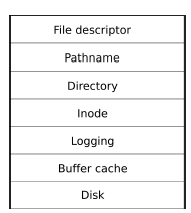
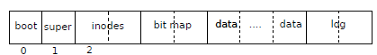

## 개요

xv6 파일 시스템 구현은 그림 6-1과 같이 7개의 계층으로 구성됩니다.

* 디스크 계층은 IDE 하드 드라이브에서 블록을 읽고 씁니다.

* 버퍼 캐시 계층은 디스크 블록을 캐시하고 액세스를 동기화하여 한 번에 하나의 커널 프로세스만 특정 블록에 저장된 데이터를 수정할 수 있도록 합니다.
* 로깅 계층을 사용하면 상위 계층에서 트랜잭션의 여러 블록에 대한 업데이트를 래핑할 수 있으며  블록이 원자적으로 업데이트되도록 합니다(즉, 모든 블록이 업데이트되거나 업데이트되지 않음).
* inode 계층은 개별 파일을 제공하며, 각각은 고유한 i-번호와 파일 데이터를 보유하는 일부 블록이 있는 inode로 표시됩니다.
* 디렉토리 계층은 각 디렉토리를 파일 이름과 i-번호가 포함된 디렉토리 항목의 시퀀스인 내용을 가진 특별한 종류의 inode로 구현합니다.
* 경로 이름 계층은 /usr/rtm/xv6/fs.c와 같은 계층적 경로 이름을 제공하고 재귀 조회로 확인합니다.
* 파일 설명자 계층은 파일 시스템 인터페이스를 사용하여 많은 Unix 리소스(예: 파이프, 장치, 파일 등)를 추상화하여 응용 프로그램 프로그래머의 삶을 단순화합니다.



파일 시스템에는 디스크에서 inode와 콘텐츠 블록을 저장할 위치를 결정한다. 

xv6은 그림 6-2와 같이 디스크를 여러 섹션으로 나눕니다.



파일 시스템은 블록 0(부트 섹터를 보유함)을 사용하지 않습니다. 

* 슈퍼블록:  여기에는 파일 시스템에 대한 메타데이터(블록 단위 파일 시스템 크기, 데이터 블록 수, inode 수 및 로그의 블록 수)가 포함됩니다.
* Inode:  2에서 시작하는 블록은 블록당 여러 개의 inode가 있는 inode를 보유합니다.
* 비트맵:  블럭  그 다음에는 사용 중인 데이터 블록을 추적하는 비트맵 블록이 나옵니다. 
* 데이터 블럭: 나머지 블록의 대부분은 데이터 블록입니다. 각각은 비트맵 블록에서 사용 가능으로 표시되거나 파일 또는 디렉토리에 대한 내용을 보유합니다. 디스크 끝에 있는 블록은 로깅 계층의 로그를 보유합니다.

이 장의 나머지 부분에서는 버퍼 캐시부터 시작하여 각 계층에 대해 설명합니다. 


## Structure of an Ext2 Filesystem

The first 1024 bytes of the disk, the "*boot block*", are reserved for the partition boot sectors and are unused by the Ext2 filesystem. The rest of the partition is split into block groups, each of which has the layout shown in the figure above. On a 1.44 MB floppy disk, there is only one block group.


#### super block

The superblock is defined in `struct ext2_super_block`, line 339 of `include/linux/ext2_fs.h`. It contains information such as the total number of blocks on disk, the size of a block (usually 1024 bytes), the number of free blocks, etc. The meaning of each field in the `ext2_super_block` structure is explained in `ext2_fs.h`. Part of this structure has been reported below:

```c
struct ext2_super_block {
	__u32	s_inodes_count;		/* Inodes count */
	__u32	s_blocks_count;		/* Blocks count */
	...
	__u32	s_free_blocks_count;	/* Free blocks count */
	__u32	s_free_inodes_count;	/* Free inodes count */
	__u32	s_first_data_block;	/* First Data Block */
	__u32	s_log_block_size;	/* Block size */
	...
	__u32	s_blocks_per_group;	/* # Blocks per group */
	...
	__u16	s_magic;		/* Magic signature */
	...
```


```c
#include <linux/ext2_fs.h>
...
int main()
{
    int fd;
	struct ext2_super_block super;

	fd = open("/dev/fd0", O_RDONLY);    /* open floppy device */

	lseek(fd, 1024, SEEK_SET);                    /* position head above super-block */
	read(fd, &super, sizeof(super));              /* read super-block */

	if (super.s_magic != EXT2_SUPER_MAGIC)
	        exit(1); /* bad file system */	

        block_size = 1024 << super.s_log_block_size;  /* calculate block size in bytes */

        ...
```


#### Group Descriptoors

This list contains a descriptor for each block group on the disk. In the case of a floppy, there is only one block group and therefore one group descriptor. For a bigger disk, we would have to calculate the size of this list by using `s_blocks_count` and `s_blocks_per_group` in the superblock:

The group descriptor tells us the location of the block/inode bitmaps and of the inode table (described later) through the `bg_block_bitmap`, `bg_inode_bitmap` and `bg_inode_table` fields. These values indicate the blocks where the bitmaps and the table are located. It is handy to have a function to convert a block number to an offset on disk, which can be easily done by knowing that all blocks on disk have the same size of `block_size` bytes (calculated earlier from the super-block):


#### The block and inodes bitmaps

A bitmap is a sequence of bits. Each bit represents a specific block (blocks bitmap) or inode (inode bitmap) in the block group. A bit value of 0 indicates that the block/inode is free, while a value of 1 indicates that the block/inode is being used. A bitmap always refers to the block-group it belongs to, and its size must fit in one block.


#### inode table

The inode table consists of a series of consecutive blocks, each of which contains a predefined number of inodes. The block number of the first block of the inode table is stored in the `bg_inode_table` field of the group descriptor. To figure out how many blocks are occupied by the inode table, divide the total number of inodes in a group (stored in the `s_inodes_per_group` field of the superblock) by the number of inodes per block:

In the case of our floppy disk, we can see from the output of `mkfs.ext2` that we have 184 inodes per group and a block size of 1024 bytes. 

The size of an inode is 128 bytes, therefore the inode table will take 184 / (1024/128) = 23 blocks.


##### inode 읽기

The inode table contains everything the operating system needs to know about a file, including the type of file, permissions, owner, and, most important, where its data blocks are located on disk. It is no surprise therefore that this table needs to be accessed very frequently and its read access time should be minimized as much as possible

```c
static void read_inode(fd, inode_no, group, inode)
     int                           fd;        /* the floppy disk file descriptor */
     int                           inode_no;  /* the inode number to read  */
     const struct ext2_group_desc *group;     /* the block group to which the inode belongs */
     struct ext2_inode            *inode;     /* where to put the inode */
{
	lseek(fd, BLOCK_OFFSET(group->bg_inode_table)+(inode_no-1)*sizeof(struct ext2_inode), SEEK_SET);
	read(fd, inode, sizeof(struct ext2_inode));
}
```


##### struct  ext2_inode

```c
struct ext2_inode {
        __u16   i_mode;         /* File type and access rights */   <<<---------
        __u16   i_uid;          /* Low 16 bits of Owner Uid */
        __u32   i_size;         /* Size in bytes */
        __u32   i_atime;        /* Access time */
        __u32   i_ctime;        /* Creation time */
        __u32   i_mtime;        /* Modification time */
        __u32   i_dtime;        /* Deletion Time */
        __u16   i_gid;          /* Low 16 bits of Group Id */
        __u16   i_links_count;  /* Links count */
        __u32   i_blocks;       /* Blocks count */    <<-------
        __u32   i_flags;        /* File flags */
	...
	__u32   i_block[EXT2_N_BLOCKS];  /* Pointers to blocks */      <<<----------
	...
};
```


##### imode


##### i_block

```c
The i_blocks field of the inode structure counts the number of blocks used by the file. Pointers to the actual data blocks of the file are stored in the i_block[EXT2_N_BLOCKS] array. The EXT2_N_BLOCKS symbol is defined in ext2_fs.h (line 177) as following:

#define	EXT2_NDIR_BLOCKS		12                      /* number of direct blocks */
#define	EXT2_IND_BLOCK			EXT2_NDIR_BLOCKS        /* single indirect block   */
#define	EXT2_DIND_BLOCK			(EXT2_IND_BLOCK + 1)    /* double indirect block   */
#define	EXT2_TIND_BLOCK			(EXT2_DIND_BLOCK + 1)   /* trible indirect block   */
#define	EXT2_N_BLOCKS			(EXT2_TIND_BLOCK + 1)   /* total number of blocks  */
In total there are 15 pointers in the i_block[] array. The meaning of each of these pointers is explained below:

 i_block[0..11] point directly to the first 12 data blocks of the file.
 i_block[12] points to a single indirect block
 i_block[13] points to a double indirect block
 i_block[14] points to a triple indirect block
```


#### Directory entries in th inode tabel

Directory entries in the inode table require special attention. To test if an inode refers to a directory file we can use the `S_ISDIR(*mode*)` macro:`if (S_ISDIR(inode.i_mode)) ... `In the case of directory entries, the data blocks pointed by `i_block[]` contain a list of the files in the directory and their respective inode numbers.


The list is composed of ext2_dir_entry_2 structures:

```c

struct ext2_dir_entry_2 {
	__u32	inode;			/* Inode number */
	__u16	rec_len;		/* Directory entry length */
	__u8	name_len;		/* Name length */
	__u8	file_type;
	char	name[EXT2_NAME_LEN];	/* File name */
};
The file_type field indicates what kind of file the entry is referring to. Possible values are:

file_type	Description
0	Unknown
1	Regular File
2	Directory
3	Character Device
4	Block Device
5	Named pipe
6	Socket
7	Symbolic Link

```


#### 파일의 위치

