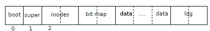

### 로그 디자인

로그는 디스크 끝에 고정 위치에 있습니다.

헤더 블록과 업데이트된 블록 복사본(로깅 블록') 시퀀스로 구성됩니다. 

* 헤더 블럭, 블럭의 복사본(로깅 블럭) 

헤더 블록에는 각각 로깅된 블럭의 섹터 번호의 배열을 포함하고 있다. 
헤더 블록에는 로깅된  블록의 개수도 포함됩니다. 

Xv6은 

1. 트랜잭션이 커밋될 때 헤더 블록을 기록하지만 그 전에는 기록하지 않고 (헤더는 commit 될 때 기록한다. )
2. 기록된 블록을 파일 시스템에 복사한 후 카운트를 0으로 설정합니다.  (로깅 블럭을 디스크에 저장하면 헤더에 0으로 설정한다.)
3. 따라서 트랜잭션 중간에 충돌이 발생하면 로그의 헤더 블록에 0이 표시됩니다. 
4. 커밋 후 크래시가 발생하면 0이 아닌 카운트가 발생합니다.(commit 이후에는 log 헤더에는 각각의 로깅된 블럭의 섹터 번호 가 들어 있고, 로깅 블럭의 갯수가 들어 있다. )

##### Group Commit

각 System call code는 원자성이 보장되어야하는 쓰기 순서의 시작과 끝을  나타냅니다. 

* log의 효율성을 위해 그리고 파일 시스템 코드에서 어느 정도 동시성을 허용하기 위해 로깅 시스템은 각 트랜잭션에 대한 여러 시스템 호출의 쓰기를 누적할 수 있습니다.  

* 따라서 단일 커밋에는 여러 개의 완전한 시스템 호출 쓰기가 포함될 수 있습니다. 

* 원자성을 유지하기 위해 로깅 시스템은 진행 중인 파일 시스템 시스템 호출이 없을 때만 커밋합니다.
* 여러 트랜잭션을 함께 커밋하는 아이디어를 그룹 커밋이라고 합니다.
* 그룹 커밋을 사용하면 여러 트랜잭션을 동시에 실행할 수 있으며 파일 시스템에서 여러 디스크 작업을 일괄 처리하고 디스크 드라이버에 단일 디스크 작업을 실행할 수 있습니다.
* 이를 통해 디스크는 블록 쓰기를 영리하게 예약하고 디스크 대역폭의 속도로 쓸 수 있습니다. Xv6의 IDE 드라이버는 일괄 처리를 지원하지 않지만 xv6의 파일 시스템 설계는 일괄 처리를 지원합니다.

##### 제한된 log 공간의 크기로 인한 문제 

Xv6은 로그를 보관하기 위해 디스크에 고정된 공간을 할당합니다.  트랜잭션의  System Call에 의해서 Writen된  전체 블럭 수는  해당 공간에 맞아야 합니다.

이것은 두 가지 결과를 낳습니다. 

*  로그에 있는 공간보다 더 많은 개별 블록을 쓰기 위해 단일 시스템 호출을 허용할 수 없습니다. 
* 이것은 대부분의 system call에서 문제가 되지 않지만,  잠재적으로 많은 블록을 쓸 수  있는 write와 unlike 는 다르다. 

Large File의  Write는  많은  데이터 블록과 많은 비트맵 블록과 inode 블록에 많은 write를 발생 시킨다. 

Large File 의 unlink도 많은 비트맵 블록과 inode에 Write를 발생시킨다. 

Xv6의 쓰기 시스템 호출은 큰 쓰기를 로그에 맞는 여러 개의 작은 쓰기로 나눕니다. 실제로 xv6 파일 시스템은 하나의 비트맵 블록만 사용하기 때문에 링크 해제는 문제를 일으키지 않습니다. 

제한된 log의 공간의 크기 때문에  system call의 write 시점에  로그에 남아 있는 공간이 부족하다면 로깅 시스템은 system call을 허용 하지 않는 문제가 발생한다. 

