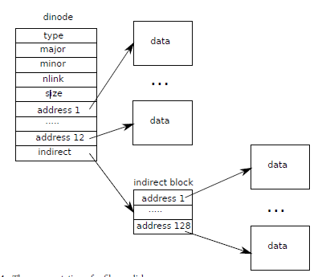

#### code inode content

디스크 상의 inode 구조인 struct dinode는 블록 번호의 크기와 배열을 포함합니다

* 직접 블럭
* 간접 블럭

inode 데이터는 dinode의 addrs 배열에 나열된 블록에서 찾을 수 있습니다. 데이터의 첫 번째 NDIRECT 블록은 배열의 첫 번째 NDIRECT 항목에 나열됩니다. 이러한 블록을 직접 블록이라고 합니다. 다음 NINDIRECT 데이터 블록은 inode가 아니라 간접 블록이라고 하는 데이터 블록에 나열됩니다.
addrs 배열의 마지막 항목은 간접 블록의 주소를 제공합니다.

따라서 파일의 처음 6kB(NDIRECT×BSIZE) 바이트는 inode에 나열된 블록에서 로드할 수 있는 반면 다음 64kB(NINDIRECT×BSIZE) 바이트는 간접 블록을 참조한 후에만 로드할 수 있습니다.
이것은 좋은 디스크 표현이지만 클라이언트에게는 복잡한 표현입니다. bmap 함수는 우리가 곧 보게 될 readi 및 writei와 같은 상위 수준 루틴이 표시되도록 관리합니다. Bmap은 inode ip에 대한 bn'번째 데이터 블록의 디스크 블록 번호를 반환합니다. ip에 아직 그러한 블록이 없으면 bmap이 블록을 할당합니다.

함수 bmap은 쉬운 경우를 선택하여 시작합니다. 첫 번째 NDIRECT 블록은 inode 자체에 나열됩니다.

다음 NINDIRECT 블록은 ip->addrs[NDIRECT]의 간접 블록에 나열됩니다. Bmap은 간접 블록을 읽은 다음(5176) 블록 내 오른쪽 위치에서 블록 번호를 읽습니다(5177). 블록 번호가 NDIRECT+NINDIRECT를 초과하면 bmap 패닉이 발생합니다. writei는 이것을 방지하는 검사를 포함합니다(5315).
Bmap은 필요에 따라 블록을 할당합니다. ip->addrs[] 또는 0의 간접 항목은 할당된 블록이 없음을 나타냅니다. bmap이 0을 만나면 요청 시 할당된 새로운 블록 수로 대체합니다. (5166-5167, 5174-5175).
itrunc는 파일의 블록을 해제하고 inode의 크기를 0으로 재설정합니다. Itrunc(5206)는 직접 블록(5212-5217)을 해제한 다음 간접 블록(5222-5225)에 나열된 블록을 해제하고 마지막으로 간접 블록 자체(5227-5228)를 해제합니다.
Bmap을 사용하면 readi 및 writei가 inode의 데이터를 쉽게 가져올 수 있습니다. Readi(5252)는 오프셋과 개수가 파일의 끝을 넘지 않는지 확인하는 것으로 시작합니다.
파일 끝을 넘어 시작하는 읽기는 오류(5263-5264)를 반환하는 반면 파일 끝에서 시작하거나 파일 끝을 가로지르는 읽기는 요청된 것(5265-5266)보다 적은 바이트를 반환합니다. 메인 루프는 버퍼에서 dst(5268-5273)로 데이터를 복사하면서 파일의 각 블록을 처리합니다. writei(5302)는 readi와 동일하지만 세 가지 예외가 있습니다. 루프는 out(5321) 대신 버퍼에 데이터를 복사합니다. 쓰기가 파일을 확장한 경우 writei는 크기를 업데이트해야 합니다(5326-5329).
readi와 writei는 모두 ip->type == T_DEV를 확인하는 것으로 시작합니다. 이 경우는 데이터가 파일 시스템에 존재하지 않는 특수 장치를 처리합니다. 파일 설명자 계층에서 이 경우로 돌아갑니다. 함수 stati(4773)는 inode 메타데이터를 stat 시스템 호출을 통해 사용자 프로그램에 노출되는 stat 구조로 복사합니다.

