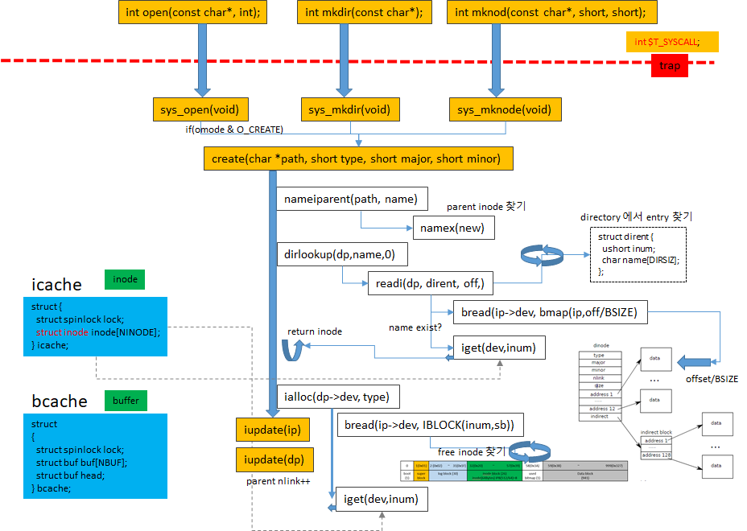
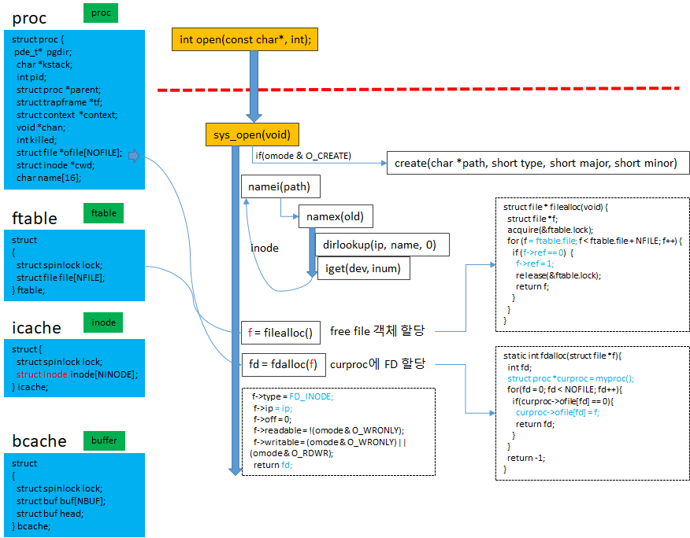

## Code system calls

하위 계층이 제공하는 기능을 사용하면 대부분의 시스템 호출 구현이 간단합니다(sysfile.c 참조). 

자세히 살펴볼 가치가 있는 몇 가지 system call이 있습니다.

### sys_link, sys_unlink

sys_link 및 sys_unlink 함수는 디렉토리를 편집하여 inode에 대한 참조를 생성하거나 제거합니다. 그것들은 transaction를 사용하는  또 다른 좋은 예입니다. 

```c
// Create the path new as a link to the same inode as old.
int
sys_link(void)
{
  char name[DIRSIZ], *new, *old;
  struct inode *dp, *ip;

  if(argstr(0, &old) < 0 || argstr(1, &new) < 0)  -->> argint(n,&addr)-->fetchstr(addr,pp)--> return pp
    return -1;

  begin_op();
  if((ip = namei(old)) == 0){
    end_op();
    return -1;
  }

  ilock(ip);
  if(ip->type == T_DIR){
    iunlockput(ip);
    end_op();
    return -1;
  }

  ip->nlink++;
  iupdate(ip);
  iunlock(ip);

  if((dp = nameiparent(new, name)) == 0)
    goto bad;
  ilock(dp);
  if(dp->dev != ip->dev || dirlink(dp, name, ip->inum) < 0){
    iunlockput(dp);
    goto bad;
  }
  iunlockput(dp);
  iput(ip);

  end_op();

  return 0;

bad:
  ilock(ip);
  ip->nlink--;
  iupdate(ip);
  iunlockput(ip);
  end_op();
  return -1;
}
```


sys_link는 이전 및 새 문자열의 두 문자열인 인수를 가져오는 것으로 시작합니다.

* old가 존재하고 디렉토리가 아니라고 가정하면 sys_link는 ip->nlink 수를 증가시킵니다. 
* 그런 다음 sys_link는 new의 부모 디렉터리와 최종 경로 요소를 찾기 위해 nameiparent를 호출하고 old의 inode를 가리키는 새 디렉터리 항목을 만듭니다. 
* 새 상위 디렉토리가 존재해야 하고 기존 inode와 동일한 장치에 있어야 합니다.
* 이와 같은 오류가 발생하면 sys_link는 돌아가서 ip->nlink를 감소시켜야 합니다.  (rollback 처리)

트랜잭션은 여러 디스크 블록을 업데이트해야 하기 때문에 구현을 단순화하지만 수행 순서에 대해 걱정할 필요가 없습니다. 그들은 모두 성공하거나 전혀 성공하지 못할 것입니다. 예를 들어, 트랜잭션 없이 링크를 생성하기 전에 ip->nlink를 업데이트하면 파일 시스템이 일시적으로 안전하지 않은 상태가 되고 그 사이에 충돌이 발생하면 혼란이 생길 수 있습니다. 트랜잭션을 사용하면 이에 대해 걱정할 필요가 없습니다.


#### create

create(6057) 함수는 새 inode의 새 이름을 만듭니다. 

* 이것은 세 가지 파일 생성 시스템 호출을 일반화한 것입니다. 
  * O_CREATE 플래그로 open은 새 일반 파일을 만들고 
  * mkdir은 새 디렉토리를 만들고 
  * mkdev는 새 장치 파일을 만듭니다. 
* sys_link와 마찬가지로 create는 nameiparent를 호출하여 상위 디렉토리의 inode를 가져오는 것으로 시작합니다. 
* 그런 다음 dirlookup을 호출하여 이름이 이미 존재하는지 확인합니다. 이름이 존재하는 경우 create의 동작은 사용 중인 시스템 호출에 따라 다릅니다. 

``` c
static struct inode*
create(char *path, short type, short major, short minor)
{
  struct inode *ip, *dp;
  char name[DIRSIZ];

  if((dp = nameiparent(path, name)) == 0)
    return 0;
  ilock(dp);

  if((ip = dirlookup(dp, name, 0)) != 0){
    iunlockput(dp);
    ilock(ip);
    if(type == T_FILE && ip->type == T_FILE)
      return ip;
    iunlockput(ip);
    return 0;
  }

  if((ip = ialloc(dp->dev, type)) == 0)
    panic("create: ialloc");

  ilock(ip);
  ip->major = major;
  ip->minor = minor;
  ip->nlink = 1;
  iupdate(ip);

  if(type == T_DIR){  // Create . and .. entries.
    dp->nlink++;  // for ".."
    iupdate(dp);
    // No ip->nlink++ for ".": avoid cyclic ref count.
    if(dirlink(ip, ".", ip->inum) < 0 || dirlink(ip, "..", dp->inum) < 0)
      panic("create dots");
  }

  if(dirlink(dp, name, ip->inum) < 0)
    panic("create: dirlink");

  iunlockput(dp);

  return ip;
}
```

open은 mkdir 및 mkdev와 다른 의미를 갖습니다. 

create가 open 대신 사용 중이고(type == T_FILE) 존재하는 이름 자체가 일반 파일인 경우 open은 이를 성공으로 취급하므로 create도 성공합니다. 그렇지 않으면 오류입니다. 이름이 아직 존재하지 않는 경우 create는 이제 ialloc을 사용하여 새 inode를 할당합니다. 

새 inode가 디렉토리인 경우 create는 초기화합니다.  

sys_link와 마찬가지로 Create는 ip와 dp라는 두 개의 inode 잠금을 동시에 보유합니다. inode ip가 새로 할당되었기 때문에 교착 상태의 가능성이 없습니다. 

시스템의 다른 프로세스는 ip의 잠금을 유지한 다음 dp를 잠그려고 시도하지 않습니다.

create를 사용하면 sys_open, sys_mkdir 및 sys_mknod를 쉽게 구현할 수 있습니다.





### sys_open


sys_open은 가장 복잡합니다. 

새 파일을 만드는 것이 수행할 수 있는 작업의 작은 부분에 불과하기 때문입니다. 

* open에 O_CREATE 플래그가 전달되면 create를 호출합니다. 
* 그렇지 않으면 namei(6120)를 호출합니다. 
* Create는 잠긴 inode를 반환하지만 namei는 그렇지 않으므로 sys_open은 inode 자체를 잠가야 합니다. 
* 이것은 디렉토리가 쓰기가 아닌 읽기 전용으로 open하는지 체크한다. 

inode를 얻었으면 sys_open은 파일과 파일 설명자를 할당한 다음 파일을 채웁니다. 

* 현재 프로세스의 테이블에만 있기 때문에 다른 프로세스는 부분적으로 초기화된 파일에 액세스할 수 없습니다.
* 

```c
int
sys_open(void)
{
  char *path;
  int fd, omode;
  struct file *f;
  struct inode *ip;

  if(argstr(0, &path) < 0 || argint(1, &omode) < 0)
    return -1;

  begin_op();

  if(omode & O_CREATE){                <<--- create
    ip = create(path, T_FILE, 0, 0);   --->> ialloc(dp->dev,type)
    if(ip == 0){
      end_op();
      return -1;
    }
  } else {                             
    if((ip = namei(path)) == 0){      <<---- create 아니고 실제 open 일때
      end_op();
      return -1;
    }
    ilock(ip);                                        <<--- inode 정보 lock 하고...
    if(ip->type == T_DIR && omode != O_RDONLY){
      iunlockput(ip);
      end_op();
      return -1;
    }
  }

  if((f = filealloc()) == 0 || (fd = fdalloc(f)) < 0){    <<----- filealloc 
    if(f)
      fileclose(f);
    iunlockput(ip);
    end_op();
    return -1;
  }
  iunlock(ip);
  end_op();

  f->type = FD_INODE;
  f->ip = ip;
  f->off = 0;
  f->readable = !(omode & O_WRONLY);
  f->writable = (omode & O_WRONLY) || (omode & O_RDWR);
  return fd;
}

```





### sys_pipe

* 5장에서는 우리가 파일 시스템을 갖기도 전에 파이프의 구현을 조사했습니다.
* sys_pipe 함수는 파이프 쌍을 생성하는 방법을 제공하여 해당 구현을 파일 시스템에 연결합니다.
*  그 인수는 두 개의 새로운 파일 설명자를 기록할 두 개의 정수에 대한 공간에 대한 포인터입니다. 그런 다음 파이프를 할당하고 파일 설명자를 설치합니다.