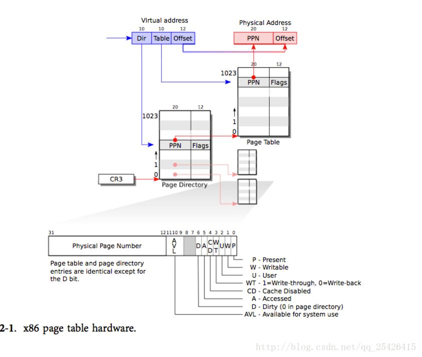

## Xv6 소스 코드 분석 - 메모리 관리

메모리 관리는 크게 두 부분으로 나뉩니다. 

* 첫 번째 부분은 커널이 메모리를 할당하고 나중에 해제할 수 있도록 하는 커널의 물리적 메모리 할당 프로그램입니다. 할당자는 페이지라고 하는 4096바이트 단위로 작동합니다. 커널은 어떤 물리적 페이지가 사용 가능한지, 어떤 데이터 구조가 할당되었는지, 각 페이지에 대한 프로세스 수, 메모리 페이지를 할당 및 해제하는 방법에 대한 기록을 유지합니다. 
* 두 번째 구성 요소는 커널과 사용자 소프트웨어에서 사용하는 가상 주소를 물리적 메모리의 주소에 매핑하는 가상 메모리입니다. 명령어가 메모리를 사용하는 경우 x86 하드웨어의 MMU(메모리 관리 장치)는 매핑을 수행하고 페이지 테이블 집합을 쿼리합니다.

### 사전 지식

#### 페이지 테이블

페이지 테이블은 메모리에서 프로세스의 각 페이지에 해당하는 물리적 블록을 쉽게 찾기 위한 것입니다. 시스템은 메모리에 페이지의 물리적 블록 번호를 기록하기 위해 각 프로세스에 대한 페이지 테이블을 설정합니다. XV6은 주로 페이지 테이블을 사용하여 주소 공간을 재사용하고 메모리를 보호합니다.

#### 주소 변환 하드웨어

X86 명령어(사용자 및 커널 포함)는 가상 주소를 직접 사용하는 반면 물리적 메모리는 인덱싱에 물리적 주소를 사용합니다. 가상 주소에서 물리적 주소로의 변환은 하드웨어에 의해 수행됩니다.

*  x86 페이지 테이블은 1단계 페이지 디렉토리와 2단계 페이지 테이블 항목으로 구성됩니다. 각 페이지 디렉토리 항목에는 1024개의 연속 페이지 테이블 항목이 있습니다(각 페이지 테이블 항목은 4B이며 4kb의 공간, 즉 한 페이지를 차지함) 
* CR3은 페이지 디렉토리 테이블의 물리적 주소를 저장하는 페이지 디렉토리 기본 주소 레지스터입니다. 
* 페이지 디렉토리 테이블은 페이지 정렬되어 있기 때문에 CR3의 상위 20비트만 유효합니다. 주소 변환은 아래 그림과 같습니다.



#### 메모리 초기화

부트는 커널 코드를 물리적 주소의 하위 주소인 0x100000에 넣습니다.

*  커널을 최소에 실행하기 위해서는 KERNBASE을 0x0에서 시작하는 물리적 주소 매핑하는 Paget Table 생성
* 커널을 실행하기 위해 항목은 가상 주소 0x80000000(KERNBASE)을 0x0에서 시작하는 물리적 주소에 매핑하는 페이지 테이블을 만듭니다. 페이지 테이블은 main.c 파일의 enterpgdir 배열이며, 여기서 가상 주소 하위 4M은 물리적 주소 하위 4M에 매핑됩니다. KERNBASE, KERNBASE+4MB)는 물리적 주소[0,4MB)에 매핑됩니다.

```cpp
__attribute__((__aligned__(PGSIZE)))
pde_t entrypgdir[NPDENTRIES] = {     // Map VA's [0, 4MB) to PA's [0, 4MB)
 [0] = (0) | PTE_P | PTE_W | PTE_PS, //Map VA's [KERNBASE, KERNBASE+4MB) to PA's [0, 4MB)
 [KERNBASE >>PDXSHIFT] = (0) | PTE_P | PTE_W | PTE_PS,
};

#define NPDENTRIES      1024    // # directory entries per page directory
#define PTE_P           0x001   // Present
#define PTE_W           0x002   // Writeable
#define PTE_U           0x004   // User
#define PTE_PS          0x080   // Page Size
// KERNBASE >>PDXSHIFT  0x80000000 >>22 => 512
```

PTE_P: 이 페이지가 이미 메모리에 있음을 나타냅니다. PTE_W: 쓰기 가능, PTE_PS: 페이지 크기

#####  Look at the entry code; 

 ```c
entry:
  # Turn on page size extension for 4Mbyte pages
  #Set up cr4, use 4M pages, so the page table created is relatively simple
  movl    %cr4, %eax
  orl     $(CR4_PSE), %eax
  movl    %eax, %cr4
  # Set page directory Load the physical address of entrypgdir into the control register %cr3
  movl    $(V2P_WO(entrypgdir)), %eax
  movl    %eax, %cr3
  # Turn on paging. Turn on paging
  movl    %cr0, %eax
  orl     $(CR0_PG|CR0_WP), %eax
  movl    %eax, %cr0
 
  # Set up the stack pointer. Create a CPU stack
  movl $(stack + KSTACKSIZE), %esp
 
  # Jump to main(), and switch to executing at
  # high addresses. The indirect call is needed because
  # the assembler produces a PC-relative instruction
  # for a direct jump.
  mov $main, %eax
  jmp *%eax
 #Open up the stack area, the size is KSTACKSIZE
.comm stack, KSTACKSIZE
 ```


아직 페이지 테이블이 없고 주소 변환을 수행할 수 없기 때문에 cr3 레지스터의 숫자는 물리적 주소여야 합니다. V2P_W0의 매크로 정의를 통해 물리적 주소를 가져옵니다.

```html
#define V2P_WO(x) ((x) - KERNBASE)    // same as V2P, but without casts
```

PG 페이징(CR0의 비트 31)은 페이징을 활성화하려면 1로 설정하고 페이징을 비활성화하려면 0으로 설정합니다. 페이징이 비활성화되면 모든 선형 주소를 물리적 주소로 취급할 수 있습니다.

WP 쓰기 방지(CR0의 비트 16)는 1로 설정하면 관리 수준 프로세스가 사용자 수준 읽기 전용 페이지에 쓰는 것을 금지하고 0으로 설정하면 관리 수준 프로세스가 사용자 수준에 쓸 수 있습니다. 읽기 전용 페이지.
스택 포인터 %esp는 스택으로 사용되는 메모리 섹션을 가리킵니다. 스택을 포함한 모든 기호는 상위 주소에 있으므로 하위 주소 매핑이 제거되면 스택을 계속 사용할 수 있습니다. 마지막으로 항목은 상위 주소의 기본 코드로 점프합니다. 간접 점프를 사용해야 합니다. 그렇지 않으면 어셈블러가 PC 기준 직접 점프를 생성하고 점프는 하위 메모리 주소의 기본에서 실행됩니다. PC 값이 스택에 반환되지 않기 때문에 main은 반환되지 않습니다. 그 후 커널은 상위 주소의 main 함수에서 실행됩니다.

#### 물리적 메모리 초기화 및 관리:

main 함수는 kinit1 및 kinit2를 호출하여 물리적 메모리를 초기화합니다. 차이점은 kinit1이 호출될 때 이전 페이지 테이블이 사용된다는 것입니다. 4m 공간만 초기화할 수 있습니다. 이때 멀티코어 CPU가 시작되지 않았으므로 잠금 메커니즘이 없습니다. 전체 페이지 테이블을 설정한 후 kinit2를 사용하여 나머지 물리적 메모리를 초기화합니다.

```c
void
kinit1(void *vstart, void *vend)
{
  initlock(&kmem.lock, "kmem");
  kmem.use_lock = 0;
  freerange(vstart, vend);
}
 
void
kinit2(void *vstart, void *vend)
{
  freerange(vstart, vend);
  kmem.use_lock = 1;
}
```

xv6은 할당할 수 있는 물리적 페이지를 기록하기 위해 freelist 데이터 구조를 사용합니다. kinit1 및 kinit2는 freerang을 호출하여 free list에 free page를 추가합니다. PTE는 페이지 정렬의 물리적 주소만 참조할 수 있으므로 freerange는 PGROUNDUP을 사용하여 페이지 정렬만 해제되도록 합니다. 물리적 주소. PGROUNDUP(sz)의 기능은 sz가 페이지의 배수가 아닐 때 페이지의 배수가 되도록 1비트 진행하는 것입니다.

```c
#define PGROUNDUP(sz)  (((sz)+PGSIZE-1) & ~(PGSIZE-1))
```

kfree는 해제된 메모리를 바이트 1로 채우기 시작합니다. 목적은 해제(와일드 포인터를 통한 메모리의 불법적 사용)가 가비지 데이터를 읽은 후 코드가 이 메모리를 사용하도록 하여 이 코드가 최대한 빨리 종료되도록 하는 것입니다. 그런 다음 kfree는 v를 struct run에 대한 포인터로 변환하고 사용 가능한 목록의 원래 헤드를 r->next에 기록하고 사용 가능한 목록의 헤드를 r로 설정합니다. kalloc은 사용 가능한 목록의 첫 번째 요소를 삭제하고 반환합니다.

```c
void freerange(void *vstart, void *vend)
{
  char *p;
  p = (char*)PGROUNDUP((uint)vstart);
  for(; p + PGSIZE <= (char*)vend; p += PGSIZE)
    kfree(p);
}

//PAGEBREAK: 21
// Free the page of physical memory pointed at by v,
// which normally should have been returned by a
// call to kalloc().  (The exception is when
// initializing the allocator; see kinit above.)
void kfree(char *v)
{
  struct run *r;
  if((uint)v % PGSIZE || v < end || V2P(v) >= PHYSTOP)
    panic("kfree");
 
  // Fill with junk to catch dangling refs.
  memset(v, 1, PGSIZE);
 
  if(kmem.use_lock)
    acquire(&kmem.lock);
  r = (struct run*)v;
  r->next = kmem.freelist;
  kmem.freelist = r;
  if(kmem.use_lock)
    release(&kmem.lock);
}
```

 

```c
// Allocate one 4096-byte page of physical memory.
// Returns a pointer that the kernel can use.
// Returns 0 if the memory cannot be allocated.
char*kalloc(void)
{
  struct run *r;
 
  if(kmem.use_lock)
    acquire(&kmem.lock);
  r = kmem.freelist;
  if(r)
    kmem.freelist = r->next;
  if(kmem.use_lock)
    release(&kmem.lock);
  return (char*)r;
}
```

## 프로세스 주소 공간

entry에 의해 생성된 페이지 테이블은 커널의 C 코드가 실행을 시작하기에 충분합니다. 그러나 main 함수는 kvmalloc을 통해 직접 새 페이지 테이블을 설정합니다. 각 프로세스에는 독립적인 페이지 테이블이 있습니다. Xv6은 페이지 테이블 하드웨어를 사용하여 프로세스 전환 중에 페이지 테이블을 전환합니다. . switchkvm은 페이지 테이블을 커널 페이지 테이블로 전환합니다.

```c
// Allocate one page table for the machine for the kernel address
// space for scheduler processes.
void
kvmalloc(void)
{
  kpgdir = setupkvm();
  switchkvm();
}
```

#### setupkvm

setupkvm에서 먼저 물리적 블록을 kalloc을 통해 페이지 디렉토리로 할당한 다음 mappages를 호출하여 kmap에 따라 커널 가상 주소 공간을 물리적 주소 공간에 매핑합니다.

```c
// Set up kernel part of a page table.
pde_t *
setupkvm(void)
{
  pde_t *pgdir;
  struct kmap *k;

  if ((pgdir = (pde_t *)kalloc()) == 0)
    return 0;
  memset(pgdir, 0, PGSIZE);
  if (P2V(PHYSTOP) > (void *)DEVSPACE)
    panic("PHYSTOP too high");
  for (k = kmap; k < &kmap[NELEM(kmap)]; k++)
    if (mappages(pgdir, k->virt, k->phys_end - k->phys_start,
                 (uint)k->phys_start, k->perm) < 0)
    {
      freevm(pgdir);
      return 0;
    }
  return pgdir;
}

// This table defines the kernel's mappings, which are present in
// every process's page table.
static struct kmap {
  void *virt;
  uint phys_start;
  uint phys_end;
  int perm;
} kmap[] = {
 { (void*)KERNBASE, 0,             EXTMEM,    PTE_W}, // I/O space
 { (void*)KERNLINK, V2P(KERNLINK), V2P(data), 0},     // kern text+rodata
 { (void*)data,     V2P(data),     PHYSTOP,   PTE_W}, // kern data+memory
 { (void*)DEVSPACE, DEVSPACE,      0,         PTE_W}, // more devices
};
 
// Return the address of the PTE in page table pgdir
// that corresponds to virtual address va.  If alloc!=0,
// create any required page table pages.
static pte_t *
walkpgdir(pde_t *pgdir, const void *va, int alloc)
{
  pde_t *pde;
  pte_t *pgtab;
 
     pde = &pgdir[PDX(va)];//The first 10 items find the position in the page directory
  if(*pde & PTE_P){
    pgtab = (pte_t*)P2V(PTE_ADDR(*pde));
  } else {
         if(!alloc || (pgtab = (pte_t*)kalloc()) == 0)//Allocation page table
      return 0;
    // Make sure all those PTE_P bits are zero.
    memset(pgtab, 0, PGSIZE);
    // The permissions here are overly generous, but they can
    // be further restricted by the permissions in the page table
    // entries, if necessary.
         *pde = V2P(pgtab) | PTE_P | PTE_W | PTE_U;//Set permissions
  }
  return &pgtab[PTX(va)];
}
 
```

#### swithkvm

Switchkvm은 kpgdir을 cr3 레지스터의 값으로 설정합니다. 

이 페이지 테이블은 스케줄러 커널 스레드에서만 사용됩니다.

```c
// Switch h/w page table register to the kernel-only page table,
// for when no process is running.
void
switchkvm(void)
{
  lcr3(V2P(kpgdir));   // switch to the kernel page table
}
```

페이지 테이블과 커널 스택은 각 프로세스에 고유합니다. Xv6은 proc 구조를 사용하여 통합합니다. 프로세스가 전환될 때 종종 프로세스 스위치로 전환됩니다. 커널 스레드는 커널에서 시뮬레이션됩니다. 독점적인 커널 스택과 커널 페이지 테이블 kpgdir은 모든 프로세스 스케줄링의 기초입니다.

#### switchuvm

Switchuvm은 TSS 관련 작업을 포함하여 들어오는 proc 구조를 통해 관련 프로세스의 고유한 데이터 구조를 전환한 다음 해당 프로세스별 페이지 테이블을 cr3 레지스터에 로드하여 관련 가상 주소 공간 환경 설정을 완료합니다. 과정.

```cpp

// Switch TSS and h/w page table to correspond to process p.
void
switchuvm(struct proc *p)
{
  if(p == 0)
    panic("switchuvm: no process");
  if(p->kstack == 0)
    panic("switchuvm: no kstack");
  if(p->pgdir == 0)
    panic("switchuvm: no pgdir");
 
  pushcli();
  mycpu()->gdt[SEG_TSS] = SEG16(STS_T32A, &mycpu()->ts,
                                sizeof(mycpu()->ts)-1, 0);
  mycpu()->gdt[SEG_TSS].s = 0;
  mycpu()->ts.ss0 = SEG_KDATA << 3;
  mycpu()->ts.esp0 = (uint)p->kstack + KSTACKSIZE;
  // setting IOPL=0 in eflags *and* iomb beyond the tss segment limit
  // forbids I/O instructions (e.g., inb and outb) from user space
  mycpu()->ts.iomb = (ushort) 0xFFFF;
  ltr(SEG_TSS << 3);
  lcr3(V2P(p->pgdir));  // switch to process's address space
  popcli();
}
```

프로세스의 페이지 테이블은 사용하기 전에 초기화해야 하는 경우가 많으며 여기에는 커널 코드 매핑이 포함되어야 하므로 프로세스가 커널에 들어갈 때 페이지 테이블을 다시 전환할 필요가 없습니다. 프로세스는 가상 주소 공간의 낮은 주소 부분을 사용하고 높은 주소 부분은 커널용으로 예약되어 있습니다. 페이지 테이블 설정 시 setupkvm, allocuvm, deallocuvm 인터페이스를 호출하여 관련 동작을 완료한다.

 