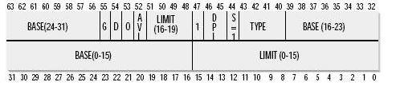
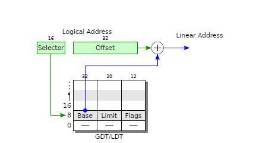
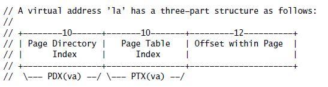
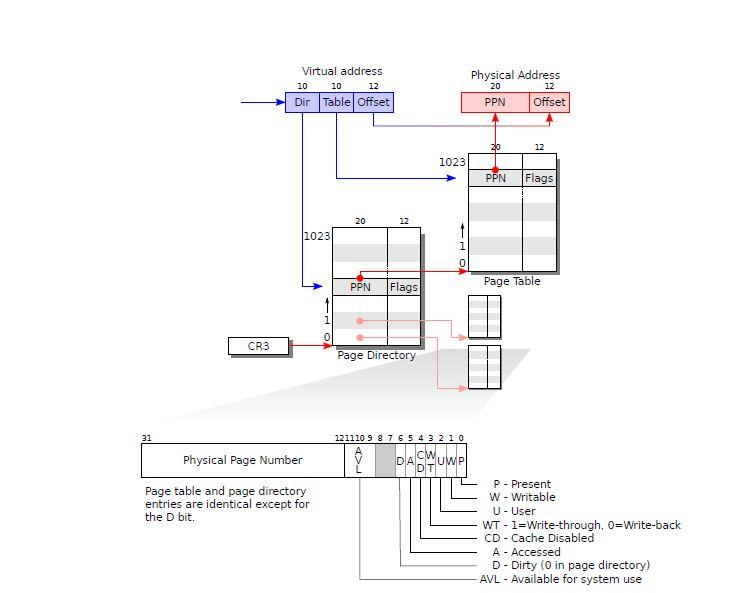

## xv6 시작 소스 코드 읽기

### 부트로더 어셈블리 코드 부분

우리는 컴퓨터가 시작될 때 가장 먼저 실행되는 코드가 마더보드의 BIOS(기본 입출력 시스템)라는 것을 알고 있습니다. BIOS는 주로 하드웨어 자체 검사에서 작동합니다. 이러한 작업이 완료되면 부팅 디스크에서 메모리로 데이터의 첫 번째 섹터의 512바이트를 읽습니다. 이 512바이트는 실제로 잘 알려진 부트로더입니다. 가져온 후 BIOS는 CPU 제어 권한을 부트로더로 이전합니다.

#### 부트로더 : 0x7c00

BIOS는 부트로더를 주소 0x7c00으로 가져온 다음 PC 포인터를 이 주소로 설정하여 점프를 완료합니다. 부트로더 코드의 어셈블리 부분을 살펴보겠습니다.

```asm
<span style="font-size:18px;">.code16 # Assemble for 16−bit mode
.globl start
start:
cli # BIOS enabled interrupts; disable
 
 # Zero data segment registers DS, ES, and SS.
xorw %ax,%ax # Set %ax to zero
movw %ax,%ds # −> Data Segment
movw %ax,%es # −> Extra Segment
movw %ax,%ss # −> Stack Segment</span>
```


.code16은 이 코드가 16비트 코드임을 의미합니다. 이전 버전과의 호환성을 보장하기 위해 처음 시작할 때 16비트 코드가 실행됩니다. 32비트 코드는 32비트가 활성화된 후에만 실행할 수 있습니다.

BIOS는 실행 중에 인터럽트를 켭니다. 그러나 이것은 BIOS가 더 이상 실행되지 않기 때문에 인터럽트 벡터 테이블 등이 더 이상 유효하지 않기 때문입니다. 부트로더는 이 때 인터럽트를 끄고 적절한 시간에 인터럽트를 켜야 합니다.

   다음 명령문의 의도는 세그먼트 레지스터를 지우는 것입니다. xv6에는 가상 주소, 논리 주소, 선형 주소 및 물리적 주소의 개념이 있습니다. 가상 주소의 개념은 페이징 메커니즘에 익숙한 모든 사람에게 친숙한 것으로 믿어집니다. 이 과정에서 명령어 작업은 실제 물리적 주소가 아닌 경우가 많습니다. 보안 문제, 공유 문제 등 많은 문제가 발생하기 때문입니다. 따라서 페이징 메커니즘은 다운 변환에 사용됩니다. 프로그램은 가상 주소에서 작동하며 이러한 가상 주소는 변경되지 않습니다. 운영 체제는 가상 주소를 실제 물리적 주소에 매핑하는 역할을 합니다. 동일한 가상 주소가 다른 시간에 있을 수 있습니다. 다른 물리적 주소에 해당합니다.

x86 명령어 아키텍처에서 가상 주소는 일반적으로 논리 주소로 표시됩니다. 가상 주소는 일반적으로 segment:offset 형식으로 저장됩니다. 각 주소는 세그먼트에 있습니다. 세그먼트는 세그먼트의 기본 주소입니다. 각 주소는 오프셋에 저장되는 세그먼트 기준 주소의 오프셋을 기준으로 합니다. 실제로 오프셋만 프로그램에 나타납니다. 하드웨어는 세그먼트와 오프셋을 통해 선형 주소를 자동으로 계산하고 선형 주소는 일련의 페이지 테이블을 통해 처리되어 실제 물리적 주소를 얻습니다.

부트로더를 입력하기만 하면 하드웨어는 리얼 모드입니다. 이 모드에서는 16비트 레지스터만 사용할 수 있지만 실제 주소 지정 가능 범위는 1M 주소 공간인 20비트 주소입니다. 하드웨어는 세그먼트를 왼쪽으로 이동합니다. 그런 다음 4비트가 오프셋에 추가되어 선형 주소를 얻습니다. 이때 페이징 모드가 켜져 있지 않기 때문에 얻는 것은 실제 물리적 주소이기 때문입니다.

실제 모드의 물리적 주소 계산 방법: 세그먼트 >> 4 + 오프셋.

%ds, %es, %ss는 실제로 각 세그먼트(세그먼트)의 기본 주소를 저장합니다. 여기서 ds는 데이터 세그먼트, es는 확장 세그먼트, ss는 스택 세그먼트를 나타냅니다. 이러한 레지스터는 BIOS에서 사용할 수 있습니다. 여기에서 레지스터를 0으로 지웁니다.

```asm
<span style="font-size:18px;">seta20.1:
inb $0x64,%al # Wait for not busy
testb $0x2,%al
jnz seta20.1
 
movb $0xd1,%al # 0xd1 −> port 0x64
outb %al,$0x64
 
seta20.2:
inb $0x64,%al # Wait for not busy
testb $0x2,%al
jnz seta20.2
 
movb $0xdf,%al # 0xdf −> port 0x60
outb %al,$0x60</span>
```


​    위의 물리 주소 계산 과정에서 2개의 16비트 레지스터가 사용되며 두 레지스터의 최대값은 0xffff이므로 획득한 물리 주소의 최대값은 0xffff0+0xffff = 0x10ffef여야 합니다. 이 주소는 실제로 21비트가 있지만 리얼 모드에서 8086/8088 주소 지정 주소는 실제로 20비트만 가집니다. 즉, 최상위 비트가 유효하지 않으며 얻은 주소는 실제로 0xffef입니다.

그러나 Intel의 상위 아키텍처 프로세서(예: 80286)에서는 총 주소 라인 수가 20비트 이상이므로 이 21비트가 유효하므로 리얼 모드에서 8086 및 80286의 동작이 일관되지 않습니다. 동작을 일관되게 하기 위해 IBM은 다음과 같은 방법을 채택했습니다. 키보드 컨트롤러 입력이 낮으면 A21 비트를 지우고 키보드 컨트롤러 입력이 높을 때만 이 비트가 유효합니다. 특정 상황은 이 문서를 참조할 수 있습니다. http://www.techbulo.com/703.html

물론 여기에서 리얼 모드를 떠나야 하므로 A2가 80286 이상의 모델에서 유효한지 확인하기 위해 키보드 컨트롤러 출력이 높은지 확인해야 합니다. 이것이 위의 코드가 하는 일입니다. 키보드 컨트롤러 게이트를 활성화하려면 0xdf를 보냅니다.

```asm
<span style="font-size:18px;">lgdt gdtdesc
movl %cr0, %eax
orl $CR0_PE, %eax
movl %eax, %cr0</span>
```


우리는 리얼 모드를 떠나려고 하고 곧 보호 모드에 들어갈 것이라고 앞서 언급했습니다. 보호 모드에서 주소 지정 주소는 32비트에 이릅니다. 그리고 선형 주소의 계산 방식도 리얼 모드와 다릅니다.

보호 모드에서 세그먼트 레지스터는 실제로 세그먼트 설명자 테이블의 인덱스입니다. 세그먼트 디스크립터의 형식은 다음과 같습니다.




우리는 당분간 다른 부분은 무시하고 BASE와 LIMIT에만 집중할 수 있습니다. 이름에서 알 수 있듯이 BASE는 세그먼트 기본 주소의 주소를 나타내고 LIMIT는 세그먼트의 크기를 나타낼 수 있습니다. 프로그램에 사용된 주소는 오프셋일 뿐이며 하드웨어는 주소가 있는 세그먼트에 따라 세그먼트 설명자 테이블의 인덱스를 자동으로 추출하고 논리 주소를 선형 주소로 변환합니다. 변환 방법은 다음과 같습니다.

​            


 따라서 보호 모드로 전환하기 전에 세그먼트 설명자 테이블이 빌드되었는지 확인해야 합니다. lgdt 명령은 GDTR 레지스터에 세그먼트 설명자 테이블의 기본 주소와 한계를 저장하고 하드웨어는 세그먼트 설명 테이블을 찾을 수 있습니다. 세그먼트 설명 테이블의 내용을 살펴보겠습니다.


```c
<span style="font-size:18px;">gdt:
SEG_NULLASM # null seg
SEG_ASM(STA_X|STA_R, 0x0, 0xffffffff) # code seg
SEG_ASM(STA_W, 0x0, 0xffffffff) # data seg
 
gdtdesc:
.word (gdtdesc − gdt − 1) # sizeof(gdt) − 1
.long gdt # address gdt</span>
```


이 코드를 분석하기 전에 SEG_ASM의 코드를 살펴보겠습니다.

```asm
<span style="font-size:18px;">#define SEG_ASM(type,base,lim) \
 .word (((lim) >> 12) & 0xffff), ((base) & 0xffff); \
 .byte (((base) >> 16) & 0xff), (0x90 | (type)), \
 (0xC0 | (((lim) >> 28) & 0xf)), (((base) >> 24) & 0xff)</span>
```

이 코드는 실제로 세그먼트 디스크립터의 형태로 세그먼트 디스크립터 테이블에 항목을 생성하는 것을 볼 수 있습니다. 여기에는 null, 코드 세그먼트 및 데이터 세그먼트의 세 가지 항목이 정의되어 있습니다. 우리는 코드 세그먼트와 데이터 세그먼트의 기본 주소와 한계가 모두 0x0, 0xffffffff라는 것을 발견했습니다. 이는 xv6에서 부팅 기간 동안 논리 주소와 선형 주소가 실제로 동일함을 보여줍니다.

Gdtdesc는 실제로 6바이트를 할당합니다. 처음 2바이트는 gdt에서 1을 뺀 크기를 저장하고 마지막 4바이트는 gdt 테이블의 주소입니다. lgdt는 이 공간의 기본 주소를 GDTR 레지스터에 전달하는 역할을 하며 세그먼트 설명자 테이블이 설정됩니다.

세그먼트 설명 테이블이 설정되면 보호 모드로 전환할 수 있습니다. CR0의 PE 비트를 설정하여 보호 모드를 켜십시오. CR0은 다음과 같이 정의된 제어 레지스터입니다.


```html
ljmp $(SEG_KCODE<<3), $start32
```


이 코드는 PC 및 cs 레지스터를 설정하는 것입니다. CS 레지스터의 값을 직접 수정할 수는 없으며 간접적으로만 수정할 수 있습니다. 이 코드는 CS 값을 (SEG_KCODE * 8)로 설정하고, 8을 곱하면 세그먼트 설명자의 크기가 8바이트이므로 SEG_KCODE는 1로 정의되며, 이는 방금 생성한 세그먼트 설명 테이블에 해당합니다. 코드 세그먼트는 1. 그런 다음 start32를 건너뛰고 실행합니다. 코드 섹션을 살펴보겠습니다.

```asm
start32:
# Set up the protected-mode data segment registers
movw $(SEG_KDATA<<3), %ax # Our data segment selector
movw %ax, %ds # -> DS: Data Segment
movw %ax, %es # -> ES: Extra Segment
movw %ax, %ss # -> SS: Stack Segment
movw $0, %ax # Zero segments not ready for use
movw %ax, %fs # -> FS
movw %ax, %gs # -> GS
```

이 코드는 실제로 각 세그먼트의 인덱스를 설정합니다. ds, es, ss는 모두 데이터 세그먼트에 인덱스되어 있고 fs와 gs의 값은 0임을 알 수 있습니다.


```asm
# Set up the stack pointer and call into C.
movl $start, %esp
call bootmain
```

   이 섹션에서는 스택의 상단에 대한 포인터를 설정한 다음 C 코드 실행으로 점프하고 부트로더의 어셈블리 부분은 여기에서 끝납니다.

###   부트로더의 두 C 코드 부분

bootmain 함수를 살펴보겠습니다.

```c
9207 #include "types.h"
9208 #include "elf.h"
9209 #include "x86.h"
#include "memlayout.h"
 
#define SECTSIZE 512
 
void readseg(uchar*, uint, uint);
 
void
bootmain(void)
{
	struct elfhdr *elf;
	struct proghdr *ph, *eph;
	void (*entry)(void);
	uchar* pa;
 
	elf = (struct elfhdr*)0x10000; // scratch space
 
	// Read 1st page off disk
	readseg((uchar*)elf, 4096, 0);
 
	// Is this an ELF executable?
	if(elf−>magic != ELF_MAGIC)
	return; // let bootasm.S handle error
 
	// Load each program segment (ignores ph flags).
	ph = (struct proghdr*)((uchar*)elf + elf−>phoff);
	eph = ph + elf−>phnum;
	for(; ph < eph; ph++){
	pa = (uchar*)ph−>paddr;
	readseg(pa, ph−>filesz, ph−>off);
	if(ph−>memsz > ph−>filesz)
	stosb(pa + ph−>filesz, 0, ph−>memsz − ph−>filesz);
    }
 
	// Call the entry point from the ELF header.
	// Does not return!
	entry = (void(*)(void))(elf−>entry);
	entry();
}
```


이 단락의 기능은 주로 하드 디스크에서 커널을 읽은 다음 진입점으로 점프하여 커널 코드 실행을 시작하는 것입니다. 커널은 elf 형식으로 하드디스크에 저장되고 커널은 이를 읽어내어 주소공간 0x10000에 넣는다.

```c
void
waitdisk(void)
{
	// Wait for disk ready.
	while((inb(0x1F7) & 0xC0) != 0x40)
	;
}
 
// Read a single sector at offset into dst.
void
readsect(void *dst, uint offset)
{
	// Issue command.
	waitdisk();
	outb(0x1F2, 1); // count = 1
	outb(0x1F3, offset);
	outb(0x1F4, offset >> 8);
	outb(0x1F5, offset >> 16);
	outb(0x1F6, (offset >> 24) | 0xE0);
	outb(0x1F7, 0x20); // cmd 0x20 − read sectors
 
	// Read data.
	waitdisk();
	insl(0x1F0, dst, SECTSIZE/4);
}
 
// Read ’count’ bytes at ’offset’ from kernel into physical address ’pa’.
// Might copy more than asked.
void
readseg(uchar* pa, uint count, uint offset)
{
	uchar* epa;
 
	epa = pa + count;
 
	// Round down to sector boundary.
	pa −= offset % SECTSIZE;
 
	// Translate from bytes to sectors; kernel starts at sector 1.
	offset = (offset / SECTSIZE) + 1;
 
	// If this is too slow, we could read lots of sectors at a time.
	// We’d write more to memory than asked, but it doesn’t matter −−
	// we load in increasing order.
	for(; pa < epa; pa += SECTSIZE, offset++)
		readsect(pa, offset);
}
```


먼저 하드 디스크에서 데이터를 읽는 함수를 살펴보고 readseg는 하드 디스크에서 pa의 시작 부분까지 메모리 주소를 읽고 count는 바이트 수이고 offset은 시작 바이트 수입니다. 하드 디스크에서 가장 작은 단위가 섹터(SECTSIZE, 512바이트)이기 때문에 먼저 오프셋을 인덱스에 대한 섹터 정렬로 변환합니다. 커널은 섹터 1부터 시작하고 인덱스 변환 후 결과는 1 증가합니다. 다음 단계는 지정된 섹터에서 시작하여 count로 정의된 바이트 수를 메모리에 순차적으로 읽는 것입니다.

readsect 기능은 섹터의 데이터를 메모리로 읽어오기 위해 IO 포트에 명령을 보내는 것입니다. 0x20은 섹터 읽기 명령, 즉 섹터의 데이터를 읽는 명령에 해당한다.

elf 헤더를 읽은 후, elf 파일인지 판단하고, 만약 그렇다면 커널의 각 부분을 차례로 메모리로 읽어들입니다. 마지막으로 stosb를 사용하여 값이 없는 메모리 영역을 초기화합니다.

```c
 static inline void
 stosb(void *addr, int data, int cnt)
 {
     asm volatile("cld; rep stosb" :
     "=D" (addr), "=c" (cnt) :
     "0" (addr), "1" (cnt), "a" (data) :
     "memory", "cc");
 }
```

​    

어셈블리 cld는 eflags의 DF 플래그 비트, 즉 방향 비트를 지웁니다. 즉, esi 및 edi를 사용하여 메모리에 값을 할당할 때 주소가 추가됩니다. =D는 addr을 edi 레지스터에 할당하고 =c는 cnt를 의미하며 값은 cx 레지스터에 할당되고 a는 데이터 튜터링 ax를 나타내고 rep는 이 작업을 반복하는 것을 나타냅니다.

bootmain의 마지막 작업은 실행을 위해 커널로 점프하는 것입니다. 여기의 엔트리 주소는 0x10000c이고 실제 커널 코드는 아래에서 시작합니다.

### 세 개의 커널 항목.S   

위에서 말했듯이 부트로더는 하드 디스크에서 0x100000으로 커널을 가져옵니다. 0x0의 시작 부분에 위치하지 않는 이유는 640kb부터 0x100000까지의 위치를 IO 디바이스 매핑에 사용하기 때문에 커널 코드의 연속성을 유지하기 위해 1MB 메모리 영역부터 저장을 시작한다. . xv6에서 커널에 해당하는 가상 주소는 실제로 0x800000에서 시작하므로 커널을 0x800000의 물리적 주소로 가져오지 않는 이유는 무엇입니까? 그 주된 이유는 일부 소형 PC에는 그렇게 높은 주소가 없기 때문에 0x100000에 두는 것이 분명히 더 나은 선택입니다.

   ```asm
.globl _start
_start = V2P_WO(entry)
 
# Entering xv6 on boot processor, with paging off.
.globl entry
entry:
# Turn on page size extension for 4Mbyte pages
movl %cr4, %eax
orl $(CR4_PSE), %eax
movl %eax, %cr4
 
# Set page directory
$(V2P_WO(entrypgdir)), %eax
movl %eax, %cr3

# Turn on paging.
movl %cr0, %eax
orl $(CR0_PG|CR0_WP), %eax
movl %eax, %cr0
 
# Set up the stack pointer.
movl $(stack + KSTACKSIZE), %esp
 
# Jump to main(), and switch to executing at
# high addresses. The indirect call is needed because
# the assembler produces a PC−relative instruction
# for a direct jump.
mov $main, %eax
jmp *%eax
 
.comm stack, KSTACKSIZE
   ```


먼저 항목의 주소를 저장하기 위해 전역 변수 _start를 정의합니다. 아직 가상 주소를 시작하지 않았기 때문에 항목의 실제 물리적 주소가 여기에 저장됩니다.

항목에서 먼저 CR4의 PSE 비트, 즉 페이지 크기 확장 비트를 켭니다. PSE가 0이면 각 페이지의 크기는 4KB에 불과하고 PSE가 1이면 각 페이지의 용량은 4MB에 달할 수 있습니다. CR4는 다음과 같이 정의된 제어 레지스터입니다.


다음으로 페이징 모드를 켭니다. 그 전에 페이지 디렉토리 테이블의 주소가 cr3에 저장되어 있는지 확인해야 합니다. cr3은 또한 전역 페이지 디렉토리 테이블의 주소를 저장하는 제어 레지스터입니다. 물리적 주소는 CR3에 저장해야 합니다. entrydir의 정의를 살펴보겠습니다.

```asm
__attribute__((__aligned__(PGSIZE)))
pde_t entrypgdir[NPDENTRIES] = {
// Map VA’s [0, 4MB) to PA’s [0, 4MB)
[0] = (0) | PTE_P | PTE_W | PTE_PS,
// Map VA’s [KERNBASE, KERNBASE+4MB) to PA’s [0, 4MB)
[KERNBASE>>PDXSHIFT] = (0) | PTE_P | PTE_W | PTE_PS,
};
```


entrydir에는 가상 주소 0~4MB와 KERNBASE(0x800000) ~ KERNBASE + 4MB의 공간을 0~4MB의 물리적 주소에 매핑하는 두 가지만 정의되어 있습니다. 0~4MB의 매핑은 진입 전에 계속 사용할 수 있기 때문입니다. 이 영역에서 0x800000은 커널이 페이징 후 생각하는 가상 주소입니다. 이 두 항목은 같은 위치, 즉 커널 위치를 가리킵니다.

다음으로 페이징 모드를 켭니다. 여기에서 가상 주소 개념을 사용할 수 있습니다. 페이징 모드를 켜는 것은 주로 누군가가 커널 코드를 변경하는 것을 원하지 않기 때문에 CR0의 PG 비트를 설정하는 것이므로 WP 비트도 설정하십시오. CR0 레지스터의 정의는 다음과 같습니다.


페이징 후 스택 포인터를 설정합니다. KSTACKSIZE의 정의는 4096이며 이는 4K입니다. 이것은 우리가 일시적으로 커널 스택으로 아래쪽으로 시작하는 4KB 영역을 사용할 것임을 의미합니다.

마지막으로 main 함수의 실행으로 넘어갑니다. 메인 함수에서 일부 변수를 초기화하고 첫 번째 프로세스 생성을 시작합니다.


### 첫 번째 프로세스 생성

​    

```c
int
main(void)
{
	kinit1(end, P2V(4*1024*1024)); // phys page allocator
	kvmalloc(); // kernel page table
	(); // detect other processors
	lapicinit(); // interrupt controller
	seginit(); // segment descriptors
	cprintf("\ncpu%d: starting xv6\n\n", cpunum());
	picinit(); // another interrupt controller
	ioapicinit(); // another interrupt controller
	consoleinit(); // console hardware
	uartinit(); // serial port
	pinit(); // process table
	tvinit(); // trap vectors
	binit(); // buffer cache
	fileinit(); // file table
	ideinit(); // disk
	if(!ismp)
	timerinit(); // uniprocessor timer
	startothers(); // start other processors
	kinit2(P2V(4*1024*1024), P2V(PHYSTOP)); // must come after startothers()
	userinit(); // first user process
	mpmain(); // finish this processor’s setup
}
```


​     메인 함수는 많은 함수를 호출합니다. 여기에서는 그 중 몇 가지에 초점을 맞춰 보겠습니다. Kvmalloc은 커널의 페이지 테이블을 할당합니다. 먼저 이 기능을 살펴보자.

 ```c
void
kvmalloc(void)
{
    kpgdir = setupkvm();
    switchkvm();
}
 ```


Kvmalloc은 먼저 커널에 대한 페이지 테이블을 생성한 다음 이 페이지 테이블을 사용하기 시작합니다. 구체적으로 setupkvm의 코드를 살펴보겠습니다.

```c
// Set up kernel part of a page table.
pde_t*
setupkvm(void)
{
	pde_t *pgdir;
	struct kmap *k;
 
	if((pgdir = (pde_t*)kalloc()) == 0)
	return 0;
	memset(pgdir, 0, PGSIZE);
	if (P2V(PHYSTOP) > (void*)DEVSPACE)
	panic("PHYSTOP too high");
	for(k = kmap; k < &kmap[NELEM(kmap)]; k++)
	if(mappages(pgdir, k−>virt, k−>phys_end − k−>phys_start,
	(uint)k−>phys_start, k−>perm) < 0)
        return 0;
    return pgdir;
}
```


함수는 먼저 전역 페이지 테이블을 저장하기 위해 4KB 영역을 할당합니다. xv6에서는 보조 페이지 테이블 형식을 사용합니다. 가상 주소는 세 부분으로 나뉩니다.

   


​     가상 주소의 상위 10비트는 글로벌 카탈로그 페이지 테이블의 인덱스로 사용되며 중간 10비트는 보조 페이지 테이블의 인덱스로 사용되며 마지막 12비트는 페이지의 인덱스입니다.

​     


# 

   위의 그림과 같이 가상 주소에서 물리적 주소로의 변환(xv6에서 가상 주소는 실제로 선형 주소와 같다고 언급했습니다). 페이지 테이블에 대한 구체적인 정보는 나중에 다루겠습니다. 여기에서 전역 페이지 디렉토리 테이블의 주소가 CR3에 저장된다는 것을 기억하십시오. 이를 통해 페이지 테이블을 구축한 후 가상 주소에서 단계별로 물리적 주소를 얻을 수 있습니다. 물론 이러한 변환은 하드웨어에 의해 수행되며 운영 체제는 이러한 페이지 테이블만 설정하면 됩니다.

이제 위의 코드를 다시 살펴보자. 이 전역 가상 페이지 테이블을 커널로 사용하기 위해 0으로 초기화한 후 kmap의 각 항목에 대해 해당 페이지 테이블을 생성합니다. kmap은 다음과 같이 정의됩니다.

    ```c
// This table defines the kernel’s mappings, which are present in
// every process’s page table.
static struct kmap {
void *virt;
uint phys_start;
uint phys_end;
int perm;
} kmap[] = {
	{ (void*)KERNBASE, 0, EXTMEM, PTE_W}, // I/O space
	{ (void*)KERNLINK, V2P(KERNLINK), V2P(data), 0}, // kern text+rodata
	{ (void*)data, V2P(data), PHYSTOP, PTE_W}, // kern data+memory
	{ (void*)DEVSPACE, DEVSPACE, 0, PTE_W}, // more devices
};
    ```


kmap은 4개의 항목을 정의합니다. 0x80000000부터 0x100000 크기의 영역인 KERNBASE는 물리적 메모리 0에서 EXTMEM(즉, 0x100000), 즉 0~1M 영역에 매핑된다. 우리는 이 영역이 IO 장치를 매핑하는 데 사용된다는 것을 알고 있습니다. 데이터 영역의 위치에 대한 KERNLINK(0x80100000)는 0x100000에서 시작하는 물리적 메모리 영역에 매핑된다. 우리는 또한 이 영역이 주로 커널 코드와 읽기 전용 데이터를 매핑한다는 것을 이전에서 알고 있습니다. 상단 부분은 데이터 및 기타 메모리 영역입니다. 마지막 항목에는 주의를 기울이지 않습니다.

  

```c
// Return the address of the PTE in page table pgdir
// that corresponds to virtual address va. If alloc!=0,
// create any required page table pages.
static pte_t *
walkpgdir(pde_t *pgdir, const void *va, int alloc)
{
	pde_t *pde;
	pte_t *pgtab;
 
	pde = &pgdir[PDX(va)];
	if(*pde & PTE_P){
	pgtab = (pte_t*)P2V(PTE_ADDR(*pde));
	} else {
	if(!alloc || (pgtab = (pte_t*)kalloc()) == 0)
	return 0;
	// Make sure all those PTE_P bits are zero.
	memset(pgtab, 0, PGSIZE);
	// The permissions here are overly generous, but they can
	// be further restricted by the permissions in the page table
	// entries, if necessary.
	*pde = V2P(pgtab) | PTE_P | PTE_W | PTE_U;
	}
	return &pgtab[PTX(va)];
}
 
// Create PTEs for virtual addresses starting at va that refer to
// physical addresses starting at pa. va and size might not
// be page−aligned.
static int
mappages(pde_t *pgdir, void *va, uint size, uint pa, int perm)
{
	char *a, *last;
	pte_t *pte;
 
	a = (char*)PGROUNDDOWN((uint)va);
	last = (char*)PGROUNDDOWN(((uint)va) + size − 1);
	for(;;){
	if((pte = walkpgdir(pgdir, a, 1)) == 0)
	return −1;
	if(*pte & PTE_P)
	panic("remap");
	*pte = pa | perm | PTE_P;
	if(a == last)
	break;
	a += PGSIZE;
	pa += PGSIZE;
	}
	return 0;
}
```


이 함수에서 kmap의 각 항목에 대해 mappages가 존재하지 않는 경우 각 4K에 대해 walkpgdir 함수를 호출한다는 것을 알 수 있습니다. 이 기능에서 존재하지 않는 경우 해당 보조 페이지 테이블을 할당한 다음 해당 보조 페이지 테이블을 채우고 전역 페이지 디렉토리 테이블을 동시에 업데이트합니다. 존재하는 경우 해당 보조 페이지 테이블이 직접 업데이트됩니다.

이 시점에서 커널에 해당하는 페이지 테이블 항목이 구축되었으며 이 페이지 테이블 항목은 향후 모든 사용자 프로세스에 공통적입니다.

다음으로, switchkvm 항목을 사용하여 cr3 레지스터를 업데이트하고 이 페이지 테이블을 사용하기 시작합니다.

```c
void
switchkvm(void)
{
    lcr3(V2P(kpgdir)); // switch to the kenel page t
```


cr3에 저장된 물리적 주소는 여기에서 가상 주소를 물리적 주소로 변환해야 합니다.