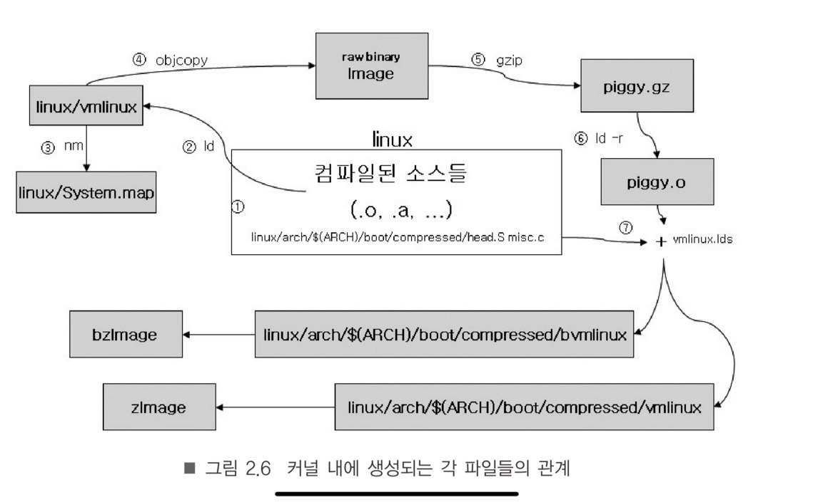

# ARM 테스트 환경 설정
*  rpi2
*  versatilepb
*  vexpress-a9

몇가지 환경으로 테스트해본 결과 vexpress-a9이 적합한 듯 


## 라즈베리파이 테스트 환경
* 컴파일러: crossbuild-essential-armhf
* qemu-system-arm
* QEMU 아키텍처 :  ARM 32 bit
* QEMU: Machine 모델:  raspi2
* QEMU: Device  bcm2710-rpi-3-b.dts
* 디버거: gdb-mutiarch

#### 컴파일 방법

* Building Kernel locally
* Cross compiling the kernel <--- 우리는 이것으로

https://www.raspberrypi.com/documentation/computers/linux_kernel.html


#### 커널 위한 유틸리티: cross compiling 

```
$ sudo apt-get install git bc bison flex libssl-dev
$ sudo apt install git bc bison flex libssl-dev make libc6-dev libncurses5-dev
$ sudo apt install crossbuild-essential-armhf
```

* 이렇게 하면 cross compile 되기는한데.. 다시 만들어야 하기 때문에 그냥 Linaro 다운 받아서 설치하는 것이 편한다.


#### 커널 소스 받기

```
$ git clone https://github.com/raspberrypi/linux.git
$ git fetch --all  --tags
$ git checkout tags/rpi-4.20.y   <----
```


#### 컴파일

* For Raspberry Pi 2, 3, 3+ and Zero 2 W, and Raspberry Pi Compute Modules 3 and 3+ default 32-bit build configuration
#####  bcm2709용 config 파일 위치
* linux/arch/arm/configs/bcm2709_defconfig     <<--- config 
* linux/arch/arm/boot/dts/bcm2710-rpi-3-b.dts  <<--- device

##### Cross compile
```
$ cd linux
$ KERNEL=kernel7
$ make ARCH=arm CROSS_COMPILE=arm-linux-gnueabihf- bcm2709_defconfig
$ make ARCH=arm CROSS_COMPILE=arm-linux-gnueabihf- menuconfig
# 디버깅 정보 포함하여 컴파일
Kernel hacking --> Compile-time checks and compiler option --> 
            Compile the kernel with debug info --> Enable
            Generate dwarf4 debuginfo --> Enable
            Provide GDB scripts for kernel debuffing--> Enable
            
$ make ARCH=arm CROSS_COMPILE=arm-linux-gnueabihf- zImage modules dtbs -j 4
1core 16:42 ~ 17:20
4core 9:47 ~ 22:01
```





### 라즈비안 OS에서 kernel 과 ramdisk 이미지 추출하는 방법

#### 라즈비안 버젼 이미지 받기
http://downloads.raspberrypi.org/raspbian_full/images/raspbian_full-2019-07-12/

```
$ wget http://downloads.raspberrypi.org/raspbian_full/images/raspbian_full-2019-07-12/2019-07-10-raspbian-buster-full.zip
$ unzip 2019-07-10-raspbian-buster-full.zip 
```


#### boot kernel 이미지 추출 방법
```
$ fdisk -l 2019-07-10-raspbian-buster-full.img 
Disk 2019-07-10-raspbian-buster-full.img: 6 GiB, 6434062336 bytes, 12566528 sectors
Units: sectors of 1 * 512 = 512 bytes
Sector size (logical/physical): 512 bytes / 512 bytes
I/O size (minimum/optimal): 512 bytes / 512 bytes
Disklabel type: dos
Disk identifier: 0x698e33bd

Device                               Boot  Start      End  Sectors  Size Id Type
2019-07-10-raspbian-buster-full.img1        8192   532480   524289  256M  c W95 FAT32 (LBA)
2019-07-10-raspbian-buster-full.img2      540672 12566527 12025856  5.8G 83 Linux
```

* 8192 * 512 bytes = 4,194,304
* 540672 * 512 = 276,824,064

```
$ sudo mount -v -o offset=4194304  -t vfat 2019-07-10-raspbian-buster-full.img /mnt/debian
$ sudo mount -v -o offset=276824064 -t ext4 2019-07-10-raspbian-buster-full.img /mnt/debian1
==> 필요한 커널 이미지 추출
$ sudo umount /mnt/debian/
```


#### qemu-system-arm 으로 부팅

##### 1. raspbian-buster-lite 모드로 실행

```
#!/bin/sh
export KERNEL=kernel7
export ARCH=arm
export CROSS_COMPILE=arm-linux-gnueabihf-

echo "target remote localhost:1234"
qemu-system-arm \
  -M raspi2   \
  -m 256 \
  -kernel kernel7.img  \
  -dtb    bcm2710-rpi-3-b.dtb  \
  -drive  file=2020-02-13-raspbian-buster-lite.img,format=raw,if=sd \
  -append "dwc_otg.lpm_enable=0 root=/dev/mmcblk0p2  console=ttyAMA0  rootfstype=ext4 elevator=deadline rootwait" \
  -no-reboot \
  -serial stdio

==> booting 


$ lsblk
NAME        MAJ:MIN RM  SIZE RO TYPE MOUNTPOINT
mmcblk0     179:0    0  1.7G  0 disk 
├─mmcblk0p1 179:1    0  256M  0 part /boot
└─mmcblk0p2 179:2    0  1.5G  0 part /
pi@raspberrypi:~$
```
##### ID/PASSWD
* login:  pi/raspberry


##### 2. raspbian-buster-full 모드 실행

```
#!/bin/sh
export KERNEL=kernel7
export ARCH=arm
export CROSS_COMPILE=arm-linux-gnueabihf-

echo "target remote localhost:1234"
qemu-system-arm \
  -M raspi2   \
  -m 256 \
  -kernel kernel7.img  \
  -dtb    bcm2710-rpi-3-b.dtb  \
  -drive  file=2019-07-10-raspbian-buster-full.img,format=raw,if=sd \
  -append "dwc_otg.lpm_enable=0 root=/dev/mmcblk0p2  console=ttyAMA0  rootfstype=ext4 elevator=deadline rootwait" \
  -no-reboot \
  -serial stdio
```

* graphic 모드로 기동은 되는데 마우스 동작이 안됨
* 그냥 lite 모드로 사용하는 것이 현명할듯

##### 3. raspbianbuster-full 이미지는 nographic 모드로 booting 
```
#!/bin/sh
export KERNEL=kernel7
export ARCH=arm
export CROSS_COMPILE=arm-linux-gnueabihf-

echo "target remote localhost:1234"
qemu-system-arm \
  -M raspi2   \
  -m 256 \
  -kernel kernel7.img  \
  -dtb    bcm2710-rpi-3-b.dtb  \
  -drive  file=2019-07-10-raspbian-buster-full.img,format=raw,if=sd \
  -append "dwc_otg.lpm_enable=0 root=/dev/mmcblk0p2  console=ttyAMA0  rootfstype=ext4 elevator=deadline rootwait" \
  -no-reboot \
  -nographic 
```

* id/pass  pi/raspberry 

```
Raspbian GNU/Linux 10 raspberrypi ttyAMA0

raspberrypi login: pi
Password: raspberry
Last login: Wed Jul 10 01:43:03 BST 2019 on tty1
Linux raspberrypi 4.19.57-v7+ #1244 SMP Thu Jul 4 18:45:25 BST 2019 armv7l

The programs included with the Debian GNU/Linux system are free software;
the exact distribution terms for each program are described in the
individual files in /usr/share/doc/*/copyright.

Debian GNU/Linux comes with ABSOLUTELY NO WARRANTY, to the extent
permitted by applicable law.
pi@raspberrypi:~$ 
pi@raspberrypi:~$ 
pi@raspberrypi:~$ df
Filesystem     1K-blocks    Used Available Use% Mounted on
/dev/root        5852936 5452812     83096  99% /
devtmpfs           86244       0     86244   0% /dev
tmpfs              90852       0     90852   0% /dev/shm
tmpfs              90852    2560     88292   3% /run
tmpfs               5120       0      5120   0% /run/lock
tmpfs              90852       0     90852   0% /sys/fs/cgroup
/dev/mmcblk0p1    258096   39969    218127  16% /boot
tmpfs              18168       0     18168   0% /run/user/1000
pi@raspberrypi:~$ uname -a
Linux raspberrypi 4.19.57-v7+ #1244 SMP Thu Jul 4 18:45:25 BST 2019 armv7l GNU/Linux
pi@raspberrypi:~$ lsblk
NAME        MAJ:MIN RM  SIZE RO TYPE MOUNTPOINT
mmcblk0     179:0    0    6G  0 disk 
├─mmcblk0p1 179:1    0  256M  0 part /boot
└─mmcblk0p2 179:2    0  5.8G  0 part /
```


#### 컴파일된 zImage 부팅 
```
jhyunlee@ubuntu18:~/code/ras3b$ cp  linux/arch/arm/boot/zImage .
jhyunlee@ubuntu18:~/code/ras3b$ cp  linux/arch/arm/boot/dts/bcm2710-rpi-3-b.dtb .
```

##### 2019-07-10-raspbian-buster-full.img 

```
$ cat brun.sh
#!/bin/sh
export KERNEL=kernel7
export ARCH=arm
export CROSS_COMPILE=arm-linux-gnueabihf-

echo "target remote localhost:1234"
qemu-system-arm \
  -M raspi2   \
  -m 256 \
  -kernel zImage  \
  -dtb    bcm2710-rpi-3-b.dtb  \
  -drive  file=2019-07-10-raspbian-buster-full.img,format=raw,if=sd \
  -append "dwc_otg.lpm_enable=0 root=/dev/mmcblk0p2  console=ttyAMA0  rootfstype=ext4 elevator=deadline rootwait" \
  -no-reboot \
  -nographic 
```


## Coretex-A9 환경 

### ARM Versatile Express for Cortex-A9

$ find . | grep  vexpress_defconfig
./arch/arm/configs/vexpress_defconfig

vexpress-a9          ARM Versatile Express for Cortex-A9

##### 컴파일, qemu boot

```
$ git clone https://github.com/torvalds/linux
$ cd linux
$ cd linux && git checkout v4.4
$ ARCH=arm CROSS_COMPILE=arm-linux-gnueabihf- make vexpress_defconfig
$ ARCH=arm CROSS_COMPILE=arm-linux-gnueabihf- make menuconfig
# 디버깅 정보 포함하여 컴파일
Kernel hacking --> Compile-time checks and compiler option --> 
            Compile the kernel with debug info --> Enable
            Generate dwarf4 debuginfo --> Enable
            Provide GDB scripts for kernel debuffing--> Enable
            
$ ARCH=arm CROSS_COMPILE=arm-linux-gnueabihf- make -j4


$ qemu-system-arm \
 -M vexpress-a9  \
 -dtb vexpress-v2p-ca9.dtb \
 -kernel zImage  \
 -append "root=/dev/vda2 rw console=ttyAMA0" \
 -device virtio-blk-device,drive=disk \
 -drive if=none,id=disk,file=2020-02-13-raspbian-buster-lite.img \
 -no-reboot \
 -nographic
==>booting

```

##### 정상 부팅 결과

```
Raspbian GNU/Linux 10 raspberrypi ttyAMA0

raspberrypi login: pi
Password: raspberry

Last login: Thu Feb 13 16:12:40 GMT 2020 on ttyAMA0
Linux raspberrypi 4.20.17+ #2 SMP Sun May 15 02:39:08 KST 2022 armv7l

The programs included with the Debian GNU/Linux system are free software;
the exact distribution terms for each program are described in the
individual files in /usr/share/doc/*/copyright.

Debian GNU/Linux comes with ABSOLUTELY NO WARRANTY, to the extent
permitted by applicable law.
pi@raspberrypi:~$ lsblk
NAME      MAJ:MIN RM  SIZE RO TYPE MOUNTPOINT
mtdblock0  31:0    0  128M  0 disk 
mtdblock1  31:1    0   32M  0 disk 
vda       254:0    0  1.7G  0 disk 
├─vda1    254:1    0  256M  0 part /boot
└─vda2    254:2    0  1.5G  0 part /

pi@raspberrypi:/boot$ ls -l
total 52964
-rwxr-xr-x 1 root root    23983 Feb  3  2020 bcm2708-rpi-b.dtb
-rwxr-xr-x 1 root root    24246 Feb  3  2020 bcm2708-rpi-b-plus.dtb
-rwxr-xr-x 1 root root    23764 Feb  3  2020 bcm2708-rpi-cm.dtb
-rwxr-xr-x 1 root root    23688 Feb  3  2020 bcm2708-rpi-zero.dtb
-rwxr-xr-x 1 root root    24424 Feb  3  2020 bcm2708-rpi-zero-w.dtb
-rwxr-xr-x 1 root root    25310 Feb  3  2020 bcm2709-rpi-2-b.dtb
-rwxr-xr-x 1 root root    25439 Feb  3  2020 bcm2710-rpi-2-b.dtb
-rwxr-xr-x 1 root root    26480 Feb  3  2020 bcm2710-rpi-3-b.dtb
-rwxr-xr-x 1 root root    27099 Feb  3  2020 bcm2710-rpi-3-b-plus.dtb
-rwxr-xr-x 1 root root    25294 Feb  3  2020 bcm2710-rpi-cm3.dtb
-rwxr-xr-x 1 root root    40988 Feb  3  2020 bcm2711-rpi-4-b.dtb
-rwxr-xr-x 1 root root    52304 Jan 17  2020 bootcode.bin
-rwxr-xr-x 1 root root      169 Feb 13  2020 cmdline.txt
-rwxr-xr-x 1 root root     1784 Feb 13  2020 config.txt
-rwxr-xr-x 1 root root    18693 Jun 24  2019 COPYING.linux
-rwxr-xr-x 1 root root  5424376 Feb  3  2020 kernel7.img
-rwxr-xr-x 1 root root  5757200 Feb  3  2020 kernel7l.img
-rwxr-xr-x 1 root root 13521408 Feb  3  2020 kernel8.img
-rwxr-xr-x 1 root root  5142912 Feb  3  2020 kernel.img
```


```
#!/bin/sh
export PATH=/opt/gcc-linaro-7.5.0-2019.12-x86_64_arm-linux-gnueabihf/bin:$PATH
export KERNEL=kernel7
export ARCH=arm
export CROSS_COMPILE=arm-linux-gnueabihf-
export TOOLCHAIN=arm-linux-gnueabihf
export KERNEL_MAKE_CONFIG=menuconfig

KERNEL=kernel7
make ARCH=arm CROSS_COMPILE=arm-linux-gnueabihf- vexpress_defconfig
cat >> .config << EOF
CONFIG_CROSS_COMPILE="$TOOLCHAIN"
EOF

make  ARCH=arm CROSS_COMPILE=arm-linux-gnueabihf- $KERNEL_MAKE_CONFIG
make  ARCH=arm CROSS_COMPILE=arm-linux-gnueabihf- bzImage modules dtbs  -j4

$ cp arch/arm/boot/zImage ~/code/rpi/kernel-qemu.4.19.vexpress.img
$ cp arch/arm/boot/dts/vexpress-v2p-ca9.dtb ~/code/rpi/vexpress-v2p-ca9.dtb
==> compiled
```


##### vexpress_defconfig compile 스크립트

```
$ cat build_kernel.sh 
#!/bin/bash

echo "configuration build output path"
KERNEL_TOP_PATH="$( cd  "$(dirname "$0")" ; pwd -P )"
OUTPUT="$KERNEL_TOP_PATH/out"
echo "$OUTPUT"

PATH=/opt/gcc-linaro-7.5.0-2019.12-x86_64_arm-linux-gnueabihf/bin:$PATH
KERNEL=kernel7
KERNEL=kernel7
ARCH=arm
CROSS_COMPILE=arm-linux-gnueabihf-
TOOLCHAIN=arm-linux-gnueabihf
KERNEL_MAKE_CONFIG=menuconfig

BUILD_LOG="$KERNEL_TOP_PATH/build_log.txt"

cd linux
make O=$OUTPUT ARCH=arm CROSS_COMPILE=arm-linux-gnueabihf- vexpress_defconfig
make O=$OUTPUT ARCH=arm CROSS_COMPILE=arm-linux-gnueabihf- bzImage modules dtbs  -j4

cp $OUTPUT/arch/arm/boot/zImage ~/code/raspbian/zImage
cp $OUTPUT/arch/arm/boot/dts/vexpress-v2p-ca9.dtb ~/code/raspbian/vexpress-v2p-ca9.dtb
```


## Versatilepb : arm1176

* qemu로 미리 만들어 놓은 kernel 이미지 받아서 실행하기 

##### 라즈비안 OS 이미지 받기.

http://downloads.raspberrypi.org/raspbian_full/images/

##### qemu 용 커널 이미지와  dtb  받기.

https://github.com/dhruvvyas90/qemu-rpi-kernel

#### qemu 실행

```
cat $ qrun.sh
qemu-system-arm \
  -M versatilepb \
  -cpu arm1176 \
  -m 256 \
  -hda 2019-06-20-raspbian-buster-lite.img \
  -net user,hostfwd=tcp::5022-:22 \
  -dtb versatile-pb-buster.dtb \
  -kernel kernel-qemu-4.19.50-buster \
  -append 'root=/dev/sda2 panic=1' \
  -no-reboot

```


### gdb 컴파일과 설치

* 이 방법은  별로 잘 잘안된다. 
* 그냥 linaro tool을 설치해서 사용하는 것이 편리하다. 

#### arm-linux-gnueabihf-gdb

https://www.codetd.com/en/article/10470722

##### 현재버전 확인

```
$ gdb -v
GNU gdb (Ubuntu 8.1.1-0ubuntu1) 8.1.1
```

##### 소스 다운로드  및 컴파일 

```
$ wget https://ftp.gnu.org/gnu/gdb/gdb-8.1.1.tar.gz
$ gzip -d  gdb-8.1.1.tar.gz
$ tar -xvf gdb-8.1.1.tar gdb-8.1.1/

$ sudo apt-get install texinfo
$ ./configure --target=arm-linux-gnueabihf --host=arm-linux-gnueabihf --program-prefix=arm-linux-gnueabihf- CC=arm-linux-gnueabihf-gcc --prefix=/opt/arm-linux-gnueabihf-gdb-8.1.1

$ mkdir build
$ cd build
$ pwd
$ source /home/jhyunlee/code/gdb/gdb-8.1.1/configure --target=arm-linux-gnueabihf --host=arm-linux-gnueabihf --program-prefix=arm-linux-gnueabihf- CC=arm-linux-gnueabihf-gcc --prefix=/opt/arm-linux-gnueabihf-gdb

$ make -j4
$ make install
```

##### 설치 결과

```
$ cd /opt/arm-linux-gnueabihf-gdb/
jhyunlee@ubuntu18:/opt/arm-linux-gnueabihf-gdb/bin$ ls -l
합계 70428
-rwxr-xr-x 1 jhyunlee dev     3523  5월 15 12:55 arm-linux-gnueabihf-gcore
-rwxr-xr-x 1 jhyunlee dev 61656692  5월 15 12:55 arm-linux-gnueabihf-gdb
-rwxr-xr-x 1 jhyunlee dev  4243984  5월 15 12:55 arm-linux-gnueabihf-gdbserver
-rwxr-xr-x 1 jhyunlee dev  6203500  5월 15 12:55 arm-linux-gnueabihf-run
```


##### add path

~ / .bashrc file

```
export PATH=$PATH:/opt/arm-linux-gnueabihf-gdb/bin
export LD_LIBRARY_PATH=$LD_LIBRARY_PATH:/opt/arm-linux-gnueabihf-gdb/lib
```


### The Linaro Binary Toolchain

https://releases.linaro.org/components/toolchain/binaries/latest-7/

```
$ mkdir ~/code/tools
$ cd ~/code/tools
$ wget https://releases.linaro.org/components/toolchain/binaries/latest-7/arm-linux-gnueabihf/gcc-linaro-7.5.0-2019.12-x86_64_arm-linux-gnueabihf.tar.xz
$ xz -d   gcc-linaro-7.5.0-2019.12-x86_64_arm-linux-gnueabihf.tar.xz
$ tar xvf gcc-linaro-7.5.0-2019.12-x86_64_arm-linux-gnueabihf.tar

$ source env.sh
$ which  arm-linux-gnueabihf-gcc
/opt/gcc-linaro-7.5.0-2019.12-x86_64_arm-linux-gnueabihf/bin/arm-linux-gnueabihf-gcc

이렇게 나와야 정상
$ which arm-linux-gnueabihf-gdb
/opt/gcc-linaro-7.5.0-2019.12-x86_64_arm-linux-gnueabihf/bin/arm-linux-gnueabihf-gdb

```

##### env 파일로 등록

```
$ cat env.sh
#!/bin/sh
export PATH=/opt/gcc-linaro-7.5.0-2019.12-x86_64_arm-linux-gnueabihf/bin:$PATH
export KERNEL=kernel7
export ARCH=arm
export CROSS_COMPILE=arm-linux-gnueabihf-
```


### ddd 

##### 디버그 모드로 실행

```
$ cat run.sh
#!/bin/sh
export KERNEL=kernel7
export ARCH=arm
export CROSS_COMPILE=arm-linux-gnueabihf-

echo "target remote localhost:1234"
qemu-system-arm -s -S \
  -M raspi2   \
  -m 256 \
  -kernel kernel7.img  \
  -dtb    bcm2710-rpi-3-b.dtb  \
  -drive  file=2019-07-10-raspbian-buster-full.img,format=raw,if=sd \
  -append "dwc_otg.lpm_enable=0 root=/dev/mmcblk0p2  console=ttyAMA0  rootfstype=ext4 elevator=deadline rootwait" \
  -no-reboot \
  -nographic 
```


##### ddd 실행

```
$ ddd --debugger arm-linux-gnueabihf-gdb ./vmlinux
# GDB shell에서 target remote localhost:1234 명령을 친다.
(gdb) target remote localhost:1234

# start_kernel 에 브레이크 포인트 셋팅
(gdb) b start_kernel

# 디버깅 시작.
(gdb) c
```


# Raspberry Pi boards 

* `raspi0`
* `raspi1ap`
*  `raspi2b`
*  `raspi3ap`
*  `raspi3b`

QEMU provides models of the following Raspberry Pi boards:

- `raspi0` and `raspi1ap`

  ARM1176JZF-S core, 512 MiB of RAM

- `raspi2b`

  Cortex-A7 (4 cores), 1 GiB of RAM

- `raspi3ap`

  Cortex-A53 (4 cores), 512 MiB of RAM

- `raspi3b`

  Cortex-A53 (4 cores), 1 GiB of RAM

## Implemented devices

> - ARM1176JZF-S, Cortex-A7 or Cortex-A53 CPU
> - Interrupt controller
> - DMA controller
> - Clock and reset controller (CPRMAN)
> - System Timer
> - GPIO controller
> - Serial ports (BCM2835 AUX - 16550 based - and PL011)
> - Random Number Generator (RNG)
> - Frame Buffer
> - USB host (USBH)
> - GPIO controller
> - SD/MMC host controller
> - SoC thermal sensor
> - USB2 host controller (DWC2 and MPHI)
> - MailBox controller (MBOX)
> - VideoCore firmware (property)


#### qemu-system-arm  machine

```
jhyunlee@ubuntu18:~/code/ras3b/linux$ qemu-system-arm -machine help
Supported machines are:
akita                Sharp SL-C1000 (Akita) PDA (PXA270)
ast2500-evb          Aspeed AST2500 EVB (ARM1176)
borzoi               Sharp SL-C3100 (Borzoi) PDA (PXA270)
canon-a1100          Canon PowerShot A1100 IS
cheetah              Palm Tungsten|E aka. Cheetah PDA (OMAP310)
collie               Sharp SL-5500 (Collie) PDA (SA-1110)
connex               Gumstix Connex (PXA255)
cubieboard           cubietech cubieboard
emcraft-sf2          SmartFusion2 SOM kit from Emcraft (M2S010)
highbank             Calxeda Highbank (ECX-1000)
imx25-pdk            ARM i.MX25 PDK board (ARM926)
integratorcp         ARM Integrator/CP (ARM926EJ-S)
kzm                  ARM KZM Emulation Baseboard (ARM1136)
lm3s6965evb          Stellaris LM3S6965EVB
lm3s811evb           Stellaris LM3S811EVB
mainstone            Mainstone II (PXA27x)
midway               Calxeda Midway (ECX-2000)
mps2-an385           ARM MPS2 with AN385 FPGA image for Cortex-M3
mps2-an511           ARM MPS2 with AN511 DesignStart FPGA image for Cortex-M3
musicpal             Marvell 88w8618 / MusicPal (ARM926EJ-S)
n800                 Nokia N800 tablet aka. RX-34 (OMAP2420)
n810                 Nokia N810 tablet aka. RX-44 (OMAP2420)
netduino2            Netduino 2 Machine
none                 empty machine
nuri                 Samsung NURI board (Exynos4210)
palmetto-bmc         OpenPOWER Palmetto BMC (ARM926EJ-S)
raspi2               Raspberry Pi 2
realview-eb          ARM RealView Emulation Baseboard (ARM926EJ-S)
realview-eb-mpcore   ARM RealView Emulation Baseboard (ARM11MPCore)
realview-pb-a8       ARM RealView Platform Baseboard for Cortex-A8
realview-pbx-a9      ARM RealView Platform Baseboard Explore for Cortex-A9
romulus-bmc          OpenPOWER Romulus BMC (ARM1176)
sabrelite            Freescale i.MX6 Quad SABRE Lite Board (Cortex A9)
smdkc210             Samsung SMDKC210 board (Exynos4210)
spitz                Sharp SL-C3000 (Spitz) PDA (PXA270)
sx1                  Siemens SX1 (OMAP310) V2
sx1-v1               Siemens SX1 (OMAP310) V1
terrier              Sharp SL-C3200 (Terrier) PDA (PXA270)
tosa                 Sharp SL-6000 (Tosa) PDA (PXA255)
verdex               Gumstix Verdex (PXA270)
versatileab          ARM Versatile/AB (ARM926EJ-S)
versatilepb          ARM Versatile/PB (ARM926EJ-S)
vexpress-a15         ARM Versatile Express for Cortex-A15
vexpress-a9          ARM Versatile Express for Cortex-A9
virt-2.10            QEMU 2.10 ARM Virtual Machine
virt                 QEMU 2.11 ARM Virtual Machine (alias of virt-2.11)
virt-2.11            QEMU 2.11 ARM Virtual Machine
virt-2.6             QEMU 2.6 ARM Virtual Machine
virt-2.7             QEMU 2.7 ARM Virtual Machine
virt-2.8             QEMU 2.8 ARM Virtual Machine
virt-2.9             QEMU 2.9 ARM Virtual Machine
xilinx-zynq-a9       Xilinx Zynq Platform Baseboard for Cortex-A9
z2                   Zipit Z2 (PXA27x)
```


## Vexpress-a9 환경

* rpi2 머신으로 하면 여러가지 걸림 돌이 있다. 
* vexpress-a9 


#### 1. Linaro binary Toolchain

```
$ mkdir ~/code/tools
$ cd ~/code/tools
$ wget https://releases.linaro.org/components/toolchain/binaries/latest-7/arm-linux-gnueabihf/gcc-linaro-7.5.0-2019.12-x86_64_arm-linux-gnueabihf.tar.xz
$ xz -d   gcc-linaro-7.5.0-2019.12-x86_64_arm-linux-gnueabihf.tar.xz
$ tar xvf gcc-linaro-7.5.0-2019.12-x86_64_arm-linux-gnueabihf.tar

$ source env.sh
$ which  arm-linux-gnueabihf-gcc
/opt/gcc-linaro-7.5.0-2019.12-x86_64_arm-linux-gnueabihf/bin/arm-linux-gnueabihf-gcc

이렇게 나와야 정상
$ which arm-linux-gnueabihf-gdb
/opt/gcc-linaro-7.5.0-2019.12-x86_64_arm-linux-gnueabihf/bin/arm-linux-gnueabihf-gdb
```
##### env.sh 생성
```
$ cat env.sh
#!/bin/sh
export PATH=/opt/gcc-linaro-7.5.0-2019.12-x86_64_arm-linux-gnueabihf/bin:$PATH
export KERNEL=kernel7
export ARCH=arm
export CROSS_COMPILE=arm-linux-gnueabihf-

$ source env.sh
```


#### 2. vexpress-a9         
ARM Versatile Express for Cortex-A9

```
$ git clone https://github.com/torvalds/linux
$ cd linux
$ git fetch --all --tags
$ git checkout tags/v4.4
$ ARCH=arm CROSS_COMPILE=arm-linux-gnueabihf- make vexpress_defconfig
$ ARCH=arm CROSS_COMPILE=arm-linux-gnueabihf- make menuconfig
# 디버깅 정보 포함하여 컴파일
Kernel hacking --> Compile-time checks and compiler option --> 
            Compile the kernel with debug info --> Enable
            Generate dwarf4 debuginfo --> Enable
            Provide GDB scripts for kernel debuffing--> Enable
            
$ ARCH=arm CROSS_COMPILE=arm-linux-gnueabihf- make -j 4


$ qemu-system-arm \
 -M vexpress-a9  \
 -dtb vexpress-v2p-ca9.dtb \
 -kernel zImage  \
 -append "root=/dev/vda2 rw console=ttyAMA0" \
 -device virtio-blk-device,drive=disk \
 -drive if=none,id=disk,file=2020-02-13-raspbian-buster-lite.img \
 
 -no-reboot \
 -nographic
==>booting
```

#### 3. vrun.sh
```
#!/bin/sh
export KERNEL=kernel7
export ARCH=arm
export CROSS_COMPILE=arm-linux-gnueabihf-

echo "target remote localhost:1234"
qemu-system-arm -s -S \
 -M vexpress-a9  \
 -dtb vexpress-v2p-ca9.dtb \
 -kernel zImage  \
 -append "root=/dev/vda2 rw console=ttyAMA0" \
 -device virtio-blk-device,drive=disk \
 -drive if=none,id=disk,file=2020-02-13-raspbian-buster-lite.img,format=raw \
 -netdev type=user,ipv6=off,hostfwd=tcp::5555-:22,id=net0 -device virtio-net-device,netdev=net0  \
 -no-reboot \
 -nographic 
 
 
 $ sh vrun.sh
```


 * host에서 guest 연결

```
$ netstat -na | grep 5555
tcp        0      0 0.0.0.0:5555            0.0.0.0:*               LISTEN     
tcp        0      0 127.0.0.1:5555          127.0.0.1:60438         ESTABLISHED
tcp        0      0 127.0.0.1:60438         127.0.0.1:5555          ESTABLISHED

$ ssh pi@localhost -p 5555 
The authenticity of host '[localhost]:5555 ([127.0.0.1]:5555)' can't be established.
ECDSA key fingerprint is SHA256:AnRw1+CQcJOHKeJcpmxS3RB4ywbYXet3HZtU0Cozob0.
Are you sure you want to continue connecting (yes/no)? yes
```


 #### 4. Rasbian 환경 설정

##### enable SSH server via desktop
```
$ sudo raspi-config
```
In the menu of the opening configuration tool, first select item 7 ('Advanced options') and then select A4 ('SSH'). The tool asks you if you want to enable the SSH server, which you do, before closing the settings by clicking on 'Finish'.

##### enable ssh
```
sudo systemctl enable ssh
sudo systemctl start ssh
```

```
$ systemctl status ssh
● ssh.service - OpenBSD Secure Shell server
   Loaded: loaded (/lib/systemd/system/ssh.service; enabled; vendor preset: enab
   Active: active (running) since Tue 2022-05-17 06:54:40 BST; 46min ago
     Docs: man:sshd(8)
           man:sshd_config(5)
 Main PID: 1711 (sshd)
   CGroup: /system.slice/ssh.service
           └─1711 /usr/sbin/sshd -D
```


#### 5.ddd
```
$ cat run.sh
#!/bin/sh
export KERNEL=kernel7
export ARCH=arm
export CROSS_COMPILE=arm-linux-gnueabihf-

echo "target remote localhost:1234"
qemu-system-arm -s -S \
 -M vexpress-a9  \
 -dtb vexpress-v2p-ca9.dtb \
 -kernel zImage  \
 -append "root=/dev/vda2 rw console=ttyAMA0" \
 -device virtio-blk-device,drive=disk \
 -drive if=none,id=disk,file=2020-02-13-raspbian-buster-lite.img,format=raw \
 -netdev type=user,ipv6=off,hostfwd=tcp::5555-:22,id=net0 -device virtio-net-device,netdev=net0  \
 -no-reboot \
 -nographic 
```

##### gdb 
```
$ arm-linux-gnueabihf-gdb linux/vmlinux
(gdb) target remote localhsot:1234
```


##### ddd
```
$ ddd --debugger arm-linux-gnueabihf-gdb linux/vmlinux
(gdb) target remote localhsot:1234
```


#### 6. vscode

* native gdb 는  `Target description specified unknown architecture "arm"` 오류 발생

```
$ ddd --debugger arm-linux-gnueabihf-gdb linux/vmlinux
(gdb) target remote localhost:1234
(gdb) b start_kernel
(gdb) c
```

##### arm-linux-gnuabihf-gdb  방법으로  vscode launch.json 설정

* gdb-multiarch 또는 arm-linu-gnuabihf-gdb 
* 중요한점 :break point를 찍지 않고 실행하면 continu 실행 되버리기 때문에 init/main.c 에서 `start_kernel`에 break 걸고 디버깅 시작한다. 
* break를 걸지 않으면 booting까지 진행되 버린다. 

```json
{
    "version": "0.2.0",
    "configurations": [
        {
            "name": "GDB debug - custom",
            "type": "cppdbg",
            "request": "launch",
            "program": "vmlinux",
            "args": [],
            "stopAtEntry": true,
            "cwd": "${workspaceFolder}",
            "environment": [],
            "externalConsole": false,
            "MIMode": "gdb",
            //"miDebuggerPath": "/usr/bin/gdb-multiarch",
            "miDebuggerPath": "/opt/gcc-linaro-7.5.0-2019.12-x86_64_arm-linux-gnueabihf/bin/arm-linux-gnueabihf-gdb",
            "miDebuggerServerAddress": ":1234",            
            "valuesFormatting": "parseText",
            "setupCommands": [
                {
                    "description": "Enable pretty-printing for gdb",
                    "text": "-enable-pretty-printing",
                    "ignoreFailures": true
                }
            ]            
        }
    ]
}
```

* gdb 접두사 문제..

```
xecute debugger commands using "-exec <command>", for example "-exec info registers" will list registers in use (when GDB is the debugger)
```


#### 7. vscode Native Debug Extention 


* cppdbg는 -exec 접두사를 붙여야 하기 때문에 native-debug를 쓰면 좀 gdb 명령을 바로 사용할 수 있는 장점이 있다. 

##### qemu 디버그 모드 실행
* qemu 디버깅에서 중단하려면 Ctl-a,x 눌러서 중단 한다.  
```sh
#!/bin/sh

echo "target remote localhost:1234"
qemu-system-arm  -s -S \
 -M vexpress-a9  \
 -dtb vexpress-v2p-ca9.dtb \
 -kernel zImage  \
 -append "root=/dev/vda2 rw console=ttyAMA0" \
 -device virtio-blk-device,drive=disk \
 -drive if=none,id=disk,file=2020-02-13-raspbian-buster-lite.img,format=raw \
 -no-reboot \
 -nographic 
```

##### vscode launch.json
* 중요한점 :break point를 찍지 않고 실행하면 continu 실행 되버리기 때문에 init/main.c 에서 `start_kernel`에 break 걸고 디버깅 시작한다. 
* break를 걸지 않으면 booting까지 진행되 버린다. 
```json
{
    "version": "0.2.0",
    "configurations": [
        {
            "type": "gdb",
            "request": "attach",
            "name": "Attach to gdbserver",
            "executable": "./vmlinux",
            "gdbpath": "/opt/gcc-linaro-7.5.0-2019.12-x86_64_arm-linux-gnueabihf/bin/arm-linux-gnueabihf-gdb",
            "target": ":1234",
            "remote": true,
            "cwd": "${workspaceRoot}",
            "valuesFormatting": "parseText"
        }
    ]
}
```

