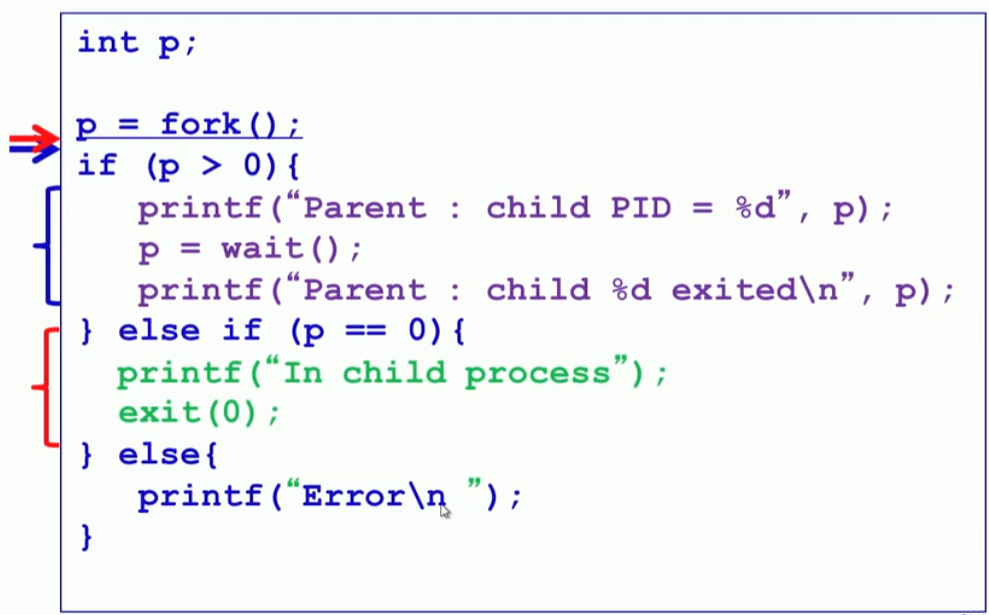
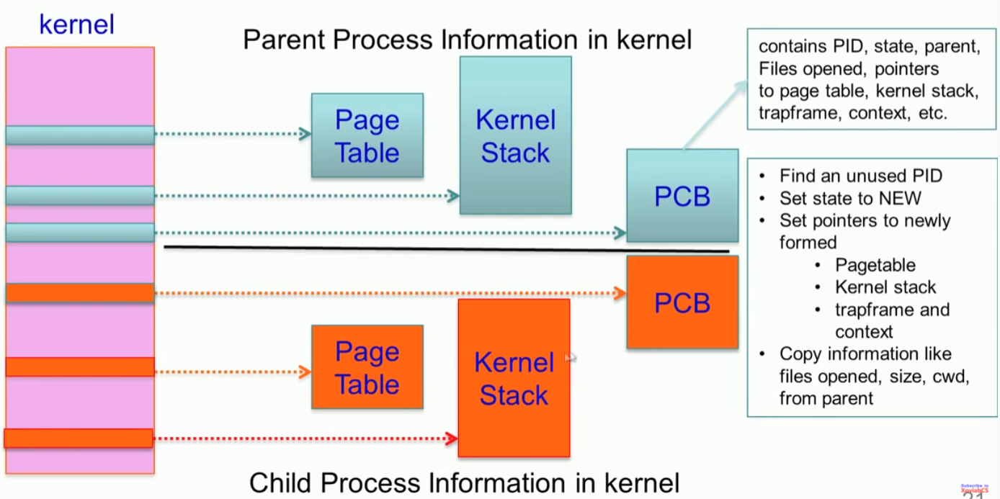

## process 생성


### xv6에서 process 생성

[06.program_process\03.Process_Management.md](../../06.program_process/03.Process_Management.md)








#### system call 

[D:\Code\lk\05.system_call\05.new_syscalll_Kernel5.4.md](../../05.system_call/05.new_syscalll_Kernel5.4.md)


### _do_fork() 함수

/mnt/code/vexpress/linux/kernel/fork.c

```c
/*
 *  Ok, this is the main fork-routine.
 *
 * It copies the process, and if successful kick-starts
 * it and waits for it to finish using the VM if required.
 */
long _do_fork(unsigned long clone_flags,  <<--------------------
	      unsigned long stack_start,  <<-------------
	      unsigned long stack_size,
	      int __user *parent_tidptr,
	      int __user *child_tidptr,
	      unsigned long tls)
{
	struct task_struct *p;
	int trace = 0;
	long nr;

	/*
	 * Determine whether and which event to report to ptracer.  When
	 * called from kernel_thread or CLONE_UNTRACED is explicitly
	 * requested, no event is reported; otherwise, report if the event
	 * for the type of forking is enabled.
	 */
	if (!(clone_flags & CLONE_UNTRACED)) {
		if (clone_flags & CLONE_VFORK)
			trace = PTRACE_EVENT_VFORK;
		else if ((clone_flags & CSIGNAL) != SIGCHLD)
			trace = PTRACE_EVENT_CLONE;
		else
			trace = PTRACE_EVENT_FORK;

		if (likely(!ptrace_event_enabled(current, trace)))
			trace = 0;
	}

	p = copy_process(clone_flags, stack_start, stack_size,
			 child_tidptr, NULL, trace, tls);
	/*
	 * Do this prior waking up the new thread - the thread pointer
	 * might get invalid after that point, if the thread exits quickly.
	 */
	if (!IS_ERR(p)) {
		struct completion vfork;
		struct pid *pid;

		trace_sched_process_fork(current, p);

		pid = get_task_pid(p, PIDTYPE_PID);
		nr = pid_vnr(pid);

		if (clone_flags & CLONE_PARENT_SETTID)
			put_user(nr, parent_tidptr);

		if (clone_flags & CLONE_VFORK) {
			p->vfork_done = &vfork;
			init_completion(&vfork);
			get_task_struct(p);
		}

		wake_up_new_task(p);

		/* forking complete and child started to run, tell ptracer */
		if (unlikely(trace))
			ptrace_event_pid(trace, pid);

		if (clone_flags & CLONE_VFORK) {
			if (!wait_for_vfork_done(p, &vfork))
				ptrace_event_pid(PTRACE_EVENT_VFORK_DONE, pid);
		}

		put_pid(pid);
	} else {
		nr = PTR_ERR(p);
	}
	return nr;
}

```


### 유저 레벨 프로세스 생성 _do_fork()  함수

/mnt/code/vexpress/linux/kernel/fork.c

```c
#ifdef __ARCH_WANT_SYS_CLONE
#ifdef CONFIG_CLONE_BACKWARDS
SYSCALL_DEFINE5(clone, unsigned long, clone_flags, unsigned long, newsp,
		 int __user *, parent_tidptr,
		 unsigned long, tls,
		 int __user *, child_tidptr)
#elif defined(CONFIG_CLONE_BACKWARDS2)
SYSCALL_DEFINE5(clone, unsigned long, newsp, unsigned long, clone_flags,
		 int __user *, parent_tidptr,
		 int __user *, child_tidptr,
		 unsigned long, tls)
#elif defined(CONFIG_CLONE_BACKWARDS3)
SYSCALL_DEFINE6(clone, unsigned long, clone_flags, unsigned long, newsp,
		int, stack_size,
		int __user *, parent_tidptr,
		int __user *, child_tidptr,
		unsigned long, tls)
#else
SYSCALL_DEFINE5(clone, unsigned long, clone_flags, unsigned long, newsp,
		 int __user *, parent_tidptr,
		 int __user *, child_tidptr,
		 unsigned long, tls)
#endif
{
	return _do_fork(clone_flags, newsp, 0, parent_tidptr, child_tidptr, tls);
}
#endif
```


