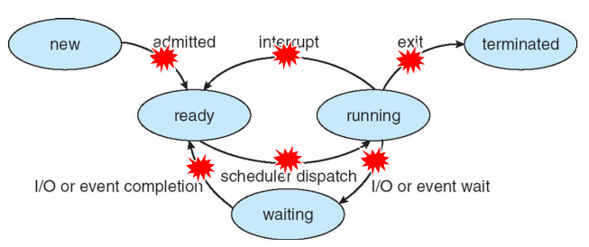
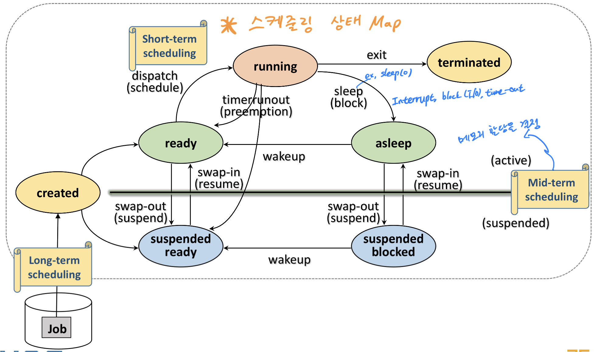

### 1. 인터럽트 컨텍스트란?


* 인터럽트 컨텍스트란 ?  현재 실행 중인 프로세스가 "인터럽트를 처리중"을 의미한다.


#### cpu 상태를 저장

/mnt/code/vexpress/linux/arch/arm/include/asm/thread_info.h

```c
struct cpu_context_save {
	__u32	r4;
	__u32	r5;
	__u32	r6;
	__u32	r7;
	__u32	r8;
	__u32	r9;
	__u32	sl;
	__u32	fp;
	__u32	sp;
	__u32	pc;
	__u32	extra[2];		/* Xscale 'acc' register, etc */
};
```


#### srtuct thread_info

```c
/*
 * low level task data that entry.S needs immediate access to.
 * __switch_to() assumes cpu_context follows immediately after cpu_domain.
 */
struct thread_info {
	unsigned long		flags;		/* low level flags */
	int			preempt_count;	/* 0 => preemptable, <0 => bug */
	mm_segment_t		addr_limit;	/* address limit */
	struct task_struct	*task;		/* main task structure */
	__u32			cpu;		/* cpu */
	__u32			cpu_domain;	/* cpu domain */
	struct cpu_context_save	cpu_context;	/* cpu context */
	__u32			syscall;	/* syscall number */
	__u8			used_cp[16];	/* thread used copro */
	unsigned long		tp_value[2];	/* TLS registers */
#ifdef CONFIG_CRUNCH
	struct crunch_state	crunchstate;
#endif
	union fp_state		fpstate __attribute__((aligned(8)));
	union vfp_state		vfpstate;
#ifdef CONFIG_ARM_THUMBEE
	unsigned long		thumbee_state;	/* ThumbEE Handler Base register */
#endif
};
```


#### taks_struct

/mnt/code/vexpress/linux/include/linux/sched.h

```c
struct task_struct {
#ifdef CONFIG_THREAD_INFO_IN_TASK
	/*
	 * For reasons of header soup (see current_thread_info()), this
	 * must be the first element of task_struct.
	 */
	struct thread_info		thread_info;
#endif
	/* -1 unrunnable, 0 runnable, >0 stopped: */
	volatile long			state;

	/*
	 * This begins the randomizable portion of task_struct. Only
	 * scheduling-critical items should be added above here.
	 */
	randomized_struct_fields_start

	void				*stack;
	atomic_t			usage;
	/* Per task flags (PF_*), defined further below: */
	unsigned int			flags;
	unsigned int			ptrace;
...
```


### 2. ftrace와 커널 로그에서 인터럽트 컨텍스트 확인해보기


### 3. in_interrupt() 함수


* 나는 지금 인터럽트를 처리중에 있는가 ?


* 이것은 thread_info  구조체에서  preempt_count 필드값을 참조해서 알수 있다.

```c
static __always_inline int preempt_count(void)
{
	return READ_ONCE(current_thread_info()->preempt_count);
}
```

/mnt/code/vexpress/linux/arch/m68k/include/asm/thread_info.h

```c
static inline struct thread_info *current_thread_info(void)
{
	struct thread_info *ti;
	__asm__(
		"move.l %%sp, %0 \n\t"
		"and.l  %1, %0"
		: "=&d"(ti)
		: "di" (~(THREAD_SIZE-1))
		);
	return ti;
}
```


#### 4. 인터럽트 컨텍스트에서 스케쥴링하면 어떻게 되는가?


* panic 발생한다.





