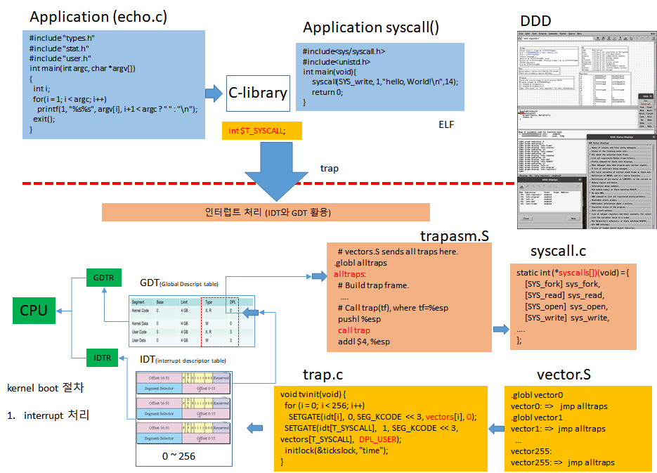
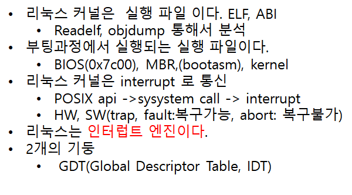

### 1. 인터럽트 핸들러 등록과정 


* 인터럽트를 초기화 하는 과정에서 등록한다. 


인터럽트 핸들러 등록은 인터럽트를 초기화하는 과정에 포함돼 있습니다.
인터럽트 초기화하려면 호출하는 request_irq() 함수 선언부와 함수 사용법에 대해 살펴보겠습니다. 

#### request_irq() 함수

/mnt/code/raspbian/linux/include/linux/interrupt.h

```c
static inline int __must_check
request_irq(unsigned int irq, irq_handler_t handler, unsigned long flags, const char *name, void *dev)
{
	return request_threaded_irq(irq, handler, NULL, flags, name, dev);
}
```

* unsigned int irq: 인터럽트 번호
* irq_handler_t handler: 인터럽트가 발생되면 호출될 인터럽트 핸들러 주소
* unsigned long flags: 인터럽트 속성 플래그
* const char *name: 인터럽트 이름
* void *dev: 디바이스 드라이버를 제어하는 구조체의 주소


#### request_irq() 호출 예시 

/mnt/code/raspbian/linux/drivers/usb/host/dwc_otg/dwc_otg_driver.c

```c
/**
 * This function is called when an lm_device is bound to a dwc_otg_driver.
 */
static int dwc_otg_driver_probe( struct lm_device *_dev ){
    ...
    retval = request_irq(devirq, dwc_otg_common_irq, IRQF_SHARED,"dwc_otg", dwc_otg_device);
	if (retval) {
		DWC_ERROR("request of irq%d failed\n", devirq);
		retval = -EBUSY;
		goto fail;
	} else {
		dwc_otg_device->common_irq_installed = 1;
	}
    ...
}
```


#### request_threaded_irq() 함수 분석

* irq_to_desc() 함수를 호출해서 인터럽트 디스크립터의 주소를 desc 변수에 저장한다. 

/mnt/code/raspbian/linux/kernel/irq/manage.c

```c

int request_threaded_irq(unsigned int irq, irq_handler_t handler,
			 irq_handler_t thread_fn, unsigned long irqflags,
			 const char *devname, void *dev_id)
{
	struct irqaction *action;
	struct irq_desc *desc;
	int retval;

	if (irq == IRQ_NOTCONNECTED)
		return -ENOTCONN;

	/*
	 * Sanity-check: shared interrupts must pass in a real dev-ID,
	 * otherwise we'll have trouble later trying to figure out
	 * which interrupt is which (messes up the interrupt freeing
	 * logic etc).
	 *
	 * Also IRQF_COND_SUSPEND only makes sense for shared interrupts and
	 * it cannot be set along with IRQF_NO_SUSPEND.
	 */
	if (((irqflags & IRQF_SHARED) && !dev_id) ||
	    (!(irqflags & IRQF_SHARED) && (irqflags & IRQF_COND_SUSPEND)) ||
	    ((irqflags & IRQF_NO_SUSPEND) && (irqflags & IRQF_COND_SUSPEND)))
		return -EINVAL;

	desc = irq_to_desc(irq);  <<---- 1. 인터럽트 디스크랩의 주소를 desc에 저장 한다.  
	if (!desc)
		return -EINVAL;

	if (!irq_settings_can_request(desc) ||
	    WARN_ON(irq_settings_is_per_cpu_devid(desc)))
		return -EINVAL;

	if (!handler) {
		if (!thread_fn)
			return -EINVAL;
		handler = irq_default_primary_handler;
	}

	action = kzalloc(sizeof(struct irqaction), GFP_KERNEL);  <<-- 2. kzalloc() 호출해서 irqaction 할당
	if (!action)
		return -ENOMEM;

	action->handler = handler;   <<--3. 핸들러 설정
	action->thread_fn = thread_fn;  <<--4. IRQ 스레드 처리 함수
	action->flags = irqflags;   <<- 5.irq 속성 플래그
	action->name = devname;  <<--6. 인터럽트 이름
	action->dev_id = dev_id; <<-- 7. 인터럽트 핸들러 매개 변수

        <<-- 8. 여기에 패치 코드 삽입니다. 
    if (irq ==56 || irq==86){
		printk("[+][irq_debug] irq_num: %d function: %s line: %d caller :%pS \n", irq, __func__, __LINE__,(void*)__builtin_return_address(0));
		dump_stack();
	}
        
        
	retval = irq_chip_pm_get(&desc->irq_data);
	if (retval < 0) {
		kfree(action);
		return retval;
	}

	retval = __setup_irq(irq, desc, action);

	if (retval) {
		irq_chip_pm_put(&desc->irq_data);
		kfree(action->secondary);
		kfree(action);
	}

#ifdef CONFIG_DEBUG_SHIRQ_FIXME
	if (!retval && (irqflags & IRQF_SHARED)) {
		/*
		 * It's a shared IRQ -- the driver ought to be prepared for it
		 * to happen immediately, so let's make sure....
		 * We disable the irq to make sure that a 'real' IRQ doesn't
		 * run in parallel with our fake.
		 */
		unsigned long flags;

		disable_irq(irq);
		local_irq_save(flags);

		handler(irq, dev_id);

		local_irq_restore(flags);
		enable_irq(irq);
	}
#endif
	return retval;
}
EXPORT_SYMBOL(request_threaded_irq);

```


/mnt/code/raspbian/linux/kernel/irq/irqdesc.c

```c
struct irq_desc *irq_to_desc(unsigned int irq)
{
	return (irq < NR_IRQS) ? irq_desc + irq : NULL;
}
EXPORT_SYMBOL(irq_to_desc);
```


### 2. 디버깅: 인터럽트 핸들러 초기화 과정

* 다음 코드를 추가한다.  

/mnt/code/vexpress/linux/kernel/irq/manage.c

```c
	if (irq ==56 || irq==86){
		printk("[+][irq_debug] irq_num: %d function: %s line: %d caller :%pS \n", irq, __func__, __LINE__,(void*)__builtin_return_address(0));
		dump_stack();
	}
```

* /var/log/kernel.log에서 메세지를 확인한다.  


### 3. 인터럽트 핸들러 등록시 플래그 설정

#### IRQ Storm(인터럽트 폭풍)

인터럽트 신호가 엄청나게 자주 발생해서 시스템 오동작을 유발하는 상황

* 에지 트리거 인터럽트 : High-> Low 전기 신호가 넘어가는 순간
* 레벨 트리거 인터럽트 : Low-> High 상태일때 인터럽트 신로호 인식

```c
/*
 * These correspond to the IORESOURCE_IRQ_* defines in
 * linux/ioport.h to select the interrupt line behaviour.  When
 * requesting an interrupt without specifying a IRQF_TRIGGER, the
 * setting should be assumed to be "as already configured", which
 * may be as per machine or firmware initialisation.
 */
#define IRQF_TRIGGER_NONE	0x00000000
#define IRQF_TRIGGER_RISING	0x00000001
#define IRQF_TRIGGER_FALLING	0x00000002
#define IRQF_TRIGGER_HIGH	0x00000004
#define IRQF_TRIGGER_LOW	0x00000008
#define IRQF_TRIGGER_MASK	(IRQF_TRIGGER_HIGH | IRQF_TRIGGER_LOW | \
				 IRQF_TRIGGER_RISING | IRQF_TRIGGER_FALLING)
#define IRQF_TRIGGER_PROBE	0x00000010

```


#### 플래그 설정

```c
static inline int __must_check
request_irq(unsigned int irq, irq_handler_t handler, unsigned long flags,
	    const char *name, void *dev)
{
	return request_threaded_irq(irq, handler, NULL, flags, name, dev);
}
```


##### build kernel vmimage 

```sh
#!/bin/sh
export PATH=/opt/gcc-linaro-7.5.0-2019.12-x86_64_arm-linux-gnueabihf/bin:$PATH
export KERNEL=kernel7
export ARCH=arm
export CROSS_COMPILE=arm-linux-gnueabihf-
export TOOLCHAIN=arm-linux-gnueabihf
export KERNEL_MAKE_CONFIG=menuconfig
KERNEL=kernel7
make ARCH=arm CROSS_COMPILE=arm-linux-gnueabihf- vexpress_defconfig
cat >> .config << EOF
CONFIG_CROSS_COMPILE="$TOOLCHAIN"
EOF
make  ARCH=arm CROSS_COMPILE=arm-linux-gnueabihf- $KERNEL_MAKE_CONFIG
make  ARCH=arm CROSS_COMPILE=arm-linux-gnueabihf- bzImage modules dtbs  -j4

cp arch/arm/boot/zImage ~/code/raspbian/zImage
cp arch/arm/boot/dts/vexpress-v2p-ca9.dtb ~/code/raspbian/vexpress-v2p-ca9.dtb
```

##### 컴파일 옵션 

```
# 디버깅 정보 포함하여 컴파일
Kernel hacking --> Compile-time checks and compiler option --> 
            Compile the kernel with debug info --> Enable
            Generate dwarf4 debuginfo --> Enable
            Provide GDB scripts for kernel debuffing--> Enable
#uftrace  
kernel hacking -->Tracers --> Kernel Function Tracer              
```


### * xv6에서 인터럽트 등록 방법





```c
int main(void)
{
  kinit1(end, P2V(4 * 1024 * 1024));          // phys page allocator
  kvmalloc();                                 // kernel page table
  mpinit();                                   // detect other processors
  lapicinit();                                // interrupt controller
  seginit();                                  // segment descriptors
  picinit();                                  // disable pic
  ioapicinit();                               // another interrupt controller
  consoleinit();                              // console hardware
  uartinit();                                 // serial port
  pinit();                                    // process table
  tvinit();                                   // trap vectors  <<--  trap vector 등록 
  binit();                                    // buffer cache
  fileinit();                                 // file table
  ideinit();                                  // disk
  startothers();                              // start other processors
  kinit2(P2V(4 * 1024 * 1024), P2V(PHYSTOP)); // must come after startothers()
  userinit();                                 // first user process
  mpmain();                                   // finish this processor's setup
}
```


```c
#define T_SYSCALL       64      // system call

// Interrupt descriptor table (shared by all CPUs).
struct gatedesc idt[256];
extern uint vectors[]; // in vectors.S: array of 256 entry pointers  <-----
struct spinlock tickslock;
uint ticks;

void tvinit(void)
{
  int i;

  for (i = 0; i < 256; i++)
    SETGATE(idt[i], 0, SEG_KCODE << 3, vectors[i], 0);
  SETGATE(idt[T_SYSCALL], 1, SEG_KCODE << 3, vectors[T_SYSCALL], DPL_USER);

  initlock(&tickslock, "time");
}
```

###
```
// Set up a normal interrupt/trap gate descriptor.
// - istrap: 1 for a trap (= exception) gate, 0 for an interrupt gate.
//   interrupt gate clears FL_IF, trap gate leaves FL_IF alone
// - sel: Code segment selector for interrupt/trap handler
// - off: Offset in code segment for interrupt/trap handler
// - dpl: Descriptor Privilege Level -
//        the privilege level required for software to invoke
//        this interrupt/trap gate explicitly using an int instruction.
#define SETGATE(gate, istrap, sel, off, d)                \
{                                                         \
  (gate).off_15_0 = (uint)(off) & 0xffff;                \
  (gate).cs = (sel);                                      \
  (gate).args = 0;                                        \
  (gate).rsv1 = 0;                                        \
  (gate).type = (istrap) ? STS_TG32 : STS_IG32;           \
  (gate).s = 0;                                           \
  (gate).dpl = (d);                                       \
  (gate).p = 1;                                           \
  (gate).off_31_16 = (uint)(off) >> 16;                  \
}

#endif
```


