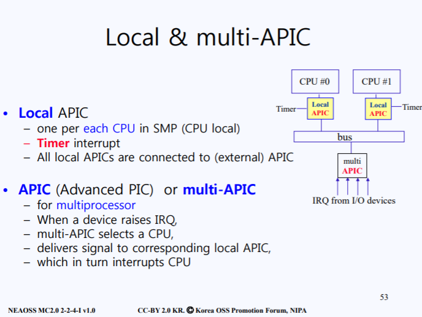

# 인터럽트-1

## 1. 타이머

------

저번 시간에 스케줄링시 사용되는 timeslice에 대해서 학습하였다. 이번 시간에는 timeslice를 커널이 어떻게 관리를 하는지에 대해서 간략하게 설명하고, 인터럽트에대해서 학습할 것이다.

손목시계를 생각해보자. HZ란 1초동안 몇번 째깍 거렸나를 나타내는 지표이다. 1000HZ는 1초동안 천번 째깍거렸다는 의미이다. 이는 물리시간에 배우는 의미이고 컴퓨터적인 의미로 해석하면 다음과 같다

- \#define HZ 1000

매크로 상수로 선언된 해당 의미는 1초에 1000번 인터럽트가 걸린다는 의미이다. 일반적으로 대부분의 아키텍처에서는 HZ가 100으로 세팅되어 있다.

시스템이 부팅된후, 몇번 째깍째각 거렸는지를 `jiffies` 라고 한다. 이는 global 변수이다. 그럼 이 `jiffies` 변수에 들어있는 값을 이용해서 현재 부팅된후 얼마만큼의 시간이 흘렀는지를 알수가 있다. 만약 HZ가 100으로 설저되어있고, 부팅된후 jiffies에 274050이 들어있다면, 274050/100 = 약 2740 초가 흘렀다는걸 알수 있다는 소리이다.

그럼 왜 HZ가 필요할까? 음 생각해봤을때 예를 들어 10분뒤에 울리는 알람을 설정해놨다고 해보자. 현재 HZ는 100으로 세팅되어있다. 그럼 초당 100번의 인터럽트가 발생하게되고, 총 300번의 인터럽트 즉 3초가 지났을때 알람이 울릴것이다. 이런식으로 타이머 인터럽트를 설정한거같다

또한 전 시간에 설명한 timeslice와 관련된 이유도 포함된다. 각 task마다 가용시간을 할당받는다고 했는데, 이 할당받는 시간의 체크 단위를 HZ로 하게 되는것이다. 특정 task가 3초의 시간을 할당받았다고하면, 300번의 인터럽트가 발생했을때 완료가 되서 끝나거나 아니면 다시 대기 상태로 빠지게 될것이다. 이렇게 HZ의 단위로 계속해서 프로세스들이 돌아가며 작업을 할 수 있게 해주기 위해 계속해서 특정 시간마다 인터럽트를 걸어주는 것 이다.

## 2. Hardware Clocks and Timers

------

시간과 관련된 2가지가 있다. 하나는 Timer이고, 나머지는 RTC이다. 두개는 구분되어서 사용된다. RTC의 가장 큰 특징은, 내부의 충전된 배터리가 존재하기 때문에 컴퓨터 파워를 꺼도 계속 시간이 흐른다. 따라서 컴퓨터가 부팅시에 커널로부터 RTC(현재 시각)을 읽어올수 있다.

이러한 RTC와는 다르게 Timer는 현재시간을 알리는 목적이 아니라 주기적으로 CPU에게 인터럽트를 거는 역할로서, 프로그램적으로 인터럽트를 걸게 설정할수도 있다. 그렇다면 타이머 인터럽트가 어떻게 걸리는지를 살펴보자.

clock을 시간으로 비유할때 1번 째깍 거릴때마다 인터럽트가 걸린다고했다. 이렇게 인터럽트가 걸리면, 인터럽트 핸들러에 의해 do_time 함수가 안에서 `jiffies` 를 1 증가시킨다.

그리고 `update_process_times()` 함수가 호출되는데, 현재 동작하고 있는 프로세스의 PCB정보를 토대로 커널모드인지, 유저모드인지에 따라서 각 모드에서의 count를 증가시킨다. 이를 통해 count * HZ 계산을 해서 커널 모드에서 얼만큼의 시간을 사용했고, 유저모드에서 얼만큼의 시간을 사용했는지 알수있다. 그리고 이 두개를 합쳐서 해당 프로세스가 얼마만큼의 CPU를 사용했지를 알수있다. (해당 정보 역시 PCB에 존재)

타이머에 대한 설명은 여기까지만 하고 이제 인터럽트에 대해서 자세히 알아보자

## 3. Interrupt

------

인터럽트(interrupt, 문화어: 중단, 새치기)란 마이크로프로세서(CPU)가 프로그램을 실행하고 있을 때, 입출력 하드웨어 등의 장치나 또는 예외상황이 발생하여 처리가 필요할 경우에 마이크로프로세서에게 알려 처리할 수 있도록 하는 것을 말한다

⇒ https://ko.wikipedia.org/wiki/인터럽트

위 그림을 봐보자. 네모난 파란색 박스는 CPU 내부를 의미한다. 현재 CPU 명령어 사이클을 돌면서 fetch, decode, execution 등의 루틴이 돌아간다. 하나의 사이클이 끝나면 다음 명령어를 수행하기 위해 PC가 증가된다.

하지만 만약 중간에 disk가 인터럽트를 걸었다고 가정해보자. 그렇게 되면, CPU 내부의 Interrupt request bit가 세팅되면서 현재 PC는 저장을 시키고, PC에 인터럽트 핸들러 주소가 들어가고, 그 주소가 fetch되면서 디스크를 서비스해주는 인터럽트 핸들러 루틴이 실행된다.

> 만약 인터럽트가 안걸리게 하고 싶을때도있다. 커널이 부팅될때 중간에 인터럽트가 들어와도 무시하고 부팅만 먼저 되게끔 하고 싶을때를 말한다. 따라서 이를 위한 내부적으로 소프트웨어 명령어가 존재하고 이는 *Interrupt request bit*을 disable 시키게 된다.

위에선 하나의 disk가 인터럽트를 건 상황이지만, 실제로는 수많은 디바이스들이 인터럽트를 요청할수 있다. 프린터, CD, 등등이 말이다.

따라서 여러 디바이스들이 각자 *interrupt requet bit* 을 세팅하는게 아니라, 중간에 Interrupt Controller를 두고 이놈이 여러 디바이스를 제어해서 대표적으로 *interrupt request bit*을 세팅하게 된다.

## 3.1 PIC (Programmable Interrupt Controller)

------

Interrupt Controller를 프로그램적으로 관리를 가능하게 해뒀기 때문에 이를 PIC라고 한다. 위 사진을 PIC라고 보면 될것이다.

우측 파란색 박스가 바로 PIC이다. PIC에는 여러 디바이스들이 물려있고, 디바이스들이 `IRQ Lines`를 통해 PIC에 연결되어 있다. IRQ(Interrupt Request)

때에 따라서 동시에 여러 디바이스들이 인터럽트를 요청할수 있다. 즉 서로 인터럽트 요청을 위한 경쟁을 하게 되고, PIC에서는 이러한 경쟁을 관리하기 위해 내부적으로 처리 로직이 존재한다.

우선 PIC에 `IMR(Interrupt Mask Register)`가 존재한다. 마스킹의 역할로, 0으로 세팅할경우 인터럽트 요청을 차단시킬수 있다. 만약 마스킹이 안되어있으면 요청은 그대로 전달되고, `IRR(Interrupt Request Resiger)`이 받게된다. IRR에서는 마스킹되지 않았던 요청을 그대로 받는다.

IRR에서 `Priority Register` 에서는 IRR에서 전달된 요청들중 어떤 놈의 요청을 제일먼저 처리해야할지 우선순위를 체크한다. 그리고 선정된 요청을 `ISR(In Service Register)` 에 전달한다. 여기에는 이제 실제 서비스해줄 요청이 담기고, 마지막으로 PIC에서는 해당 요청이 `INTR`에 전달되어 Interrupt request bit이 enable된다.

`INTR` 로 요청이 전달될때 어느 디바이스가 요청했는지의 정보를 vector에 담아서 같이 보낸다. 만약 디스크면 0, 프린트면 3 이런식으로 말이다. 사진 속 5번이 이에 대한 설명이다. IRQ Lines number를 vector로 변경시킨다는 의미이다.

여기서 INTR이 바로 좀 전 사진의 마름모 모양의 부분을 뜻한다.

이제 CPU에게 인터럽트 신호가 전달되었으면, PIC와 다른 디바이스들은 요청에 대한 응답(ACK)이 올때까지 Blocked 상태가 된다.

위 사진은 방금 설명한 그대로를 나타낸다. CPU 내부에 VECTOR, INTR이 들어가 있고, PIC가 외부에 존재한다. PIC에는 많은 IRQ 라인이 연결되어있는데, 하나의 IRQ에는 여러 디바이스들이 연결되어있다.

PIC로부터 선택된 인터럽트 요청과 해당 디바이스에 대한 Vector가 CPU로 전달되고, 이에대한 응답이 올때까지 PIC는 block 된다. ack가 온 뒤에, block이 풀리면서 다른 디바이스들의 요청이 처리된다.

## 3.2 Interrupt Handling in Multiprocessor

------

이번엔 멀티 프로세싱 상태의 인터럽트가 어떻게 동작하는지 살펴보자.

현재 CPU 가 2개 있고 각 CPU는 버스에 물려있다. 또한 모든 I/O 디바이스들은 `Multi APIC`에 연결되어 있다. `APIC`이란 Advanced PIC의 약자로 멀티프로세서를 위한 PIC을 의미한다. 또한 CPU에 달려있는 조그마한 `Local APIC`도 존재한다. 이 APIC에는 Timer device만 연결되어 있다.

좀더 큰 개념으로 봐보자. CPU는 실제 MMU와 연결되어있다. MMU는 Memory Management Unit으로 가상 메모리 주소를 실제 메모리 주소로 변환하며, 메모리 보호, 캐시 관리, 버스 중재 등의 역할을 진행한다.

즉 관리의 역할이므로 MMU에서는 CPU에서 전달된 주소가 low addreass(가령 0 ~ 7777xxx)이면 해당 주소는 메모리인것을 파악하고 메모리 버스를 통해 메모리에 전달한다. 만약 high address(가령 7777xxx ~ 7777777)이면 I/O 와 관련된 주소인것을 파악하고 I/O버스로 보낸다.

I/O 버스에는 실제 I/O 디바이스들이 물리는데, I/O interface card 형태로 직접 물릴수도 있고, PIC를 거쳐서 물릴수도 있다.

interface 는 요런거를 말하는거 같다. I/O interface card는 모두 동일한 포맷으로 **규격화**가 되어있다. 만약 디스크라고 하면

- address 레지스터 : 디스크로 가는 섹터 주소

- data 레지스터 : 디스크에 쓰거나 읽을 데이터

- 보조레지스터인

  - control : cpu가 디스크를 read하고 싶은지 write하고 싶은지, 등에 대한 정보들

  - status : 디스크가 바쁜지 놀고있는지 등에 대한 상태정보

- ROM

  - vendor id : 제조 회사 정보

  - device is : 해당 디바이스 정보

  - interrupt line

  

I/O 디바이스들이 I/O interface 로 직접 물릴수도 있고, PIC를 통해 물릴수도 있다.

이번엔 멀티 프로세싱 상황에서 좀더 자세히 알아보자. 멀티 프로세싱은 크게 2가지 종류가 있다.

1. SMP (대칭형 멀티 프로세싱)

   SMP는 모든 프로세스가 메모리 버스, I/O 버스, 데이터 버스를 공유하며 하나의 운영체제가 모든 프로세스를 관리한다. 따라서 자원들이 서로 공유됨에 따라 동기화가 매우 중요하다.

   

1. AMP (비 대칭형 멀티 프로세싱)

   AMP는 각 프로세스가 특정된 업무를 맡아서 한다. 이는 Mast-Slave 형태라고 부르며, 주 프로세스가 전체 시스템을 통제하고, 다른 프로세스들은 Master의 통제하에 동작된다.

   

이 개념을 토대로 아래 그림을 봐보자.

SMP에서는 모든 버스를 공유한다고 했다. 현재 Disk에서 인터럽트 요청이 오면, 해당 시그널은 APIC으로 전달된다. 헌데 현재 CPU가 4개나 있다. 이 중 어떤 CPU에게 요청을 해야할까?

아키텍처마다 다르지만 IRQ를 분배하는 알고리즘은 대부분 비슷하다. IRQ를 어떤 CPU에게 전달할꺼인지에 대한 방법은 크게 2가지가 있다.

1. Static distribution

   말그대로 Static하게 설정된 table에 따라서 요청을 CPU에 분배한다

1. Dynamic distribution

   동적으로 그때마다 우선순위 같은거에 따라 분배한다

   

   현재 우선순위가 가장 낮은 프로세스를 돌리고 있는 CPU에게 인터럽트 요청을 준다. 하지만 만약 running중인 프로세스의 우선순위가 동일한 cpu가 존재하면, *Arbitration 알고리즘*이 적용된다.

   

   해당 알고리즘에는, 모든 CPU가 카운터를 가지고, 현재 인터럽트 요청을 처리하는 CPU의 카운터는 0으로 만든다. 그러면서 다른 cpu들의 카운터는 1 증가가 된다. 이에따라 카운터의 숫자가 높은 CPU일 수록 인터럽트 처리를 자기는 안하고 남들한테 떠넘기는 놈이라고 판명할수 있다.

   

   그리고 이제 다음 IRQ 요청이 오면, CPU들의 카운터를 보고 가장 높은 놈에게 처리해달라고 요청한다.

   

   

   이번엔 AMP 를 봐보자. 위에서 간략하게 설명한것처럼 AMP는 Master - Slave 구조로써 Master CPU만 OS Kernel이 존재하게 된다. 따라서 Master CPU 만이 I/O 를 처리할수 있고, Slave에서 I/O를 하기 위해선 무조건 Master에게 요청을 보내서 부탁해야한다.

   

   SMP에서는 각 CPU들이 자원을 공유하기 때문에 상호배제의 원칙이 철저히 보장되야한다. 따라서 매우 복잡하다. 하지만 AMP는 Master-Slave 구조이기 때문에 모든 시스템 콜이 마치 한줄로 수행되므로 상호배제를 신경쓸 필요가 없다. 따라서 아키텍쳐 디자인이 SMP보다 매우 간단하다.

   

   이런 이유때문에 1997?8? 년까지는 멀티프로세싱이다 하면 AMP 프로세싱 구조로 통용되었다. 하지만 Slave의 요청이 많아지면 많은 과부하가 걸렸으며, Master CPU가 고장나버리면 아무것도 할수없는 상황이 벌어지기 때문에 신뢰성, 가용성, 성능 등의 많은 문제로 AMP 구조는 더이상 사용되지 않으며, SMP 구조가 최근까지 사용되고 있다.

# 인터럽트-2

## 1. Data Structure for Interrupt Handling

------

우선 소프트웨어로서의 인터럽트를 설명하기 위해 Data Structure와 Function 인터럽트 2가지로 분류해서 설명하겠다.

저번시간에 설명한 부분을 간략하게 다시 설명해보자. IRQ 라인에는 많은 디바시으들이 물려있고, 여러 디바이스들의 인터럽트 요청을 컨트롤하기 위해 PIC가 존재한다. 결국 PIC를 통해 나가는 요청은 하나고, 이를 프로그램 적으로 마스킹을 걸어 인터럽트를 제어할수 있기 때문에 PIC라고 부른다.

이젠 IRQ Lines 에 대해서 좀더 자세히 알아보자. IRQ Lines에는 4개의 정보가 담겨져 있다

- Handler

  PIC는 APIC과 Local APIC이 존재한다고 했다. 인터럽트 요청이 어느 PIC로 부터 왔는지 확인하기 위해 존재

- Lock

  공유 자원을 이용시 상호배제를 위해 존재. 뒤에서 설명함

- Status

  1. **IRQ_Disabled** : 인터럽트가 현재 마스킹 되어 disabled 된 상태

  1. **IRQ_Wating** : 인터럽트가 마스킹되지 않았지만 요청이 아직 안온상태이므로 대기인 상태이다

  1. **IRQ_Pending** : 인터럽트 요청이 왔지만, 아직 커널이 이를 서비스 해주지 못한 상태

  1. **IRQ_Inprogress** : 드디어 커널이 인터럽트 서비스 루틴을 수행하는 상태(ISR)

  이렇게 IRQ Lines에는 4가지의 상태가 존재한다.

- Action

  실제 IRQ Lines에는 많은 디바이스가 연결되어있다. 따라서 요청이 어느 라인의 어느 디바이스로부터 왔는가에 대한 정보가 여기 담겨있다. 즉, Action 필드를 따라가보면 ISR이 리스트로 쭉 연결되어 있다.

이러한 4개의 정보는 하나의 IRQ Lines에 존재한다. 따라서 만약 IRQ Lines이 여러개라면 4개의 정보를 하나의구조체로 하여 배열 형태로 IRQ Lines 정보가 관리된다.

위 사진을 봐보자. 만약 IRQ Lines이 3개라면, 3개의 구조체가 존재하고 이는 `irq_desc`배열형태로 관리된다. 또한 아까말한 action 필드를 보면, ISR에 연결된다. 다양한 디바스이가 하나의 IRQ Lines에 연결된 경우 해당 포인터를 따라가서 특정 디바이스를 찾는다. 찾는게 아니면 next로 다음껄 찾는다.

저번시간에 멀티 프로세싱에 대한 얘기를 끝에 잠깐했었다. CPU가 만약 3개라면 어떤 CPU라도 해당 요청을 처리할수 있다. 보통 CPU가 인터럽트 요청을 처리하기 위해 제일 먼저 irq_desc[] 배열의 IRQn→status를 참조한다. 따라서 irq_desc[] 배열은 shared variable이다.

SMP 멀티프로세싱인 경우 상호배제 원칙을 잘 지켜야하므로 특정 CPU가 irq_desc[] 중 하나를 처리하면 다른 CPU가 접근하지 못하게 막아야하므로 IRQ Lines 구조체는 Lock 필드를 가진다. Lock 이 걸려있으면 다른 CPU는 접근하지 못하게 상호배제를 시킨다.

## 2. Function for interrupt

------

그럼 실제로 인터럽트가 걸렸을때 어떤 코드가 실행되는지 알아보자. 제일먼져 IRQn_interrupt() 가 호출되는데, 이는 어셈블러 함수이다. 해당 함수가 호출되면 간단한 동작을 한후 바로 `do_IRQ() `함수를 호출한다.

위 코드는 실제 do_IRQ() 함수 코드이다.

do_IRQ() 함수는 struct pt_regs 라는 자료형으로 regs 변수를 하나 가지고 들어온다. 그리고 reg.irg_eax & 0xff 연산을 통해 `irq` line number를 뽑아낸다.

아까 irq_de sc[] 배열에는 각 irq_lines 구조체가 존재한다고 했다. 위에서 뽑은 line number가 바로 irq_desc 배열의 인덱스라고 생각하면 된다. 따라서 irq_desc + irq 연산을 통해 현재 irq_desc[] 의 특정 인덱스에 들어있는 구조체 주소를 가져오게 된다. (`desc`)

그리고 spin_lock(desc→lock) 함수를 통해 사용가능한 놈인지 체크를 하고 사용중인 놈이 없으면 lock을 걸고 진행을한다. 만약 누가 사용중이면 계속 기다리게 된다.

진행이 되면, 이제 desc→handler를 참조하여 현재 어떤 PIC가 요청했는지 찾고 그 PIC에 ack 신호를 보낸다.(desc→handler→ack(irq)). 그래야 다른 인터럽트를 처리할수 있다.

그리고 desc→status를 가져와서 이제 실제로 인터럽트 요청이 왔기 떄문에 irq_lines의 waiting status bit를 없애고 처리를 기다리는 상태인IRQ_pendding bit을 세팅한다. (왜냐하면 아직 ISR까지는 안갔기 때문)

- (desc → status & ~(IRQ_waiting))

- (desc → status |= ~IRQ_pending)

그다음 쭉 실행되고 사진의 우측을 보면 for문을 돌면서 desc→lock을 unlock한다. 왜냐하면 critical_section 즉, irq_desc[] 배열에서 요청들어온 라인을 찾았기 때문에다.

그다음 `handle_IRQ_event()`를 호출한다. `handle_IRQ_event()` 안에서 이제 실제로 action→에 연결되어있는 각 디바이스들의 요청된 작업을 수행한다. 이는 do-while ()로 되어있기때문에 action 필드가 NULL일 때까지 모든 해당 IRQ Lines 에 연결되어있는 요청한 디바이스의 인터럽트 요청을 처리한다.

정리를 한번 해보자. 왼쪽 박스는 HW, 오른쪽 박스는 SW이다. 분홍색 박스는 인터럽트의 Data Structure이다.

1. 프린터 같은 디바이스에서 인터럽트 요청이 오면 PIC가 이를 관리하여 실제로 CPU에게 보낸다

1. 4개의 CPU중 CPU0가 요청을 받고, 처리를 시작하면 do_IRQ()함수가 실제 호출된다.

1. do_IRQ() 함수는 실제 메모리 안에 존재하는 SW적으로 구현된 로직이다. do_IRQ()에서 어느 라인에서 온건지 확인을하고 IRQ3에서 온것을 확인했다

1. 그럼 이제 실제 IRQ3→action을 뒤지면서 ISR을 수행한다.

이상태에서 CPU0가 ISR을 수행하고있는데, 아까 코드를 보면 아까 desc→handler→ack(irq)를 통해 ack를 보냈기 때문에 다른 디바이스들의 요청을 처리할수 있게된다.

만약 CPU0가 ISR을 수행하고 있는데 동일한 Line IRQ3에서 또 요청이 오게되면, 서로다른 CPU들이 동일한 ISR 루틴을 수행하여 충돌이 발생할수 있다. 따라서 do_IRQ() 왼쪽 아래쯤을 보면 action=NULL을 초기화시켜주고, if문으로 현재 Line의 status의 IRQ_inprogress 가 세팅되어있으면, 이러한 충돌을 방지하기 위해 goto out 종료되게 처리한다. 어짜피 종료되도 이미 현재 CPU0가 다 ISR을 수행시킨다.

# 인터럽트-3

## 1. Interrupt

------

저번시간의 마지막 부분을 이어서 설명하겠다. 그전에 우선 IRQ 라인에 의해서 CPU가 인터럽트에 걸리는 3가지 경우가 존재한다는걸 알고가자. 이미 설명한 케이스이다.

1. 만약 현재 요청들어온 IRQm 라인에 일을 해주고 있는 CPU가 없으면 그냥 CPU0 가 처리해준다.

1. CPU0가 IRQm 라인을 처리하고 있는 도중에 동일한 IRQm라인의 요처이 들어와서 CPU1이 처리해주려고한다. IRQm라인의 status는 현재 IRQ_Inprogress 비트가 세팅되어있기 때문에 이를 확인하고 IRQ_pending bit을 추가로 세팅한다음 종료된다.

1. CPU1이 IRQm 의 `handle_IRQ_event()` 함수를 수행하고 이는 do-while이다. 이게 끝나면 for문에서 다시한번 IRQ_pendding bit을 체크한다. 분명 그전에 끄고 왔지만 이게 세팅되었다는 뜻은, 동일한 라인에서 또 요청이 들어왔다는 놈이고, 다른 CPU가 나에게 처리부탁을 요청했다는 의미이다. 그럼 다시 for문으로 돌아가 `handle_IRQ_event()` 를 수행한다.

이제 위 과정을 정리해보자.

1. APIC의 IRQ lines에 여러 디바이스들이 물려있다. IRQm 라인을통해 특정 디바이스가 인터럽트 요청을 보낸다.

1. APIC에서는 현재 CPI(i)와 CPI(k) 둘중 CPU(i) 를 선택한다. 따라서 CPU(i)의 counter는 0가 된다. (counter에 대한 설명은 이전 강의를 참고바람)

1. CPUi는 irq_desc[m].status의 waiting 필드를 지우고 pennding으로 업데이트한다.

1. 이제 어떤 CPU가 해당 인터럽트를 처리할지 선택한다. 이는 위에서 설명한 케이스에 따라서 달라진다.

   - Case A : 어떠한 CPU도 IRQm을 처리하고 있지 않으면, CPU(i)가 바로 해줌. ⇒Let CPU(i) handle IRQm

   - Case B : 다른 CPU(k)가 이미 IRQm을 처리하고 있으면, irq status에 Inprogress status를 추가하고, CPU(k)에게 요청을 넘긴다. ⇒ Let CPU(k) handle IRQm

   

## 2. Race Condition

------

이러한 do_iqr() 함수 로직은 많은 민폐를 끼치게 된다. 여기서 말하는 민폐는 요청에 대한 ACK가 오기 전까지 PIC는 block이되고, 또 IRQ 라인은 공유 메모리로 사용되기 때문에 lock이걸리면 다른 CPU는 사용하지 못하는 것들을 말한다.

이렇게 민폐를 끼치는 영역은 주로 `Critical_section` 에서 발생한다. 따라서 해당 영역은 매우 신속한 처리를 필요로한다. 이러한 신속한 처리를 필요로 하는 영역을 Top-Half 영역이라고 부른다. 이는 하드웨어에 시작되는 영역이다

이에 반해 `Non-Critical_section` Top-Half 영역보다는 block되는 리소스같은게 적긴하다. 하지만 이 역시도 민폐를 키칠수 있는 상황이 존재한다.

만약 현재 handle_IRQ_event() 에서 처리해야하는 작업이 디스크에서 200TB를 가져와라! 라는 요청이면 어떨까?. 매우 사이즈가 큰 작업이므로 신속한 처리를 하지 못한다. 따라서 한번에 처리하지 못하는 작업을 후에 다시 처리할수 있도록 `soft-iqr pending bit` 를 세팅한다.

해당 비트가 설정되어 있으면 후에 do_softirq() 에 의해서 남은 작업을 다시 수행하도록 소프트웨어적으로 구현되어있다. 이러한 메커니즘은 `Bottom Half` 라고 부른다.

즉 Top Half는 하드웨어의해 실행되고, Bottom Half는 소프트웨어에 의해 실행되는 로직을 갖는다. Bottom Half의 실 예를 한번 봐보자.

현재 NIC 즉 네트워크 인터페이스 카드에서 인터럽트 요청이 들어왔다. 무선 랜카드 같은곳에서 현재 어떠한 패킷을 받고 해당 패킷을 처리하기 위한 인터럽트 요청일것이다.

그럼 PIC는 특정 CPU를 선택하고 CPU에서는 do_IRQ()를 호출한다. do_IRQ()에서는 초기에 ack를 PIC에 보내 다른 인터럽트를 처리할수 있도록 하고, irq_desc[IRQm] status를 업데이트한다. 메모리에 복사된 패킷을 확인하여 재조립후 하나의 스트림으로 하여 패킷 요청이 실행된다. 만약 ftp 관련 패킷이면 ftp 관련 작업을 할것이다.

위 과정은 하나의 Top-Half에서 다 수행되는게 아니다.

NIC로부터 요청이 오고, do_irq() 즉, 초기엔 Top-Half가 수행된다. Critical Top half가 수행되면서, ACK를 보내고, NIC의 패킷을 저장한 버퍼를 만들고, 거기에 패킷을 복사한다. 실제 패킷의 동작 처리는 bottom-half에서 진행되게끔 `soft-iqr pending bit` 를 세팅한다.

그 이후 정상적으로 다른 인터럽트들을 쭉 실행한다. 그러면서 중간중간 CPU가 처리할 작업을 우선순위를 보고 선택하게 되는데, 그때 `soft-irq-pending-bit` 가 세팅되어있는 놈을 보면, do_softiqr()를 실행시킨다. 여기서 실제 패킷에 대한 처리가 수행된다.

이러한 일련의 과정을 다음 그림으로 정리할수 있다

## 3. 정리

------

ISR 루틴이 수행될때 부하가 큰 작업은 신속한 처리를 위해 do_softirq() 함수를 이용해서 처리를 한다. 따라서 Top-half, Bottom-half 가 무엇인지 이제 구분할수 있다. 다음에는 Bottom-half 를 중점적으로 설명하겠다.

# 인터럽트-4

## 1. Bottom halves

------

저번시간에 Top-half와 Bottom-half에 대해서 설명을 했다. 이번 강의는 Bottom-half에 대해서 좀더 자세히 알아보는시간을 가져보자.

인터럽트 요청이 오면 Top Half 루틴이 수행되고, 큰 작업이 수행되야할때는 Top-Half에서 soft irq bit을 세팅한다고 했다. 왼쪽 아래에 보이는 게 바로 그 bit이다.

softirq_pending[] bit을 보면, 1로 세팅되어있는 부분이 현재 Bottom-half로 처리되야하는 기능이다. 이는 인덱스마다 정해져있다. 예를 들어 0번 인덱스는 디스크 관련, 1번은 TCP/IP 관련 이런식으로 말이다.

만약 현재 인덱스 1의 bit이 세팅되어있으면 그대로 sofirq_vec[1] 을 참조한다. 해당 action data 필드는 실제 구조체 형태로 되어있는데, 기능을 수행하는 action과 실 데이터를 가리키는 필드가 구조체 안에 들어있다.

실제 위에서 설명한 softirq_pending[cpu]는 내부에 각 인덱스마다 어떤 Softirq 기능인지 정의되어있다. 0번이 HI_SOFTIRQ, 2번이 NET_TX_SOFTIRQ 이다. 이러한 Softirq 기능은 추가할수있다.

## 1.2 Softirq

------

Top-half에서 do_irq() 함수가 호출됬다면 Bottom-half에서는 do_softirq() 함수가 호출된다. 코드 로직은 비슷하며, 왼쪽 아래를 보면 do-while 반복문을 볼수가 있다.

현재 pending 배열이 아까 말한 softirq_pending[]인데, 여기서 하위 한바이트를 확인하고, 1이면 이에 해당하는 softirq_vecc 즉, h→action을 호출한다. 그다음 pending을 쉬프트 연산을 통해 하나씩 반복해서 확인한다. 실제 h→action이 Softirq handler의 역할을 진행한다.

위 그림을 봐보자. 중간 화살표는 시간의 흐름을 뜻한다. 현재 t1 시간에 IRQm 라인에서 인터럽트 요청이 들어와서 CPU(i)가 선택되었다. 그리고 do_IRQ() 함수가 호출되면서 ISR 루틴이 실행된다. (NIC에서 건 인터럽트라고 가정하자)

그럼 ISR에서는 실제 수행은 여기서 못하고 NIC의 패킷만 메모리에 복사하기만 한다. 여기까지도 많은 일을 한거다. 이제 softirq bit를 세팅하고 끝나게 된다. 시간이 흘러서 t2 시간이 되었을때 CPU(i)가 do_softirq()를 호출했다.

현재 softirq_bit를 체크하여 세팅된 인덱스의 IP softirq handler를 호출한다. 이는 IP() 와 관련된 함수이고, 실제 수행된다. (라우팅의 기능을 처리하는 함수가 수행됨)

그리고 시간이 또 흘러서 t3때 동일한 IRQm라인에서 요청이 들어왔고, 이번엔 CPU(k)가 선택되어 do_IRQ()를 호출한다. 이 요청도 NIC에서 보낸 인터럽트이다. 그럼 동일하게 패킷을 메모리에 복사하고 softirq bit를 세팅한다.

t4시간이 되었을때 CPU(k)가 do_softirq() 함수를 호출하여 soft_irq handler를 통해 동일한 IP() 함수가 또 실행된다. IP() 함수가 호출되기 전에 함수를 위한 데이터를 스택에 저장하게 된다. 로컬 변수들은 문제가 되지 않지만 global 변수같은 것은 상호배제를 위해 lock을 잘 걸어야한다.

즉 매우 IP() 함수는 신중하게 코딩이 되어야 한다는 소리이다. 만약 CPU가 50개다? 그럼 50개 CPU가 각자 IP()함수를 동시에 처리할수 있고 병렬처리에 의한 효율성을 좋을것이다. 하지만 그만큼 신경을 많이 써야한다.

따라서 이러한 처리가 귀찮으면 그냥 IP() 함수 내에 global한 count 변수를 두고, 하나의 CPU가 처리중이면 lock을 걸어 다른 CPU가 접근하지 못하게 만들수도 있다. 이러한 신경써야 할 일이 줄어들지만 반대로 병렬처리에 의한 효율을 낼수가 없다. 이러한 메커니즘은 `tasklet`이라고 부른다.

## 1.3 Softirq vs Tasklet

------

정리를 해서 말하자면 Softirq는 여러개의 CPU가 동시에 ISR 핸들러를 실행시킬수 있다. 동시성이 높아지기 때문에 처리량이 많아지면 이러한 장점은 네트워크 패킷 핸들링 과 같은 곳에 매우 유용하다. 하지만 코딩하기에 많은 고려사항을 가진다. 복잡하단 소리이다.

taslket은 굳이 동시성의 장점이 필요없는 함수를 수행하기 위해 나온것이다. Softirq이긴 하지만, CPU가 한번에 하나의 ISR 핸들러만 수행시킬수 있다. 따라서 코드 구현은 간단하지만 Sofirq보다는 처리량이 떨어진다.

Tasklet의 구조체를 보면 state라는 필드가 있다. 이 필드를 보고 현재 1이면 접근을 못하고 0이면 아무도 사용안하고 있기때문에 사용가능하다.

Bottom-Half 핸들러 예를 들어 Bottom-Handler에 의해 실행되야할 함수가 IP() 함수이다라고 하면 이 함수를 등록시키는 방법은 3개가 있다. 위에서 말한 Softirq, Tasklet 이외에도 Work Queue라는 방식이 있다. 원하는 상황에 맞춰서 3가지 중 하나의 방법으로 등록시키면 된다

1. Softirq

   빠른 처리가 필요할때

1. Tasklet

   코드 구현이 간단하며 병렬처리가 딱히 필요가 없는 서비스일때

1. Work Queue

   위 두개는 프로세스 형태가 아니기 때문에 sleep 되면 안된다. 하지만 원하는 함수가 sleep이 필요하거 하는 경우는 따로 독립된 프로그램으로 핸들러에 등록시킬수 있다. 이렇게 되면 함수로 등록하는게 아니라 독립 프로그램(데몬이나 서버로 등록시킬수 있다는 뜻)을 등록시킴으로써 커널 쓰레드를 통해 등록하게 된다. (Context Switching에 따른 오버헤드 발생)

   

3가지 Bottom-half 핸들러의 특징은 아래의 그림으로 정리가 된다

참조 : https://wogh8732.tistory.com/295?category=807175

