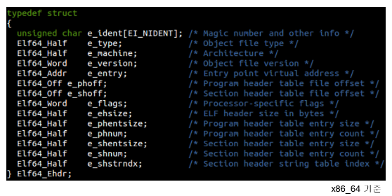

# linux kenel 5.0 

## linux 구성

1. Core  부분
   1. PM: process managerment (task, Scheduler)
   2. MM : memory management, Virtual memory, paging
   3. irq, Exception, locking (pagefault, systmcall이 가장 대표적인 exception 처리)
   4. locking 부모 프로세스와 자식 프로세스간  공유하는 것 mm, 여러 cpu 사용할 때도 마찬가지.
2. IO 처리
   1. network, L4, L3, L2
   2. 스토리지  (VFS/FS,Block)  (linux에서 디바이스와 통신할때 Read/Write 공통 기능 사용한다)
   3. VFS 의 실체를 이해하는 것도 큰 목표 중에 하나다.
   4. 디바이스 (USB, GPU, SCSI 등등)
3. 기타 
   1. Security, tools, sounds,....
4. 기본 알고리즘을 완전히 체득하는 것이 필요하다. 그런것 처럼 듣고 아는 수준이 아니라... 바로 써서 설명할 수 있는 수준으로 해설이 가능할 정도로 정리가 되어야 한다. 
5. 접근 방법
   1. 부팅 부터 시작.. 밑고 끝도 없는 길고 긴 여정
   2. 60년대 OS 책...
   3. 현업에서 필요한 이슈들.. trace

6. 관점
   1. 커널 개발자.. 커널 개선하겠다
   2. 시스템 프로그램... 시스템 call 호출 (임베디드 개발자)
   3. system call 사용하지 않는 Framework기반 개발자
   4. UI 개발자...

7. 문제해결은 언제나 log. 그러나 커널 로그는 친절하지 않다. 
   1. AP는 log라도 남겨서 분석은하는데...
   2. sys% 높아지면  내부에서 무슨일 이 벌어진거야
   3. 동작원리를 잘 알아야 최적화된 AP 구현 가능
   4. 리눅스는 모드 영역에서 사용, 그것은 마치....

8. linux kernel map


### kernel 이해의 접근 방법

#### trace->event->kernel함수->linux kernel 소스코드 분석


### [실습] linux source

#### 1. 어느것이 변경되나?

```sh
reallinux@ubuntu:~$ vi   /usr/local/bin/git-files-commits
reallinux@ubuntu:~$ sudo  chmod  +x /usr/local/bin/git-files-commits
```

* linux 중에서 어느 부분이 많이 변경 되고 있는가?

```sh
#!/bin/bash

start="$1";
curr=`date +%Y-%m-%d`
curr_y=`date +%Y`;
re='^[0-9]+$'

if [[ $1 == "" ]]; then
	start="$curr_y-01-01"
	end=$curr
elif ! [[ $1 =~ $re ]];then
	echo "Please enter a year."
	exit 1
elif [[ ${#start} != 4 ]]; then
	echo "Please enter a year."
	exit 1
else
	end="$start-12-31"
	start="$start-01-01"
fi

files=`ls -I "*\.patch" -I "*\.o" -I "*\.order"  -I "*\.a"  -I "*\.builtin"  -I "*\.symvers" -I "*\.map" -I "*\.mod\.*"  -I "*\.ko" -I "cscope*" `

echo "$start ~ $end:"
for i in $files
do
    printf "$i: ";
    git rev-list --after=$start --before=$end --count --no-merges HEAD -- $i;
done | sort -k2 -nr | awk '{printf("%20s %5d\n", $1, $2)}' |nl

exit 0

```

* git commit

```sh
reallinux@ubuntu:~/git/linux$ git files-commits 2019
2019-01-01 ~ 2019-12-31:
     1              drivers: 23314
     2                 arch:  5979
     3              include:  4355
     4                  net:  2722
     5                   fs:  2550
     6        Documentation:  2428
     7                tools:  2034
     8                sound:  1790
     9               kernel:  1293
    10                   mm:   630
    11          MAINTAINERS:   435
    12                  lib:   321
    13              scripts:   299
    14                block:   261
    15             security:   243
    16               crypto:   184
    17             Makefile:   130
    18                 virt:   121
    
    
    reallinux@ubuntu:~/git/linux/drivers$ git files-commits 2019
2019-01-01 ~ 2019-12-31:
     1                  gpu:  4857
     2                  net:  4680
     3              staging:  1572
     4                 scsi:   921
     5           infiniband:   839
     6                media:   788
     7                  usb:   538
     8                  clk:   505
     9                 misc:   342

```


```sh
reallinux@ubuntu:~/git/linux/fs$ git files-commits 2019
2019-01-01 ~ 2019-12-31:
     1                btrfs:   511
     2                  xfs:   249
     3                 cifs:   228
     4                  nfs:   181
     5                 f2fs:   143  <<---- 이것은 한국에서 기여하고 있다?
     6                 ceph:   104
     7                  afs:    98
     8                 ext4:    93
     9           io_uring.c:    84
    10                 proc:    70
    11                 nfsd:    67
    12                 fuse:    54
    13                 gfs2:    53
    14                ubifs:    43
    15               notify:    41
    16             orangefs:    36
    17          namespace.c:    33
    18               crypto:    32
    19                ocfs2:    31
    20                 ext2:    29
    21          block_dev.c:    24
    22                 coda:    23
    23                 adfs:    22
    24                aio.c:    21
    25              super.c:    20
    26               pstore:    18
    27            overlayfs:    18
    28                lockd:    17
    29           internal.h:    17
    30                 jbd2:    16
    31          eventpoll.c:    16
    32              debugfs:    16
    33               kernfs:    15
    34             ecryptfs:    15
    35         binfmt_elf.c:    14
    36              unicode:    13
    37         read_write.c:    13
    38              inode.c:    13
    39                dax.c:    13
```


* log를 통해서 어디가  많이 commit 되는가?

```sh
reallinux@ubuntu:~/git/linux/fs$ git log --oneline  -- file.c
```

* sourc code 기여자 

```sh
reallinux@ubuntu:~/git/linux$ git shortlog -sn --no-merges | nl | less
     1    6545  Al Viro
     2    6045  Mauro Carvalho Chehab
     3    5942  H Hartley Sweeten
     4    5706  Takashi Iwai
     5    5136  Christoph Hellwig
     6    4626  Chris Wilson
     7    4592  Thomas Gleixner
     8    4373  Arnd Bergmann
     9    4352  Johannes Berg
    10    4180  Greg Kroah-Hartman
    11    4090  Russell King
    12    4072  Tejun Heo  <<--- 한국인 허태준
    13    4024  Mark Brown

   
```

* kernel 버젼

```sh
reallinux@ubuntu:~/git/linux$ git remote -v
origin  https://kernel.googlesource.com/pub/scm/linux/kernel/git/torvalds/linux.git 
origin  https://kernel.googlesource.com/pub/scm/linux/kernel/git/torvalds/linux.git 

reallinux@ubuntu:~/git/linux$ make kernelversion
5.3.0
reallinux@ubuntu:~/git/linux$ uname -r
5.3.0
```


## 커널도 HelloWorld

### [실습] helloworld

#### 1. hello.c

```c
reallinux@ubuntu:~$ cat hello.c
#include <stdio.h>
void main()
{
        printf("hello\n");
}
reallinux@ubuntu:~$ gcc hello.c

reallinux@ubuntu:~$ file a.out
a.out: ELF 64-bit LSB shared object, x86-64, version 1 (SYSV), dynamically linked, interpreter /lib64/ld-linux-x86-64.so.2, for GNU/Linux 3.2.0, BuildID[sha1]=a767467902dc2ae94fc27dbd4dd1c48a41099ba5, not stripped
```

#### 2. readelf -l

- .text 섹션을 찾아라.
- 이 ELF 파일은 바이너리 파일인데... 일단 실행가는하고 링킹이 가능한 바이너리 파일 형식이다는 것. 그리고 여러개의 섹션으로 구성되어 있는데... 이것은 하나의 실행 파일의 약속이라는 것이다... 실행 파일  약속..
- 비슷한 것들을 section들 비슷한 것을 묶어서 segment로 부를 수  있다. 
- Entry Point 0x530

```sh
reallinux@ubuntu:~$ readelf -l  a.out

Elf file type is DYN (Shared object file)
Entry point 0x530
There are 9 program headers, starting at offset 64

Program Headers:
  Type           Offset             VirtAddr           PhysAddr
                 FileSiz            MemSiz              Flags  Align
  PHDR           0x0000000000000040 0x0000000000000040 0x0000000000000040
                 0x00000000000001f8 0x00000000000001f8  R      0x8
  INTERP         0x0000000000000238 0x0000000000000238 0x0000000000000238
                 0x000000000000001c 0x000000000000001c  R      0x1
      [Requesting program interpreter: /lib64/ld-linux-x86-64.so.2]
  LOAD           0x0000000000000000 0x0000000000000000 0x0000000000000000
                 0x0000000000000820 0x0000000000000820  R E    0x200000
  LOAD           0x0000000000000db8 0x0000000000200db8 0x0000000000200db8
                 0x0000000000000258 0x0000000000000260  RW     0x200000
  DYNAMIC        0x0000000000000dc8 0x0000000000200dc8 0x0000000000200dc8
                 0x00000000000001f0 0x00000000000001f0  RW     0x8
  NOTE           0x0000000000000254 0x0000000000000254 0x0000000000000254
                 0x0000000000000044 0x0000000000000044  R      0x4
  GNU_EH_FRAME   0x00000000000006dc 0x00000000000006dc 0x00000000000006dc
                 0x000000000000003c 0x000000000000003c  R      0x4
  GNU_STACK      0x0000000000000000 0x0000000000000000 0x0000000000000000
                 0x0000000000000000 0x0000000000000000  RW     0x10
  GNU_RELRO      0x0000000000000db8 0x0000000000200db8 0x0000000000200db8
                 0x0000000000000248 0x0000000000000248  R      0x1

 Section to Segment mapping:
  Segment Sections...
   00
   01     .interp
   02     .interp .note.ABI-tag .note.gnu.build-id .gnu.hash .dynsym .dynstr .gnu.version .gnu.version_r .rela.dyn .rela.plt .init .plt .plt.got .text .fini .rodata .eh_frame_hdr .eh_frame
   03     .init_array .fini_array .dynamic .got .data .bss
   04     .dynamic
   05     .note.ABI-tag .note.gnu.build-id
   06     .eh_frame_hdr
   07
   08     .init_array .fini_array .dynamic .got

```

#### 3. objdump -d a.out

* 시작 위치 : <_start>

```asm
Disassembly of section .text:

0000000000000530 <_start>:   
 530:   31 ed                   xor    %ebp,%ebp   <=== Entry point 0x530
 532:   49 89 d1                mov    %rdx,%r9
 535:   5e                      pop    %rsi
 536:   48 89 e2                mov    %rsp,%rdx
 539:   48 83 e4 f0             and    $0xfffffffffffffff0,%rsp
 53d:   50                      push   %rax
 53e:   54                      push   %rsp
 53f:   4c 8d 05 7a 01 00 00    lea    0x17a(%rip),%r8        # 6c0 <__libc_csu_fini>
 546:   48 8d 0d 03 01 00 00    lea    0x103(%rip),%rcx       # 650 <__libc_csu_init>
 54d:   48 8d 3d e6 00 00 00    lea    0xe6(%rip),%rdi        # 63a <main>
 554:   ff 15 86 0a 20 00       callq  *0x200a86(%rip)        # 200fe0 <__libc_start_main@GLIBC_2.2.5>
 55a:   f4                      hlt
 55b:   0f 1f 44 00 00          nopl   0x0(%rax,%rax,1)
```

* main 함수 찾기

```asm
000000000000063a <main>:
 63a:   55                      push   %rbp
 63b:   48 89 e5                mov    %rsp,%rbp
 63e:   48 8d 3d 8f 00 00 00    lea    0x8f(%rip),%rdi        # 6d4 <_IO_stdin_used+0x4>
 645:   e8 c6 fe ff ff          callq  510 <puts@plt>
 64a:   90                      nop
 64b:   5d                      pop    %rbp
 64c:   c3                      retq
 64d:   0f 1f 00                nopl   (%rax)
```


#### 4. vmlinux ELF 구조

* vmlinux 커널도 동일한 ELF 구조다

```
reallinux@ubuntu:~/git/linux$ file vmlinux
vmlinux: ELF 64-bit LSB executable, x86-64, version 1 (SYSV), statically linked, BuildID[sha1]=c7c01be9a155813aa08277ced3569f6ede1c06ed, with debug_info, not stripped
```

* vmlinux 

```sh
reallinux@ubuntu:~/git/linux$ readelf -l vmlinux
Elf file type is EXEC (Executable file)
Entry point 0x1000000
There are 5 program headers, starting at offset 64

Program Headers:
  Type           Offset             VirtAddr           PhysAddr
                 FileSiz            MemSiz              Flags  Align
  LOAD           0x0000000000200000 0xffffffff81000000 0x0000000001000000
                 0x0000000001320000 0x0000000001320000  R E    0x200000
  LOAD           0x0000000001600000 0xffffffff82400000 0x0000000002400000
                 0x00000000005af000 0x00000000005af000  RW     0x200000
  LOAD           0x0000000001c00000 0x0000000000000000 0x00000000029af000
                 0x000000000002a558 0x000000000002a558  RW     0x200000
  LOAD           0x0000000001dda000 0xffffffff829da000 0x00000000029da000
                 0x0000000000186000 0x0000000000252000  RWE    0x200000
  NOTE           0x00000000010010d4 0xffffffff81e010d4 0x0000000001e010d4
                 0x000000000000003c 0x000000000000003c         0x4

 Section to Segment mapping:
  Segment Sections...
   00     .text .notes __ex_table .rodata .pci_fixup .tracedata __ksymtab __ksymtab_gpl __ksymtab_strings __param __modver
   01     .data __bug_table .orc_unwind_ip .orc_unwind .orc_lookup .vvar
   02     .data..percpu
   03     .init.text .altinstr_aux .init.data .x86_cpu_dev.init .altinstructions .altinstr_replacement .iommu_table .apicdrivers .exit.text .smp_locks .data_nosave .bss .brk
   04     .notes
```


왜 vm이 붙어 있을까? 가상 메모리 메커니즘을 이용하기 때문에 vm접두사를 사용한다. real 메모리 주소를 그대로 사용하지 않고 virtual memory를 사용한다는 의미 이다.

* vmlinux가 압축된 것이 vmlinuz 이다. 

```sh
reallinux@ubuntu:~/git/linux$ ls -l /boot/vmlinuz-*
-rw------- 1 root root 8457888 Nov  5 11:39 /boot/vmlinuz-4.15.0-163-generic
-rw------- 1 root root 8330904 Sep 12  2019 /boot/vmlinuz-4.15.0-64-generic
-rw-r--r-- 1 root root 9417600 Nov  1  2019 /boot/vmlinuz-5.3.0
-rw-r--r-- 1 root root 9044864 Sep 29  2019 /boot/vmlinuz-5.3.0.old
```


* start_kernel : 커널 함수의 시작 지점이다. 

```
reallinux@ubuntu:~/git/linux$ objdump -d  vmlinux | less

ffffffff829dab20 <start_kernel>:
ffffffff829dab20:       e8 5b 6b 22 ff          callq  ffffffff81c01680 <__fentry__>
ffffffff829dab25:       41 56                   push   %r14
ffffffff829dab27:       41 55                   push   %r13
ffffffff829dab29:       48 c7 c7 80 17 41 82    mov    $0xffffffff82411780,%rdi
ffffffff829dab30:       41 54                   push   %r12
ffffffff829dab32:       55                      push   %rbp
ffffffff829dab33:       53                      push   %rbx
ffffffff829dab34:       48 83 ec 18             sub    $0x18,%rsp
ffffffff829dab38:       65 48 8b 04 25 28 00    mov    %gs:0x28,%rax
ffffffff829dab3f:       00 00
...
```

hello.c와 kernel 프로그램의 실행 파일은 기본적으로 동일한 실체다.

### [실습3] linux kernel 

CPU **=>** 함수  단위 실행

1) 일반(유저)함수 (예: main 함수)

2) 라이브러리(유저)함수 (예: printf 함수)
3) 커널함수가 호출되는 시나리오
4) (Entry: 진입점)- 예외처리: syscall, pagefault …- 인터럽트처리: usb 연결, network 패킷도착, ..

- 커널스레드(태스크): kswapd0, ksoftirqd, kworker 등 …

* 커널 쓰레드 :  kswapd0, ksoftirqd, kworker 등 …
* 후반부 작업 (kernel 인터럽트 처리)  미룬 작업을 위한 커널 프로세스

```sh
:서reallinux@ubuntu:~/git/linux$ ps -ef | grep  ksoft
root         9     2  0 01:06 ?        00:00:00 [ksoftirqd/0]
root        15     2  0 01:06 ?        00:00:00 [ksoftirqd/1]
root        20     2  0 01:06 ?        00:00:00 [ksoftirqd/2]
root        25     2  0 01:06 ?        00:00:00 [ksoftirqd/3]
reallin+ 11561 11452  0 03:32 pts/2    00:00:00 grep --color=auto ksoft
reallinux@ubuntu:~/git/linux$ ps -ef | grep  kwo
root         6     2  0 01:06 ?        00:00:00 [kworker/0:0H-kb]
root        17     2  0 01:06 ?        00:00:00 [kworker/1:0H-kb]
root        22     2  0 01:06 ?        00:00:00 [kworker/2:0H-kb]
root        27     2  0 01:06 ?        00:00:00 [kworker/3:0H-kb]
root        88     2  0 01:06 ?        00:00:00 [kworker/u9:0]
root       105     2  0 01:06 ?        00:00:00 [kworker/3:1H-kb]
root       106     2  0 01:06 ?        00:00:00 [kworker/0:1H-kb]
root       174     2  0 01:06 ?        00:00:00 [kworker/1:1H-kb]
root       175     2  0 01:06 ?        00:00:01 [kworker/2:1H-kb]
root       410     2  0 01:06 ?        00:00:00 [kworker/3:4-mm_]
root      1414     2  0 01:39 ?        00:00:00 [kworker/0:1-eve]
root      2295     2  0 01:55 ?        00:00:01 [kworker/0:0-eve]
root      4876     2  0 02:07 ?        00:00:00 [kworker/3:2-eve]
root     11499     2  0 02:53 ?        00:00:00 [kworker/1:0-ata]
root     11511     2  0 03:03 ?        00:00:00 [kworker/u8:1-ev]
root     11529     2  0 03:13 ?        00:00:00 [kworker/u8:2-ev]
root     11532     2  0 03:15 ?        00:00:00 [kworker/2:0-eve]
root     11549     2  0 03:26 ?        00:00:00 [kworker/1:2-ata]
root     11550     2  0 03:26 ?        00:00:00 [kworker/2:2-ata]
root     11555     2  0 03:28 ?        00:00:00 [kworker/u8:0-ev]
root     11558     2  0 03:31 ?        00:00:00 [kworker/2:1-ata]
root     11559     2  0 03:31 ?        00:00:00 [kworker/1:1-eve]
reallin+ 11563 11452  0 03:32 pts/2    00:00:00 grep --color=auto kwo

==> 짤린 이름을 전체 보려면 이렇게 한다.  
reallinux@ubuntu:~/git/linux$ cat /proc/22/comm
kworker/2:0H-kblockd
```

#### 1. ctag 사용

* ctag 사용

```
reallinux@ubuntu:~$ cat ~/.vimrc
set tags=/home/reallinux/git/linux/tags
set csprg=/usr/local/bin/cscope
cs add /home/reallinux/git/linux/cscope.out
syntax on
set autoindent
set laststatus=2
set tabstop=4
set expandtab
set smartindent
set expandtab
set shiftwidth=4
set number
```


* vscode도 좋기는 하지만 linux 실행 환경에 직접 접속해서 터미널 editor에서 사용하는 것을 생각한다면 vi 이용하는 것도 괞찮다.
* ctag  점프하기 : 사실 ctag가 뭔지는 잘 알려 주지는 않는다. ( 상당히 어느 정도 알고 있다고 생각하고  진도가 나간다.)

```
ctl-]  <jump>
ctl-t  <되돌아 오기>
:tj    <ctag 항목 중 한개로 선택하여 jump>
```

## uftrace

### [실습] uftrace

#### 1. uftrace 

- uftrace 이용한 user+lib+kernel 호출 과정 추적하기

```sh
reallinux@ubuntu:~$ touch reallinux
reallinux@ubuntu:~$ sudo uftrace record --force -K 5 /bin/mv reallinux rlinux
reallinux@ubuntu:~$ uftrace replay -t  8us
reallinux@ubuntu:~$ uftrace replay -t  8us | less
=> 여기서 rename() 함수를 찾아보자.


            [ 11720] | rename() {
            [ 11720] |   __x64_sys_rename() {  <<== 여기부터 system call 
            [ 11720] |     do_renameat2() {
            [ 11720] |       filename_parentat() {
 123.480 us [ 11720] |         smp_apic_timer_interrupt();
 211.089 us [ 11720] |       } /* filename_parentat */
            [ 11720] |       vfs_rename() {
            [ 11720] |         ext4_rename2() {  <<== 실제 파일 시스템 특성에 따라서 다르게 호출 된다. 
 350.827 us [ 11720] |           ext4_rename();
 387.726 us [ 11720] |         } /* ext4_rename2 */
            [ 11720] |         d_move() {
 135.924 us [ 11720] |           _raw_spin_lock();
 170.068 us [ 11720] |         } /* d_move */
 809.907 us [ 11720] |       } /* vfs_rename */
  92.172 us [ 11720] |       dput();
   1.537 ms [ 11720] |     } /* do_renameat2 */
   1.578 ms [ 11720] |   } /* __x64_sys_rename */
   1.592 ms [ 11720] | } /* rename */
 105.486 us [ 11720] | fclose();

```

- 컴파일할때 g 옵션 줘서 debug모드로 진행하는 것 처럼 force를 줘서 진행,  -k 5는 자식 함수 5단계까지 진행한다는 것.

- ldd를 이용한 공유 라이브러리

```sh
reallinux@ubuntu:~$ ldd /bin/mv
        linux-vdso.so.1 (0x00007ffe8e9fe000)
        libselinux.so.1 => /lib/x86_64-linux-gnu/libselinux.so.1 (0x00007f472d436000)
        libacl.so.1 => /lib/x86_64-linux-gnu/libacl.so.1 (0x00007f472d22e000)
        libattr.so.1 => /lib/x86_64-linux-gnu/libattr.so.1 (0x00007f472d029000)
        libc.so.6 => /lib/x86_64-linux-gnu/libc.so.6 (0x00007f472cc38000)
        libpcre.so.3 => /lib/x86_64-linux-gnu/libpcre.so.3 (0x00007f472c9c6000)
        libdl.so.2 => /lib/x86_64-linux-gnu/libdl.so.2 (0x00007f472c7c2000)
        /lib64/ld-linux-x86-64.so.2 (0x00007f472d880000)
        libpthread.so.0 => /lib/x86_64-linux-gnu/libpthread.so.0 (0x00007f472c5a3000)
```

- 왜 libc를 봐야 하는가? 

#### 2. libc에서 mv sys-call 찾기

```sh
reallinux@ubuntu:~$ objdump -d /lib/x86_64-linux-gnu/libc.so.6 | less


000000000007bda0 <rename@@GLIBC_2.2.5>:
   7bda0:       b8 52 00 00 00          mov    $0x52,%eax <<== 여기서 eax에 넣고. system call을 발생시킨다. 
   7bda5:       0f 05                   syscall           <<== 원리는 동일한데... 이렇게 call 하는 것이 libc
   7bda7:       48 3d 00 f0 ff ff       cmp    $0xfffffffffffff000,%rax
   7bdad:       77 09                   ja     7bdb8 <rename@@GLIBC_2.2.5+0x18>
   7bdaf:       f3 c3                   repz retq
   7bdb1:       0f 1f 80 00 00 00 00    nopl   0x0(%rax)
   7bdb8:       48 8b 15 a9 f0 36 00    mov    0x36f0a9(%rip),%rdx        # 3eae68 <h_errlist@@GLIBC_2.2.5+0xdc8>
   7bdbf:       f7 d8                   neg    %eax
   7bdc1:       64 89 02                mov    %eax,%fs:(%rdx)
   7bdc4:       b8 ff ff ff ff          mov    $0xffffffff,%eax
   7bdc9:       c3                      retq
   7bdca:       66 0f 1f 44 00 00       nopw   0x0(%rax,%rax,1)

000000000007bdd0 <renameat@@GLIBC_2.4>:
   7bdd0:       49 89 ca                mov    %rcx,%r10
   7bdd3:       b8 08 01 00 00          mov    $0x108,%eax
   7bdd8:       0f 05                   syscall
   7bdda:       48 3d 00 f0 ff ff       cmp    $0xfffffffffffff000,%rax
   7bde0:       77 06                   ja     7bde8 <renameat@@GLIBC_2.4+0x18>
   7bde2:       f3 c3                   repz retq
   7bde4:       0f 1f 40 00             nopl   0x0(%rax)
   7bde8:       48 8b 15 79 f0 36 00    mov    0x36f079(%rip),%rdx        # 3eae68 <h_errlist@@GLIBC_2.2.5+0xdc8>
   7bdef:       f7 d8                   neg    %eax
   7bdf1:       64 89 02                mov    %eax,%fs:(%rdx)
   7bdf4:       b8 ff ff ff ff          mov    $0xffffffff,%eax
   7bdf9:       c3                      retq
   7bdfa:       66 0f 1f 44 00 00       nopw   0x0(%rax,%rax,1)

```


* why  system call을 사용하는가? : kernel에게 서비스를 요청하기 위해서 사용한다는 것.

```sh
reallinux@ubuntu:~$ echo $((16#52))
82

```

#### 3. system call 목록

- 현재 시스템 안에 있는 system call의 번호 목록을 확인하는 방법

```
vim /usr/include/x86_64-linux-gnu/asm/unistd_64.h

 81 #define __NR_ftruncate 77
 82 #define __NR_getdents 78
 83 #define __NR_getcwd 79
 84 #define __NR_chdir 80
 85 #define __NR_fchdir 81
 86 #define __NR_rename 82   <<== 10진수   16진수 0x52 이다. 

```

shift+g 눌러서 마지막으로 가보면... 336개의 system call 이 있다는 것이다. 

## System call

### [실습]  System Call

* ABI 개념 안에서 system call 번호가 모두 정의 된다. 

#### 1. linux/arch/x86/entry/entry_64.S

* system call 처리의 시작 코드 찾기.
* Entry.S
* do_syscall_64 가 호출된다. 

```
<linux/arch/x86/entry/entry_64.S>

107 /*
 108  * 64-bit SYSCALL instruction entry. Up to 6 arguments in registers.
 126  * Registers on entry:
 127  * rax  system call number
 128  * rcx  return address
 129  * r11  saved rflags (note: r11 is callee-clobbered register in C ABI)
 130  * rdi  arg0
 131  * rsi  arg1
 132  * rdx  arg2
 133  * r10  arg3 (needs to be moved to rcx to conform to C ABI)
 134  * r8   arg4
 135  * r9   arg5
 136  * (note: r12-r15, rbp, rbx are callee-preserved in C ABI)
 137  *
 138  * Only called from user space.
 139  *
 140  * When user can change pt_regs->foo always force IRET. That is because
 141  * it deals with uncanonical addresses better. SYSRET has trouble
 142  * with them due to bugs in both AMD and Intel CPUs.
 143  */
 144
 145 ENTRY(entry_SYSCALL_64)
 146     UNWIND_HINT_EMPTY
 147     /*
 148      * Interrupts are off on entry.
 149      * We do not frame this tiny irq-off block with TRACE_IRQS_OFF/ON,
 150      * it is too small to ever cause noticeable irq latency.
 151      */
 152
 153     swapgs
 154     /* tss.sp2 is scratch space. */
 155     movq    %rsp, PER_CPU_VAR(cpu_tss_rw + TSS_sp2)
 156     SWITCH_TO_KERNEL_CR3 scratch_reg=%rsp
 157     movq    PER_CPU_VAR(cpu_current_top_of_stack), %rsp
 158
 159     /* Construct struct pt_regs on stack */
 160     pushq   $__USER_DS              /* pt_regs->ss */
 161     pushq   PER_CPU_VAR(cpu_tss_rw + TSS_sp2)   /* pt_regs->sp */
 162     pushq   %r11                    /* pt_regs->flags */
 163     pushq   $__USER_CS              /* pt_regs->cs */
 164     pushq   %rcx                    /* pt_regs->ip */
 165 GLOBAL(entry_SYSCALL_64_after_hwframe)   <== 함수 첫번째 인자 담는 용도로 첫번째 인자로
 166     pushq   %rax                    /* pt_regs->orig_ax */
 167
 168     PUSH_AND_CLEAR_REGS rax=$-ENOSYS
 169
 170     TRACE_IRQS_OFF
 171
 172     /* IRQs are off. */
 173     movq    %rax, %rdi      <<== rdi에는 arg0이 전달된다. 
 174     movq    %rsp, %rsi      <<== rsi에는 arg1이 전달된다.  
 175     call    do_syscall_64       /* returns with IRQs disabled */  <<== do_syscall_64
```

#### 2. do_syscall_64 

- system call 번호가 index 번호가 되어서 system call 번호가 된다.

```c
<linux/arch/x86/entry/common.c>
    
277 #ifdef CONFIG_X86_64
278 __visible void do_syscall_64(unsigned long nr, struct pt_regs *regs) <<== nr 은 %rdi 매개변수 입력한것
279 {
280     struct thread_info *ti;
281
282     enter_from_user_mode();
283     local_irq_enable();
284     ti = current_thread_info();
285     if (READ_ONCE(ti->flags) & _TIF_WORK_SYSCALL_ENTRY)
286         nr = syscall_trace_enter(regs);
287
288     /*
289      * NB: Native and x32 syscalls are dispatched from the same
290      * table.  The only functional difference is the x32 bit in
291      * regs->orig_ax, which changes the behavior of some syscalls.
292      */
293     nr &= __SYSCALL_MASK;
294     if (likely(nr < NR_syscalls)) {
295         nr = array_index_nospec(nr, NR_syscalls);
296         regs->ax = sys_call_table[nr](regs);   <<== nr 번호가 결국 호출하는  system call 번호가 된다. 
297     }
298
299     syscall_return_slowpath(regs);
300 }
301 #endif
```

* 커널은 이런 방식으로 호출하는 방식이 많이 사용된다.  //332개 중에서 

#### 3. SYSCALL_DEFINE 

* sys_call_table 테이블에서 직접 호출하는 system call 함수를 구현체를 찾으려면 찾을 수는 있는데 엄청난  MACRO가 덕지 덕지 붙여서 있어서... 그냥 아래 처럼 찾아서 흘러 가는 것으로 이해하면 된다. 
* ag 는 grep 과 비슷한 데 속도가 빠르기 때문에 많이 쓴다. 

```sh
reallinux@ubuntu:~/git/linux$ ag SYSCALL_DEFINE | grep rename
fs/namei.c:4659:SYSCALL_DEFINE5(renameat2, int, olddfd, const char __user *, oldname,
fs/namei.c:4665:SYSCALL_DEFINE4(renameat, int, olddfd, const char __user *, oldname,
fs/namei.c:4671:SYSCALL_DEFINE2(rename, const char __user *, oldname, const char __user *, newname)
```


```c
< linux/fs/namei.c:4671>
    
4671 SYSCALL_DEFINE2(rename, const char __user *, oldname, const char __user *, newname)
4672 {
4673     return do_renameat2(AT_FDCWD, oldname, AT_FDCWD, newname, 0);
4674 }
```

* 커널 공부 하다가 보면 너무 깊게 빠져서 문제가 발생하는 경우가 있다. 너무 미시적으로 간다면 공부의 효율성이 많이 떨어 질 수 있다.

#### 4. do_renameat2

```c
<linux/fs/namei.c>
    
4516 static int do_renameat2(int olddfd, const char __user *oldname, int newdfd,
4517             const char __user *newname, unsigned int flags)
4518 {
4519     struct dentry *old_dentry, *new_dentry;
4520     struct dentry *trap;
4521     struct path old_path, new_path;
4522     struct qstr old_last, new_last;
4523     int old_type, new_type;
4524     struct inode *delegated_inode = NULL;
4525     struct filename *from;
4526     struct filename *to;
4527     unsigned int lookup_flags = 0, target_flags = LOOKUP_RENAME_TARGET;
4528     bool should_retry = false;
4529     int error;
4530
4531     if (flags & ~(RENAME_NOREPLACE | RENAME_EXCHANGE | RENAME_WHITEOUT))
4532         return -EINVAL;
4533
4534     if ((flags & (RENAME_NOREPLACE | RENAME_WHITEOUT)) &&
4535         (flags & RENAME_EXCHANGE))
4536         return -EINVAL;
4537
4538     if ((flags & RENAME_WHITEOUT) && !capable(CAP_MKNOD))
4539         return -EPERM;
4540
4541     if (flags & RENAME_EXCHANGE)
4542         target_flags = 0;
```


#### 5. vfs_rename()->ext4_reanem()

* 실제 호출 관계를 살펴 보려면 uftrace에서 호출 함수 관계를 살펴보면 되는데... vfs에서 실제 ext4 드라이버 함수를 호출한다.

* rename call에서 역추적 하기... 

```sh
            [ 11720] | rename() {
            [ 11720] |   __x64_sys_rename() {
            [ 11720] |     do_renameat2() {
            [ 11720] |       filename_parentat() {
 123.480 us [ 11720] |         smp_apic_timer_interrupt();
 211.089 us [ 11720] |       } /* filename_parentat */
            [ 11720] |       vfs_rename() {
            [ 11720] |         ext4_rename2() {   <<== 여기서 호출된 함수를 찾는 방법
 350.827 us [ 11720] |           ext4_rename();
 387.726 us [ 11720] |         } /* ext4_rename2 */
            [ 11720] |         d_move() {
 135.924 us [ 11720] |           _raw_spin_lock();
 170.068 us [ 11720] |         } /* d_move */
 809.907 us [ 11720] |       } /* vfs_rename */
  92.172 us [ 11720] |       dput();
   1.537 ms [ 11720] |     } /* do_renameat2 */
   1.578 ms [ 11720] |   } /* __x64_sys_rename */
   1.592 ms [ 11720] | } /* rename */
 105.486 us [ 11720] | fclose();
```

* git/linux/fs/name.c 함수에서  vfs_name() 함수를 찾아 보고....

```c
4477     error = old_dir->i_op->rename(old_dir, old_dentry,
4478                        new_dir, new_dentry, flags);
4479     if (error)
4480         goto out;

```

#### 5. ext4에서 rename 함수 찾기

* vfs에서 rename 호출된 것이 ext4에서는 

- 그다음에 실제 ext4 실제 함수의 코드를 살펴보는 본다.  그런데. 여기를 ext4 함수로 직접 찾아가는 것은 불가능 하기 때문에 ag를 통해서 역 추적해야 한다. 

```c
reallinux@ubuntu:~/git/linux/fs$ ag ext4_rename2
ext4/namei.c
3977:static int ext4_rename2(struct inode *old_dir, struct dentry *old_dentry,
4015:   .rename         = ext4_rename2,

                             
<linux/fs/ext4/namei.c>                             
3977 static int ext4_rename2(struct inode *old_dir, struct dentry *old_dentry, <<== 여기...
3978             struct inode *new_dir, struct dentry *new_dentry,
3979             unsigned int flags)
3980 {
3981     int err;
3982
3983     if (unlikely(ext4_forced_shutdown(EXT4_SB(old_dir->i_sb))))
3984         return -EIO;
3985
3986     if (flags & ~(RENAME_NOREPLACE | RENAME_EXCHANGE | RENAME_WHITEOUT))
3987         return -EINVAL;
3988
3989     err = fscrypt_prepare_rename(old_dir, old_dentry, new_dir, new_dentry,
3990                      flags);
3991     if (err)
3992         return err;
3993
3994     if (flags & RENAME_EXCHANGE) {
3995         return ext4_cross_rename(old_dir, old_dentry,
3996                      new_dir, new_dentry);
3997     }
3998
3999     return ext4_rename(old_dir, old_dentry, new_dir, new_dentry, flags);
4000 }

<함수 포인터로 선언되어 있음>
4005 const struct inode_operations ext4_dir_inode_operations = {
4006     .create     = ext4_create,
4007     .lookup     = ext4_lookup,
4008     .link       = ext4_link,
4009     .unlink     = ext4_unlink,
4010     .symlink    = ext4_symlink,
4011     .mkdir      = ext4_mkdir,
4012     .rmdir      = ext4_rmdir,
4013     .mknod      = ext4_mknod,
4014     .tmpfile    = ext4_tmpfile,
4015     .rename     = ext4_rename2,  <<== 여기에 지정해 놓은 것을 찾아서 함수 포인터를 찾아 간다
4016     .setattr    = ext4_setattr,
4017     .getattr    = ext4_getattr,
4018     .listxattr  = ext4_listxattr,
4019     .get_acl    = ext4_get_acl,
4020     .set_acl    = ext4_set_acl,
4021     .fiemap         = ext4_fiemap,
4022 };    
```

? 질문:  struct inode_operations ext4_dir_inode_operatrions ={}에서 내부에 들어 있는 .create- = ext4_create, 의미는?


```sh
reallinux@ubuntu:~/git/linux$ ag SYSCALL_DEF | grep rename,
fs/namei.c:4671:SYSCALL_DEFINE2(rename, const char __user *, oldname, const char __user *, newname)
```

* 여기 SYSCALL_DEFINE2 정의 한것이 아래 처럼 실행에서는 풀린다는 것이다.

```
            [ 11720] | rename() {
            [ 11720] |   __x64_sys_rename() {  <<==== 이렇게 풀린다. 
            [ 11720] |     do_renameat2() {
            [ 11720] |       filename_parentat() {
 123.480 us [ 11720] |         smp_apic_timer_interrupt();
 211.089 us [ 11720] |       } /* filename_parentat */
            [ 11720] |       vfs_rename() {
            [ 11720] |         ext4_rename2() {
 350.827 us [ 11720] |           ext4_rename();
 387.726 us [ 11720] |         } /* ext4_rename2 */
            [ 11720] |         d_move() {
 135.924 us [ 11720] |           _raw_spin_lock();
 170.068 us [ 11720] |         } /* d_move */
 809.907 us [ 11720] |       } /* vfs_rename */
  92.172 us [ 11720] |       dput();
   1.537 ms [ 11720] |     } /* do_renameat2 */
   1.578 ms [ 11720] |   } /* __x64_sys_rename */
   1.592 ms [ 11720] | } /* rename */
 105.486 us [ 11720] | fclose();

```


* ELF에서 실제 시작하는 주소는 어디에 정의하고 있는가?


### ELF

#### 1. ELF 개념

ELF는 Executable and Linking Format의 약어입니다. UNIX / LINUX 기반에서 사용되는 실행 및 링킹 파일 포맷입니다.

ELF는 하나의 ELF Header와 파일데이터로 구성되어 있습니다. 아래 그림을 보시면 파일의 가장 위에 ELF Header 정보가 들어있고, 그 아래 program header table이 있습니다. 그 이후 Segment 정보와 Section 관련 정보들이 나오네요. 

| ELF header                    |
| ----------------------------- |
| Program header table          |
| Segment1                      |
| Segemtn2                      |
| ....                          |
| Section header table optional |

- Segment: 동일한 메모리 속성(read-only, writable, ...)을 가진 하나 또는 그 이상의 섹션의 집합
- Section: 특정 정보(machine instructions, symbol table, ..)를 포함하고 있는 ELF file의 작은 조각
- Symbol: ELF file내에 저장된 함수 또는 변수의 디스크립션입니다. 간단한 함수 또는 변수의 정보를 포함하고 있습니다.
- Objec file: 컴퓨터에서 읽을 수 있는 소스파일 버전입니다. Object file은 소스파일의 전역, 정적 변수 이름같은 심볼 정보들이 아직 남아있는 파일입니다. 하지만 이 파일은 메모리에 어떻게 로드되어야 하는지 정보가 명시되어 있지 않기 때문에 직접 실행은 불가능합니다.
- Shared Library: 하나 또는 그 이상의 Object 파일의 심볼들로 구성된 파일입니다. 주소 공간 어디에든 로드 되어질 수 있습니다.
- Executables: Shared Library와 매우 유사하지만 메모리 내 특정 주소에 로드될 수 있는 파일입니다. 프로그램 시작을 위한 함수를 가지고 있습니다. 해당 함수에서 Executables 파일은 시작됩니다.
- Core Files: ELF 의 특별한 타입의 파일입니다. 실행된 프로세스에 의해 사용된 여러 메모리 세그먼트 들을 포함한 메모리 이미지 정보를 가지고 있습니다. 
- Linking: object 파일들로 부터 심볼 정도들을 가져와 특정 순서에 맞게 정렬을 해주는 과정입니다. 오브젝트의 각 섹션들을 공유 라이브러리나 실행파일 내에 각 세그먼트내에 정렬해 주는 과정입니다. 

#### 2. ELF header 



Program Header Table은 ELF내의 Segment들에 대한 정보와 그 Segment들을 메모리에 어떻게 로드해야 하는지에 대한 정보가 포함되어 있습니다.  Segment란  동일한 메모리 속성(read-only, writable, ...)을 가진 하나 또는 그 이상의 섹션의 집합입니다. 여러 개의 Segment들이 존재할테고 각 Segment들에 대한 정보가  명시된 곳이 Program Header입니다. readelf로 ELF Header를 확인

```sh
reallinux@ubuntu:~$ readelf -h a.out
ELF Header:
  Magic:   7f 45 4c 46 02 01 01 00 00 00 00 00 00 00 00 00
  Class:                             ELF64
  Data:                              2's complement, little endian
  Version:                           1 (current)
  OS/ABI:                            UNIX - System V
  ABI Version:                       0
  Type:                              DYN (Shared object file)
  Machine:                           Advanced Micro Devices X86-64
  Version:                           0x1
  Entry point address:               0x530
  Start of program headers:          64 (bytes into file)
  Start of section headers:          6448 (bytes into file)
  Flags:                             0x0
  Size of this header:               64 (bytes)
  Size of program headers:           56 (bytes)
  Number of program headers:         9
  Size of section headers:           64 (bytes)
  Number of section headers:         29
  Section header string table index: 28
```

* 9개의 header
* headr 구조는 type, offset, virtAddr, PhysAddr, FileSize, MemSiz,Flag,Align 

```sh
reallinux@ubuntu:~$ readelf -l  a.out

Elf file type is DYN (Shared object file)
Entry point 0x530
There are 9 program headers, starting at offset 64

Program Headers:
  Type           Offset             VirtAddr           PhysAddr
                 FileSiz            MemSiz              Flags  Align
  PHDR           0x0000000000000040 0x0000000000000040 0x0000000000000040
                 0x00000000000001f8 0x00000000000001f8  R      0x8
  INTERP         0x0000000000000238 0x0000000000000238 0x0000000000000238
                 0x000000000000001c 0x000000000000001c  R      0x1
      [Requesting program interpreter: /lib64/ld-linux-x86-64.so.2]
  LOAD           0x0000000000000000 0x0000000000000000 0x0000000000000000
                 0x0000000000000820 0x0000000000000820  R E    0x200000
  LOAD           0x0000000000000db8 0x0000000000200db8 0x0000000000200db8
                 0x0000000000000258 0x0000000000000260  RW     0x200000
  DYNAMIC        0x0000000000000dc8 0x0000000000200dc8 0x0000000000200dc8
                 0x00000000000001f0 0x00000000000001f0  RW     0x8
  NOTE           0x0000000000000254 0x0000000000000254 0x0000000000000254
                 0x0000000000000044 0x0000000000000044  R      0x4
  GNU_EH_FRAME   0x00000000000006dc 0x00000000000006dc 0x00000000000006dc
                 0x000000000000003c 0x000000000000003c  R      0x4
  GNU_STACK      0x0000000000000000 0x0000000000000000 0x0000000000000000
                 0x0000000000000000 0x0000000000000000  RW     0x10
  GNU_RELRO      0x0000000000000db8 0x0000000000200db8 0x0000000000200db8
                 0x0000000000000248 0x0000000000000248  R      0x1

 Section to Segment mapping:
  Segment Sections...
   00
   01     .interp
   02     .interp .note.ABI-tag .note.gnu.build-id .gnu.hash .dynsym .dynstr .gnu.version .gnu.version_r .rela.dyn .rela.plt .init .plt .plt.got .text .fini .rodata .eh_frame_hdr .eh_frame
   03     .init_array .fini_array .dynamic .got .data .bss
   04     .dynamic
   05     .note.ABI-tag .note.gnu.build-id
   06     .eh_frame_hdr
   07
   08     .init_array .fini_array .dynamic .got

```

* Section to Segment Mapping이라고 표기된 정보들이 있습니다. 섹션들이 세그먼트 내에 위치하는 내용
* GNU_EH_FRAME Segment에는 .note.ABI-tag, .note.gnu.build-id 란 섹션이 있다.


#### 3. header

- PHDR : Programe Header 정보 자기 자신에 대한 Segment입니다. Offset과 Siz 등을 살펴보면 ELF Header정보에 들어있던 내용과 같음을 알 수 있습니다.

- LOAD : LOAD Segment는 로드할 수 있는 프로그램 Segment 입니다. 섹션을 다시 살펴보면 .intrp, .dynsym, .dynstr 등 다양한 섹션들이 존재하는데요. 메모리에 로드될 수 있는 섹션들이 모여있습니다. 그런데 왜 LOAD란 이름이 두개일까요? 2개의 Segment는 같은 이름을 가지고 있지만 다른 메모리 속성을 가지고 있습니다. Segment는 각각의 메모리 속성을 가진 Section들의 그룹이라고 앞 글에서 설명했던 것 기억나시나요? 자세히 Flags 정보를 보시면 RE와 RW로 속성이 다릅니다. 그 말은 읽고 실행할 수 있는 영역과 읽고 쓸수만 있는 영역이란 것을 의미합니다.
- NOTE :  Array 요소들은 보조적인 정보들의 위치와 크기가 저장되어 있습니다
- DYNAMIC : DYNAMIC Segment는 동적 링킹에 사용되는 세그먼트입니다. 자세한 내용은 나중에 다시 다루기로 하겠습니다. 지금은 말 그대로 프로그램 실행 중에 동적으로 링크되는 녀석들, 공유라이브러리 같은 놈들에 관련된(?) 것인가 추측만 하고 지나가셔도 됩니다.
- GNU_EH_FRAME / GNU_STACK / GNU_RELRO :  Vendor-specific한 정보들을 위한 매우 특별한 세그먼트들입니다.


###  ftrace 

ftrace 리눅스 커널에서 제공하는 가장 강력한 트레이서입니다. ftrace는 커널 개발자에게 축복입니다. ftrace는 커널 세부 동작을 알기 쉽게 출력하기 때문입니다. 

ftrace의 특징은 다음과 같습니다.

1. 인터럽트, 스케줄링, 커널 타이머 커널 동작을 상세히 추적해줍니다.
2. 함수 필터를 지정하면 자신을 호출한 함수와 전체 콜스택까지 출력합니다. 물론 코드를 수정할 필요가 없습니다.
3. 함수를 어느 프로세스가 실행하는지 알 수 있습니다.
4. 함수 실행 시각을 알 수 있습니다.
5. ftrace 로그를 키면 시스템 동작에 부하를 주지 않습니다.


### uftrace

https://uftrace.github.io/slide/#1

https://uftrace.github.io/slide/#4   데모

https://uftrace.github.io/slide/#87  dump

https://uftrace.github.io/slide/#97  Graph

https://uftrace.github.io/slide/#110  TUI  GUI
