# Page Fault 와 가상주소

## Page fault

* 메모리 관리에 대해서 백지에서 완전하게 설명 할 수  있을 정도로 정리되어야 한다.
* 가장 중요한것은 int i=1;  이것이 컴파일 될때   ABI 개념이 중요하고, ABI 개념에 따라서 VA 방식으로 컴파일 된다는 것 그리고 system call, ELF  포멧에 대한 정의가 이뤄 진다는 것이 중요하다. 그렇게 정의된것이 실제 런타임에 PA 주소로 변환되는데 이것은  cpu의 MMU 장치를  이용하고, 이것이 사용하는 테이블이 page table  또는 translate table이라고 한다. 그런데 이 테이블은 선적재하지 않고 실제 실행하는 시점에 page fault가 발생하면 그때 실제 메모리에 적재 한다는 것이 중요하다
* 개념적으로는 선 매핑이 아니라 후매핑 알고리즘을 사용하기 때문에 page fault가 발생한다는 점이다. 

```
reallinux@ubuntu:~$ gcc hello.c 
reallinux@ubuntu:~$ hexdump a.out
reallinux@ubuntu:~$ objdump -d a.out | less
000000000000063a <main>:
 63a:   55                      push   %rbp
 63b:   48 89 e5                mov    %rsp,%rbp
 63e:   48 8d 3d 8f 00 00 00    lea    0x8f(%rip),%rdi        # 6d4 <_IO_stdin_used+0x4>
 645:   e8 c6 fe ff ff          callq  510 <puts@plt>
 64a:   90                      nop
 64b:   5d                      pop    %rbp
 64c:   c3                      retq
 64d:   0f 1f 00                nopl   (%rax)
```

### 가상 메모리

* 가상 메모리와 물리 메모리의 실제 매핑 관계

```sh
reallinux@ubuntu:~/git/linux$ ps -eo pid,comm,vsz,rss | head -2
  PID COMMAND            VSZ   RSS
    1 systemd         225172  6924
```

#### 출발점은 소스 코드 컴파일

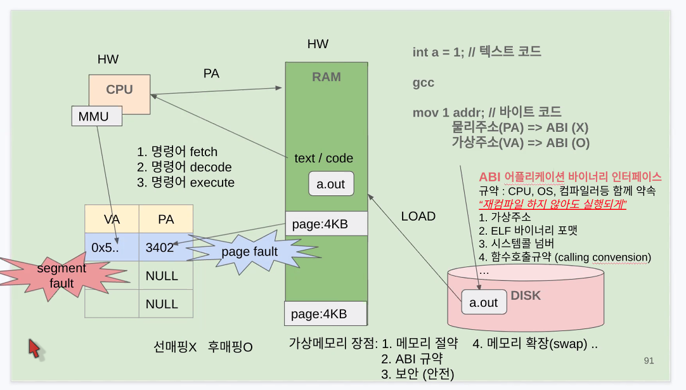


외울 것이 천지 인데... 이것은 꼭 외워야... 

- 4096 byte
- 4KB
- 2^12
- 2<<12

우리가 malloc으로 메모리를 할당 받아도 실제 할당 받는 주소는 VA 주소이다.  실제 PA, RSS 공간을 할당 받은 시점은 READ/Write 하는 시점이다. 그래서 application에서 주소를 요청하는 것은 모두 가상 주소 공간이라는 것을 알고 있어야 한다. 

#### task_struct는 가상 주소

* cpu register의 역할

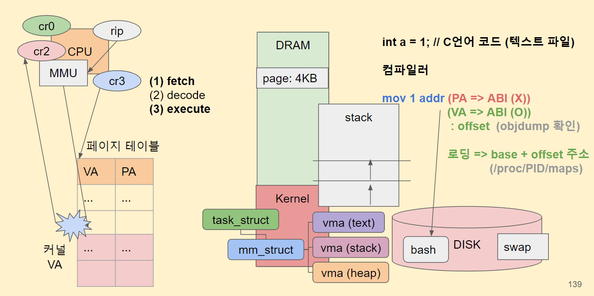


1. task_struct에서  mm_struct가 있고... VMA 주소 공간을 이용한다.
2. CR0 보호 모드 또는 Real모드 부팅
3. CPU에서는 항상 MMU 통해서 페이지테이블 거쳐서 물리 주소 간다
4. 만약 페이지 테이블에 VA-PA연결이 안되어 있으면  PageFault 발생한다.
5. Page fault 발생한 이후 vma 확인했는데 VMA에  할당 안된 주소를 참조하는 경우는 Sement Fault 발생한다. 
6. Fault가 발생하면 Fault Handling하게 되는데 Exception, Interrupt 수행하게 되는데.. 이때 커널의 진입점인 Entry 진입점을 호출하여 사용하게 된다. (Entry_64.S ) kernel에서 부팅 또는 runtime에도 kernel 진입한다.
7. 이때 fault 발생하는 첫번째 주소가 CR2에 저장 된다. 

```
entry_64.S : 1202 라인...
1202 idtentry page_fault     do_page_fault       has_error_code=1    read_cr2=1
```

이것이 MACRO로 이렇게 되어 있다. 

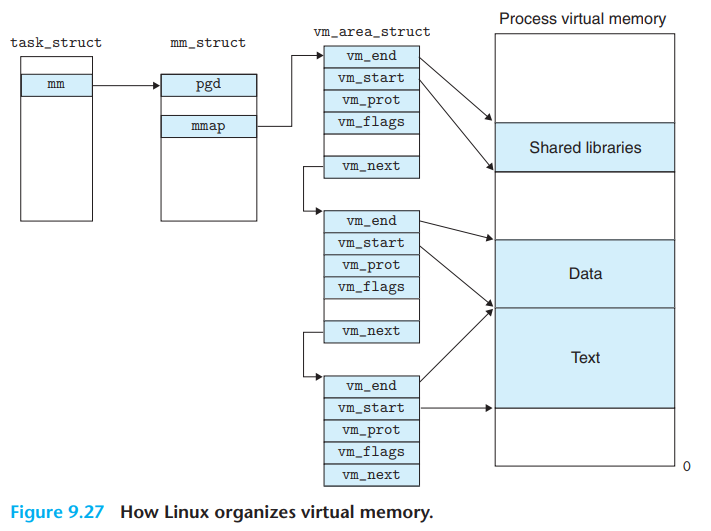.


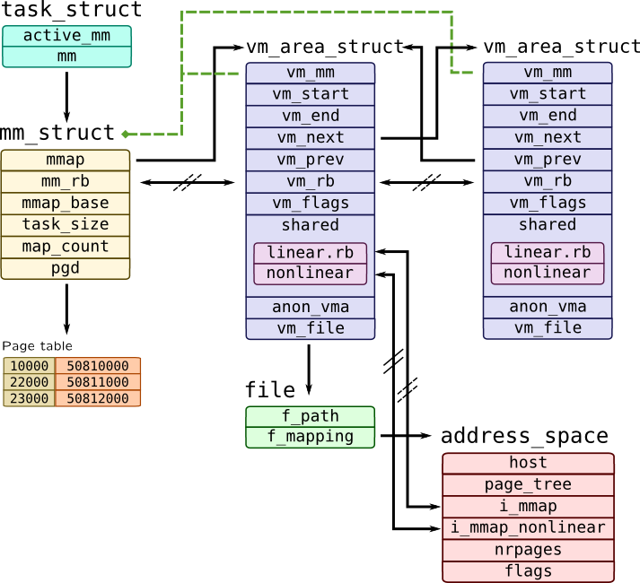


#### vma list 목록 

* 실제 1번 프로세스가 가지고 있는 vma 리스트는 아래 같이 가상 주소 공간을 확인할 수 있다.  나오는 주소는 당연히 VA이다.

```sh
reallinux@ubuntu:~/git/linux$ ps -eo pid,comm,vsz,rss | head -2
  PID COMMAND            VSZ   RSS
    1 systemd         225472  7212

reallinux@ubuntu:~/git/linux$ sudo cat /proc/1/maps
[sudo] password for reallinux:
5616605e2000-561660732000 r-xp 00000000 08:02 918859                     /lib/systemd/systemd
561660931000-56166096c000 r--p 0014f000 08:02 918859                     /lib/systemd/systemd
56166096c000-56166096d000 rw-p 0018a000 08:02 918859                     /lib/systemd/systemd
5616628e9000-561662a94000 rw-p 00000000 00:00 0                          [heap]
7f86d4000000-7f86d4021000 rw-p 00000000 00:00 0
7f86d4021000-7f86d8000000 ---p 00000000 00:00 0
7f86dc000000-7f86dc021000 rw-p 00000000 00:00 0
7f86dc021000-7f86e0000000 ---p 00000000 00:00 0
7f86e1eb3000-7f86e1eb4000 ---p 00000000 00:00 0
7f86e1eb4000-7f86e26b4000 rw-p 00000000 00:00 0
7f86e26b4000-7f86e26b5000 ---p 00000000 00:00 0
7f86e26b5000-7f86e2eb5000 rw-p 00000000 00:00 0

```

* 현재 프로세스의 가상 메모리 list

```sh
reallinux@ubuntu:~/git/linux$ sudo cat /proc/$$/maps | nl
     1  55b324881000-55b324985000 r-xp 00000000 08:02 131100                     /bin/bash
     2  55b324b84000-55b324b88000 r--p 00103000 08:02 131100                     /bin/bash
     3  55b324b88000-55b324b91000 rw-p 00107000 08:02 131100                     /bin/bash
     4  55b324b91000-55b324b9b000 rw-p 00000000 00:00 0
     5  55b326401000-55b326584000 rw-p 00000000 00:00 0                          [heap]
     ....
    43  7f4394d40000-7f4394d41000 rw-p 00000000 00:00 0
    44  7fff617c4000-7fff617e5000 rw-p 00000000 00:00 0                          [stack]
    45  7fff617e9000-7fff617ec000 r--p 00000000 00:00 0                          [vvar]
    46  7fff617ec000-7fff617ed000 r-xp 00000000 00:00 0                          [vdso]
    47  ffffffffff600000-ffffffffff601000 --xp 00000000 00:00 0                  [vsyscall]

```

47개의 vma 리스트가 있다는 것을 확인할 수 있다.


### [실습] page fault 추적

#### 1. tracing 

* page fault

```
cd /sys/kernel/debug/tracing/
echo 1 > events/exceptions/page_fault_user/enable
cat trace_pipe

<<종료>>
echo 0 > events/enable
echo > trace
```

* trace_pipe 로 시작하고 ctl-C  로 종료한다. 

```sh
   systemd-udevd-13056 [002] d...  page_fault_user: address=0x55dde453f558 ip=0x7f5d47f893af error_code=0x7
   systemd-udevd-13056 [002] d...  page_fault_user: address=0x55dde4553c78 ip=0x7f5d47f8900c error_code=0x7
   systemd-udevd-13056 [002] dn..  page_fault_user: address=0x55dde4513bf8 ip=0x7f5d47f819b6 error_code=0x7
   systemd-udevd-13056 [002] d...  page_fault_user: address=0x55dde4524ff8 ip=0x7f5d47f81a59 error_code=0x7
           snapd-6242  [003] d...  page_fault_user: address=0xc4204db000 ip=0x565009f0b853 error_code=0x6
           snapd-6242  [003] d...  page_fault_user: address=0xc4204dc000 ip=0x565009f0b853 error_code=0x6
           snapd-6242  [003] d...  page_fault_user: address=0xc4204dd000 ip=0x565009f0b853 error_code=0x6
   systemd-udevd-21698 [003] d...  page_fault_user: address=0x7f5d482de8a0 ip=0x7f5d47f7e935 error_code=0x7
   systemd-udevd-21698 [003] d...  page_fault_user: address=0x55dde44fafe8 ip=0x7f5d47f81a94 error_code=0x7
   systemd-udevd-21698 [003] d...  page_fault_user: address=0x55dde44fe7d8 ip=0x7f5d47f81a94 error_code=0x7
   systemd-udevd-21698 [003] d...  page_fault_user: address=0x55dde452f368 ip=0x7f5d47f8566e error_code=0x7
   systemd-udevd-21698 [003] d...  page_fault_user: address=0x55dde4532d68 ip=0x7f5d47f86259 error_code=0x7
```

* 이것이 발생할때 err_code  의미는 뭐지?

- address 는 VA 가상 주소이다. 이  가상 주소가 fault  발생했다고 이해 해야 한다. 
- ip는 instruction point 즉 명령어가 실행된 point 를 의미한다.
- error  코드도 해석해 보자: ox7 
- 강사님 질문 : help@reallinux.co.kr


* 프로세스의 가상 주소 테이블 정보 

```
cat /proc/10369/maps
```

#### 2. pagefault err bit

* git/linux/arch/x86/include/asm/traps.h

```c
158  * Page fault error code bits:
159  *
160  *   bit 0 ==    0: no page found   1: protection fault
161  *   bit 1 ==    0: read access     1: write access
162  *   bit 2 ==    0: kernel-mode access  1: user-mode access
163  *   bit 3 ==               1: use of reserved bit detected
164  *   bit 4 ==               1: fault was an instruction fetch
165  *   bit 5 ==               1: protection keys block access
166  */
```


* 커널은 full 가상 주소로 컴파일 되고, user applicaiton은 offset 주소로 컴파일 되고 실행 시점에 base 주소와 결합해서 실제 VA가 결정된다.


#### 3. kernel mode page fault

* 커널 모드에서 page fault 확인

```
# sudo su 
# cd /sys/kernel/debug/tracing
echo 1 > options/stacktrace
echo 0 > events/exceptions/page_fault_user/enable
echo 1 > events/exceptions/page_fault_kernel/enable
cat trace_pipe

=> trace_event_raw_event_x86_exceptions
 => do_page_fault
 => page_fault
             cat-13544 [002] d... 26845.440344: page_fault_user: address=0x7fd64420c3f4 ip=0x7fd643c69461 error_code=0x4
             cat-13544 [002] d... 26845.440345: <stack trace>
 => trace_event_raw_event_x86_exceptions
 => do_page_fault
 => page_fault
             cat-13544 [002] d... 26845.440350: page_fault_user: address=0x557128e76068 ip=0x7fd643cd026d error_code=0x6
             cat-13544 [002] d... 26845.440351: <stack trace>
 => trace_event_raw_event_x86_exceptions
 => do_page_fault
 => page_fault
             cat-13544 [002] d... 26845.440358: page_fault_user: address=0x7fd643d3edb0 ip=0x7fd643d3edb0 error_code=0x14
             cat-13544 [002] d... 26845.440360: <stack trace>
 => trace_event_raw_event_x86_exceptions
 => do_page_fault
 => page_fault
             cat-13544 [002] d... 26845.440373: page_fault_user: address=0x7fd644088000 ip=0x7fd643cced93 error_code=0x6
             cat-13544 [002] d... 26845.440375: <stack trace>
 => trace_event_raw_event_x86_exceptions
 => do_page_fault
 => page_fault

```


### [실습] pagefault handler 

#### 1. entry point

* entry : 모든interrupt, systemcall 등의 진입점을 의미한다.  

entry_64.S 모든 진입점은 여기에서 출발...

```sh
reallinux@ubuntu:~/git/linux/arch/x86/entry$ pwd
/home/reallinux/git/linux/arch/x86/entry

1202 idtentry page_fault     do_page_fault       has_error_code=1    read_cr2=1  <<== exception 발생하면 1202라인으로 가도록 시스템 부팅할때 이미 이렇게 설정되어 있다. 따라서 우리는 entry.S 화일의 etnry point를 확인하고 실제 호출하는 함수를 읽어 봐야 한다. 그래서 아래 do_page_fault 함수를 찾아서 이해해 볼 수 있는 것이다. 

```

ctag의  do_page_fault 함수를 호출 한것을 찾아 본다. 

그러면 이것은 cr2 에 의해서 전달되는 변수가  아래의  unsigened long address 에서 전달되는 변수가 된다. 

```c
1493 static noinline void
1494 __do_page_fault(struct pt_regs *regs, unsigned long hw_error_code,
1495         unsigned long address)  <<== 여기의 address가 fault 발생한 주소이다.
1496 {
1497     prefetchw(&current->mm->mmap_sem);
1498
1499     if (unlikely(kmmio_fault(regs, address)))
1500         return;
1501
1502     /* Was the fault on kernel-controlled part of the address space? */
1503     if (unlikely(fault_in_kernel_space(address)))
1504         do_kern_addr_fault(regs, hw_error_code, address);
1505     else
1506         do_user_addr_fault(regs, hw_error_code, address);
1507 }
1508 NOKPROBE_SYMBOL(__do_page_fault);

```


#### 2. do_page_fault

* /sys, /proc에 있는 것은 kernel의 함수와 변수로 긴밀하게 연결되어 있다.
* trace_pagefault_enabled() 설정은 실제 /sys/kernel/debug/tacing..

```c
1510 static __always_inline void
1511 trace_page_fault_entries(struct pt_regs *regs, unsigned long error_code,
1512              unsigned long address)
1513 {
1514     if (!trace_pagefault_enabled())
1515         return;
1516
1517     if (user_mode(regs))
1518         trace_page_fault_user(address, regs, error_code);
1519     else
1520         trace_page_fault_kernel(address, regs, error_code);
1521 }
1522
1523 dotraplinkage void
1524 do_page_fault(struct pt_regs *regs, unsigned long error_code, unsigned long address)
1525 {
1526     enum ctx_state prev_state;
1527
1528     prev_state = exception_enter();
1529     trace_page_fault_entries(regs, error_code, address);
1530     __do_page_fault(regs, error_code, address);
1531     exception_exit(prev_state);
1532 }
1533 NOKPROBE_SYMBOL(do_page_fault);

```


__do_page_fault 이렇게  내장 함수를 사용하는 것은 좀더 내용이 있다는 것으로 이해 하면 된다. 


```c
1493 static noinline void
1494 __do_page_fault(struct pt_regs *regs, unsigned long hw_error_code,
1495         unsigned long address)
1496 {
1497     prefetchw(&current->mm->mmap_sem);
1498
1499     if (unlikely(kmmio_fault(regs, address)))
1500         return;
1501
1502     /* Was the fault on kernel-controlled part of the address space? */
1503     if (unlikely(fault_in_kernel_space(address)))
1504         do_kern_addr_fault(regs, hw_error_code, address);
1505     else
1506         do_user_addr_fault(regs, hw_error_code, address);  <<== address에서 fault 주소 넘겨줌
1507 }
1508 NOKPROBE_SYMBOL(__do_page_fault);

```


#### 3. unlikely

unlikely는 cpu가 분기 예측할때   그럴 가능성이 낮기 때문에 예측을 해야 한다면 else 쪽으로 예측하라는 것을 컴파일러에게 힌트를 주는 것이다. 즉 true가 되는 것은 거의 발생하지 않는 다는 것이다.  


여기서 사용되는 vm_area_struct, task_struct, mm_struct 자료 구조를 명확하게 이해하는 것이 매우 중요하다.  

```c
1281 static inline
1282 void do_user_addr_fault(struct pt_regs *regs,
1283             unsigned long hw_error_code,
1284             unsigned long address)
1285 {
1286     struct vm_area_struct *vma;    <<== mm_strcut 아래에 있는 것이 vma 가상 메모리 관리하는 자료 구조
1287     struct task_struct *tsk;       <<== 이것 중요
1288     struct mm_struct *mm;          <<== 이것 중요
1289     vm_fault_t fault, major = 0;
1290     unsigned int flags = FAULT_FLAG_ALLOW_RETRY | FAULT_FLAG_KILLABLE;
1291
1292     tsk = current;   <<=== 여기 현재 프로세스
1293     mm = tsk->mm;    <<==  여기 현재 프로세스의 mm_strcut 
1294
1295     /* kprobes don't want to hook the spurious faults: */
1296     if (unlikely(kprobe_page_fault(regs, X86_TRAP_PF)))
1297         return;
1298
1299     /*
1300      * Reserved bits are never expected to be set on
1301      * entries in the user portion of the page tables.
1302      */
1303     if (unlikely(hw_error_code & X86_PF_RSVD))
1304         pgtable_bad(regs, hw_error_code, address);

    
1402     vma = find_vma(mm, address);   <<== 여기서 실제 fault가 발생한 주소를 보고 찾는다. (segment에 VA주소 확인)
1403     if (unlikely(!vma)) {
1404         bad_area(regs, hw_error_code, address);   <<=== 여기서 segment fault를 여기서 한다. 
1405         return;
1406     }
1407     if (likely(vma->vm_start <= address))
1408         goto good_area;
1409     if (unlikely(!(vma->vm_flags & VM_GROWSDOWN))) {
1410         bad_area(regs, hw_error_code, address);
1411         return;
1412     }
1413     if (unlikely(expand_stack(vma, address))) {
1414         bad_area(regs, hw_error_code, address);
1415         return;
1416     }
```


#### 4. find_vma

```c
2227 struct vm_area_struct *find_vma(struct mm_struct *mm, unsigned long addr)
2228 {
2229     struct rb_node *rb_node;
2230     struct vm_area_struct *vma;
2231
2232     /* Check the cache first. */
2233     vma = vmacache_find(mm, addr);
2234     if (likely(vma))
2235         return vma;
2236
2237     rb_node = mm->mm_rb.rb_node;
2238
2239     while (rb_node) {
2240         struct vm_area_struct *tmp;
2241
2242         tmp = rb_entry(rb_node, struct vm_area_struct, vm_rb);
2243
2244         if (tmp->vm_end > addr) {
2245             vma = tmp;
2246             if (tmp->vm_start <= addr)
2247                 break;
2248             rb_node = rb_node->rb_left;
2249         } else
2250             rb_node = rb_node->rb_right;
2251     }
2252
2253     if (vma)
2254         vmacache_update(addr, vma);
2255     return vma;
2256 }

```

```
set tags=/home/reallinux/git/linux/tags
set csprg=/usr/local/bin/cscope
cs add /home/reallinux/git/linux/cscope.out
syntax on
set autoindent
set laststatus=2
set tabstop=4
set expandtab
set smartindent
set expandtab
set shiftwidth=4
set number

```


#### 5. pte page table entry

결국 하는 일은 page table entry를 수정하는 일을 한다. 

PTE 는 Page table의 한 항목을 의미한다. 

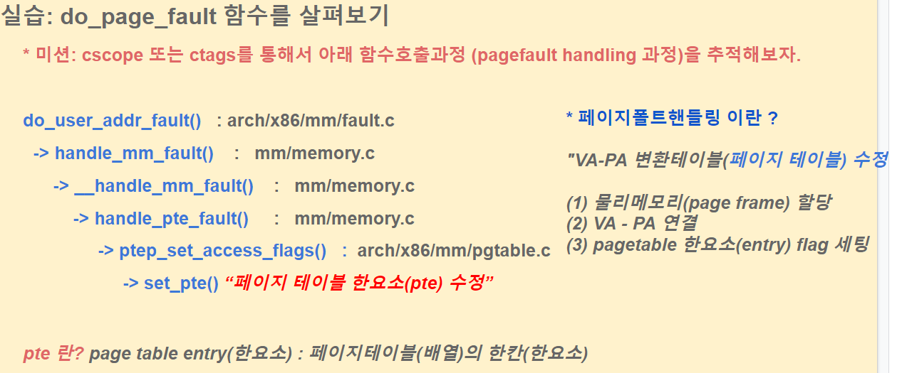


```
3973 vm_fault_t handle_mm_fault(struct vm_area_struct *vma, unsigned long address,
3974         unsigned int flags)
3975 {
3976     vm_fault_t ret;
3977
3978     __set_current_state(TASK_RUNNING);
3979
3980     count_vm_event(PGFAULT);
3981     count_memcg_event_mm(vma->vm_mm, PGFAULT);
3982
3983     /* do counter updates before entering really critical section. */
3984     check_sync_rss_stat(current);
3985
3986     if (!arch_vma_access_permitted(vma, flags & FAULT_FLAG_WRITE,
3987                         flags & FAULT_FLAG_INSTRUCTION,
3988                         flags & FAULT_FLAG_REMOTE))
3989         return VM_FAULT_SIGSEGV;
3990
3991     /*
3992      * Enable the memcg OOM handling for faults triggered in user
3993      * space.  Kernel faults are handled more gracefully.
3994      */
3995     if (flags & FAULT_FLAG_USER)
3996         mem_cgroup_enter_user_fault();
3997
3998     if (unlikely(is_vm_hugetlb_page(vma)))
3999         ret = hugetlb_fault(vma->vm_mm, vma, address, flags);
4000     else
4001         ret = __handle_mm_fault(vma, address, flags);


3964     return handle_pte_fault(&vmf);
3965 }

```


```c
483 int ptep_set_access_flags(struct vm_area_struct *vma,
484               unsigned long address, pte_t *ptep,
485               pte_t entry, int dirty)
486 {
487     int changed = !pte_same(*ptep, entry);
488
489     if (changed && dirty)
490         set_pte(ptep, entry);   <<== 이것이 실제 PTE를 설정하는 것...
491
492     return changed;
493 }

```


페이지(물리메모리의 한조각): 4KB / 4096 / 0x1000 / 2^12 / 12 bit

1. 페이지 케시: 파일 내용 (디스크 블럭) , 절대적으로 많이 사용하는 용도...
2. Anonymous page : 순수 메모리 (예: stack, heap) 공간 용도

메모리와 파일 시스템은 너무 긴밀히 관계되어 있고 page cache 용도로 너무 많이 사용하기 때문에 lunux 세션에서 메모리와  파일 시스템 같이 열린다. 

이때 anonymous 이 메모리는 뭐냐... 즉 file IO와 동반 되느냐 

* memory.c

```c
/* Allocate our own private page. */
2991     if (unlikely(anon_vma_prepare(vma)))
2992         goto oom;
2993     page = alloc_zeroed_user_highpage_movable(vma, vmf->address); <<== anonymous memory 할당
2994     if (!page)
2995         goto oom;

3033 setpte:
3034     set_pte_at(vma->vm_mm, vmf->address, vmf->pte, entry);   <<== 할당 받은 페이지를 page table에 할당

```

* linux/mm/memory.c

```
3836     if (!vmf->pte) {
3837         if (vma_is_anonymous(vmf->vma))
3838             return do_anonymous_page(vmf);
3839         else
3840             return do_fault(vmf);
3841     }
3842
```

pagefault: 

1. IO 처리가 동반된 fault
2. IO 처리가 없는 fault 

### [실습] 특정 프로세스 tracing 

#### 1. hello.c

```
#include <stdio.h>
void main()
{
        printf("hello\n");
}
```

#### 2. cgdb

```
$ gcc -g -o hello hello.c
$ cgdb ./hello
(gdb) b main
(gdb) r
(gdb) info proc
process 27946
cmdline = '/home/reallinux/hello'
cwd = '/home/reallinux'
exe = '/home/reallinux/hello'

(gdb) info stack
#0  main () at hello.c:5

(gdb) si
.....
<아래 trace 준비해 놓고>
(gdb) run

```


#### 3. 특정 프로세스 trace 

* 현재 특정 프로세스 trace 하는 방법 :  점검 대상 프로세스 

```
root@ubuntu:/sys/kernel/debug/tracing# echo 15566 > set_event_pid
root@ubuntu:/sys/kernel/debug/tracing# cd /sys/kernel/debug/tracing/
root@ubuntu:/sys/kernel/debug/tracing#
root@ubuntu:/sys/kernel/debug/tracing# echo 1 > events/exceptions/page_fault_user/enable
root@ubuntu:/sys/kernel/debug/tracing#  echo $$ > set_event_pid  <<== 현재 프로세스만 trace
root@ubuntu:/sys/kernel/debug/tracing# echo > trace              <<== 전역적 trace 정보 비워준다. 
root@ubuntu:/sys/kernel/debug/tracing# cat trace_pipe

<<종료 절차>>
root@ubuntu:/sys/kernel/debug/tracing# ^C
root@ubuntu:/sys/kernel/debug/tracing# echo 0 > events/enable
root@ubuntu:/sys/kernel/debug/tracing# echo 0 > set_event_pid
root@ubuntu:/sys/kernel/debug/tracing# echo > trace

```


### [실습]  RSS(Rdsident set size) vs VSZ (virtual memory size)

#### 1. free

```
root@ubuntu:/sys/kernel/debug/tracing# free
              total        used        free      shared  buff/cache   available
Mem:        2035676      161108       39620         260     1834948     1841396
Swap:       2094076       29952     2064124


root@ubuntu:/sys/kernel/debug/tracing# free
              total        used        free      shared  buff/cache   available
Mem:        2035676      161108       39620         260     1834948     1841396
Swap:       2094076       29952     2064124


root@ubuntu:/sys/kernel/debug/tracing# 
root@ubuntu:/sys/kernel/debug/tracing# echo $((161108+39620+1834948))
2035676

```

used + free + buff/cache 합한  값이  total 값이다. 

왜 그럴까?

- buffer cache는 used로 봐야 하는데... used는 anoymous의 used라고 봐야 한다. 따라서 buff/cache는 메모리 사용중인데 IO 용도로 사용하고 있다는 것이다. 그래서  실제 사용된  용량은 used + buff/cache 용량이다. 
- available은 free+buff/cache 용량으로 봐야 한다. 
- buff/cache는 털어 낼 수  있는 공간이기 때문에 free 용량으로 보는 것이다. 

#### 2. VSZ

```
reallinux@ubuntu:~$ man ps | grep VSZ
       %z     vsz      VSZ
       vsize       VSZ       see vsz.  (alias vsz).
       vsz         VSZ       virtual memory size of the process in KiB (1024-byte units).  Device mappings are currently excluded; this is subject to
reallinux@ubuntu:~$
```

==> task_struct->mm_struct->vma의 합을 VSZ이라고 한다. 

==> RSS는 실제 물리 메모리에 매핑된 페이지 용량

```
reallinux@ubuntu:~$ ps -eo pid,comm,vsz,rss | head -2
  PID COMMAND            VSZ   RSS
    1 systemd         225472  7204
reallinux@ubuntu:~$ echo  $((225472-7204))
218268


reallinux@ubuntu:~$ ps -eo pid,comm,vsz,rss  --sort rss | more  <<== 실제 물리 메모리 많이 사용하는 놈들...
```

==> 아무리 할당을 많이 해도 안쓰면 물리 주소 공간을 할당해주지  않는다.  꼭 기억하자.


#### 3. meminfo 

* meminfo 핵심적인 내용 일단 5개만 알고 가자.

```sh
root@ubuntu:/sys/kernel/debug/tracing# cat /proc/meminfo | head -5
MemTotal:        2035676 kB
MemFree:           39352 kB
MemAvailable:    1841208 kB
Buffers:          162904 kB
Cached:          1504128 kB
```

==> buffers는 파일 정보 (inode block), Cached는 파일의 내용 (data block)

#### 4. buffer  

* 용어를 일반화 시켜서 이해하면 망한다. 그 계층에 맞는 용어로 정확하게 개념을 설명해야 한다.  

버퍼 용어는 상대적으로 이해해야 한다. 일반적인 용어로 이해한다면 망한다. 

일반적인 개념으로 이해하거나 적용하면 안된다.  항상 그 계층을 이야기 하고 cache를 이야기 해야 한다. 브라우저 케시로 하면 디스크 케시와는 완전히 다른 의미로 해설 될 수 있다. 따라서 여기서 캐시의 의미는 디스크의 내용을 미리 읽어온 것을 의미한다. 그중에서도 파일의 내용을 미리 읽어 온것으로 제약의 제약을 둬서 설명해야 한다. 이렇게 하지 않으면 내용이 헷갈리게 유도 한다. 따라서 반드시 적용되는 계층을 먼저 이야기 하고 설명해 해야 한다. 특히  buffer는 일반적인 용어로 설명하거나 이해하면 만한다. 

* 계층에 계층의 속에서 용어를 정의해야 한다.  

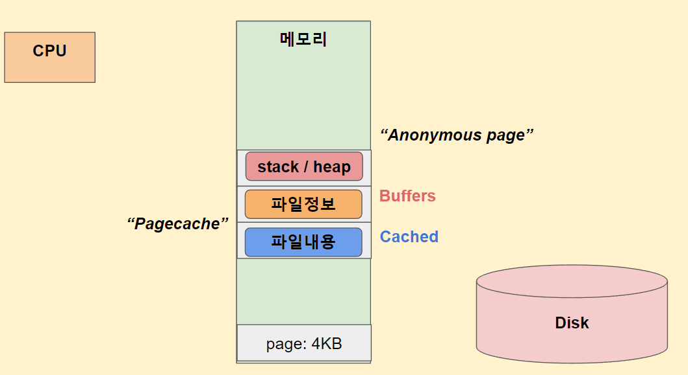

#### 5. inode 

* inode : 메타 정보 담고 있는 거

```sh
reallinux@ubuntu:~$ stat hello.c
  File: hello.c
  Size: 57              Blocks: 8          IO Block: 4096   regular file
Device: 802h/2050d      Inode: 787411      Links: 1
Access: (0664/-rw-rw-r--)  Uid: ( 1000/reallinux)   Gid: ( 1000/reallinux)
Access: 2021-12-06 02:29:26.398845356 +0000
Modify: 2021-12-06 02:29:23.683769377 +0000
Change: 2021-12-06 02:29:23.683769377 +0000
 Birth: -

```


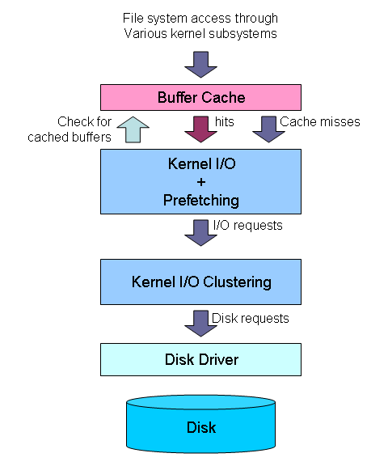


## Page Table


huge page : 4K * 512개 연속된 512개 페이지이다. 어차피 내부적으로는 4K로 관리된다. 


#### 1 level page table

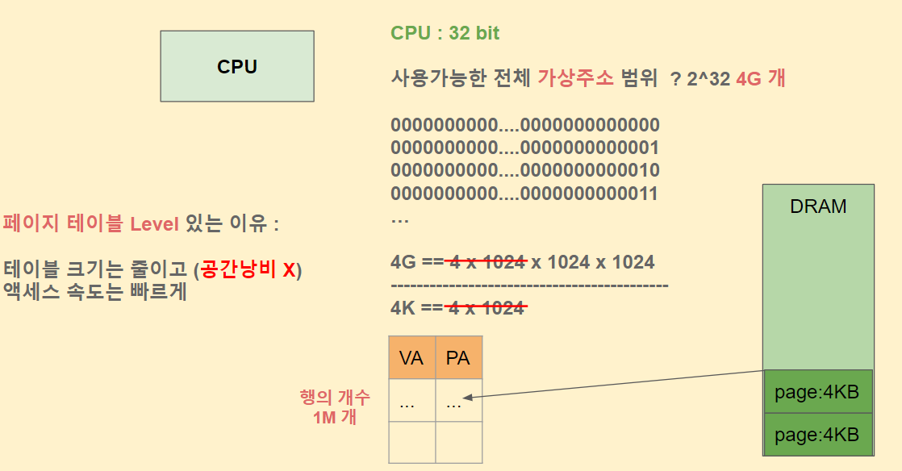

#### 4 level page table

* 페이지 테이블을 좀더 효율적으로 ... Linked List를 사용하지 않으면서도 공간을 좀 더 효율적으로 사용할 수 있다.  
* 배열은 : index 사용하면 빠른 접근은 가능한데... 공간 낭비가 발생한다는 문제점 ... 그래서 낭비된 공간을 어떻게 줄일지 고민한다. 
* 실제 사용되는 주소 공간이 할당 될 때 관리 테이블이 할당 된다. 
* 2단계 구성할 때는 1차 관리 테이블 8개와 실 테이블 9개 미사용이므로 17개가 공간 낭비가 발새한다. 
* 가상 주소 접근할때 fault가 발생하면 아래 단계의 모든 테입을 동시에 필요한 테이블을  할당하기 때문에 page fault 빈도가 더 많이 발생하지는 않는다. 

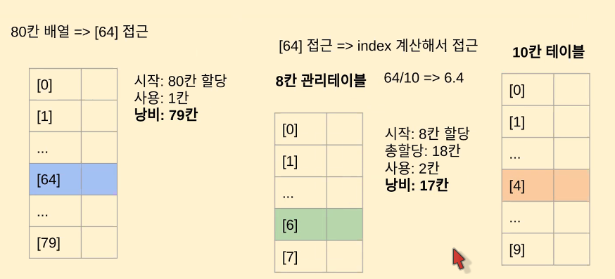


#### 64 bit page table

* 최종적으로 사용하는 4KB 12 비트 할당 된다.
* 2^9 이므로 512개 * 512개 * 512개 *512개가 된다. 
* 따라서 실제 사용되는 메모리 공간은 512+512+512+512 공간이 사용된다. 물론 다른 영역의 주소 공간을 사용한다면 또다른 512개가 필요하다. 이것을 너무 깊게 들어갈 필요는 없다. 어떤 매커니즘으로 동작되는지 이정도만 알면된다. 커널의 page table 원리만 알고 넘어가는 정도만 가도 된다.  

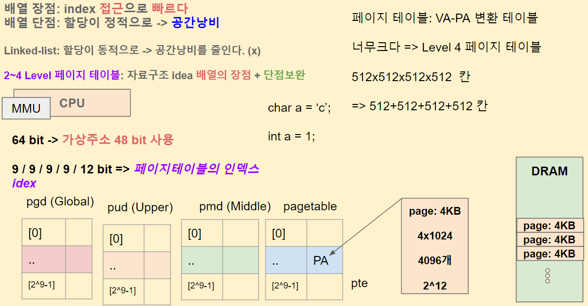

* 페이지 테입을 dump 해서 볼 수 있는데... 이것은 커널 build 할때 옵션 줘하면 된다. 


```
cd ~/git/linux
make menuconfig
```


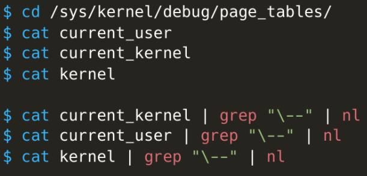


#### 현재 커널의 page table level

```
reallinux@ubuntu:~/git/linux$ cat /boot/config-5.3.0 | grep  PGTABLE
CONFIG_PGTABLE_LEVELS=4

```

#### page table entry

![13. mmap and DMA - Linux Device Drivers, Second Edition [Book]](img/tagoreillycom20070220oreillyimages66958.png)


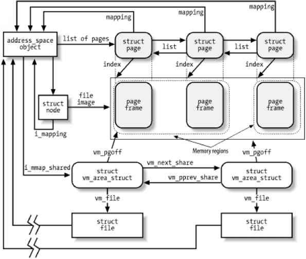


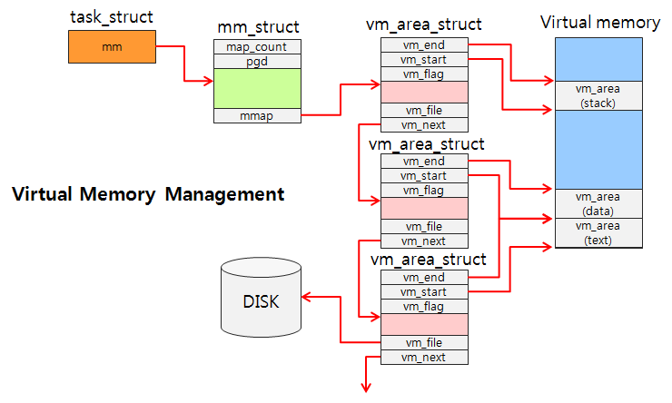


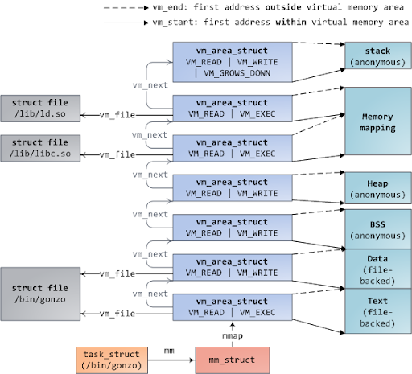


##   mmap

### Memory map

* mmap은 가상 주소 공간할당이 주된 역할 이다.  (이것이 더 중요한 기능이다.)
* 보통은 파일과 가상 주소 매핑으로 알고 있는 데 이것은 부가적인 기능이다. (중요)
* vma를 할당하는 것이 역할이다. 
* 그중에서 anonymous 용도로 사용하는 것이 아닌것이 있을때는 mapping 옵션을 사용한다.  아니면 가상 주소 공간을 항한다.
* 파일과 매핑되지 않은 주소 공간 (heap, stack 등에서 사용되는 공간)
* malloc으로도 기본적으로 heap(vma)에서 가상 주소 공간을 할당하지만 더 큰 할당이 필요할 때는 내부적으로는 mmap을 사용한다. 
* 여기서 진짜 중요한것은 malloc으로 메모리 할당을 하는 것이 아니라  가상 주소 공간만 할당 받는 것이 중요하다. 실제 공간은 READ/WRITE 가 발생할때 page fault가 발생하고 그때 물리 page를 할당 받아서 page table에 VA-PA 매핑 할당 한다는 것이다. 이것을 꼭 꼭 기억하고 실제 소스에서 그렇데 동작하는 것을 반드시 확인 할 것...


#### mmap 이란?

1. 가상주소 공간 할당 : 이것이 가장 중요한 기능이다.  
2.  파일과 가상주소 매핑 (옵션)
3. malloc() 함수도  기본적으로 heap(vma)에서가상주소 공간을 할당하지만   더 큰 할당이 필요할때에는  내부적으로 mmap 을 통해서   "가상주소 공간 할당" 한다.
4. 메모리 공간을 할당하기 때문에  
5. 파일과 매핑 X => anonymous vma / page(예: stack, heap ...)


```
reallinux@ubuntu:~/git/linux$ cat /proc/self/maps
56280a176000-56280a17e000 r-xp 00000000 08:02 131116                     /bin/cat
56280a37d000-56280a37e000 r--p 00007000 08:02 131116                     /bin/cat
56280a37e000-56280a37f000 rw-p 00008000 08:02 131116                     /bin/cat
56280aceb000-56280ad0c000 rw-p 00000000 00:00 0                          [heap]
7f9f09fcf000-7f9f0a1b6000 r-xp 00000000 08:02 960270                     /lib/x86_64-linux-gnu/libc-2.27.so
7f9f0a1b6000-7f9f0a3b6000 ---p 001e7000 08:02 960270                     /lib/x86_64-linux-gnu/libc-2.27.so
7f9f0a3b6000-7f9f0a3ba000 r--p 001e7000 08:02 960270                     /lib/x86_64-linux-gnu/libc-2.27.so
7f9f0a3ba000-7f9f0a3bc000 rw-p 001eb000 08:02 960270                     /lib/x86_64-linux-gnu/libc-2.27.so
7f9f0a3bc000-7f9f0a3c0000 rw-p 00000000 00:00 0
7f9f0a3c0000-7f9f0a3e9000 r-xp 00000000 08:02 947723                     /lib/x86_64-linux-gnu/ld-2.27.so
7f9f0a41c000-7f9f0a43e000 rw-p 00000000 00:00 0
7f9f0a43e000-7f9f0a5d9000 r--p 00000000 08:02 793760                     /usr/lib/locale/locale-archive
7f9f0a5d9000-7f9f0a5db000 rw-p 00000000 00:00 0
7f9f0a5e9000-7f9f0a5ea000 r--p 00029000 08:02 947723                     /lib/x86_64-linux-gnu/ld-2.27.so
7f9f0a5ea000-7f9f0a5eb000 rw-p 0002a000 08:02 947723                     /lib/x86_64-linux-gnu/ld-2.27.so
7f9f0a5eb000-7f9f0a5ec000 rw-p 00000000 00:00 0
7ffd2eba7000-7ffd2ebc8000 rw-p 00000000 00:00 0                          [stack]
7ffd2ebcf000-7ffd2ebd2000 r--p 00000000 00:00 0                          [vvar]
7ffd2ebd2000-7ffd2ebd3000 r-xp 00000000 00:00 0                          [vdso]
ffffffffff600000-ffffffffff601000 --xp 00000000 00:00 0                  [vsyscall]

```

`$ echo $$` bash process id 만 얻어 내는 것

`/proc/self/maps`는 순수하게 running되는 process 자신

* vma 출력하는 과정을 추적해 보자

```
reallinux@ubuntu:~/git/linux$ sudo uftrace record -d pid_maps.uftrace.data --force -K 30 /bin/cat /proc/self/maps
[sudo] password for reallinux:

reallinux@ubuntu:~/git/linux$  cd pid_maps.uftrace.data/
reallinux@ubuntu:~/git/linux/pid_maps.uftrace.data$  uftrace replay

            [ 16283] |             show_map() {
            [ 16283] |               show_map_vma() {
            [ 16283] |                 show_vma_header_prefix() {
   3.811 us [ 16283] |                   seq_put_hex_ll();
   4.011 us [ 16283] |                   seq_put_hex_ll();
   3.811 us [ 16283] |                   seq_putc();
   3.961 us [ 16283] |                   seq_putc();

```


```sh
reallinux@ubuntu:~/git/linux$ ag show_map_vma
fs/proc/task_mmu.c
300:show_map_vma(struct seq_file *m, struct vm_area_struct *vma)
365:    show_map_vma(m, v);
826:    show_map_vma(m, vma);

pid_maps.uftrace.data/kallsyms
13002:ffffffffa508e980 t show_map_vma
reallinux@ubuntu:~/git/linux$
```


* mmap은 가상 주소 공간할당이 주된 역할 이다. 

### [실습] mmap

hello_mmap.c

```c
   #include <sys/mman.h>
   void *mmap(void *addr, size_t length, int prot, int flags,int fd, off_t offset);
```

#### 1. hello_mmap.c

```c
#include <stdio.h>
#include <string.h>
#include <sys/stat.h>
#include <sys/mman.h>
#include <unistd.h>
#include <fcntl.h>

#define READ_SIZE 16

int main(int argc, char **argv)
{
	int fd, flag = PROT_WRITE | PROT_READ;
	struct stat sb;
	char *addr;


	if ((fd = open(argv[1], O_RDWR|O_CREAT)) < 0) {
		printf("File Open Error\n");
		return -1;
	}

	if (fstat(fd, &sb) < 0) {
		printf("fstat error\n");
		return -1;
		
	}
	addr =  mmap(NULL, READ_SIZE, flag, MAP_SHARED, fd, 0); <<== fd값을 인자로 받는다.
	if (addr == MAP_FAILED)
		printf("mmap error\n");

	printf("%s\n", addr);
	memset(addr, 0x00, READ_SIZE);
	munmap(addr, READ_SIZE);
	close(fd);
}

```

1. mmap에서 fd 값을 넣어서 파일과 연결된다. 
2. 만약 fd 값을 넣지 않으면 malloc 과 동일하게 동작한다.

####  2. gcc -g -pg hello_mmap.c

-g : 디버깅

 -pg  : user 함수 추적

```
reallinux@ubuntu:~$ cat mmap_test.txt
111111122222333344456

reallinux@ubuntu:~$ hexdump -x mmap_test.txt
0000000    3131    3131    3131    3231    3232    3232    3333    3333
0000010    3434    3534    0a36
0000016

reallinux@ubuntu:~$ gcc -g -pg hello_mmap.c
reallinux@ubuntu:~$ ./a.out mmap_test.txt
111111122222333344456

reallinux@ubuntu:~$ hexdump -x mmap_test.txt
0000000    0000    0000    0000    0000    0000    0000    0000    0000
0000010    3434    3534    0a36
0000016

reallinux@ubuntu:~$ vi mmap_test.txt

  1 ^@^@^@^@^@^@^@^@^@^@^@^@^@^@^@^@44456

```

#### 3. drop caches

* 사용되지 않는 buff/cache data를 버림

```

root@ubuntu:/home/reallinux/git/linux/pid_maps.uftrace.data# free
              total        used        free      shared  buff/cache   available
Mem:        2035676      158780      135520         280     1741376     1843716
Swap:       2094076       31688     2062388
root@ubuntu:/home/reallinux/git/linux/pid_maps.uftrace.data#
root@ubuntu:/home/reallinux/git/linux/pid_maps.uftrace.data# echo 3> /proc/sys/vm/drop_caches

root@ubuntu:/home/reallinux/git/linux/pid_maps.uftrace.data# free
              total        used        free      shared  buff/cache   available
Mem:        2035676      158768      135520         280     1741388     1843728
Swap:       2094076       31688     2062388


root@ubuntu:/home/reallinux/git/linux/pid_maps.uftrace.data# echo 3> /proc/sys/vm/drop_caches

root@ubuntu:/home/reallinux/git/linux/pid_maps.uftrace.data# free
              total        used        free      shared  buff/cache   available
Mem:        2035676      151920       25088         280     1858668     1850564
Swap:       2094076       36316     2057760
root@ubuntu:/home/reallinux/git/linux/pid_maps.uftrace.data# free
              total        used        free      shared  buff/cache   available
Mem:        2035676      153476     1733756         280      148444     1849020
Swap:       2094076       36316     2057760

```


*  `echo 3> /proc/sys/vm/drop_caches`

####  4. mmap uftrace/replace 

```
root@ubuntu:/home/reallinux# echo  3 > /proc/sys/vm/drop_caches
root@ubuntu:/home/reallinux# uftrace record -d mmap.uftrace.data -K 30 ./a.out  mmap_test.txt
```

* 여기서 cache drop 해줘야만 ext4_filemap_fault가 실행된다.  

```
root@ubuntu:/home/reallinux# cat mmap_test.txt
11111222233334444
root@ubuntu:/home/reallinux#
root@ubuntu:/home/reallinux#
root@ubuntu:/home/reallinux# echo  3 > /proc/sys/vm/drop_caches
root@ubuntu:/home/reallinux# uftrace record -d mmap.uftrace.data -K 30 ./hello_mmap   mmap_test.txt
11111222233334444
root@ubuntu:/home/reallinux# cd  mmap
mmap_test.txt          mmap.uftrace.data/     mmap.uftrace.data.old/
root@ubuntu:/home/reallinux# cd  mmap.uftrace.data
root@ubuntu:/home/reallinux/mmap.uftrace.data#
root@ubuntu:/home/reallinux/mmap.uftrace.data#
root@ubuntu:/home/reallinux/mmap.uftrace.data#
root@ubuntu:/home/reallinux/mmap.uftrace.data# uftrace replay | grep ext4_filemap_fault
            [ 17299] |               ext4_filemap_fault() {
   5.027 ms [ 17299] |               } /* ext4_filemap_fault */

```

* uftrace replay 결과 분석

```
            [ 17299] |   puts() {   <<=== 여기서 중요한것 
            [ 17299] |     do_page_fault() {    <<== printf -> puts-> page_fault 유발시킴
            [ 17299] |       __do_page_fault() {
   3.591 us [ 17299] |         down_read_trylock();
            [ 17299] |         _cond_resched() {
   3.611 us [ 17299] |           rcu_all_qs();
  10.823 us [ 17299] |         } /* _cond_resched */
            [ 17299] |         find_vma() {
   3.761 us [ 17299] |           vmacache_find();
   3.730 us [ 17299] |           vmacache_update();
  18.505 us [ 17299] |         } /* find_vma */
            [ 17299] |         handle_mm_fault() {
   3.571 us [ 17299] |           mem_cgroup_from_task();
   3.561 us [ 17299] |           __count_memcg_events();
            [ 17299] |           __handle_mm_fault() {
   3.922 us [ 17299] |             filemap_map_pages();
            [ 17299] |             __do_fault() {
            [ 17299] |               ext4_filemap_fault() {  <<===
            [ 17299] |                 down_read() {
            [ 17299] |                   _cond_resched() {
   3.671 us [ 17299] |                     rcu_all_qs();
  10.983 us [ 17299] |                   } /* _cond_resched */
  18.325 us [ 17299] |                 } /* down_read */
            [ 17299] |                 filemap_fault() {
            [ 17299] |                   pagecache_get_page() {
   3.641 us [ 17299] |                     find_get_entry();
  10.993 us [ 17299] |                   } /* pagecache_get_page */

```

1. 가상 주소 공간을 할당하고 나서 즉 vma만 할당하고 나서 실제로 printf 호출되면 put 호출될 때... 이때 가상 주소를 찾아 보면 pagetable에 없기 때문에 page fault 가 발생한다는 점이다. 이것이 중요하다. 파일에 매핑된 가상 주소도 실제 사용할 때메모리에 매핑된 것이 없으면... fault가 발생한다. 따라서 이것은 anonymous 메모리나 일반 파일용 메모리와 차이가 없이 동일하게 동작된다는 것을 알수 있다.
2. File IO을 동반하는 Page fault를 여기서 확인하게 되는것이다. major fault라고 한다.
3. anonymous page fault는 무조건 minor fault라고 할 수 있다.  
4. 그래서 우리가 page cache를 clear 시키고 나서 테스트를 해본것이다. 시스템 테스트 하다보면 성능 차이가 있기 때문에 drop cache하고 나서 테스트 해야 하는 원리가 여기에 있는 것이다.  


* 현재 파일 시스템이 ext4 라는 것을 확인한다.  

```
root@ubuntu:/mnt# df -Th
Filesystem     Type      Size  Used Avail Use% Mounted on
/dev/sda2      ext4       18G   13G  4.7G  73% /
```


### [실습]  read system call vs mmap

#### 1. mmap 방식 

```
            [ 17299] |   puts() {   <<=== 여기서 중요한것 
            [ 17299] |     do_page_fault() {    <<== printf -> puts-> page_fault 유발시킴
            [ 17299] |       __do_page_fault() {
   3.591 us [ 17299] |         down_read_trylock();
            [ 17299] |         _cond_resched() {
   3.611 us [ 17299] |           rcu_all_qs();
  10.823 us [ 17299] |         } /* _cond_resched */
            [ 17299] |         find_vma() {
   3.761 us [ 17299] |           vmacache_find();
   3.730 us [ 17299] |           vmacache_update();
  18.505 us [ 17299] |         } /* find_vma */
            [ 17299] |         handle_mm_fault() {
   3.571 us [ 17299] |           mem_cgroup_from_task();
   3.561 us [ 17299] |           __count_memcg_events();
            [ 17299] |           __handle_mm_fault() {
```


````
            [ 17420] |     __x64_sys_read() {
            [ 17420] |       ksys_read() {
            [ 17420] |         __fdget_pos() {
   3.721 us [ 17420] |           __fget_light();
  11.043 us [ 17420] |         } /* __fdget_pos */
            [ 17420] |         vfs_read() {
            [ 17420] |           rw_verify_area() {
            [ 17420] |             security_file_permission() {
            [ 17420] |               selinux_file_permission() {
            [ 17420] |                 __inode_security_revalidate() {
            [ 17420] |                   _cond_resched() {
   3.621 us [ 17420] |                     rcu_all_qs();
  10.883 us [ 17420] |                   } /* _cond_resched */
  18.555 us [ 17420] |                 } /* __inode_security_revalidate */
   3.621 us [ 17420] |                 avc_policy_seqno();
  33.258 us [ 17420] |               } /* selinux_file_permission */
   3.661 us [ 17420] |               __fsnotify_parent();
   3.671 us [ 17420] |               fsnotify();
  55.575 us [ 17420] |             } /* security_file_permission */
  65.797 us [ 17420] |           } /* rw_verify_area */
            [ 17420] |           __vfs_read() {
            [ 17420] |             new_sync_read() {
            [ 17420] |               ext4_file_read_iter() {
            [ 17420] |                 generic_file_read_iter() {

````


* smp 정보 제거하고 trace

`uftrace replay -N smp_apic_timer_interrupt@kernel`


#### 2. trace 

```
            [ 17483] |     __x64_sys_read() {
            [ 17483] |       ksys_read() {
            [ 17483] |         __fdget_pos() {
   4.641 us [ 17483] |           __fget_light();
  12.533 us [ 17483] |         } /* __fdget_pos */
            [ 17483] |         vfs_read() {
            [ 17483] |           rw_verify_area() {
            [ 17483] |             security_file_permission() {
            [ 17483] |               selinux_file_permission() {
            [ 17483] |                 __inode_security_revalidate() {
            [ 17483] |                   _cond_resched() {
   4.060 us [ 17483] |                     rcu_all_qs();
  12.072 us [ 17483] |                   } /* _cond_resched */
 742.497 us [ 17483] |                 } /* __inode_security_revalidate */
   4.141 us [ 17483] |                 avc_policy_seqno();
 759.822 us [ 17483] |               } /* selinux_file_permission */
   4.011 us [ 17483] |               __fsnotify_parent();
   4.811 us [ 17483] |               fsnotify();
 785.528 us [ 17483] |             } /* security_file_permission */
 793.660 us [ 17483] |           } /* rw_verify_area */
            [ 17483] |           __vfs_read() {
            [ 17483] |             new_sync_read() {
            [ 17483] |               ext4_file_read_iter() {
            [ 17483] |                 generic_file_read_iter() {
            [ 17483] |                   _cond_resched() {
   4.041 us [ 17483] |                     rcu_all_qs();
  12.653 us [ 17483] |                   } /* _cond_resched */
            [ 17483] |                   pagecache_get_page() {
   4.421 us [ 17483] |                     find_get_entry();
  12.623 us [ 17483] |                   } /* pagecache_get_page */
            [ 17483] |                   page_cache_sync_readahead() {
            [ 17483] |                     ondemand_readahead() {
            [ 17483] |                       __do_page_cache_readahead() {
            [ 17483] |                         __page_cache_alloc() {
            [ 17483] |                           alloc_pages_current() {
  15.933 us [ 17483] |                             get_task_policy.part.44();
   4.201 us [ 17483] |                             policy_nodemask();
   4.071 us [ 17483] |                             policy_node();
            [ 17483] |                             __alloc_pages_nodemask() {
            [ 17483] |                               _cond_resched() {
   3.841 us [ 17483] |                                 rcu_all_qs();
  12.263 us [ 17483] |                               } /* _cond_resched */
   4.111 us [ 17483] |                               should_fail_alloc_page();
            [ 17483] |                               get_page_from_freelist() {
   4.041 us [ 17483] |                                 __inc_numa_state();
  17.865 us [ 17483] |                                 __inc_numa_state();
   4.111 us [ 17483] |                                 prep_new_page();
  63.366 us [ 17483] |                               } /* get_page_from_freelist */
  96.354 us [ 17483] |                             } /* __alloc_pages_nodemask */
 141.344 us [ 17483] |                           } /* alloc_pages_current */
 150.156 us [ 17483] |                         } /* __page_cache_alloc */
            [ 17483] |                         read_pages() {
   4.191 us [ 17483] |                           blk_start_plug();
            [ 17483] |                           ext4_readpages() {

```

#### 3. read system call

```sh
            [ 17299] |   puts() {
            [ 17299] |     do_page_fault() {
            [ 17299] |       __do_page_fault() {
            [ 17299] |         handle_mm_fault() {
            [ 17299] |           __handle_mm_fault() {
            [ 17299] |             __do_fault() {   <<=== 여기서 호출
            [ 17299] |               ext4_filemap_fault() {   <<=== ext4가 호출되는 것은...  
            [ 17299] |                 filemap_fault() {
            [ 17299] |                   maybe_unlock_mmap_for_io.isra.56.part.57() {
            [ 17299] |                     smp_apic_timer_interrupt() {
            [ 17299] |                       hrtimer_interrupt() {
            [ 17299] |                         __hrtimer_run_queues() {
            [ 17299] |                           tick_sched_timer() {
            [ 17299] |                             tick_sched_handle() {
 309.536 us [ 17299] |                               update_process_times();
 324.350 us [ 17299] |                             } /* tick_sched_handle */
 355.127 us [ 17299] |                           } /* tick_sched_timer */
 393.097 us [ 17299] |                         } /* __hrtimer_run_queues */
 487.781 us [ 17299] |                       } /* hrtimer_interrupt */
 589.985 us [ 17299] |                     } /* smp_apic_timer_interrupt */
 622.853 us [ 17299] |                   } /* maybe_unlock_mmap_for_io.isra.56.part.57 */
            [ 17299] |                   __do_page_cache_readahead() {
            [ 17299] |                     read_pages() {
            [ 17299] |                       ext4_readpages() {

```

ext4_filemap_fault()를 찾아 보면...

```sh
reallinux@ubuntu:~/git/linux$ ag  ext4_filemap_fault
fs/ext4/inode.c
6307:vm_fault_t ext4_filemap_fault(struct vm_fault *vmf)

fs/ext4/ext4.h
2578:extern vm_fault_t ext4_filemap_fault(struct vm_fault *vmf);

fs/ext4/file.c
366:    .fault          = ext4_filemap_fault,
```


linux/mm/memory.c

```sh
3836     if (!vmf->pte) {
3837         if (vma_is_anonymous(vmf->vma))
3838             return do_anonymous_page(vmf);
3839         else
3840             return do_fault(vmf);  <<==== 여기서 호출
3841     }
```


- mmap은 anonymous 공간으로 처리 될 수 도 있고, file IO 동반하지 않는 것은 minor fault 가 발생한다는 것을 중요하게 생각해야 한다.
- vma를 할당하는 방법이 mmap이라는 것을 꼭 기억해야 한다는 점....

