# linux kernel 5.0 (3일차)

## VFS

### IO layer

#### VFS

* 이것은 진짜 중요한 개념이다. 
* /proc /sys는 물리 디스크에 연렬되어 있지 않고, 커널 변수에 연결되어 있다.  이렇게 할 수 있는 것이 VFS 때문에 READ/WRITE가 가능하다. 꼭 기억

```sh
reallinux@ubuntu:~/git/linux/mm$ cat /proc/version
Linux version 5.3.0 (reallinux@ubuntu) (gcc version 7.4.0 (Ubuntu 7.4.0-1ubuntu1~18.04.1)) #2 SMP Fri Nov 1 04:44:53 UTC 2019

```


####  VFS, FS, Bock layer

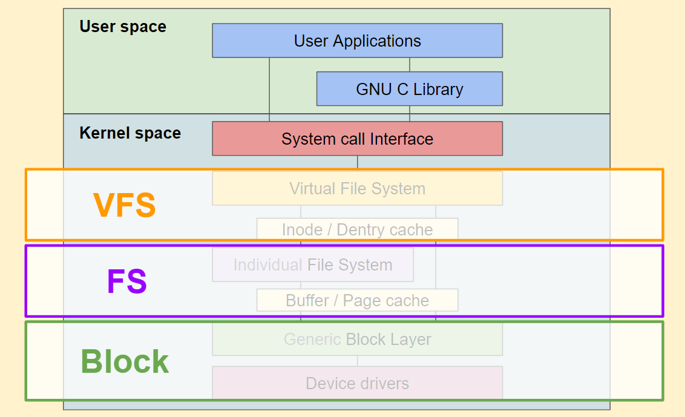

* file system format은 가장 중요한 핵심 원리는 디스크의 물리적 불럭을 어떻게 읽고 쓸지에 대한 규칙을 정의한 것이다.
* 파일을 큰것이 유리한것 , 파일이 많을때 유리한것 등등 장단점이 있다.
* 이런 물리적 디스크 특성에 따라 관리하는 것이 파일 시스템이다.
* 블럭 layer를 통해서 처리...
* 결국은 메모리의 변경이 물리적 블럭들이 변경 Read/Write를 한다는 것에서 중요하다.
* 아무튼 물리적 세계로 접근하는 방법은 VFS이기 때문에 파일 시스템을 통해서 접근하는 것 처럼 보인다. 리눅스의 철학...


## Buffered IO

#### Write

* pagecache 준비
* pagecache 쓰기
* pagecache dirty

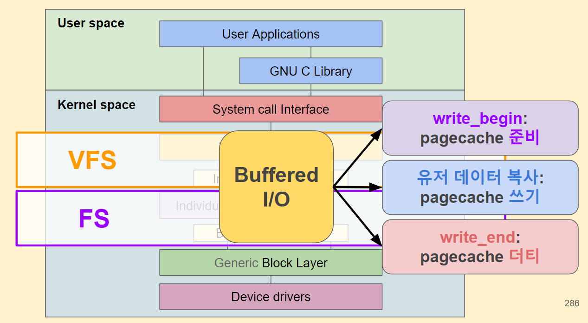


* Page Cache가 뭔가요? : 디스크에 있는 것이 메모리에 올라와 있는 것 (meta, data) <<=== 
* anonymouse page는 프로그램 에서 사용하는 데이터가 올라와 있는 페이지... (malloc....)

* page(물리) 메모리 조각: 4K, 4096, 0x1000, 12bit  2^12   2<<12
* page에 들어가 있는 내용이 stack, heap 이라면 anonymous memory라고 부른다.
* page에 들어가 있는 내용이 디스크에 들어 있는 내용이면 이것은 pageCache라고 부른다.
* 이 pagecache를 2가지로 부른다. (일반적 용어가 아니라, 여기 계층에서  사용하는 용어)
  * buffer : 파일의 정보
  * cached:  파일의 내용

```
reallinux@ubuntu:~/git/linux/mm$ cat /proc/meminfo | head -5
MemTotal:        2035676 kB
MemFree:         1723368 kB
MemAvailable:    1896472 kB
Buffers:           21184 kB
Cached:           156284 kB
```


writeback 프로세스가 5초 단위로 진행된다.  5초 이내 디스크를 뽑아 버리면 실패한다. sync 명령 하면 내려간다.


```
reallinux@ubuntu:~/git/linux/mm$ sync
```


### [실습] write 추적

#### 1. 준비

reallinux@ubuntu:~/fs_test$ vi  write.c

reallinux@ubuntu:~/fs_test$
reallinux@ubuntu:~/fs_test$
reallinux@ubuntu:~/fs_test$ gcc -o write -g -pg write.c

```c
#include <unistd.h>
#include <stdio.h>
#include <stdlib.h>

void main()
{
    FILE *fp = fopen("hello.txt", "w");

    if (fp) {
        fprintf(fp, "hello linux filesystem\n");
        fclose(fp);
        sync();
    }
}


```


#### 2. uftrace tui 

```
reallinux@ubuntu:~/fs_test$ sudo uftrace record -K 30 ./write
[sudo] password for reallinux:
Sorry, try again.
[sudo] password for reallinux:
reallinux@ubuntu:~/fs_test$ ls  -l
total 24
-rw-r--r-- 1 root      root         23 Dec  8 05:22 hello.txt
drwxr-xr-x 2 reallinux reallinux  4096 Dec  8 05:22 uftrace.data
-rwxrwxr-x 1 reallinux reallinux 11544 Dec  8 05:20 write
-rw-rw-r-- 1 reallinux reallinux   224 Dec  8 05:20 write.c
```


```sh
reallinux@ubuntu:~/fs_test/uftrace.data$ uftrace replay -t 8us
reallinux@ubuntu:~/fs_test/uftrace.data$ uftrace tui    -t 8us
reallinux@ubuntu:~/fs_test/uftrace.data$ uftrace replay -N smp_apic_timer_interrupt@kernel
reallinux@ubuntu:~/fs_test/uftrace.data$ uftrace tui -N smp_apic_timer_interrupt@kernel

```


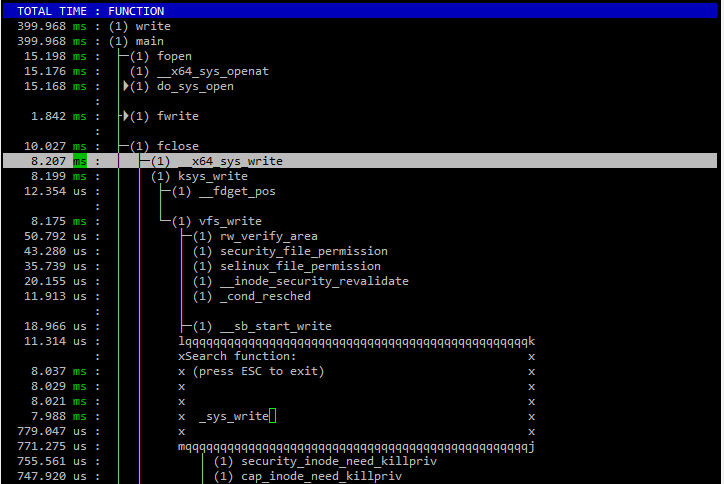


우리가 나누는 layer라고 하는 것은 그냥 함수의 종류이다. 


#### 3.  vfs -> ext4 호출 추적

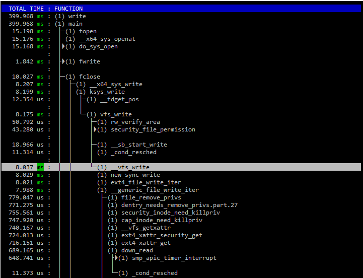

* 중간에 inline된 것은 함수 추적 목록에서 빠지는 경우가 있다. 


#### 4. 소스 보기

linux/fs/read_write.c

```
 620 SYSCALL_DEFINE3(write, unsigned int, fd, const char __user *, buf,     <<==  __x64_sys_write함수와 동일
 621         size_t, count)
 622 {
 623     return ksys_write(fd, buf, count);
 624 }
 625


 490 static ssize_t __vfs_write(struct file *file, const char __user *p,
 491                size_t count, loff_t *pos)
 492 {
 493     if (file->f_op->write)   <<=== f_op 이렇게 함수 포인터로 찾아 들어가면 소스 참조할때 역참조해서 찾아야 한다. 
 494         return file->f_op->write(file, p, count, pos);
 495     else if (file->f_op->write_iter)
 496         return new_sync_write(file, p, count, pos);   <<======== 추적할 때 trace 결과가 이쪽으로 왔다....
 497     else
 498         return -EINVAL;
 499 }

```

* 추적을 먼저해서 tracestack를 확인한 다음 소스코드를 추적하는 것이 유리하다. 
* 그렇게 하지 않으면 실제 흐름이 어디로 분기 되었는지 알수가 없다. 수많은 inline 함수와 MACRO로 빌드되고 컴파일 할때 최적화가 진행되어 있기 때문에...
* 

#### 5. ext4 파일 시스템에서 역추적

* 여기서는 함수 포인터를 써서 들어 왔기 때문에 ext4에서 역추적 해들어 와야 한다.
* 

```
reallinux@ubuntu:~/git/linux/fs/ext4$ ag ext4_file_write_iter
inode.c
950:     * Blocks should have been preallocated! ext4_file_write_iter() checks

file.c
218:ext4_file_write_iter(struct kiocb *iocb, struct iov_iter *from)    <<=== ext4에 정의된 함수 
513:    .write_iter     = ext4_file_write_iter,     <<<==== 여기 함수 포인터가 정의 되어 있다. 
reallinux@ubuntu:~/git/linux/fs/ext4$

```


* IO 쓰기 동작 (머릿속에 박아 둬야....)
  1. page cache 준비
  2. page cache write
  3. page cache dirty
* 디스크가 뽑히지 않는한 dirty 내용은 써진다. 하지만 network 기반이면 다르다.

- 메모리 내용 털어내기

  ```
  echo  3 > /proc/sys/vm/drop_caches
  ```

##### drop cache

```
drop_caches

Writing to this will cause the kernel to drop clean caches, as well as
reclaimable slab objects like dentries and inodes.  Once dropped, their
memory becomes free.

To free pagecache:
    echo 1 > /proc/sys/vm/drop_caches
To free reclaimable slab objects (includes dentries and inodes):
    echo 2 > /proc/sys/vm/drop_caches
To free slab objects and pagecache:
    echo 3 > /proc/sys/vm/drop_caches

```


* 이것을 4일에 다 완전히 숙지하는 것은 진짜 불가능합니다.
* 그냥 이런것이 있다 정도 이해하시고 나중에 차분이 공부해라.


## buffered IO Write


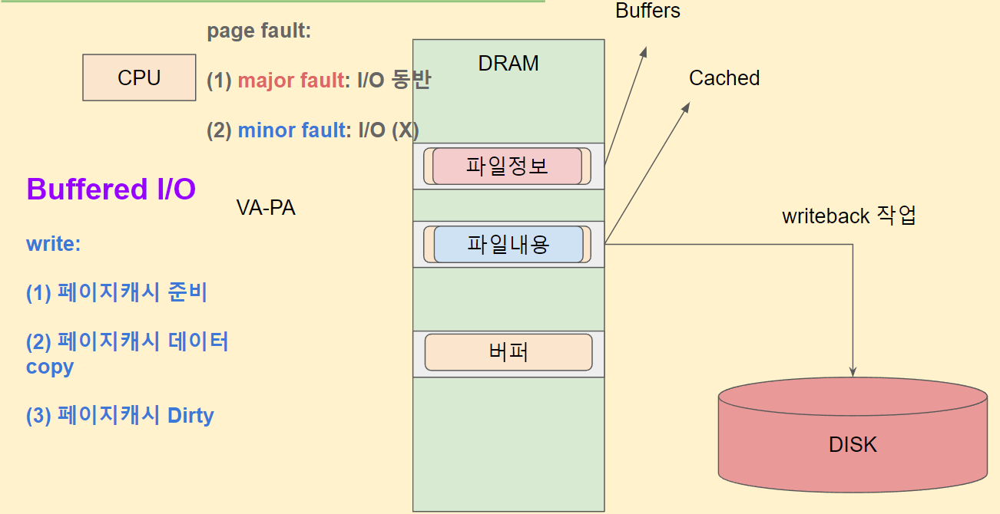


1. MMU->CR3 현재 프로세스의 page table
2. VA->PA 변환
3. PA 가 없으면 page fault ==> major fault


* 최초 프로세스 실행에 대해서 
  1. fork() 시스템 콜
  2. task_struct 생성 (mm_struct 공유)
  3. exec() 시스템 콜
  4. mm_struct 생성
  5. vma 여러개 생성 (heap, stack, text, .....)  쭈욱 생성
  6. 프로세스 실행 cpu rip 레지스터 변경 rip =0x55 
  7. cpu 는 fetch 위해서  rip 주소를 가져온다. 
  8. MMU가 CR3 기준으로 물리 주소 변경 시도  (page table)
  9. 당연히 page fault 발생 , a.out이 이제서야 읽어 온다. 

#### Process fork()와  page fault, read

(1) mmap => 가상주소공간 할당 => 파일(hello.txt) 매핑

   => 그 가상주소를 메모리 접근 한다 a[2] = 'c'; (write)

   1. MMU -> cr3 -> 현재 페이지 테이블
   2. VA -> PA 변환 시도
   3. PA 가 안적혀있음 => page fault => major

(2) 프로세스 최초 실행 시나리오
  1. fork() 시스템콜 부모프로세스 => 자식프로세스
  2. task_struct 생성 (mm_struct 공유)
  3. exec() 시스템콜
  4. mm_struct 생성
  5. vma 여러개 생성 (heap, stack, text, .... )
      - vma(text 용도) => 파일(a.out) 매핑

  6. 프로세스 실행(스케줄러의 선택) CPU rip 레지스터 값 변경
       rip = (예시: 0x55d5f73e5000)
  7. CPU 명령어 fetch를 위해서 rip 의 주소를 가져온다
  8. MMU 가 해당 가상주소 -> 물리주소 변환시도
       => page fault => major fault => a.out 파일 I/O


#### struct file, struct inode

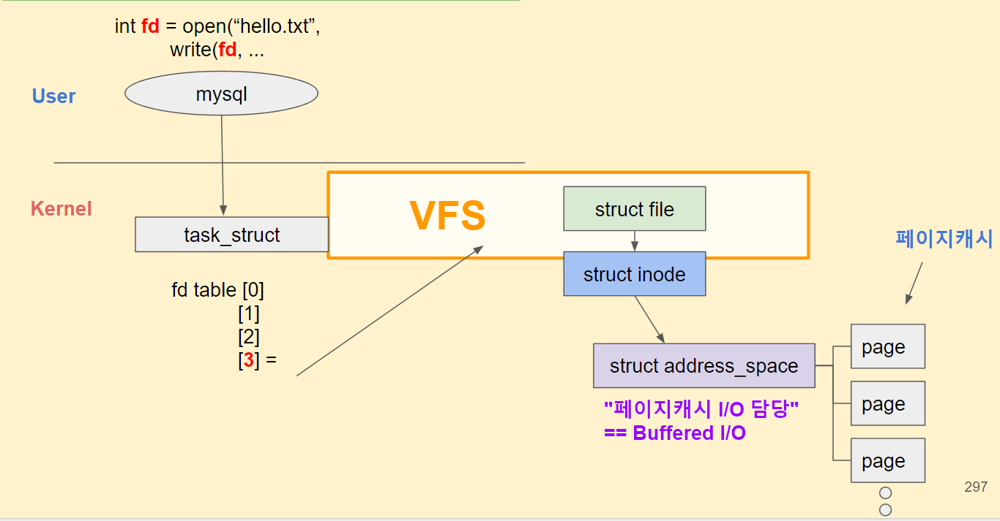


* strcut file은 빈 껍데기... 이것 구조체 꼭 외워야 한다. 
* task_struct
  * -> mm_struct
    * vma->vma->vma...
* struct file ->strcut inode -> struct address_space

* 프로세스와 연결된 특정 파일. 그 파일의 struct file, struct inode, struct address_space 이렇게 해서 page cache까지 찾아 간다든 것을 꼭 암기해야 한다.

##### generic_perform_write

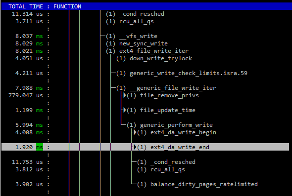

* ext4_da_write_begin : 
* ext4_da_write_end : dirty 표시


linux/mm/filemap.c

```
3286 ssize_t generic_perform_write(struct file *file,
3287                 struct iov_iter *i, loff_t pos)
3288 {
3289     struct address_space *mapping = file->f_mapping;    <<=== address_space
3290     const struct address_space_operations *a_ops = mapping->a_ops;
3291     long status = 0;
3292     ssize_t written = 0;
3293     unsigned int flags = 0;
3294
3295     do {
3296         struct page *page;
3297         unsigned long offset;   /* Offset into pagecache page */
3298         unsigned long bytes;    /* Bytes to write to page */
3299         size_t copied;      /* Bytes copied from user */
3300         void *fsdata;
3301
3302         offset = (pos & (PAGE_SIZE - 1));
3303         bytes = min_t(unsigned long, PAGE_SIZE - offset,
3304                         iov_iter_count(i));
3305
3317         if (unlikely(iov_iter_fault_in_readable(i, bytes))) {
3318             status = -EFAULT;
3319             break;
3320         }
3321
3322         if (fatal_signal_pending(current)) {
3323             status = -EINTR;
3324             break;
3325         }
3326
3327         status = a_ops->write_begin(file, mapping, pos, bytes, flags,  <<=== 
3328                         &page, &fsdata);
3329         if (unlikely(status < 0))
3330             break;
3331
3332         if (mapping_writably_mapped(mapping))
3333             flush_dcache_page(page);
3334
3335         copied = iov_iter_copy_from_user_atomic(page, i, offset, bytes);  <<=== 실제 Write 이뤄지는 곳
3336         flush_dcache_page(page);
3337
3338         status = a_ops->write_end(file, mapping, pos, bytes, copied,   <<=== 
3339                         page, fsdata);
3340         if (unlikely(status < 0))
3341             break;
3342         copied = status;
3343
3344         cond_resched();
3345
3346         iov_iter_advance(i, copied);
3347         if (unlikely(copied == 0)) {

```


* page cache안에서 buffes가 아니라 buffer라고 하는 것을 따로 운영한다. 
* 파일 속정 정보를 가지고 있는 buffers와는 다른 개념이고 page cache안에서 버퍼를 할당해서 사용한다는 것을 분리해서 이해해야 한다. 


##### ext4_da_write_end : dirty  설정 2곳

* mark_buffer_dirty : 실제 data 변경사항 dirty 
* mark_inode_dirty : inode의 변경 사항 dirty

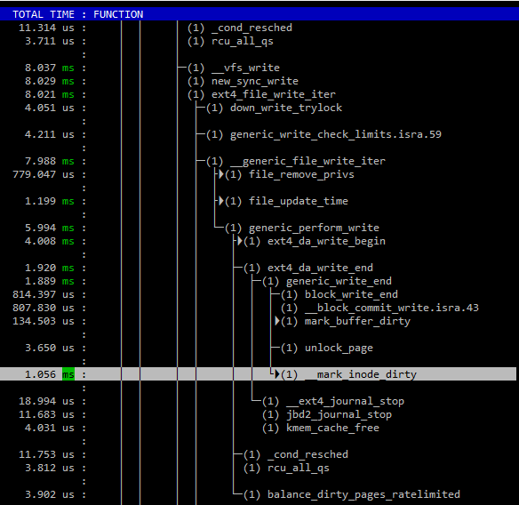


## Read


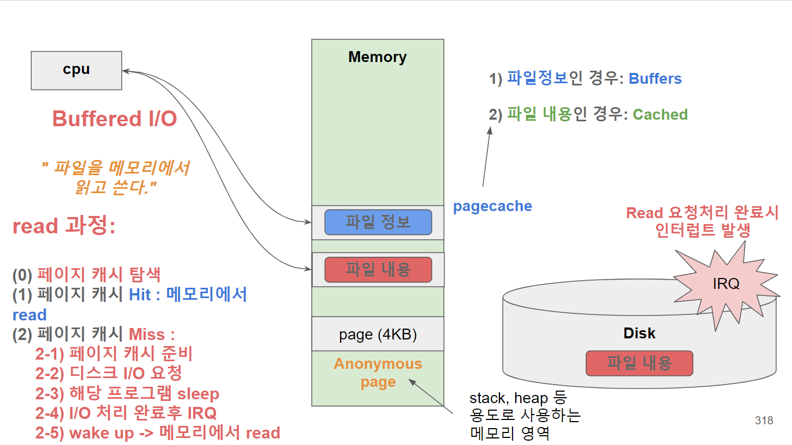


### read 과정:

 (1) 페이지 캐시 탐색 pagecache_get_page()
    hit => touch_atime()

 (2) 페이지 캐시 탐색 실패 (miss)
   - 페이지 캐시 준비
   - read_pages() => read (I/O 요청)
          => block => SCSI driver => SSD
          => sleep (CPU 를 놓는다)
       SSD => I/O  완료 => IRQ => wake up  


### [실습] read 추적

```
#include <stdio.h>
#include <stdlib.h>
#define SIZE 24
void main()
{
    FILE *fp = fopen("hello.txt","r");
    char buf[BUFSIZ];

    if (fp) {
        fread(buf, SIZE, 1, fp);
        printf("%s", buf);
        fclose(fp);
    }
}
```


```
<1차 page hit>
reallinux@ubuntu:~/fs_test$ cat hello.txt
hello linux filesystem
reallinux@ubuntu:~/fs_test$ sudo uftrace record -K 30 -d read.uftrace.data ./read
hello linux filesystem

<2차 page fatult>
reallinux@ubuntu:~/fs_test$ sudo su
root@ubuntu:/home/reallinux/fs_test# echo  3 > /proc/sys/vm/drop_caches
root@ubuntu:/home/reallinux/fs_test# exit
exit
reallinux@ubuntu:~/fs_test$ sudo uftrace record -K 30 -d read.uftrace.data2  ./read
```


##### page cache hit 시나리오 

```
root@ubuntu:/home/reallinux/fs_test/read.uftrace.data# uftrace replay | grep ext4_readpages 
```


##### page cache fault 시나리오

```
reallinux@ubuntu:~/fs_test/read.uftrace.data2$ uftrace replay | grep ext4_readpages
            [ 12324] |                           ext4_readpages() {   <<==== 여기....
   2.883 ms [ 12324] |                           } /* ext4_readpages */
reallinux@ubuntu:~/fs_test/read.uftrace.data2$
```

##### uftrace tui

```
reallinux@ubuntu:~/fs_test/uftrace.data$ uftrace replay -t 8us
reallinux@ubuntu:~/fs_test/uftrace.data$ uftrace tui    -t 8us
reallinux@ubuntu:~/fs_test/uftrace.data$ uftrace replay -N smp_apic_timer_interrupt@kernel
reallinux@ubuntu:~/fs_test/uftrace.data$ uftrace tui -N smp_apic_timer_interrupt@kernel
```

```
  TOTAL TIME : FUNCTION
   37.909 ms : (1) read
    2.520 us :  ├─(1) __monstartup
             :  │
    1.950 us :  ├─(1) __cxa_atexit
             :  │
   37.904 ms :  └─(1) main
    6.128 ms :     ├▶(1) fopen
             :     │
    7.925 ms :     ├─(1) fread
  785.920 us :     │  ├▶(1) __x64_sys_newfstat
             :     │  │
   16.054 us :     │  ├─(4) fpregs_assert_state_consistent
             :     │  │
    1.074 ms :     │  ├▶(1) do_page_fault
             :     │  │
    5.999 ms :     │  ├─(2) __x64_sys_read
    5.983 ms :     │  │ (2) ksys_read  <<== 출발점.
   55.704 us :     │  │  ├─(2) __fdget_pos
    7.882 us :     │  │  │ (2) __fget_light
             :     │  │  │
    5.903 ms :     │  │  └─(2) vfs_read   <<=== 
  826.613 us :     │  │     ├─(2) rw_verify_area
  121.164 us :     │  │     │▶(2) security_file_permission
             :     │  │     │
    5.033 ms :     │  │     ├─(2) __vfs_read
    5.016 ms :     │  │     │ (2) new_sync_read
    4.999 ms :     │  │     │ (2) ext4_file_read_iter
    4.983 ms :     │  │     │ (2) generic_file_read_iter   <<=== 여기까지 추적
   46.832 us :     │  │     │  ├─(4) _cond_resched
   15.544 us :     │  │     │  │ (4) rcu_all_qs
             :     │  │     │  │
```


### 코드 추적

#### generic_file_read_iter

```
 446 ssize_t vfs_read(struct file *file, char __user *buf, size_t count, loff_t *pos)
 447 {
 448     ssize_t ret;
 449
 450     if (!(file->f_mode & FMODE_READ))
 451         return -EBADF;
 452     if (!(file->f_mode & FMODE_CAN_READ))
 453         return -EINVAL;
 454     if (unlikely(!access_ok(buf, count)))
 455         return -EFAULT;
 456
 457     ret = rw_verify_area(READ, file, pos, count);
 458     if (!ret) {
 459         if (count > MAX_RW_COUNT)
 460             count =  MAX_RW_COUNT;
 461         ret = __vfs_read(file, buf, count, pos);
 462         if (ret > 0) {
 463             fsnotify_access(file);
 464             add_rchar(current, ret);
 465         }
 466         inc_syscr(current);
 467     }
 468
 469     return ret;
 470 }


 421 ssize_t __vfs_read(struct file *file, char __user *buf, size_t count,
 422            loff_t *pos)
 423 {
 424     if (file->f_op->read)
 425         return file->f_op->read(file, buf, count, pos);
 426     else if (file->f_op->read_iter)
 427         return new_sync_read(file, buf, count, pos);
 428     else
 429         return -EINVAL;
 430 }
 431
```

##### 역추적 : ext4_file_read_iter

```
reallinux@ubuntu:~/git/linux/fs$ ag ext4_file_read_iter
ext4/file.c
65:static ssize_t ext4_file_read_iter(struct kiocb *iocb, struct iov_iter *to)
512:    .read_iter      = ext4_file_read_iter,

```


```
 65 static ssize_t ext4_file_read_iter(struct kiocb *iocb, struct iov_iter *to)
 66 {
 67     if (unlikely(ext4_forced_shutdown(EXT4_SB(file_inode(iocb->ki_filp)->i_sb))))
 68         return -EIO;
 69
 70     if (!iov_iter_count(to))
 71         return 0; /* skip atime */
 72
 73 #ifdef CONFIG_FS_DAX
 74     if (IS_DAX(file_inode(iocb->ki_filp)))
 75         return ext4_dax_read_iter(iocb, to);
 76 #endif
 77     return generic_file_read_iter(iocb, to);
 78 }

```


```
2029 static ssize_t generic_file_buffered_read(struct kiocb *iocb,
2030         struct iov_iter *iter, ssize_t written)
2031 {
2032     struct file *filp = iocb->ki_filp;
2033     struct address_space *mapping = filp->f_mapping;
2034     struct inode *inode = mapping->host;
2035     struct file_ra_state *ra = &filp->f_ra;
2036     loff_t *ppos = &iocb->ki_pos;
2037     pgoff_t index;
2038     pgoff_t last_index;
2039     pgoff_t prev_index;
2040     unsigned long offset;      /* offset into pagecache page */
2041     unsigned int prev_offset;
2042     int error = 0;
2043
2044     if (unlikely(*ppos >= inode->i_sb->s_maxbytes))
2045         return 0;
2046     iov_iter_truncate(iter, inode->i_sb->s_maxbytes);
2047
2048     index = *ppos >> PAGE_SHIFT;
2049     prev_index = ra->prev_pos >> PAGE_SHIFT;
2050     prev_offset = ra->prev_pos & (PAGE_SIZE-1);
2051     last_index = (*ppos + iter->count + PAGE_SIZE-1) >> PAGE_SHIFT;
2052     offset = *ppos & ~PAGE_MASK;
2053
2054     for (;;) {
2055         struct page *page;
2056         pgoff_t end_index;
2057         loff_t isize;
2058         unsigned long nr, ret;
2059
2060         cond_resched();
2061 find_page:
2062         if (fatal_signal_pending(current)) {
2063             error = -EINTR;
2064             goto out;
2065         }
2066
2067         page = find_get_page(mapping, index);

```

#####  address_space

```
 442 struct address_space {
 443     struct inode        *host;
 444     struct xarray       i_pages;
 445     gfp_t           gfp_mask;
 446     atomic_t        i_mmap_writable;
 447     struct rb_root_cached   i_mmap;
 448     struct rw_semaphore i_mmap_rwsem;
 449     unsigned long       nrpages;
 450     unsigned long       nrexceptional;
 451     pgoff_t         writeback_index;
 452     const struct address_space_operations *a_ops;
 453     unsigned long       flags;
 454     errseq_t        wb_err;
 455     spinlock_t      private_lock;
 456     struct list_head    private_list;
 457     void            *private_data;
 458 } __attribute__((aligned(sizeof(long)))) __randomize_layout;
```

#### 비교

##### <1> page fault 시나리오

```
    5.999 ms :     │  ├─(2) __x64_sys_read
    5.983 ms :     │  │ (2) ksys_read
   55.704 us :     │  │  ├─(2) __fdget_pos
    7.882 us :     │  │  │ (2) __fget_light
             :     │  │  │
    5.903 ms :     │  │  └─(2) vfs_read
  826.613 us :     │  │     ├▶(2) rw_verify_area
             :     │  │     │
    5.033 ms :     │  │     ├─(2) __vfs_read
    5.016 ms :     │  │     │ (2) new_sync_read
    4.999 ms :     │  │     │ (2) ext4_file_read_iter
    4.983 ms :     │  │     │ (2) generic_file_read_iter
   46.832 us :     │  │     │  ├─(4) _cond_resched
   15.544 us :     │  │     │  │ (4) rcu_all_qs
             :     │  │     │  │
   49.414 us :     │  │     │  ├─(4) pagecache_get_page
   17.014 us :     │  │     │  │ (4) find_get_entry
             :     │  │     │  │
    4.052 ms :     │  │     │  ├─(1) page_cache_sync_readahead
    4.044 ms :     │  │     │  │ (1) ondemand_readahead
    4.036 ms :     │  │     │  │ (1) __do_page_cache_readahead
  102.694 us :     │  │     │  │  ├─(1) __page_cache_alloc
   94.652 us :     │  │     │  │  │ (1) alloc_pages_current
    3.801 us :     │  │     │  │  │  ├─(1) get_task_policy.part.44
             :     │  │     │  │  │  │
    4.101 us :     │  │     │  │  │  ├─(1) policy_nodemask
             :     │  │     │  │  │  │
    4.071 us :     │  │     │  │  │  ├─(1) policy_node
             :     │  │     │  │  │  │
   62.425 us :     │  │     │  │  │  └─(1) __alloc_pages_nodemask
   14.493 us :     │  │     │  │  │     ├─(1) _cond_resched
    3.941 us :     │  │     │  │  │     │ (1) rcu_all_qs
             :     │  │     │  │  │     │
    3.751 us :     │  │     │  │  │     ├─(1) should_fail_alloc_page
             :     │  │     │  │  │     │
   28.257 us :     │  │     │  │  │     └─(1) get_page_from_freelist
    7.782 us :     │  │     │  │  │        ├─(2) __inc_numa_state
             :     │  │     │  │  │        │
    3.871 us :     │  │     │  │  │        └─(1) prep_new_page
             :     │  │     │  │  │
    3.921 ms :     │  │     │  │  └▶(1) read_pages
             :     │  │     │  │
    4.442 us :     │  │     │  ├─(1) _raw_spin_lock_irq
             :     │  │     │  │
  680.340 us :     │  │     │  ├▶(1) io_schedule    <<== cpu 스케쥴러 부르고 sleep 상태로 전환 
             :     │  │     │  │
    4.051 us :     │  │     │  ├─(1) finish_wait
             :     │  │     │  │
    4.121 us :     │  │     │  ├─(1) mark_page_accessed
             :     │  │     │  │
   72.439 us :     │  │     │  └─(2) touch_atime
   56.674 us :     │  │     │    (2) atime_needs_update
   40.339 us :     │  │     │    (2) current_time
    8.211 us :     │  │     │     ├─(2) ktime_get_coarse_real_ts64
             :     │  │     │     │
    7.763 us :     │  │     │     └─(2) timespec64_trunc
             :     │  │     │
    4.111 us :     │  │     ├─(1) __fsnotify_parent
             :     │  │     │
    4.311 us :     │  │     └─(1) fsnotify
             :     │  │
    4.271 us :     │  └─(1) switch_fpu_return

```


##### <2> page cache hit 시나리오

```
    1.160 ms :     │  └─(2) __x64_sys_read
    1.145 ms :     │    (2) ksys_read
   22.995 us :     │     ├─(2) __fdget_pos
    7.561 us :     │     │ (2) __fget_light
             :     │     │
    1.099 ms :     │     └─(2) vfs_read
  130.443 us :     │        ├▶(2) rw_verify_area
             :     │        │
  896.288 us :     │        ├─(2) __vfs_read
  880.844 us :     │        │ (2) new_sync_read
  227.673 us :     │        │ (2) ext4_file_read_iter
  199.390 us :     │        │ (2) generic_file_read_iter
   45.760 us :     │        │  ├─(4) _cond_resched
   15.264 us :     │        │  │ (4) rcu_all_qs
             :     │        │  │
   34.758 us :     │        │  ├─(3) pagecache_get_page
   11.893 us :     │        │  │ (3) find_get_entry
             :     │        │  │
    3.741 us :     │        │  ├─(1) mark_page_accessed
             :     │        │  │
   68.907 us :     │        │  └─(2) touch_atime    <<===바로 읽어와서 성공한 시나리오 
   53.673 us :     │        │    (2) atime_needs_update
   38.039 us :     │        │    (2) current_time
    7.552 us :     │        │     ├─(2) ktime_get_coarse_real_ts64
             :     │        │     │
    7.522 us :     │        │     └─(2) timespec64_trunc
             :     │        │
    3.951 us :     │        ├─(1) __fsnotify_parent
             :     │        │
   34.318 us :     │        └─(1) fsnotify

```


### read 과정

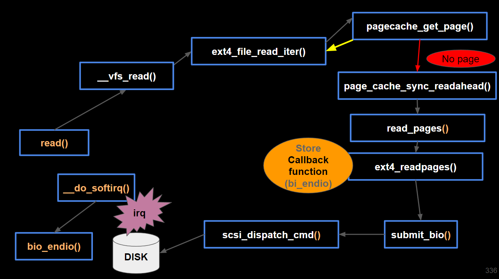


## VFS 분기 발생 

* ext4, shmem,proc,socket 등등

### filesystem

```
reallinux@ubuntu:~/git/linux/fs$ df -Th
Filesystem     Type      Size  Used Avail Use% Mounted on
udev           devtmpfs  986M     0  986M   0% /dev
tmpfs          tmpfs     199M  748K  199M   1% /run   <<== ram disk, 여기서 IO 발생은? 
/dev/sda2      ext4       18G   13G  4.4G  74% /
tmpfs          tmpfs     994M     0  994M   0% /dev/shm
tmpfs          tmpfs     5.0M     0  5.0M   0% /run/lock
tmpfs          tmpfs     994M     0  994M   0% /sys/fs/cgroup
tmpfs          tmpfs     199M     0  199M   0% /run/user/1000
```


#### /proc 파일 읽기 추적

```
sudo uftrace --force -K 30 cat /proc/version
```

````
            [ 21594] |         __vfs_read() {
            [ 21594] |           proc_reg_read() {
            [ 21594] |             seq_read() {
            [ 21594] |               mutex_lock() {
            [ 21594] |                 _cond_resched() {
   3.751 us [ 21594] |                   rcu_all_qs();
  11.373 us [ 21594] |                 } /* _cond_resched */
  19.245 us [ 21594] |               } /* mutex_lock */
            [ 21594] |               kvmalloc_node() {
            [ 21594] |                 __kmalloc_node() {
   3.781 us [ 21594] |                   kmalloc_slab();
            [ 21594] |                   _cond_resched() {
   3.851 us [ 21594] |                     rcu_all_qs();
  11.373 us [ 21594] |                   } /* _cond_resched */
   3.741 us [ 21594] |                   should_failslab();
   4.101 us [ 21594] |                   memcg_kmem_get_cache();
   3.921 us [ 21594] |                   memcg_kmem_put_cache();
  53.514 us [ 21594] |                 } /* __kmalloc_node */
  61.676 us [ 21594] |               } /* kvmalloc_node */
   3.811 us [ 21594] |               single_start();
            [ 21594] |               version_proc_show() {    <<=== proc 파일 시스템 호출한다는 것
````


## open


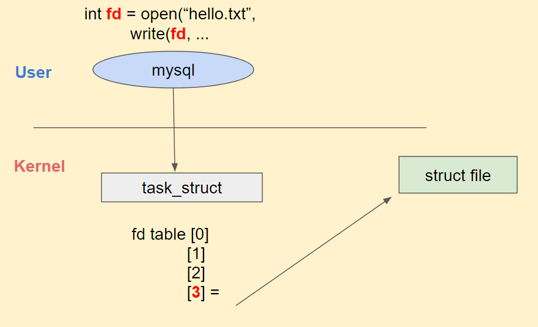

### open

#### struct file 만드는 과정

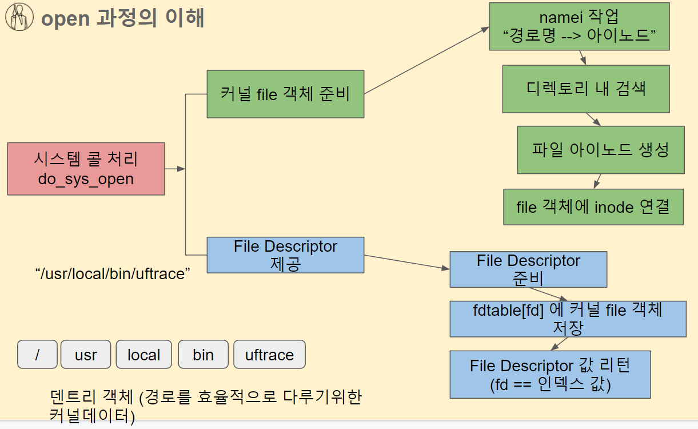


#### namei 작업

* inode 화일 한개의 메타 정보
* 경로 정보의 inode을 구하는 작업이 필요하다.  그것이 namei작업이라고 한다. 
* 파일의 경로로 받은 문자열에 대해서 그것의 실제 inode 값을 찾는 작업이 필요다. 없다면 문자열을 가지고 파싱하는 그런 반복적 작업을 한다면 비효율적.
* 파일의  문자열 경로를 받으면 dentry 객체로 변환한다. 


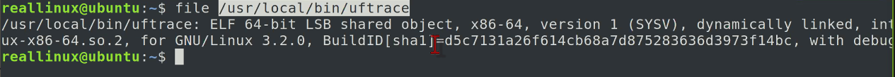


#### detry 객체

- 파일 경로의 이름을 detry 객체로 만든다. 트리구조로 되어 있어서 훨씬 빠르다.
- 재미있는 것은 잘못된 경로도 유지하고 있다. 왜냐하면 .... 잘못되었다는 것을 알려주는데도 시간이 많이 걸리기 때문이다. 

- 이것을 cache 객체로 가지고 있다. 한번하면 계속 유지한다
- dentry inode 이것을 해제하는 방법은 이렇게 .... 

```
# man proc 
		/proc/sys/vm/drop_caches (since Linux 2.6.16)
              Writing to this file causes the kernel to  drop  clean  caches,  dentries,  and
              inodes from memory, causing that memory to become free.  This can be useful for
              memory management testing and performing  reproducible  filesystem  benchmarks.
              Because  writing to this file causes the benefits of caching to be lost, it can
              degrade overall system performance.

              To free pagecache, use:

                  echo 1 > /proc/sys/vm/drop_caches

              To free dentries and inodes, use:

                  echo 2 > /proc/sys/vm/drop_caches

              To free pagecache, dentries and inodes, use:

                  echo 3 > /proc/sys/vm/drop_caches

```


#### derty 객체 생성되고 나면

-  inode 를 이용해서 디렉토리 검색하고
- 없으면 신규 생성하고 struct file 객체에 넣어 준다.  


### 코드 추적

#### 소스

```c
<open.c>

#include <stdio.h>
#include <stdlib.h>
#define SIZE 24
void main()
{
    FILE *fp = fopen("hello.txt","r");
    char buf[BUFSIZ];

    if (fp) {
        fread(buf, SIZE, 1, fp);
        printf("%s", buf);
        fclose(fp);
    }
}
```


#### uftrace 

```
reallinux@ubuntu:~/fs_test$ sudo uftrace  record -K 30 ./write
reallinux@ubuntu:~/fs_test$ sudo uftrace  record -K 30 -d open.uftrace.data ./open
hello linux filesystem

```

* create graph

`reallinux@ubuntu:~/fs_test/open.uftrace.data$ uftrace graph`

* tui

`reallinux@ubuntu:~/fs_test/open.uftrace.data$ uftrace tui -N smp_apic_timer_interrupt@kernel `

```
<uftrace tui>

399.968 ms :  └─(1) main
   15.198 ms :     ├─(1) fopen
   15.176 ms :     │  ├─(1) __x64_sys_openat
   15.168 ms :     │  │ (1) do_sys_open   <<=== 여기
   49.532 us :     │  │  ├─(1) getname
   42.020 us :     │  │  │ (1) getname_flags
   34.248 us :     │  │  │ (1) kmem_cache_alloc
   11.423 us :     │  │  │  ├─(1) _cond_resched
    3.671 us :     │  │  │  │ (1) rcu_all_qs
             :     │  │  │  │
    3.620 us :     │  │  │  ├─(1) should_failslab
             :     │  │  │  │
    3.671 us :     │  │  │  └─(1) memcg_kmem_put_cache
             :     │  │  │
   27.096 us :     │  │  ├─(1) get_unused_fd_flags
   19.354 us :     │  │  │ (1) __alloc_fd
    3.751 us :     │  │  │  ├─(1) _raw_spin_lock
             :     │  │  │  │
    3.841 us :     │  │  │  └─(1) expand_files
             :     │  │  │
   15.028 ms :     │  │  ├─(1) do_filp_open
   15.011 ms :     │  │  │  ├─(1) path_openat

```


linux/fs/open.c

```
1074 long do_sys_open(int dfd, const char __user *filename, int flags, umode_t mode)
1075 {
1076     struct open_flags op;
1077     int fd = build_open_flags(flags, mode, &op);
1078     struct filename *tmp;
1079
1080     if (fd)
1081         return fd;
1082
1083     tmp = getname(filename);
1084     if (IS_ERR(tmp))
1085         return PTR_ERR(tmp);
1086
1087     fd = get_unused_fd_flags(flags);
1088     if (fd >= 0) {
1089         struct file *f = do_filp_open(dfd, tmp, &op);
1090         if (IS_ERR(f)) {
1091             put_unused_fd(fd);
1092             fd = PTR_ERR(f);
1093         } else {
1094             fsnotify_open(f);
1095             fd_install(fd, f);
1096         }
1097     }
1098     putname(tmp);
1099     return fd;
1100 }

```


#### pathname -> dentry로 찾기

```
<linux/fs/namei.c>
2058 /*
2059  * Name resolution.
2060  * This is the basic name resolution function, turning a pathname into
2061  * the final dentry. We expect 'base' to be positive and a directory.
2062  *
2063  * Returns 0 and nd will have valid dentry and mnt on success.
2064  * Returns error and drops reference to input namei data on failure.
2065  */
2066 static int link_path_walk(const char *name, struct nameidata *nd) <<== 이함수 통해서 경로 찾기. 
2067 {
2068     int err;
2069
2070     if (IS_ERR(name))
2071         return PTR_ERR(name);
2072     while (*name=='/')
2073         name++;
2074     if (!*name)
2075         return 0;
2076
2077     /* At this point we know we have a real path component. */
2078     for(;;) {
2079         u64 hash_len;
2080         int type;
2081
2082         err = may_lookup(nd);
2083         if (err)
2084             return err;
2085
2086         hash_len = hash_name(nd->path.dentry, name);

<linux//aptfs/namei.c>
3209 no_open:
3210     if (d_in_lookup(dentry)) {
3211         struct dentry *res = dir_inode->i_op->lookup(dir_inode, dentry,
3212                                  nd->flags);
3213         d_lookup_done(dentry);
3214         if (unlikely(res)) {
3215             if (IS_ERR(res)) {
3216                 error = PTR_ERR(res);
3217                 goto out_dput;
3218             }
3219             dput(dentry);
3220             dentry = res;
3221         }
3222     }

```

#### ext4_lookup

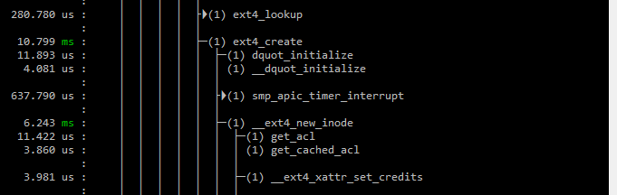

