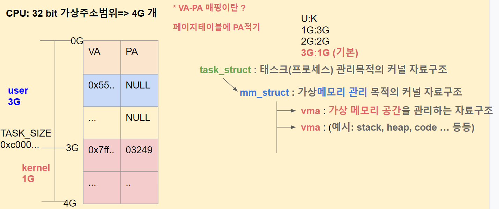
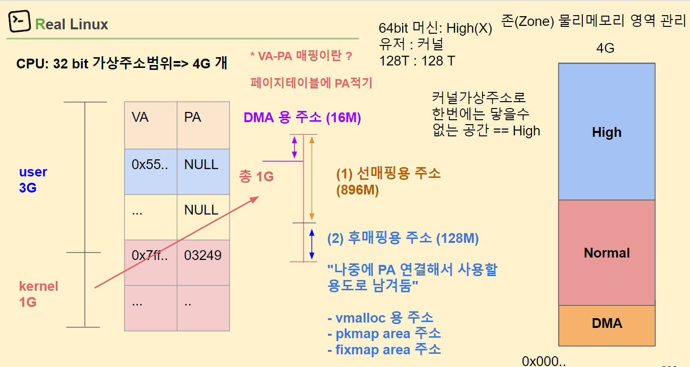
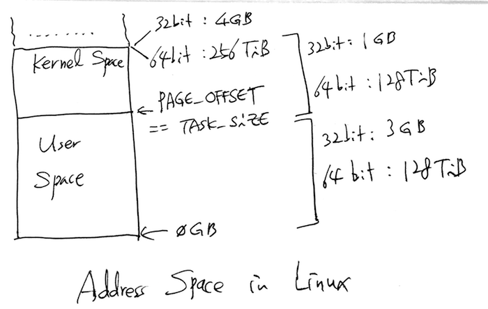
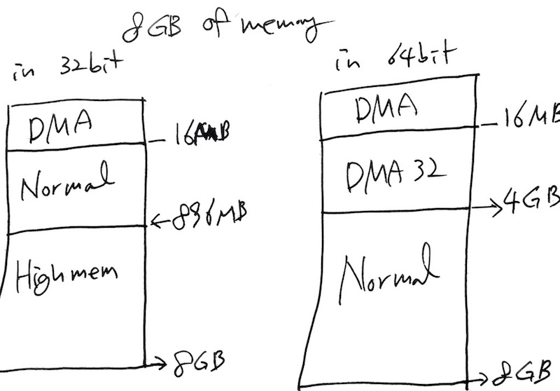
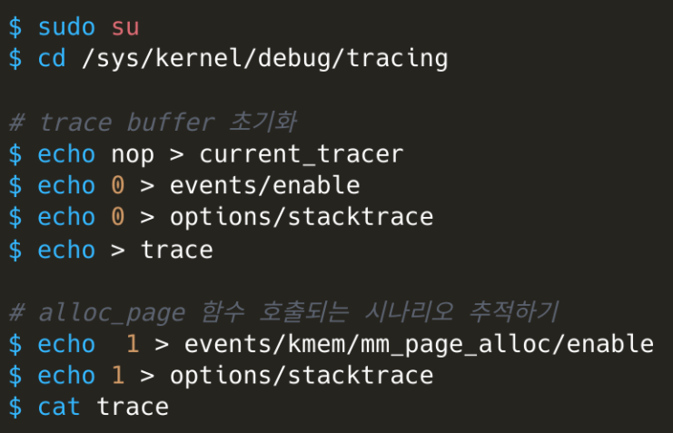
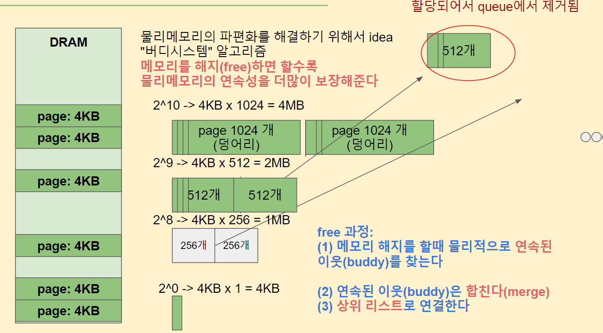
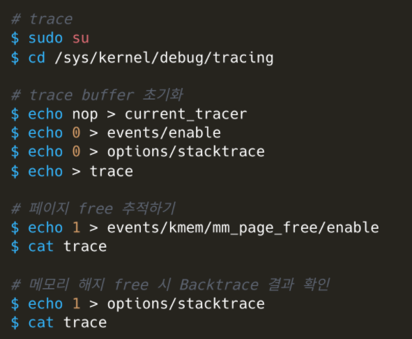
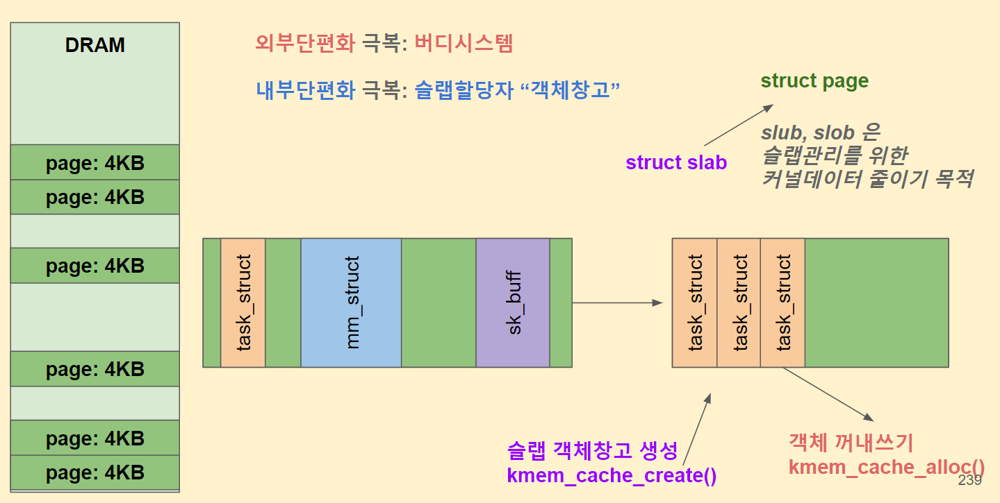
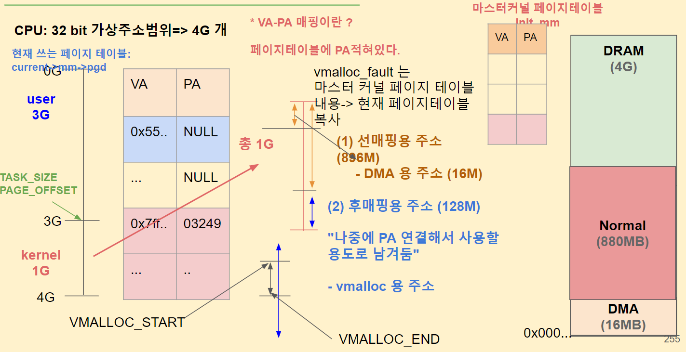
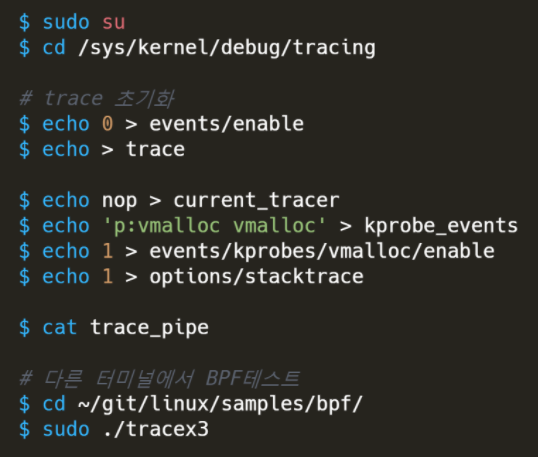

# kernel 메모리 관리


## kernel 주소 공간

### 왜 user:kernel  3:1 일까?

linux/arch/x86/mm/fault.c

```
1502     /* Was the fault on kernel-controlled part of the address space? */
1503     if (unlikely(fault_in_kernel_space(address)))
1504         do_kern_addr_fault(regs, hw_error_code, address);
1505     else
1506         do_user_addr_fault(regs, hw_error_code, address);
...
1208 static int fault_in_kernel_space(unsigned long address)
1209 {
1210     /*
1211      * On 64-bit systems, the vsyscall page is at an address above
1212      * TASK_SIZE_MAX, but is not considered part of the kernel
1213      * address space.
1214      */
1215     if (IS_ENABLED(CONFIG_X86_64) && is_vsyscall_vaddr(address))
1216         return false;
1217
1218     return address >= TASK_SIZE_MAX;
1219 }


 95 #define TASK_SIZE_OF(tsk)   (test_tsk_thread_flag(tsk, TIF_31BIT) ? \
 96                     (1UL << 31) : -PAGE_SIZE)
 97 #define TASK_UNMAPPED_BASE  (test_thread_flag(TIF_31BIT) ? \
 98                     (1UL << 30) : (1UL << 41))
 99 #define TASK_SIZE       TASK_SIZE_OF(current)
100 #define TASK_SIZE_MAX       (-PAGE_SIZE)
101
102 #define STACK_TOP       (test_thread_flag(TIF_31BIT) ? \
103                     (1UL << 31) : (1UL << 42))
104 #define STACK_TOP_MAX       (1UL << 42)
105
106 #define HAVE_ARCH_PICK_MMAP_LAYOUT

```

### kernel 주소



* kernel memory 




virtual memory max size 

```
root@ubuntu:/home/reallinux# ulimit -a
core file size          (blocks, -c) 0
data seg size           (kbytes, -d) unlimited
scheduling priority             (-e) 0
file size               (blocks, -f) unlimited
pending signals                 (-i) 7881
max locked memory       (kbytes, -l) 65536
max memory size         (kbytes, -m) unlimited
open files                      (-n) 1024
pipe size            (512 bytes, -p) 8
POSIX message queues     (bytes, -q) 819200
real-time priority              (-r) 0
stack size              (kbytes, -s) 8192
cpu time               (seconds, -t) unlimited
max user processes              (-u) 7881
virtual memory          (kbytes, -v) unlimited
file locks                      (-x) unlimited
```


#### DMA 메모리 역할

- NIC에서 바로 인터럽트 하지 않아도 디바이스가 DMA에 복사 해놓고 cpu에 인터럽트 발생한다.  디바이스가 DMA에 메모리에 올려 놓고 나서 cpu 인터럽트를 발생하도록 한다.
- DMA 메모리가 부족할때는 device는  normal memory를 사용한다. 


#### high 메모리는 뭐냐 ?

* 64 비트에서는 high가 없다.
* 커널이 최대 도달할 수  있는 메모리는 1GB인데.... 한번에 최대 도달할 수 있는 메모리는 1GB인데 그것을 초과하는 메모리를 3GB 넘어 서는  영역의 메모리이다.  
* 커널이 한번에 도달 할 수 있는 영역을 넘는 물리 메모리 영역을 high zone 이라고 생가하면 된다. 
* 아무튼 DMA를 제외한 나머지는 16MB 제외하고는 normal  zone으로 보면 된다.
* 커널도 가상 주소를 사용하기 때문에 커널이 사용하는 가상 주소의 주소 최대값을 넘는 것이 high  zone이라고 보면 된다.
* Documentation/x86/x86_64/mm.rst 








## 커널 메모리 관리

### 커널에서 메모리 할당하는 방법

- alloc_pages 함수 (페이지 자체할당)
- kmem_cache_alloc 함수 (자주쓰는 자료구조 할당)
- kmalloc 함수  (사이즈 만큼 할당: 물리연속보장)
- vmalloc 함수  (사이즈 만큼 할당: 물리연속보장x)


#### struct page

* 물리 페이지  프레임 관리 목적의 자료 구조

```
<linux/mm/pages_alloc.c>
4749 /*
4750  * Common helper functions. Never use with __GFP_HIGHMEM because the returned
4751  * address cannot represent highmem pages. Use alloc_pages and then kmap if
4752  * you need to access high mem.
4753  */
4754 unsigned long __get_free_pages(gfp_t gfp_mask, unsigned int order)
4755 {
4756     struct page *page;   <<===
4757
4758     page = alloc_pages(gfp_mask & ~__GFP_HIGHMEM, order);
4759     if (!page)
4760         return 0;
4761     return (unsigned long) page_address(page);
4762 }
4763 EXPORT_SYMBOL(__get_free_pages);


506 static inline struct page *
507 alloc_pages(gfp_t gfp_mask, unsigned int order)
508 {
509     return alloc_pages_current(gfp_mask, order); <<====
510 }

2138 struct page *alloc_pages_current(gfp_t gfp, unsigned order)
2139 {
2140     struct mempolicy *pol = &default_policy;
2141     struct page *page;                              <<==  물리적 페이지를 관리하는 커널 자료 구조 
2142
2143     if (!in_interrupt() && !(gfp & __GFP_THISNODE))
2144         pol = get_task_policy(current);
2145
2146     /*
2147      * No reference counting needed for current->mempolicy
2148      * nor system default_policy
2149      */
2150     if (pol->mode == MPOL_INTERLEAVE)
2151         page = alloc_page_interleave(gfp, order, interleave_nodes(pol));
2152     else
2153         page = __alloc_pages_nodemask(gfp, order,
2154                 policy_node(gfp, pol, numa_node_id()),
2155                 policy_nodemask(gfp, pol));
2156
2157     return page;
2158 }
2159 EXPORT_SYMBOL(alloc_pages_current);
```

linux/include/linux/mm.h

```
4749 /*
4750  * Common helper functions. Never use with __GFP_HIGHMEM because the returned
4751  * address cannot represent highmem pages. Use alloc_pages and then kmap if
4752  * you need to access high mem.
4753  */
4754 unsigned long __get_free_pages(gfp_t gfp_mask, unsigned int order)
4755 {
4756     struct page *page;  <<=====
4757
4758     page = alloc_pages(gfp_mask & ~__GFP_HIGHMEM, order);
4759     if (!page)
4760         return 0;
4761     return (unsigned long) page_address(page);
4762 }
4763 EXPORT_SYMBOL(__get_free_pages);
4764


1310 static inline void *page_address(const struct page *page)
1311 {
1312     return page->virtual;
1313 }

```

- __get_free_pages은 선 매핑된 페이지 프레임을 관리하는 것이다.
- 선매핑된 가상 주소는 struct page->virtual에 관리하고 있다. 
- 커널에서  물리 페이지를 관리하는 페이지를 struct page라고  한다.  
- 따라서 struct page -> virtual은 물리 메모리와 연결된 커널 가상 주소 이다. 


#### trace :  alloc_page

````
sudo su 
root@ubuntu:/sys/kernel/debug/tracing# echo nop > current_tracer
root@ubuntu:/sys/kernel/debug/tracing# echo 0 > events/enable
root@ubuntu:/sys/kernel/debug/tracing# echo 0 > options/stacktrace
root@ubuntu:/sys/kernel/debug/tracing# echo > trace
root@ubuntu:/sys/kernel/debug/tracing# echo 1 > events/kmem/mm_page_alloc/enable
root@ubuntu:/sys/kernel/debug/tracing# trace
root@ubuntu:/sys/kernel/debug/tracing# cat trace


# tracer: nop
#
# entries-in-buffer/entries-written: 5042/5042   #P:4
#
#                              _-----=> irqs-off
#                             / _----=> need-resched
#                            | / _---=> hardirq/softirq
#                            || / _--=> preempt-depth
#                            ||| /     delay
#           TASK-PID   CPU#  ||||    TIMESTAMP  FUNCTION
#              | |       |   ||||       |         |
     kworker/2:0-18638 [002] .... 84163.809017: mm_page_alloc: page=00000000c8a5242c pfn=98575 order=0 migratetype=0 gfp_flags=GFP_NOIO
     kworker/2:1-18658 [002] .... 84163.809114: mm_page_alloc: page=0000000069103e7b pfn=36339 order=0 migratetype=0 gfp_flags=GFP_NOIO
            bash-18648 [002] .... 84165.757605: mm_page_alloc: page=00000000d348a729 pfn=56822 order=1 migratetype=0 gfp_flags=GFP_KERNEL_ACCOUNT|__GFP_ 
````


아무튼 중요한 것은 page fault 흐름 속에서 alloc_page가 호울 되어서 물리 공간을 할당 받는 다는  것을 기억해야 한다.  




```
            bash-18785 [000] .... 85146.285921: mm_page_alloc: page=000000001e19b930 pfn=155384 order=0 migratetype=1 gfp_flags=GFP_HIGHUSER_MOVABLE|__GFP_ZERO
            bash-18785 [000] .... 85146.285922: <stack trace>
 => trace_event_raw_event_mm_page_alloc
 => __alloc_pages_nodemask
 => alloc_pages_vma
 => __handle_mm_fault
 => handle_mm_fault
 => __do_page_fault
 => page_fault

```

#### trace 종료

```
root@ubuntu:/sys/kernel/debug/tracing# echo 0 > events/enable
root@ubuntu:/sys/kernel/debug/tracing# echo 0 > options/stacktrace
```


## 버디 시스템

```
root@ubuntu:/sys/kernel/debug/tracing# cat /proc/buddyinfo
Node 0, zone      DMA      2      2      4      3      3      3      1      1      2      2      2
Node 0, zone    DMA32    130     29      9      5      2    504    695     39      0      0      0

```

### [실습] buddy 모니터링

#### 1. 모니터링 도구

```python
#!/usr/bin/env python
# vim: tabstop=4 expandtab shiftwidth=4 softtabstop=4 textwidth=79 autoindent

"""
Python source code
Last modified: 15 Feb 2014 - 13:38
Last author: lmwangi at gmail  com
Displays the available memory fragments
by querying /proc/buddyinfo
Example:
# python buddyinfo.py
"""
import optparse
import os
import re
from collections import defaultdict
import logging


class Logger:
    def __init__(self, log_level):
        self.log_level = log_level

    def get_formatter(self):
        return logging.Formatter('%(asctime)s - %(name)s - %(levelname)s - %(message)s')

    def get_handler(self):
        return logging.StreamHandler()

    def get_logger(self):
        """Returns a Logger instance for the specified module_name"""
        logger = logging.getLogger('main')
        logger.setLevel(self.log_level)
        log_handler = self.get_handler()
        log_handler.setFormatter(self.get_formatter())
        logger.addHandler(log_handler)
        return logger


class BuddyInfo(object):
    """BuddyInfo DAO"""
    def __init__(self, logger):
        super(BuddyInfo, self).__init__()
        self.log = logger
        self.buddyinfo = self.load_buddyinfo()

    def parse_line(self, line):
        line = line.strip()
        #self.log.debug("Parsing line: %s" % line)
        parsed_line = re.match("Node\s+(?P<numa_node>\d+).*zone\s+(?P<zone>\w+)\s+(?P<nr_free>.*)", line).groupdict()
        #self.log.debug("Parsed line: %s" % parsed_line)
        return parsed_line

    def read_buddyinfo(self):
        buddyhash = defaultdict(list)
        buddyinfo = open("/proc/buddyinfo").readlines()
        for line in map(self.parse_line, buddyinfo):
            numa_node =  int(line["numa_node"])
            zone = line["zone"]
            free_fragments = map(int, line["nr_free"].split())
            max_order = len(free_fragments)
            fragment_sizes = self.get_order_sizes(max_order)
            usage_in_bytes =  [block[0] * block[1] for block in zip(free_fragments, fragment_sizes)]
            buddyhash[numa_node].append({
                "zone": zone,
                "nr_free": free_fragments,
                "sz_fragment": fragment_sizes,
                "usage": usage_in_bytes })
        return buddyhash

    def load_buddyinfo(self):
        buddyhash = self.read_buddyinfo()
        #self.log.info(buddyhash)
        return buddyhash

    def page_size(self):
        return os.sysconf("SC_PAGE_SIZE")

    def get_order_sizes(self, max_order):
        return [self.page_size() * 2**order for order in range(0, max_order)]

    def __str__(self):
        ret_string = ""
        width = 20
        for node in self.buddyinfo:
            ret_string += "Node: %s\n" % node
            for zoneinfo in self.buddyinfo.get(node):
                ret_string += " Zone: %s\n" % zoneinfo.get("zone")
                ret_string += " Free KiB in zone: %.2f\n" % (sum(zoneinfo.get("usage")) / (1024.0))
                ret_string += '\t{0:{align}{width}} {1:{align}{width}} {2:{align}{width}}\n'.format(
                        "Fragment size", "Free fragments", "Total available KiB",
                        width=width,
                        align="<")
                for idx in range(len(zoneinfo.get("sz_fragment"))):
                    ret_string += '\t{order:{align}{width}} {nr:{align}{width}} {usage:{align}{width}}\n'.format(
                        width=width,
                        align="<",
                        order = zoneinfo.get("sz_fragment")[idx],
                        nr = zoneinfo.get("nr_free")[idx],
                        usage = zoneinfo.get("usage")[idx] / 1024.0)

        return ret_string

def main():
    """Main function. Called when this file is a shell script"""
    usage = "usage: %prog [options]"
    parser = optparse.OptionParser(usage)
    parser.add_option("-s", "--size", dest="size", choices=["B","K","M"],
                      action="store", type="choice", help="Return results in bytes, kib, mib")

    (options, args) = parser.parse_args()
    logger = Logger(logging.DEBUG).get_logger()
    #logger.info("Starting....")
    #logger.info("Parsed options: %s" % options)
    #print logger
    buddy = BuddyInfo(logger)
    print buddy

if __name__ == '__main__':
    main()


```

#### buddy 객체

```
Every 1.0s: python show_buddyinfo.py                                                                                                                     ubuntu: Tue Dec  7 08:32:05 2021

Node: 0
 Zone: DMA
 Free KiB in zone: 15864.00
        Fragment size        Free fragments       Total available KiB
        4096                 2                    8.0
        8192                 2                    16.0
        16384                4                    64.0
        32768                3                    96.0
        65536                3                    192.0
        131072               3                    384.0
        262144               1                    256.0
        524288               1                    512.0
        1048576              2                    2048.0
        2097152              2                    4096.0
        4194304              2                    8192.0
 Zone: DMA32
 Free KiB in zone: 260368.00
        Fragment size        Free fragments       Total available KiB
        4096                 20                   80.0
        8192                 74                   592.0
        16384                41                   656.0
        32768                21                   672.0
        65536                3                    192.0
        131072               471                  60288.0
        262144               695                  177920.0
        524288               39                   19968.0
        1048576              0                    0.0
        2097152              0                    0.0
        4194304              0                    0.0
```


#### 4k 물리 메모리 할당 

* 물리 메모리를  연속적으로 꼭 할당 받아야 하는가?
* 사진?
* buddy 시스템 에서 빼 주는 것과 해제 해주는 과정에서 인접  메모리를  더하고, 빼고 하는 과정이  진행된다.
* 단 orders=0, 4kb 짜리는 굉장히 많이 사용하기 때문에 바로 바로 merge 해서 올려 주지는 않는다. 



* 그냥 배열 단위로 할당하고 해제하는 것 보다는 단편화 현상을 개선 할 수 있다.  
* 논리적으로 어떻게 관리하는지 그것을 알고 있으면 된다. 


#### rmqueue 함수 

```
3246 /*
3247  * Allocate a page from the given zone. Use pcplists for order-0 allocations.
3248  */
3249 static inline
3250 struct page *rmqueue(struct zone *preferred_zone,
3251             struct zone *zone, unsigned int order,
3252             gfp_t gfp_flags, unsigned int alloc_flags,
3253             int migratetype)
3254 {
3255     unsigned long flags;
3256     struct page *page;
3257
3258     if (likely(order == 0)) {     <<===== 대부분은 buddy의 경우 예측을 하려면 order는 0이라는 것을 알려줌 
3259         page = rmqueue_pcplist(preferred_zone, zone, gfp_flags,
3260                     migratetype, alloc_flags);
3261         goto out;
3262     }

```


### Buddy System 메모리 할당/회수 

* 물리 메모리 측면에서는 어떻게 관리되는지는 모른다.
* linux kernel에서 물리 메모리를 몇개의 zone으로 나누고 그것들을 struct *page 자료구조로 관리한다.
* 여기서 필요한 페이지를 빼서 메모리 할당하고 가상 주소와 매핑해 주게 된다.
* freee 하는 시점에 buddy끼리 합하는 로직이 동작하게 된다.


### [실습] free_page()

#### 1. __free_one_page()

```
 903 static inline void __free_one_page(struct page *page,
 904         unsigned long pfn,
 905         struct zone *zone, unsigned int order,
 906         int migratetype)
 907 {
 908     unsigned long combined_pfn;
 909     unsigned long uninitialized_var(buddy_pfn);
 910     struct page *buddy;
 911     unsigned int max_order;
 912     struct capture_control *capc = task_capc(zone);
 913
 914     max_order = min_t(unsigned int, MAX_ORDER, pageblock_order + 1);
 915
 916     VM_BUG_ON(!zone_is_initialized(zone));
 917     VM_BUG_ON_PAGE(page->flags & PAGE_FLAGS_CHECK_AT_PREP, page);
 918
 919     VM_BUG_ON(migratetype == -1);
 920     if (likely(!is_migrate_isolate(migratetype)))
 921         __mod_zone_freepage_state(zone, 1 << order, migratetype);
 922
 923     VM_BUG_ON_PAGE(pfn & ((1 << order) - 1), page);
 924     VM_BUG_ON_PAGE(bad_range(zone, page), page);
 925
 926 continue_merging:  <<==== 
 927     while (order < max_order - 1) {
 928         if (compaction_capture(capc, page, order, migratetype)) {
 929             __mod_zone_freepage_state(zone, -(1 << order),
 930                                 migratetype);
 931             return;
 932         }
 933         buddy_pfn = __find_buddy_pfn(pfn, order);  <<=====buddy finding 
 934         buddy = page + (buddy_pfn - pfn);
 935
 936         if (!pfn_valid_within(buddy_pfn))
 937             goto done_merging;
 938         if (!page_is_buddy(page, buddy, order))
 939             goto done_merging;
 
141 static inline unsigned long
142 __find_buddy_pfn(unsigned long page_pfn, unsigned int order)
143 {
144     return page_pfn ^ (1 << order);
145 }


```

buddy 시스템을 뜯어서 고치려면 한줄 한줄 이해해야 한다. 하지만 우리는 그냥 알면 된다.

* buddy 상태 확인 방법

`watch -n 0.1 python show_buddyinfo.py`


#### 2. ftrace

* ftrace



```
root@ubuntu:/home/reallinux/git/linux# cd /sys/kernel/debug/tracing/
root@ubuntu:/sys/kernel/debug/tracing# echo nop > current_tracer
root@ubuntu:/sys/kernel/debug/tracing# echo  0 > events/enable
root@ubuntu:/sys/kernel/debug/tracing# echo  0 > options/stacktrace
root@ubuntu:/sys/kernel/debug/tracing# echo  > trace 


root@ubuntu:/sys/kernel/debug/tracing# echo 1 > events/kmem/mm_page_free/enable
root@ubuntu:/sys/kernel/debug/tracing# cat  trace

<<끝낼때는>>
root@ubuntu:/sys/kernel/debug/tracing# echo  0 > events/enable
root@ubuntu:/sys/kernel/debug/tracing# echo  0 > options/stacktrace

```


#### 3. 현재 커널에서 get_page_from_freelist 함수 심볼 확인하기

```
root@ubuntu:/sys/kernel/debug/tracing# cat /proc/kallsyms | grep  freelist
ffffffffa4f77390 T pcpu_freelist_init
ffffffffa4f77400 T pcpu_freelist_destroy
ffffffffa4f77410 T __pcpu_freelist_push
ffffffffa4f77440 T pcpu_freelist_push
ffffffffa4f77480 T pcpu_freelist_populate
ffffffffa4f77560 T __pcpu_freelist_pop
ffffffffa4f775f0 T pcpu_freelist_pop
ffffffffa4fc3d40 t move_freelist_tail
ffffffffa4fe9120 t get_page_from_freelist
ffffffffa5001440 t on_freelist
```


#### trace : kprobe_events

* p:get_page_from_freelist get_page_from_freelist

```
root@ubuntu:/sys/kernel/debug/tracing# cat /proc/kallsyms  | grep get_page_from_freelist
ffffffffa4fe9120 t get_page_from_freelist
root@ubuntu:/sys/kernel/debug/tracing# sudo su
root@ubuntu:/sys/kernel/debug/tracing# pwd
/sys/kernel/debug/tracing
root@ubuntu:/sys/kernel/debug/tracing# echo 'p:get_page_from_freelist get_page_from_freelist' > kprobe_events
root@ubuntu:/sys/kernel/debug/tracing# echo 0 > events/enable
root@ubuntu:/sys/kernel/debug/tracing# echo 1 > events/kprobes/get_page_from_freelist/enable
root@ubuntu:/sys/kernel/debug/tracing# echo 1 > options/stacktrace
# cat trace_pipe

<<종료>>
root@ubuntu:/sys/kernel/debug/tracing# echo 0 > events/enable
root@ubuntu:/sys/kernel/debug/tracing# echo 0 > options/stacktrace
root@ubuntu:/sys/kernel/debug/tracing# echo > trace

```

==? kprobe event 처리 방법은 찾아 봐야 겠네.


```
           watch-28651 [001] .... 110988.955571: get_page_from_freelist: (get_page_from_freelist+0x0/0x10e0)
           watch-28651 [001] .... 110988.955574: <stack trace>
 => get_page_from_freelist
 => __alloc_pages_nodemask
 => __get_free_pages
 => __tlb_remove_page_size
 => unmap_page_range
 => unmap_vmas
 => exit_mmap
 => mmput
 => do_exit
 => do_group_exit
 => __x64_sys_exit_group
 => do_syscall_64
 => entry_SYSCALL_64_after_hwframe
```


* 커널 분석 할때 이렇게 까지 tracing 하는 것은 없다. 강사가 실제 리눅스 개발 참여할 때 사용했던 기술들을 녹아낸 것들이다.


## 슬랩할당자

* sk_buff:  패킷 한개  이것은 이 레이어에서 사용하는 개념
* 페이지에 꽊꽉꽉 채워서 사용하기 위해서 사용하는 개념 



* kmem_cache_create는 부팅할때 한번 호출
* kmem_cache_alloc() 빈번하게 호출


### slapinfo 

```
uname -r
sudo cat /proc/slabinfo | less
sudo cat /proc/slabinfo | head -2
sudo cat /proc/slabinfo | grep task_struct
```


```
reallinux@ubuntu:~/git/linux$ sudo cat /proc/slabinfo
slabinfo - version: 2.1
# name            <active_objs> <num_objs> <objsize> <objperslab> <pagesperslab> : tunables <limit> <batchcount> <sharedfactor> : slabdata <active_slabs> <num_slabs> <sharedavail>
ext4_groupinfo_4k    168    168    144   28    1 : tunables    0    0    0 : slabdata      6      6      0
ip6-frags              0      0    184   22    1 : tunables    0    0    0 : slabdata      0      0      0
PINGv6                 0      0   1152   28    8 : tunables    0    0    0 : slabdata      0      0      0
RAWv6                 84     84   1152   28    8 : tunables    0    0    0 : slabdata      3      3      0
UDPv6                300    300   1280   25    8 : tunables    0    0    0 : slabdata     12     12      0
tw_sock_TCPv6          0      0    240   17    1 : tunables    0    0    0 : slabdata      0      0      0
request_sock_TCPv6      0      0    304   26    2 : tunables    0    0    0 : slabdata      0      0      0
TCPv6                104    104   2368   13    8 : tunables    0    0    0 : slabdata      8      8      0
nf_conntrack           0      0    320   25    2 : tunables    0    0    0 : slabdata      0      0      0
kcopyd_job             0      0   3312    9    8 : tunables    0    0    0 : slabdata      0      0      0
scsi_sense_cache     160    160    128   32    1 : tunables    0    0    0 : slabdata      5      5      0
execute_cb             0      0    128   32    1 : tunables    0    0    0 : slabdata      0      0      0
i915_request           0      0    640   25    4 : tunables    0    0    0 : slabdata      0      0      0
drm_i915_gem_object      0      0    768   21    4 : tunables    0    0    0 : slabdata      0      0      0
mqueue_inode_cache     18     18    896   18    4 : tunables    0    0    0 : slabdata      1      1      0
nfs_direct_cache       0      0    336   24    2 : tunables    0    0    0 : slabdata      0      0      0
nfs_read_data         36     36    896   18    4 : tunables    0    0    0 : slabdata      2      2      0
nfs_inode_cache        0      0   1040   31    8 : tunables    0    0    0 : slabdata      0      0      0
isofs_inode_cache      0      0    616   26    4 : tunables    0    0    0 : slabdata      0      0      0
fat_inode_cache        0      0    704   23    4 : tunables    0    0    0 : slabdata      0      0      0
fat_cache              0      0     40  102    1 : tunables    0    0    0 : slabdata      0      0      0
jbd2_journal_handle    340    340     48   85    1 : tunables    0    0    0 : slabdata      4      4      0
jbd2_journal_head    442    578    120   34    1 : tunables    0    0    0 : slabdata     17     17      0
jbd2_revoke_table_s    256    256     16  256    1 : tunables    0    0    0 : slabdata      1      1      0
ext2_inode_cache       0      0    752   21    4 : tunables    0    0    0 : slabdata      0      0      0
ext4_inode_cache   98205 100781   1056   31    8 : tunables    0    0    0 : slabdata   3251   3251      0
ext4_allocation_context  128    128   128   32    1 : tunables   0    0    0 : slabdata    4      4      0
ext4_io_end          960    960     64   64    1 : tunables    0    0    0 : slabdata     15     15      0
ext4_pending_reservation   1280   1280     32  128    1 : tunables    0    0    0 : slabdata   10   10     0
ext4_extent_status  69972  69972     40  102    1 : tunables    0    0    0 : slabdata    686    686      0
mbcache             1387   1387     56   73    1 : tunables    0    0    0 : slabdata     19     19      0
dnotify_struct         0      0     32  128    1 : tunables    0    0    0 : slabdata      0      0      0
dio                    0      0    640   25    4 : tunables    0    0    0 : slabdata      0      0      0
pid_namespace          0      0    208   19    1 : tunables    0    0    0 : slabdata      0      0      0
posix_timers_cache     51     51    240   17    1 : tunables    0    0    0 : slabdata      3      3      0
rpc_inode_cache        0      0    640   25    4 : tunables    0    0    0 : slabdata      0      0      0
UNIX                1074   1104   1024   16    4 : tunables    0    0    0 : slabdata     69     69      0
ip4-frags              0      0    200   20    1 : tunables    0    0    0 : slabdata      0      0      0
xfrm_state            23     23    704   23    4 : tunables    0    0    0 : slabdata      1      1      0
PING                   0      0    960   17    4 : tunables    0    0    0 : slabdata      0      0      0
RAW                   17     17    960   17    4 : tunables    0    0    0 : slabdata      1      1      0
tw_sock_TCP           17     17    240   17    1 : tunables    0    0    0 : slabdata      1      1      0
request_sock_TCP      26     26    304   26    2 : tunables    0    0    0 : slabdata      1      1      0
TCP                  182    182   2240   14    8 : tunables    0    0    0 : slabdata     13     13      0
hugetlbfs_inode_cache   54     54    592   27    4 : tunables    0    0    0 : slabdata      2      2      0
dquot                352    368    256   16    1 : tunables    0    0    0 : slabdata     23     23      0
eventpoll_pwq       2240   2240     72   56    1 : tunables    0    0    0 : slabdata     40     40      0
request_queue         51     51   1864   17    8 : tunables    0    0    0 : slabdata      3      3      0
blkdev_ioc           156    156    104   39    1 : tunables    0    0    0 : slabdata      4      4      0
bio-0                230    483    192   21    1 : tunables    0    0    0 : slabdata     23     23      0
biovec-max            74    112   4096    8    8 : tunables    0    0    0 : slabdata     14     14      0
biovec-128           160    160   2048   16    8 : tunables    0    0    0 : slabdata     10     10      0
biovec-64            146    160   1024   16    4 : tunables    0    0    0 : slabdata     10     10      0
sock_inode_cache    1616   1722    768   21    4 : tunables    0    0    0 : slabdata     82     82      0
skbuff_ext_cache     128    128    128   32    1 : tunables    0    0    0 : slabdata      4      4      0
skbuff_fclone_cache    112    176    512   16    2 : tunables    0    0    0 : slabdata     11     11      0
skbuff_head_cache   1409   1488    256   16    1 : tunables    0    0    0 : slabdata     93     93      0
file_lock_cache       72     72    216   18    1 : tunables    0    0    0 : slabdata      4      4      0
net_namespace          0      0   3776    8    8 : tunables    0    0    0 : slabdata      0      0      0
task_delay_info     3163   3213     80   51    1 : tunables    0    0    0 : slabdata     63     63      0
taskstats             92     92    344   23    2 : tunables    0    0    0 : slabdata      4      4      0
proc_dir_entry       399    399    192   21    1 : tunables    0    0    0 : slabdata     19     19      0
pde_opener          2958   2958     40  102    1 : tunables    0    0    0 : slabdata     29     29      0
proc_inode_cache    2289   2550    640   25    4 : tunables    0    0    0 : slabdata    102    102      0
bdev_cache            76     76    832   19    4 : tunables    0    0    0 : slabdata      4      4      0
shmem_inode_cache   1669   2184    680   24    4 : tunables    0    0    0 : slabdata     91     91      0
kernfs_node_cache  16980  16980    136   30    1 : tunables    0    0    0 : slabdata    566    566      0
mnt_cache            525    525    320   25    2 : tunables    0    0    0 : slabdata     21     21      0
filp                8593   9392    256   16    1 : tunables    0    0    0 : slabdata    587    587      0
inode_cache        10112  10696    568   28    4 : tunables    0    0    0 : slabdata    382    382      0
dentry            120300 127134    192   21    1 : tunables    0    0    0 : slabdata   6054   6054      0
names_cache           48     64   4096    8    8 : tunables    0    0    0 : slabdata      8      8      0
ebitmap_node        4580   5632     64   64    1 : tunables    0    0    0 : slabdata     88     88      0
avc_xperms_data      512    512     32  128    1 : tunables    0    0    0 : slabdata      4      4      0
iint_cache             0      0    120   34    1 : tunables    0    0    0 : slabdata      0      0      0
lsm_file_cache      3584   3584     16  256    1 : tunables    0    0    0 : slabdata     14     14      0
buffer_head        72189  73515    104   39    1 : tunables    0    0    0 : slabdata   1885   1885      0
uts_namespace          0      0    440   18    2 : tunables    0    0    0 : slabdata      0      0      0
mm_struct            658    688   1024   16    4 : tunables    0    0    0 : slabdata     43     43      0
files_cache          737    759    704   23    4 : tunables    0    0    0 : slabdata     33     33      0
signal_cache        1381   1410   1088   30    8 : tunables    0    0    0 : slabdata     47     47      0
sighand_cache        662    735   2112   15    8 : tunables    0    0    0 : slabdata     49     49      0
task_struct          789    810   3520    9    8 : tunables    0    0    0 : slabdata     90     90      0
cred_jar           19364  19929    192   21    1 : tunables    0    0    0 : slabdata    949    949      0
anon_vma_chain     26355  27904     64   64    1 : tunables    0    0    0 : slabdata    436    436      0
anon_vma           13938  14260     88   46    1 : tunables    0    0    0 : slabdata    310    310      0
pid                 2497   2528    128   32    1 : tunables    0    0    0 : slabdata     79     79      0
Acpi-Operand        1736   1736     72   56    1 : tunables    0    0    0 : slabdata     31     31      0
Acpi-Parse        107169 109938     56   73    1 : tunables    0    0    0 : slabdata   1506   1506      0
Acpi-State           510    510     80   51    1 : tunables    0    0    0 : slabdata     10     10      0
Acpi-Namespace       510    510     40  102    1 : tunables    0    0    0 : slabdata      5      5      0
numa_policy          170    170     24  170    1 : tunables    0    0    0 : slabdata      1      1      0
ftrace_event_field   4080   4080     48   85    1 : tunables    0    0    0 : slabdata     48     48      0
pool_workqueue       192    192    256   16    1 : tunables    0    0    0 : slabdata     12     12      0
radix_tree_node    39545  41615    584   28    4 : tunables    0    0    0 : slabdata   1487   1487      0
task_group           108    108    448   18    2 : tunables    0    0    0 : slabdata      6      6      0
vmap_area           5658   5658     88   46    1 : tunables    0    0    0 : slabdata    123    123      0
....
```


```
reallinux@ubuntu:~/git/linux$ ag kmem_cache_create | grep task_struct
kernel/fork.c:798:      task_struct_cachep = kmem_cache_create_usercopy("task_struct",
reallinux@ubuntu:~/git/linux$
```


### [실습] kmem_cache_alloc trace 해보자

```
root@ubuntu:/sys/kernel/debug/tracing# echo 0 > events/enable
root@ubuntu:/sys/kernel/debug/tracing# echo 1 > events/kmem/keme_cache_alloc/enable
root@ubuntu:/sys/kernel/debug/tracing# echo 1 > options/stacktrace
# cat trace_pipe

<<종료>>
root@ubuntu:/sys/kernel/debug/tracing# echo 0 > events/enable
root@ubuntu:/sys/kernel/debug/tracing# echo 0 > options/stacktrace
root@ubuntu:/sys/kernel/debug/tracing# echo > trace
```


```
           watch-18815 [002] .... 113426.247506: kmem_cache_alloc: call_site=ffffffffa504fc12 ptr=00000000342b9c1a bytes_req=64 bytes_alloc=64 gfp_flags=GFP_KERNEL
           watch-18815 [002] .... 113426.247509: <stack trace>
 => trace_event_raw_event_kmem_alloc   <<===  slab 메모리 할당 한것 추적
 => kmem_cache_alloc
 => copy_fs_struct
 => copy_process
 => _do_fork    <<=== do_fork 통해서 호출
 => __x64_sys_clone
 => do_syscall_64
 => entry_SYSCALL_64_after_hwframe

```


#### slab vs slub 

* 의도한 바는 똑 같다. 
* 커널 개발해야 하는 사람이라면 그 차이를 정확하게 이해하는 것이 필요하겠지만....
* 커널 내부 구현을 해야 하는 사람이 내부 구조를 알 필요가 있다.
* 그것을 사용하는 인터페이스는 동일하다.


#### slab

```
 11 struct kmem_cache {
 12     struct array_cache __percpu *cpu_cache;
 13
 14 /* 1) Cache tunables. Protected by slab_mutex */
 15     unsigned int batchcount;
 16     unsigned int limit;
 17     unsigned int shared;
 18
 19     unsigned int size;
 20     struct reciprocal_value reciprocal_buffer_size;
 21 /* 2) touched by every alloc & free from the backend */
 22
 23     slab_flags_t flags;     /* constant flags */
 24     unsigned int num;       /* # of objs per slab */
 25
 26 /* 3) cache_grow/shrink */
 27     /* order of pgs per slab (2^n) */
 28     unsigned int gfporder;
 29
 30     /* force GFP flags, e.g. GFP_DMA */
 31     gfp_t allocflags;
 32
 33     size_t colour;          /* cache colouring range */
 34     unsigned int colour_off;    /* colour offset */
 35     struct kmem_cache *freelist_cache;
 36     unsigned int freelist_size;
 37
 38     /* constructor func */
 39     void (*ctor)(void *obj);
 40
 41 /* 4) cache creation/removal */
 42     const char *name;
 43     struct list_head list;
 44     int refcount;
 45     int object_size;
 46     int align;

```


#### slub

````
 82 struct kmem_cache {
 83     struct kmem_cache_cpu __percpu *cpu_slab;
 84     /* Used for retrieving partial slabs, etc. */
 85     slab_flags_t flags;
 86     unsigned long min_partial;
 87     unsigned int size;  /* The size of an object including metadata */
 88     unsigned int object_size;/* The size of an object without metadata */
 89     unsigned int offset;    /* Free pointer offset */
 90 #ifdef CONFIG_SLUB_CPU_PARTIAL
 91     /* Number of per cpu partial objects to keep around */
 92     unsigned int cpu_partial;
 93 #endif
 94     struct kmem_cache_order_objects oo;
 95
 96     /* Allocation and freeing of slabs */
 97     struct kmem_cache_order_objects max;
 98     struct kmem_cache_order_objects min;
 99     gfp_t allocflags;   /* gfp flags to use on each alloc */
100     int refcount;       /* Refcount for slab cache destroy */
101     void (*ctor)(void *);
102     unsigned int inuse;     /* Offset to metadata */
103     unsigned int align;     /* Alignment */
104     unsigned int red_left_pad;  /* Left redzone padding size */
105     const char *name;   /* Name (only for display!) */
106     struct list_head list;  /* List of slab caches */

````


#### kmem_cache_create_usercopy 에서 slab 객체 꺼내 오기

#####  linux/kernel/fork.c

```
 786 void __init fork_init(void)
 787 {
 788     int i;
 789 #ifndef CONFIG_ARCH_TASK_STRUCT_ALLOCATOR
 790 #ifndef ARCH_MIN_TASKALIGN
 791 #define ARCH_MIN_TASKALIGN  0
 792 #endif
 793     int align = max_t(int, L1_CACHE_BYTES, ARCH_MIN_TASKALIGN);
 794     unsigned long useroffset, usersize;
 795
 796     /* create a slab on which task_structs can be allocated */
 797     task_struct_whitelist(&useroffset, &usersize);
 798     task_struct_cachep = kmem_cache_create_usercopy("task_struct",
 799             arch_task_struct_size, align,
 800             SLAB_PANIC|SLAB_ACCOUNT,
 801             useroffset, usersize, NULL);
```


```
 157
 158 static inline struct task_struct *alloc_task_struct_node(int node)
 159 {
 160     return kmem_cache_alloc_node(task_struct_cachep, GFP_KERNEL, node);
 161 }

 163 static inline void free_task_struct(struct task_struct *tsk)
 164 {
 165     kmem_cache_free(task_struct_cachep, tsk);
 166 }

kernel/mm/slab.c

3682 void kmem_cache_free(struct kmem_cache *cachep, void *objp)
3683 {
3684     unsigned long flags;
3685     cachep = cache_from_obj(cachep, objp);
3686     if (!cachep)
3687         return;
3688
3689     local_irq_save(flags);
3690     debug_check_no_locks_freed(objp, cachep->object_size);
3691     if (!(cachep->flags & SLAB_DEBUG_OBJECTS))
3692         debug_check_no_obj_freed(objp, cachep->object_size);
3693     __cache_free(cachep, objp, _RET_IP_);
3694     local_irq_restore(flags);
3695
3696     trace_kmem_cache_free(_RET_IP_, objp);
3697 }
3698 EXPORT_SYMBOL(kmem_cache_free);
```


BPF는 deugfs를 사용하지는 않는다.

BPF는 커널 코드에 넣어서 사용하는 것이고... (이것은 마지막 시간에 간단히 설명해  준다)


## vmalloc 

### vmalloc




* 커널은 모두 선 매핑하지 않고 일부는 후매핑 용도로 주소공간을 남겨 둔다.
* 그것을 사용할 때 vmalloc에 사용한다.  
* 프로세스 마다 있는 page table 있고, 마스터 커널 테이블은 1개만 사용하는 데... 
* vmalloc에서 할당된 공간은 마스터 커널  페이지 테이블에 기록한다.  init_mm
* 유저 프로세스가 커널 모드로 들어와서 vmalloc   page fault가 발생하면 마스터 페이지 테이블의 내용을 복사해서 user page table에 복사해 넣어 준다. 


### [실습] vmalloc trace




* 여기서 BPF의 sample 프로그램을 호출해서 vmalloc이 호출되는 것을 확인해 보자.
* BPF가 호출되는 과정에서 vmalloc 호출되기 때문에 그것을 한번 trace 해본 것이다.

```
root@ubuntu:/home/reallinux/git/linux# cd /sys/kernel/debug/tracing/
root@ubuntu:/sys/kernel/debug/tracing# echo  0 > events/enable
root@ubuntu:/sys/kernel/debug/tracing# echo 0 > options/stacktrace
root@ubuntu:/sys/kernel/debug/tracing# echo > trace

root@ubuntu:/sys/kernel/debug/tracing# echo nop > current_tracer
root@ubuntu:/sys/kernel/debug/tracing# echo 'p:vmalloc vmalloc' > kprobe_events
root@ubuntu:/sys/kernel/debug/tracing# echo 1 > events/kprobes/vmalloc/enable
root@ubuntu:/sys/kernel/debug/tracing# echo 1 > options/stacktrace
root@ubuntu:/sys/kernel/debug/tracing# cat trace_pipe
         tracex3-13973 [000] .... 116918.677517: vmalloc: (vmalloc+0x0/0x50)
         tracex3-13973 [000] .... 116918.677547: <stack trace>
 => vmalloc     <<=======
 => bpf_prog_calc_tag
 => bpf_check
 => bpf_prog_load
 => __do_sys_bpf
 => do_syscall_64
 => entry_SYSCALL_64_after_hwframe
         tracex3-13973 [000] .... 116918.685132: vmalloc: (vmalloc+0x0/0x50)
         tracex3-13973 [000] .... 116918.685162: <stack trace>
 => vmalloc
 => bpf_prog_calc_tag
 => bpf_check
 => bpf_prog_load
 => __do_sys_bpf
 => do_syscall_64
 => entry_SYSCALL_64_after_hwframe

```

* 다른 창에서  부하 발생

```
reallinux@ubuntu:~/git/linux/samples/bpf$ sudo ./tracex3
[sudo] password for reallinux:
  heatmap of IO latency
    - many events with this latency
    - few events
|1us      |10us     |100us    |1ms      |10ms     |100ms    |1s       |10s
                                                                        # 0
                                                                        # 2
                                                                        # 2
                                                                        # 4
                                                                        # 2
                                                                        # 14
```


kernel/mm/vmallc.c

```
 137 static int vmap_pte_range(pmd_t *pmd, unsigned long addr,
 138         unsigned long end, pgprot_t prot, struct page **pages, int *nr)
 139 {
 140     pte_t *pte;
 141
 142     /*
 143      * nr is a running index into the array which helps higher level
 144      * callers keep track of where we're up to.
 145      */
 146
 147     pte = pte_alloc_kernel(pmd, addr);
 148     if (!pte)
 149         return -ENOMEM;
 150     do {
 151         struct page *page = pages[*nr];
 152
 153         if (WARN_ON(!pte_none(*pte)))
 154             return -EBUSY;
 155         if (WARN_ON(!page))
 156             return -ENOMEM;
 157         set_pte_at(&init_mm, addr, pte, mk_pte(page, prot));  <<=== 마스터 커널 page table에 할당
 158         (*nr)++;
 159     } while (pte++, addr += PAGE_SIZE, addr != end);
 160     return 0;
 161 }
 162


 28 #define set_pte(pteptr, pteval) ((*(pteptr)) = (pteval))
 29 #define set_pte_at(mm,addr,ptep,pteval) set_pte(ptep,pteval)

```


linux/arch/x86/mm/fault.c

```
1493 static noinline void
1494 __do_page_fault(struct pt_regs *regs, unsigned long hw_error_code,
1495         unsigned long address)
1496 {
1497     prefetchw(&current->mm->mmap_sem);
1498
1499     if (unlikely(kmmio_fault(regs, address)))
1500         return;
1501
1502     /* Was the fault on kernel-controlled part of the address space? */
1503     if (unlikely(fault_in_kernel_space(address)))
1504         do_kern_addr_fault(regs, hw_error_code, address);
1505     else
1506         do_user_addr_fault(regs, hw_error_code, address);
1507 }


 331 static noinline int vmalloc_fault(unsigned long address)
 332 {
 333     pgd_t *pgd, *pgd_k;
 334     p4d_t *p4d, *p4d_k;
 335     pud_t *pud;
 336     pmd_t *pmd;
 337     pte_t *pte;
 338
 339     /* Make sure we are in vmalloc area: */
 340     if (!(address >= VMALLOC_START && address < VMALLOC_END))  <<=== 후매핑용 주소 범위라면....
 341         return -1;
 342
 343     /*
 344      * Copy kernel mappings over when needed. This can also
 345      * happen within a race in page table update. In the later
 346      * case just flush:
 347      */
 348     pgd = (pgd_t *)__va(read_cr3_pa()) + pgd_index(address);  <<===  CR3, 현재 페이지 테이블
 349     pgd_k = pgd_offset_k(address);                            <<===  마스커 커널 페이지 테이블
 350     if (pgd_none(*pgd_k))
 351         return -1;
 352
 353     if (pgtable_l5_enabled()) {
 354         if (pgd_none(*pgd)) {
 355             set_pgd(pgd, *pgd_k);  <<=== pgd_k를 pgd에 복사해 넣는다. 
 356             arch_flush_lazy_mmu_mode();
 357         } else {
 358             BUG_ON(pgd_page_vaddr(*pgd) != pgd_page_vaddr(*pgd_k));
 359         }
 360     }


284 #define pgd_offset_k(address) pgd_offset(&init_mm, (address))   <<=== init_mm 이것은 마스터 커널 테이블


```

* pgd 정보만 실질적으로 따로 가지고 있고 나머지 테이블 정보들은 서로 공유하고 있다.
* pgd만 복사해 넣는 이유...


## 페이지 회수

### swap: kswapd

1. 스왑은 메모리 여유공간이 LOW  이하로 될 때 swap-out 작업을 한다. (kswapd가 wakup된다.)
2. 다시  Low이상으로 올라와도 아무 조치 없다.   (low에 왔다 갔다하게 되면 임계치에서 너무 반복적 작업이 이뤄지는 문제를 해소 하기 위해서)
3. High 이상이 되면 swap 작업이 멈추게 된다. (kswapd가 sleep된다. )
4.  Min 이하가 되면 비상 조치  direct reclam 조치 하고 MIN 이상됨녀 direct-reclam은 멈춘다. 


* zram , 스왑 왔다갔다하면 느리다. 메모리의 일부를 압축해서 사용해서 효과적으로 스왑 대신에 사용하는 기술, 삼성전자에서 안드로이드 메모리 최적화 작업 하다가 구글로 가버렸다고... 좀 인정받으면 다~~ 구글로 가버리는 군... 에효


### [실습] swap 실습

#### 1. 준비

```
# tracing 준비 및 초기화
$ sudo su
$ cd /sys/kernel/debug/tracing
$ echo 0 > events/enable
$ echo 0 > options/stacktrace
$ echo > trace

# kswapd 프로세스 wake / sleep 추적하기
$ echo 1 > events/vmscan/mm_vmscan_kswapd_sleep/enable 
$ echo 1 > events/vmscan/mm_vmscan_kswapd_wake/enable 
$ echo 1 > events/vmscan/mm_vmscan_wakeup_kswapd/enable  
$ cat trace_pipe
```


#### 2. ftrace 결과

* mm_vmscan_wakeup_kswapd
* mm_vmscan_kwapd_wake

```
          python-27626 [001] .... 121318.766586: mm_vmscan_wakeup_kswapd: nid=0 order=0 gfp_flags=none
         kswapd0-91    [000] .... 121318.797577: mm_vmscan_kswapd_wake: nid=0 order=0
          python-27626 [001] .... 121318.799584: mm_vmscan_wakeup_kswapd: nid=0 order=0 gfp_flags=none
         kswapd0-91    [000] .... 121318.800446: mm_vmscan_kswapd_wake: nid=0 order=0
          python-27626 [001] .... 121318.804616: mm_vmscan_wakeup_kswapd: nid=0 order=0 gfp_flags=GFP_HIGHUSER_MOVABLE|__GFP_ZERO
         kswapd0-91    [000] .... 121318.810803: mm_vmscan_kswapd_wake: nid=0 order=0
          python-27626 [001] .... 121318.815619: mm_vmscan_wakeup_kswapd: nid=0 order=0 gfp_flags=GFP_HIGHUSER_MOVABLE|__GFP_ZERO
         kswapd0-91    [000] .... 121318.821723: mm_vmscan_kswapd_wake: nid=0 order=0
          python-27626 [001] .... 121318.847884: mm_vmscan_wakeup_kswapd: nid=0 order=0 gfp_flags=GFP_HIGHUSER_MOVABLE|__GFP_ZERO
         kswapd0-91    [000] .... 121318.847936: mm_vmscan_kswapd_wake: nid=0 order=0
          python-27626 [001] .... 121318.855585: mm_vmscan_wakeup_kswapd: nid=0 order=0 gfp_flags=none

```


* zoneinfo에서  level 상태 

```
reallinux@ubuntu:~/git/linux/kernel$ cat /proc/zoneinfo | grep -A 7 DMA32
Node 0, zone    DMA32
  pages free     5017
        min      1408
        low      1908
        high     2408
        spanned  520176
        present  520176
        managed  504942
```

* 메모리가 부족하면...

  - reaper 를 깨운다...

  - oom_reaper-32 를 깨워서 oom 된 프로세스를 죽인다.


### 소스 분석

linux/mm

```
3808 static int kswapd(void *p)
3809 {
3810     unsigned int alloc_order, reclaim_order;
3811     unsigned int classzone_idx = MAX_NR_ZONES - 1;
3812     pg_data_t *pgdat = (pg_data_t*)p;
3813     struct task_struct *tsk = current;
3814     const struct cpumask *cpumask = cpumask_of_node(pgdat->node_id);
3815
3816     if (!cpumask_empty(cpumask))
3817         set_cpus_allowed_ptr(tsk, cpumask);
3818
3819     /*
3820      * Tell the memory management that we're a "memory allocator",
3821      * and that if we need more memory we should get access to it
3822      * regardless (see "__alloc_pages()"). "kswapd" should
3823      * never get caught in the normal page freeing logic.
3824      *
3825      * (Kswapd normally doesn't need memory anyway, but sometimes
3826      * you need a small amount of memory in order to be able to
3827      * page out something else, and this flag essentially protects
3828      * us from recursively trying to free more memory as we're
3829      * trying to free the first piece of memory in the first place).
3830      */
3831     tsk->flags |= PF_MEMALLOC | PF_SWAPWRITE | PF_KSWAPD;
3832     set_freezable();
3833
3834     pgdat->kswapd_order = 0;
3835     pgdat->kswapd_classzone_idx = MAX_NR_ZONES;
3836     for ( ; ; ) {                                          <<=== 여기 무한 루프, high 보다 높아지면 종료
3837         bool ret;

```


