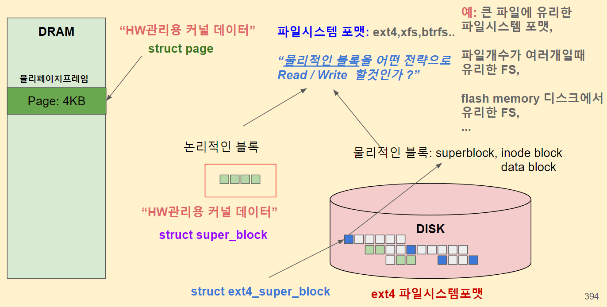
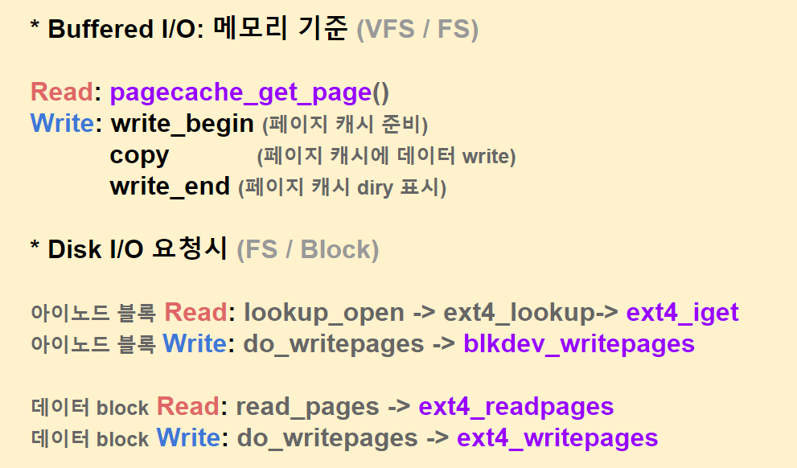

# Filesystem


## VFS File System

#### systecall-VFS-filesystem


#### mkfs

```
# 새로만든 /dev/sdb 디스크를 ext4 파일시스템으로 포맷한다.
$ sudo mkfs.ext4 /dev/sdb
mke2fs 1.44.1 (24-Mar-2018)
/dev/sdb contains a ext4 file system
	created on Sat Dec 14 23:55:13 2019
Proceed anyway? (y,N) y
Creating filesystem with 262144 4k blocks and 65536 inodes
Filesystem UUID: 074fe652-3f83-4bc9-b4f9-d9353bed77aa
Superblock backups stored on blocks: 
	32768, 98304, 163840, 229376

Allocating group tables: done                            
Writing inode tables: done                            
Creating journal (8192 blocks): done
Writing superblocks and filesystem accounting information: done 
```


### super block

* struct super_block
* struct ext4_super_block




* super block은 여러개로 copy해 놓는다. 
* 복구가 불가능한것은 아니지만...
* 자신의 어플리케이션 환경에서 파일시스템 벤치 마크를 돌려 보면서 최선의 파일 시스템을 선택하는 것이 맞을 듯...


* 여기는 스스로 공부하세요. ㅠㅠ


###  super block 

* 적합한 용어 인가?  root block 이 더 맞을 것 같기도 하고... ?

#### 자료 구조

```
# 실제 디스크에 저장되는 슈퍼블록 자료구조
$ cd ~/git/linux
$ vim fs/ext4/ext4.h
...
struct ext4_super_block {
/*00*/  __le32  s_inodes_count;         /* Inodes count */
        __le32  s_blocks_count_lo;      /* Blocks count */
        __le32  s_r_blocks_count_lo;    /* Reserved blocks count */
        __le32  s_free_blocks_count_lo; /* Free blocks count */
/*10*/  __le32  s_free_inodes_count;    /* Free inodes count */
        __le32  s_first_data_block;     /* First Data Block */
        __le32  s_log_block_size;       /* Block size */
...
}


```

#### super block 객체

```
# VFS 자료구조 중 슈퍼블록 자료구조 확인하기
$ cd ~/git/linux
$ vim include/linux/fs.h
...
struct super_block {
        struct list_head        s_list;         /* Keep this first */
        dev_t                   s_dev;          /* search index; _not_ kdev_t */ 
        unsigned char           s_blocksize_bits;
        unsigned long           s_blocksize;
        loff_t                  s_maxbytes;     /* Max file size */
        struct file_system_type *s_type;
        const struct super_operations   *s_op;
...
        struct list_head        s_inodes;       /* all inodes */
...
 }

```


#### super block operation

```
# VFS 자료구조 중 슈퍼블록 자료구조 확인하기
$ cd ~/git/linux
$ vim include/linux/fs.h
...
struct super_block {
        struct list_head        s_list;         /* Keep this first */
        dev_t                   s_dev;          /* search index; _not_ kdev_t */ 
        unsigned char           s_blocksize_bits;
        unsigned long           s_blocksize;
        loff_t                  s_maxbytes;     /* Max file size */
        struct file_system_type *s_type;
        const struct super_operations   *s_op;  <<====
...
        struct list_head        s_inodes;       /* all inodes */
...
 }
 
# VFS 동작 중 슈퍼블록 함수포인터에 매핑된 ext4 슈퍼블록 함수들 확인하기 
$ cd ~/git/linux
$ vim fs/ext4/super.c
...
static const struct super_operations ext4_sops = {
        .alloc_inode    = ext4_alloc_inode,
        .free_inode     = ext4_free_in_core_inode,
        .destroy_inode  = ext4_destroy_inode,
        .write_inode    = ext4_write_inode,
        .dirty_inode    = ext4_dirty_inode,
        .drop_inode     = ext4_drop_inode,
...
```


### inode

#### inode 블럭

* 파일 생성/저장 시 디스크안에 inode block에 다음 정보가 저장된다. 128bytes ?

```
# 실제 디스크에 저장되는 아이노드 블록 자료구조
$ cd ~/git/linux
$ vim fs/ext4/ext4.h
...
struct ext4_inode {
        __le16  i_mode;         /* File mode */
        __le16  i_uid;          /* Low 16 bits of Owner Uid */ 
        __le32  i_size_lo;      /* Size in bytes */
        __le32  i_atime;        /* Access time */
        __le32  i_ctime;        /* Inode Change time */
        __le32  i_mtime;        /* Modification time */
        __le32  i_dtime;        /* Deletion Time */
...
}
```


#### inode 블럭 객체

```
# VFS 자료구조 중 아이노드 자료구조 확인하기
$ cd ~/git/linux
$ vim include/linux/fs.h
...
struct inode {
        umode_t                 i_mode;
        unsigned short          i_opflags;
        kuid_t                  i_uid;
        kgid_t                  i_gid;
        unsigned int            i_flags;
...
        const struct inode_operations   *i_op; 
        struct super_block      *i_sb;
        struct address_space    *i_mapping;
...
        unsigned long           i_ino;
...
 }
```


#### inode 동작함수

```
# VFS 동작 중 아이노드 함수포인터에 매핑된 ext4 아이노드 함수들 확인하기 
$ cd ~/git/linux
$ vim fs/ext4/namei.c
...
const struct inode_operations ext4_dir_inode_operations = {
        .create         = ext4_create,
        .lookup         = ext4_lookup,
        .link           = ext4_link,
        .unlink         = ext4_unlink,
        .symlink        = ext4_symlink,
        .mkdir          = ext4_mkdir,
        .rmdir          = ext4_rmdir,
...
```


### Dentry

#### 파일 경로 관리위한 캐시

```
# VFS 자료구조 중 덴트리 자료구조 확인하기
$ cd ~/git/linux
$ vim include/linux/dcache.h
...
struct dentry {
        /* RCU lookup touched fields */
        unsigned int d_flags;           /* protected by d_lock */
        seqcount_t d_seq;               /* per dentry seqlock */
        struct hlist_bl_node d_hash;    /* lookup hash list */
        struct dentry *d_parent;        /* parent directory */
        struct qstr d_name;
        struct inode *d_inode;          /* Where the name belongs to - NULL is 
                                         * negative */
...
          const struct dentry_operations *d_op; <<=====
...
 }
```


#### dentry 다루는 함수

```
# VFS 동작 중 덴트리 함수포인터에 매핑된 ext4 함수들 확인하기
# 파일명 비교등 파일경로를 다루는 dentry_operations
$ cd ~/git/linux
$ vim fs/ext4/dir.c
...
const struct dentry_operations ext4_dentry_ops = {
        .d_hash = ext4_d_hash,
        .d_compare = ext4_d_compare,
};
...
```


### File 객체

#### process가 open 한 파일객체

```
# VFS 자료구조 중 "open 시 생성되는" 파일 자료구조 확인하기
$ cd ~/git/linux
$ vim include/linux/fs.h
...
struct file {
        union {
                struct llist_node       fu_llist;
                struct rcu_head         fu_rcuhead;
        } f_u;
        struct path             f_path;
        struct inode            *f_inode;       /* cached value */ 
        const struct file_operations    *f_op; <<<======= 

...
 }

```

####  file 객체 operation 

```
# VFS 동작 중 파일동작 함수포인터에 매핑된 ext4 함수들 확인하기
# 파일 내용을 다루는 file_operations
$ cd ~/git/linux
$ vim fs/ext4/file.c
...
const struct file_operations ext4_file_operations = {
        .llseek         = ext4_llseek,
        .read_iter      = ext4_file_read_iter,
        .write_iter     = ext4_file_write_iter,
        .unlocked_ioctl = ext4_ioctl,
...
        .mmap           = ext4_file_mmap,
...
        .open           = ext4_file_open,

...
```


### address_space: 

#### page cache IO 관련 정보가 저장된 객체

```
# 페이지 캐시 입출력 관련 정보를 저장하는 address_space 자료구조
$ cd ~/git/linux
$ vim include/linux/fs.h
...
struct address_space {
        struct inode            *host;
        struct xarray           i_pages;
        gfp_t                   gfp_mask;
        atomic_t                i_mmap_writable;
        struct rb_root_cached   i_mmap;
        struct rw_semaphore     i_mmap_rwsem;
        unsigned long           nrpages;
        unsigned long           nrexceptional;
        pgoff_t                 writeback_index;
        const struct address_space_operations *a_ops;
...
 }


```


####  page cache 입출력을 다루는 함수들

```
# 페이지 캐시 입출력을 다루는 함수들 address_operations
$ cd ~/git/linux
$ vim fs/ext4/inode.c
...
static const struct address_space_operations ext4_da_aops = { 
        .readpage               = ext4_readpage,
        .readpages              = ext4_readpages,
        .writepage              = ext4_writepage,
        .writepages             = ext4_writepages,
        .write_begin            = ext4_da_write_begin,
        .write_end              = ext4_da_write_end,
        .set_page_dirty         = ext4_set_page_dirty,

...

```





### Filsytem List

```
root@ubuntu20:/proc# cat /proc/filesystems 
nodev	sysfs
nodev	tmpfs
nodev	bdev
nodev	proc
nodev	cgroup
nodev	cgroup2
nodev	cpuset
nodev	devtmpfs
nodev	configfs
nodev	debugfs
nodev	tracefs
nodev	securityfs
nodev	sockfs
nodev	bpf
nodev	pipefs
nodev	ramfs
nodev	hugetlbfs
nodev	devpts
	ext3
	ext2
	ext4
	squashfs
	vfat
nodev	ecryptfs
	fuseblk
nodev	fuse
nodev	fusectl
nodev	mqueue
nodev	pstore
nodev	autofs
nodev	binfmt_misc
	xfs
	jfs
	msdos
	ntfs
	minix
	hfs
	hfsplus
	qnx4
	ufs
	btrfs
```

