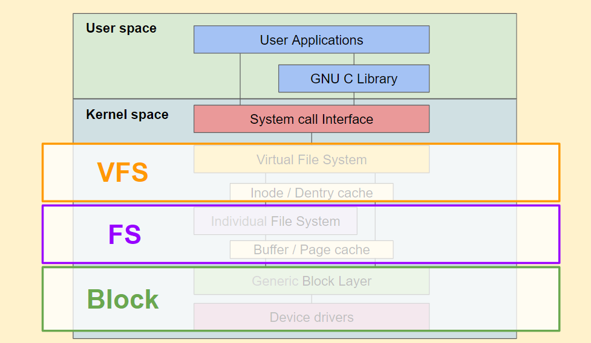
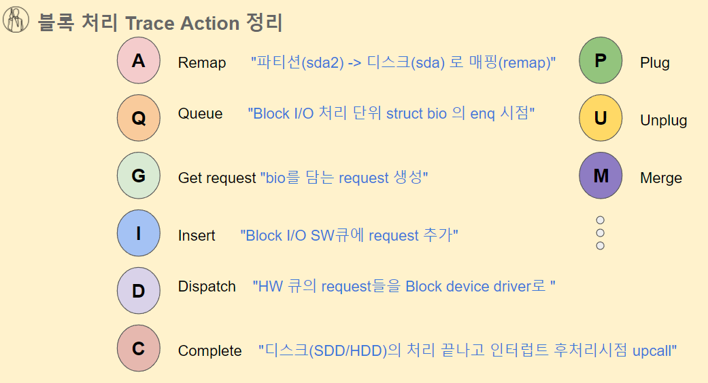
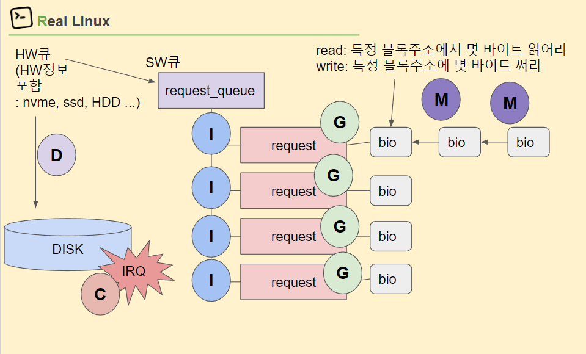
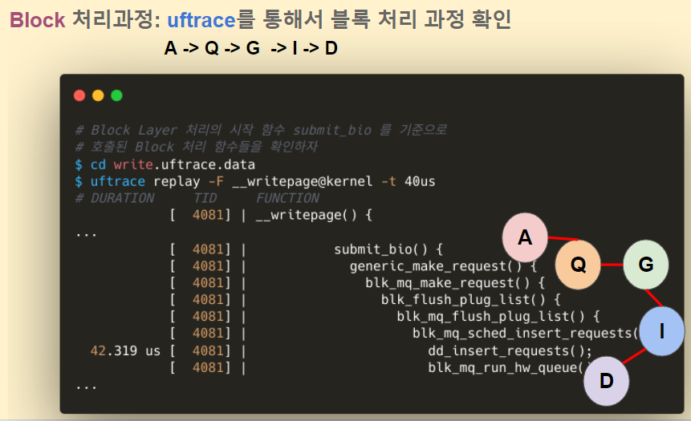
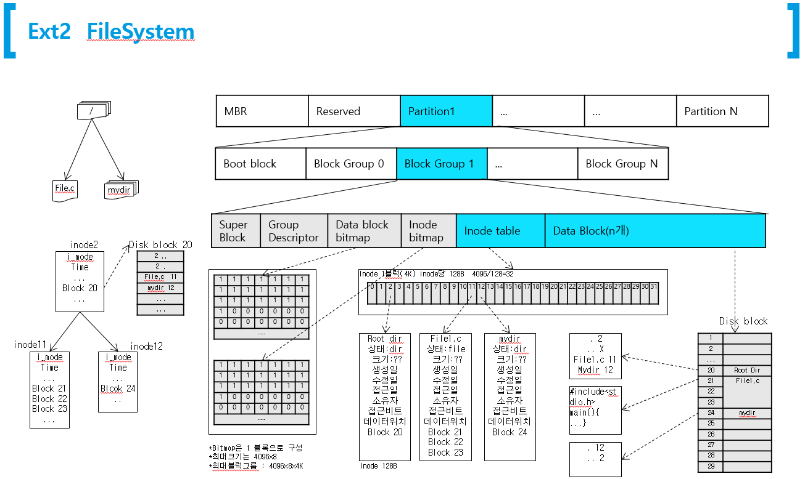

# Block Device


## VFS File System

#### mkfs

```
# 새로만든 /dev/sdb 디스크를 ext4 파일시스템으로 포맷한다.
$ sudo mkfs.ext4 /dev/sdb
mke2fs 1.44.1 (24-Mar-2018)
/dev/sdb contains a ext4 file system
	created on Sat Dec 14 23:55:13 2019
Proceed anyway? (y,N) y
Creating filesystem with 262144 4k blocks and 65536 inodes
Filesystem UUID: 074fe652-3f83-4bc9-b4f9-d9353bed77aa
Superblock backups stored on blocks: 
	32768, 98304, 163840, 229376

Allocating group tables: done                            
Writing inode tables: done                            
Creating journal (8192 blocks): done
Writing superblocks and filesystem accounting information: done 
```


### super block

* struct super_block
* struct ext4_super_block


* super block은 여러개로 copy해 놓는다. 
* 복구가 불가능한것은 아니지만...
* 자신의 어플리케이션 환경에서 파일시스템 벤치 마크를 돌려 보면서 최선의 파일 시스템을 선택하는 것이 맞을 듯...


* 여기는 스스로 공부하세요.


# Block Device


### block size


```
root@ubuntu:/sys/kernel/debug/tracing# sudo fdisk -l /dev/sda | grep  Sector
Sector size (logical/physical): 512 bytes / 512 bytes
Device        Start      End  Sectors Size Type

```


```
root@ubuntu:/sys/kernel/debug/tracing# sudo dumpe2fs /dev/sda2 | grep "Block size"
dumpe2fs 1.44.1 (24-Mar-2018)
Block size:               4096

```


### Block layer





### bio

* 여러단계 A 단계, ...Q단계  6단계....


#### 블럭 처리 단계: 일반적 A Q G I D C 단계





```
$ uftrace replay -F fread -t 30us
# DURATION     TID     FUNCTION
            [  4085] | fread() {
            [  4085] |   __x64_sys_read() {
            [  4085] |     ksys_read() {
            [  4085] |       vfs_read() {
            [  4085] |         __vfs_read() {
            [  4085] |           new_sync_read() {
            [  4085] |             ext4_file_read_iter() {
            [  4085] |               generic_file_read_iter() {
  33.108 us [  4085] |                 touch_atime();

```

#### A단계 : scsi disk /dev/sda 파티션 remap 

```
root@ubuntu:/sys/kernel/debug/tracing# lsblk /dev/sda
NAME   MAJ:MIN RM SIZE RO TYPE MOUNTPOINT
sda      8:0    0  20G  0 disk
├─sda1   8:1    0   1M  0 part
├─sda2   8:2    0  18G  0 part /
└─sda3   8:3    0   2G  0 part [SWAP]

```


#### 머지 단계 

* 특정  bio가 물리적으로 연속될 때 머지 발생한다. 
* 앞으로 연결될수 있고, 뒤로 연결될 수 있는데... Back merge가 많이 발생된다. 영화 볼때 뒷쪽 블럭을 더 많이 본다. 



* C가 불려지는 단계는 Device에 처리가 완료된 단계에서 interrupt 발생한다. 

```
# blktrace 설치하기
$ sudo apt install blktrace

# btrace 를 통해서 현재 Block 처리과정 Trace Action 명으로 확인
# btrace 결과를 특정 sector 25170552 로 필터링 해서 살펴본 결과
$ sudo btrace /dev/sda > btrace.data
$ cat btrace.data | grep 25170552
  8,0    0      226    30.213968541  2960  A  WM 25170552 + 8 <- (8,2) 25166456  
  8,0    0      227    30.213974407  2960  Q  WM 25170552 + 8 [kworker/u8:2]
  8,0    0      228    30.213987258  2960  G  WM 25170552 + 8 [kworker/u8:2]
  8,0    0      242    30.214137274  2960  I  WM 25170552 + 8 [kworker/u8:2]
  8,0    0      247    30.214210745  2960  D  WM 25170552 + 8 [kworker/u8:2]
  8,0    0      254    30.214712754     0  C  WM 25170552 + 8 [0]
  
# A: remap /dev/sda2 (8,2) -> /dev/sda (8,0) 관련해서
# Block device major 번호 minor 번호 확인
$ ls -l /dev/block/8:2
lrwxrwxrwx 1 root root 7 Feb 24 10:25 /dev/block/8:2 -> ../sda2

$ ls -l /dev/block/8:0
lrwxrwxrwx 1 root root 6 Feb 24 10:25 /dev/block/8:0 -> ../sda


```


* 여기서 머지가 발생


### 소스에서 이렇게 trace 코드

* 커널 개발자들이 블럭 디바이스의 진행 단계별로 Trace point를 심어 놨다는 것....

```
reallinux@ubuntu:~/git/linux/block$ ag trace_block
blk-core.c
603:    trace_block_bio_backmerge(req->q, req, bio);
624:    trace_block_bio_frontmerge(req->q, req, bio);
851:            trace_block_bio_remap(bio->bi_disk->queue, bio, part_devt(p),
954:            trace_block_bio_queue(q, bio);
1403:   trace_block_rq_complete(req, blk_status_to_errno(error), nr_bytes);

blk-mq-sched.c
356:    trace_block_rq_insert(rq->q, rq);

blk-merge.c
291:            trace_block_split(q, split, (*bio)->bi_iter.bi_sector);

blk-mq.c
672:    trace_block_rq_issue(q, rq);
705:    trace_block_rq_requeue(q, rq);
1632:   trace_block_rq_insert(hctx->queue, rq);
1680:           trace_block_rq_insert(hctx->queue, rq);
1734:                           trace_block_unplug(this_q, depth, !from_schedule);
1755:           trace_block_unplug(this_q, depth, !from_schedule);
1966:   trace_block_getrq(q, bio, bio->bi_opf);
1988:                   trace_block_plug(q);
1995:                   trace_block_plug(q);
2014:           trace_block_plug(q);
2018:                   trace_block_unplug(q, 1, true);

bounce.c
342:    trace_block_bio_bounce(q, *bio_orig);

bio.c
1821:           trace_block_bio_complete(bio->bi_disk->queue, bio,
```


#### Plug list 이렇게 모아서 처리하는 이유는?

* 리눅스는 연결된 디바이스가 많기 때문에 다양한 IO가 발생하기 때문에 sumit io가 불려질때.. 이것이 우발적으로 정리 안되게 처리될  수 있는데.... 이것을 좀 묶어서 처리하면 교통정리 측면에서 plug list를 선택적으로 사용할수도 있고 안할 수도 있디.
* 커널 내부에서  좀 목적에 맞게.....


## Blocktrace


### [실습] blktrace

```
# blktrace 설치하기
$ sudo apt install blktrace

# btrace 를 통해서 현재 Block 처리과정 Trace Action 명으로 확인
# btrace 결과를 특정 sector 25170552 로 필터링 해서 살펴본 결과
$ sudo btrace /dev/sda > btrace.data
$ cat btrace.data | grep 25170552
  8,0    0      226    30.213968541  2960  A  WM 25170552 + 8 <- (8,2) 25166456  
  8,0    0      227    30.213974407  2960  Q  WM 25170552 + 8 [kworker/u8:2]
  8,0    0      228    30.213987258  2960  G  WM 25170552 + 8 [kworker/u8:2]
  8,0    0      242    30.214137274  2960  I  WM 25170552 + 8 [kworker/u8:2]
  8,0    0      247    30.214210745  2960  D  WM 25170552 + 8 [kworker/u8:2]
  8,0    0      254    30.214712754     0  C  WM 25170552 + 8 [0]
  
# A: remap /dev/sda2 (8,2) -> /dev/sda (8,0) 관련해서
# Block device major 번호 minor 번호 확인
$ ls -l /dev/block/8:2
lrwxrwxrwx 1 root root 7 Feb 24 10:25 /dev/block/8:2 -> ../sda2

$ ls -l /dev/block/8:0
lrwxrwxrwx 1 root root 6 Feb 24 10:25 /dev/block/8:0 -> ../sda


```

* 너무 복잡해서 결과를 볼수 없으면 특정 섹터(븕럭)만 뽑아서 보자.
* 가장 일반적인 ...  A->Q->G->I->D->C 단계

```
reallinux@ubuntu:~/git/linux/block$ cat  btrace.data  | grep  17216000
  8,0    2        1     0.000000000   289  A  WS 17216000 + 8 <- (8,2) 17211904
  8,0    2        2     0.000003641   289  Q  WS 17216000 + 8 [jbd2/sda2-8]
  8,0    2        3     0.000042820   289  G  WS 17216000 + 8 [jbd2/sda2-8]
  8,0    2       33     0.000839493   289  I  WS 17216000 + 80 [jbd2/sda2-8]
  8,0    2       34     0.000894855   289  D  WS 17216000 + 80 [jbd2/sda2-8]
  8,0    2       35     0.001495620     0  C  WS 17216000 + 80 [0]

```

* 보통은 M 단계에서 머지 되어 request에 통합될 수도 있다. 

```
reallinux@ubuntu:~/git/linux/block$ cat  btrace.data  | grep  17216048
  8,0    2       20     0.000561449   289  A  WS 17216048 + 8 <- (8,2) 17211952
  8,0    2       21     0.000564950   289  Q  WS 17216048 + 8 [jbd2/sda2-8]
  8,0    2       22     0.000583504   289  M  WS 17216048 + 8 [jbd2/sda2-8]
```


### inode와 blockcat

#### 블럭 주소 통해서 파일 보기

* 파일 시스템을 통하지 않고 직접 블럭 주소를 통해서  파일 내용을 보는 방법

```
# istat 도구 설치하기
$ sudo apt install -y sleuthkit  


reallinux@ubuntu:~$ ls -i  hello0.txt
788895 hello0.txt

reallinux@ubuntu:~$ find ./ -xdev -inum 788895
./hello0.txt

reallinux@ubuntu:~$ sudo istat /dev/sda2 788895
inode: 788895
Allocated
Group: 96
Generation Id: 206535080
uid / gid: 1000 / 1000
mode: rrw-rw-r--
Flags: Extents,
size: 23
num of links: 1

Inode Times:
Accessed:       2021-12-09 00:11:24.126761567 (UTC)
File Modified:  2021-12-09 00:11:24.187761298 (UTC)
Inode Modified: 2021-12-09 00:11:24.187761298 (UTC)
File Created:   2021-12-09 00:11:24.126761567 (UTC)

Direct Blocks:
3179219
reallinux@ubuntu:~$
reallinux@ubuntu:~$ sudo blkcat /dev/sda2 3179219
hello linux filesystem
reallinux@ubuntu:~$
```


### find inode block

#### 스크립트

```
#!/bin/bash

DEV=$1
I=$2
__STAT=$(fsstat $DEV)
_STAT=$(grep -A 4 'BLOCK GROUP INFORMATION' <<< $__STAT)
_STAT_I=$(awk '{print $NF}' <<< $(grep 'Inodes' <<< $_STAT))
_STAT_D=$(awk '{print $NF}' <<< $(grep 'Blocks' <<< $_STAT))

# Number of Inode, Data in one EXT4 group
echo "Inode/Data Blks per one Grp : $_STAT_I / $_STAT_D"

G_IDX=$[I/_STAT_I]
# Info about EXT Group
grep -A 8 "Group: $G_IDX:" <<< $__STAT
G_STAT=$(grep -A 8 "Group: $G_IDX:" <<< $__STAT)
G_I_START=$(awk '{print $3}' <<< $(grep 'Inode Range' <<< $G_STAT))
G_I_OFFSET=$((I-G_I_START))

G_I_Nth_BLK=$((G_I_OFFSET/16))
_TMP=$((G_I_Nth_BLK*16))
G_I_Nth_BLK_Idx=$((G_I_OFFSET-_TMP))

echo "Inode: $I / Group: $G_IDX / Nth Inode: $red($G_I_OFFSET) <=$I-$G_I_START"
echo "Inode BLK: $G_I_OFFSET/16=$G_I_Nth_BLK, $G_I_Nth_BLK_Idx"

G_I_BLK_START=$(awk '{print $3}' <<< $(grep 'Inode Table' <<< $G_STAT))
G_I_BLK_LOCATED=$((G_I_BLK_START+G_I_Nth_BLK))

#echo "Inode located at:" $G_I_BLK_LOCATED "+ $G_I_Nth_BLK_Idx*256 Byte"
echo "Inode located at: $G_I_BLK_LOCATED "

#OFFSET=$((G_I_Nth_BLK_Idx*256))
#echo "Dumping $G_I_BLK_LOCATED from $OFFSET"
#blkcat -h $DEV $G_I_BLK_LOCATED | grep -A 16 -w $OFFSET
```

#### find inode block

```
# 테스트 할  hello.txt 의 inode 값 구하기
$ ls -i hello.txt
787560 hello.txt

# 해당 스크립트를 통해서 inode block 넘버 구하기
$ sudo find_inodeblk /dev/sda2 787560
Inode/Data Blks per one Grp : 8192 / 32768
Group: 96:
  Block Group Flags: [INODE_ZEROED] 
  Inode Range: 786433 - 794624
  Block Range: 3145728 - 3178495
  Layout:
    Data bitmap: 3145728 - 3145728
    Inode bitmap: 3145744 - 3145744
    Inode Table: 3145760 - 3146271
    Data Blocks: 3153952 - 3178495
Inode: 787560 / Group: 96 / Nth Inode: (1127) <=787560-786433  
Inode BLK: 1127/16=70, 7
Inode located at: 3145830 
```

#### inode 기준으로 block에서 읽기

```
reallinux@ubuntu:~$ ls -i
786730 a.out          793283 hello2.txt  795365 hello_mmap             823171 read.uftrace.data
823350 cscope         793290 hello3.txt  795359 hello_mmap.c           823169 read.uftrace.data.old
788853 find_inodeblk  793298 hello4.txt  786947 max_file               793332 redirect
788121 fs_test        793323 hello5.txt  787683 max_file.c             788114 rlinux
804579 git            793325 hello6.txt  795358 mmap_test.txt          795362 show_buddyinfo.py
795355 gmon.out       793326 hello7.txt  786731 mmap.uftrace.data      837771 swap_test.py
837952 hello          793328 hello8.txt  795363 mmap.uftrace.data.old  788124 uftrace.data
788895 hello0.txt     793329 hello9.txt  795356 read                   837883 write.c
792281 hello1.txt     787411 hello.c     795361 read.c

reallinux@ubuntu:~$ sudo  ./find_inodeblk /dev/sda2    795361
Inode/Data Blks per one Grp : 8192 / 32768
Group: 97:
  Block Group Flags: [INODE_ZEROED]
  Inode Range: 794625 - 802816
  Block Range: 3178496 - 3211263
  Layout:
    Data bitmap: 3145729 - 3145729
    Inode bitmap: 3145745 - 3145745
    Inode Table: 3146272 - 3146783
    Data Blocks: 3178496 - 3211263
Inode: 795361 / Group: 97 / Nth Inode: (736) <=795361-794625
Inode BLK: 736/16=46, 0
Inode located at: 3146318


reallinux@ubuntu:~$ sudo blkcat /dev/sda2  3146318
```


### blktrace로 추적하기

```
 실습:  생성된 hello.txt 의 inode number를 토대로
             Data block 넘버 => 섹터 넘버 변환 (x8)
             Inode Block 넘버 => 섹터 넘버 변환 (x8) 를 구한다

             * 참고: find_inodeblk 스크립트 활용
```


```
# btrace 추적 결과에서 sector 넘버로 블록처리 과정 확인하기
$ cat write.btrace.data | grep <sector 넘버>

```


#### uftrace

```
# Block Layer 처리의 시작 함수 submit_bio 를 기준으로
# 호출된 Block 처리 함수들을 확인하자
$ cd write.uftrace.data
$ uftrace replay -F __writepage@kernel -t 40us
# DURATION     TID     FUNCTION
            [  4081] | __writepage() {
...
            [  4081] |           submit_bio() {
            [  4081] |             generic_make_request() {
            [  4081] |               blk_mq_make_request() {
            [  4081] |                 blk_flush_plug_list() {
            [  4081] |                   blk_mq_flush_plug_list() {
            [  4081] |                     blk_mq_sched_insert_requests() {
  42.319 us [  4081] |                       dd_insert_requests();
            [  4081] |                       blk_mq_run_hw_queue() {
...


```





#### man traceparse

```
TRACE ACTIONS
       The following trace actions are recognised:

       C -- complete A previously issued request has been completed.  The output will detail  the  sector  and
           size of that request, as well as the success or failure of it.

       D -- issued A request that previously resided on the block layer queue or in the i/o scheduler has been
           sent to the driver.

       I -- inserted A request is being sent to the i/o scheduler for addition to the internal queue and later
           service by the driver. The request is fully formed at this time.

       Q -- queued This notes intent to queue i/o at the given location.  No real requests exists yet.

       B  -- bounced The data pages attached to this bio are not reachable by the hardware and must be bounced
           to a lower memory location. This causes a big slowdown in i/o performance, since the data  must  be
           copied  to/from  kernel  buffers.  Usually this can be fixed with using better hardware -- either a
           better i/o controller, or a platform with an IOMMU.

       M -- back merge A previously inserted request exists that ends  on  the  boundary  of  where  this  i/o
           begins, so the i/o scheduler can merge them together.

       F  --  front  merge  Same  as the back merge, except this i/o ends where a previously inserted requests
           starts.

       M -- front or back merge One of the above

       M -- front or back merge One of the above.

       G -- get request To send any type of request to a block device, a  struct  request  container  must  be
           allocated first.

       S  --  sleep  No  available  request structures were available, so the issuer has to wait for one to be
           freed.

       P -- plug When i/o is queued to a previously empty block device queue, Linux will  plug  the  queue  in
           anticipation of future ios being added before this data is needed.

       U  -- unplug Some request data already queued in the device, start sending requests to the driver. This
           may happen automatically if a timeout period has passed (see next entry) or if a number of requests
           have been added to the queue.

       T  --  unplug  due  to timer If nobody requests the i/o that was queued after plugging the queue, Linux
           will automatically unplug it after a defined period has passed.

       X -- split On raid or device mapper setups, an incoming i/o may straddle a device or internal zone  and
           needs to be chopped up into smaller pieces for service. This may indicate a performance problem due
           to a bad setup of that raid/dm device, but may also just be part of normal boundary conditions.  dm
           is notably bad at this and will clone lots of i/o.

       A -- remap For stacked devices, incoming i/o is remapped to device below it in the i/o stack. The remap
           action details what exactly is being remapped to what.

```


### trace 정보 

#### 커널 소스에 등록된 trace

```
reallinux@ubuntu:~/git/linux/block$ ag trace_block
blk-core.c
603:    trace_block_bio_backmerge(req->q, req, bio);
624:    trace_block_bio_frontmerge(req->q, req, bio);
851:            trace_block_bio_remap(bio->bi_disk->queue, bio, part_devt(p),
954:            trace_block_bio_queue(q, bio);
1403:   trace_block_rq_complete(req, blk_status_to_errno(error), nr_bytes);

blk-mq-sched.c
356:    trace_block_rq_insert(rq->q, rq);

blk-merge.c
291:            trace_block_split(q, split, (*bio)->bi_iter.bi_sector);

blk-mq.c
672:    trace_block_rq_issue(q, rq);
705:    trace_block_rq_requeue(q, rq);
1632:   trace_block_rq_insert(hctx->queue, rq);
1680:           trace_block_rq_insert(hctx->queue, rq);
1734:                           trace_block_unplug(this_q, depth, !from_schedule);
1755:           trace_block_unplug(this_q, depth, !from_schedule);
1966:   trace_block_getrq(q, bio, bio->bi_opf);
1988:                   trace_block_plug(q);
1995:                   trace_block_plug(q);
2014:           trace_block_plug(q);
2018:                   trace_block_unplug(q, 1, true);

bio.c
1821:           trace_block_bio_complete(bio->bi_disk->queue, bio,

bounce.c
342:    trace_block_bio_bounce(q, *bio_orig);

```


#### /sys에 등록된 trace events

```
root@ubuntu:/sys/kernel/debug/tracing# ls -l events/block/
total 0
drwxr-xr-x 2 root root 0 Dec  9 00:04 block_bio_backmerge
drwxr-xr-x 2 root root 0 Dec  9 00:04 block_bio_bounce
drwxr-xr-x 2 root root 0 Dec  9 00:04 block_bio_complete
drwxr-xr-x 2 root root 0 Dec  9 00:04 block_bio_frontmerge
drwxr-xr-x 2 root root 0 Dec  9 00:04 block_bio_queue
drwxr-xr-x 2 root root 0 Dec  9 00:04 block_bio_remap
drwxr-xr-x 2 root root 0 Dec  9 00:04 block_dirty_buffer
drwxr-xr-x 2 root root 0 Dec  9 00:04 block_getrq
drwxr-xr-x 2 root root 0 Dec  9 00:04 block_plug
drwxr-xr-x 2 root root 0 Dec  9 00:04 block_rq_complete
drwxr-xr-x 2 root root 0 Dec  9 00:04 block_rq_insert
drwxr-xr-x 2 root root 0 Dec  9 00:04 block_rq_issue
drwxr-xr-x 2 root root 0 Dec  9 00:04 block_rq_remap
drwxr-xr-x 2 root root 0 Dec  9 00:04 block_rq_requeue
drwxr-xr-x 2 root root 0 Dec  9 00:04 block_sleeprq
drwxr-xr-x 2 root root 0 Dec  9 00:04 block_split
drwxr-xr-x 2 root root 0 Dec  9 00:04 block_touch_buffer
drwxr-xr-x 2 root root 0 Dec  9 00:04 block_unplug
-rw-r--r-- 1 root root 0 Dec  9 00:04 enable
-rw-r--r-- 1 root root 0 Dec  9 00:04 filter
```


### Block 처리 단계



