# 스케쥴러

## 리눅스 스케쥴러

#### 5.4.0 버젼 설치

```
# 커널 버전 5.4.0 설치하기 
$ sudo apt install -y linux-image-5.4.0-65-generic
$ sudo reboot

# 참고용:
# 특정 커널 버전으로 부팅하기 GRUB_DEFAULT 값 수정후 update-grub
# 예시: 5.4.0-65-generic
# /boot 폴더에서 사용가능한 커널 버전 확인
$ ls /boot/
$ vim /etc/default/grub
...
GRUB_DEFAULT='Advanced options for Ubuntu>Ubuntu, with Linux 5.4.0-65-generic'
...

$ sudo update-grub
$ sudo reboot
```


#### cpu time

```sh
Period:  (분배할 총시간) 분배할 cpu실행시간단위 (예: 100ms)
* 시간단위:                  1  s      (초)
               ==          1000  ms  (밀리)
            ==      1000 000  us   (마이크로)
         ==  1000 000 000  ns   (나노)
```


#### cpu를 몇 % 사용해야 공정한 것인가?

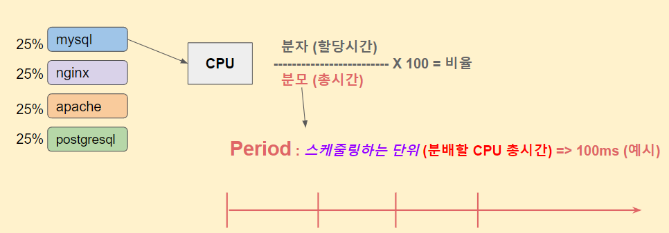

* 4개 프로세스가 cpu 공유 할때 25% 인데 ... 실제 시간을 얼마나 사용하는 것이 공평한가?

```
# period 스케줄링 기준 시간 100ms == 100,000 us
# quota CPU 사용 제한 시간  50ms ==  50,000 us
# 결과적으로 1/2 CPU 50% 사용률 제한 
$ docker run --cpu-period=100000 --cpu-quota=50000 -it ubuntu:18.04 /bin/bash  

# 다른 터미널에서 top 로 cpu 점유율 모니터링 준비
$ top
```


#### cpu.cfs_period_us 

```
reallinux@ubuntu:~$ cat /sys/fs/cgroup/cpu/cpu.cfs_period_us
100000
```

* 우리가 사용하는 cgroup은 기본적으로 사용한다. 
* 그리고 우리가 사용하느 것은 c

```
# 분배할 CPU 총시간 period 기본값 100 ms
$ cat /sys/fs/cgroup/cpu/cpu.cfs_period_us 
100000

# 모든 프로세스는 기본 cgroup 설정에 적용이 되어있다.
# cgroup (HW 자원 독립 / 제한 기능)
# CPU 기본 cgroup 설정에 포함되어있는 프로세스 PID 들 확인   
$ cat /sys/fs/cgroup/cpu/tasks

# 유저 프로세스 기준 cgroup 에서 현재 프로세스 PID 확인 (예: 2244)  
$ cat /sys/fs/cgroup/cpu/user.slice/tasks | grep $$
2244

```


#### sched time

* 여기서 runtime 값을 확인해 보자.
* se는 schedule empty의 줄임말... 이다. 

```
root@ubuntu:/proc/1492# cat sched
bash (1492, #threads: 1)
-------------------------------------------------------------------
se.exec_start                                :         49189.511400
se.vruntime                                  :           624.026830
se.sum_exec_runtime                          :             9.153227 <<== runtime....
se.nr_migrations                             :                    0
nr_switches                                  :                   54
nr_voluntary_switches                        :                   53
nr_involuntary_switches                      :                    1
se.load.weight                               :              1048576
se.runnable_weight                           :              1048576
se.avg.load_sum                              :                  289
se.avg.runnable_load_sum                     :                  289
se.avg.util_sum                              :               295947
se.avg.load_avg                              :                    0
se.avg.runnable_load_avg                     :                    0
se.avg.util_avg                              :                    0
se.avg.last_update_time                      :          49189511168
se.avg.util_est.ewma                         :                    9
se.avg.util_est.enqueued                     :                    0
policy                                       :                    0
prio                                         :                  120
clock-delta                                  :                   50
mm->numa_scan_seq                            :                    0
numa_pages_migrated                          :                    0
numa_preferred_nid                           :                   -1
total_numa_faults                            :                    0
current_node=0, numa_group_id=0
numa_faults node=0 task_private=0 task_shared=0 group_private=0 group_shared=0
```

#### timeslice, runtime

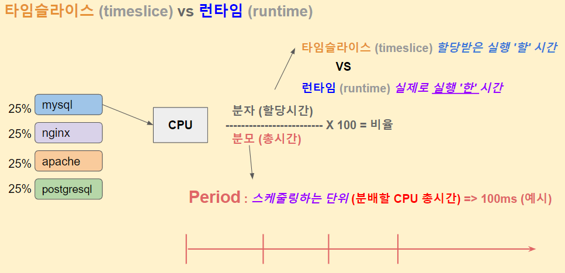


#### 이것 차이점.

```
# watch 명령어를 통해서 확인했을때 
# se.sum_exec_runtime 값이 증가하지 않는 이유는 ?
$ watch -n 0.1 cat /proc/$$/sched

# 명령어 수동입력으로 확인
$ cat /proc/$$/sched

# watch 명령어를 통해서 cat 프로세스 기준으로 스케줄링 정보 확인  
$ watch -n 0.1 cat /proc/self/sched
```

##### /proc/self/sched 

```
Every 0.1s: cat /proc/self/sched                                                 ubuntu: Thu Dec  9 02:58:14 2021

cat (3865, #threads: 1)
-------------------------------------------------------------------
se.exec_start                                :        652851.128474
se.vruntime                                  :          6451.989748
se.sum_exec_runtime                          :             0.000000 <<===  살짝 살짝 변동
```

##### /proc/$$/sched 

```
Every 0.1s: cat /proc/1492/sched                                                 ubuntu: Thu Dec  9 02:58:39 2021

bash (1492, #threads: 1)
-------------------------------------------------------------------
se.exec_start                                :        672326.846394
se.vruntime                                  :          7245.256589
se.sum_exec_runtime                          :            33.842670 <<== 시간이 변동안됨

```


```
# watch 명령어를 통해서 확인했을때 
# se.sum_exec_runtime 값이 증가하지 않는 이유는 ?
$ watch -n 0.1 cat /proc/$$/sched

# 명령어 수동입력으로 확인
$ cat /proc/$$/sched

# watch 명령어를 통해서 cat 프로세스 기준으로 스케줄링 정보 확인  
$ watch -n 0.1 cat /proc/self/sched
```


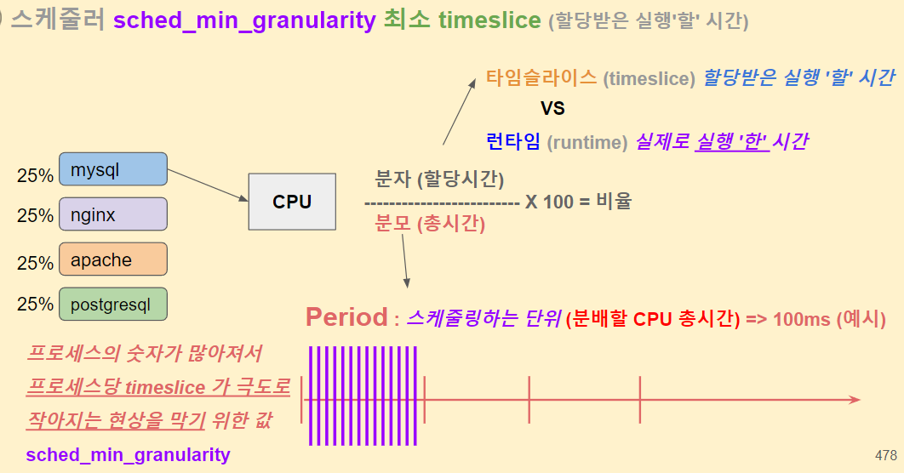

```
# period 스케줄링 기준 시간 100ms == 100,000 us
# quota CPU 사용 제한 시간  50ms ==  50,000 us
# 결과적으로 1/2 CPU 50% 사용률 제한 
$ docker run --cpu-period=100000 --cpu-quota=50000 -it ubuntu:18.04 /bin/bash  

# 다른 터미널에서 top 로 cpu 점유율 모니터링 준비
$ top
```

#### sched_min_granularity_ns

```
# nansecond 단위 (ns)
# 2,250,000 ns == 2.25 ms
$ cat /proc/sys/kernel/sched_min_granularity_ns   
2250000

# 분배할 CPU 총시간 period 기본값 100 ms 이기때문에
# 총 100 ms 중에서 한 프로세스당 최소 2.25 ms 는 보장해준다  
# (프로세스 개수가 무한이 많아져도 보장)
$ cat /sys/fs/cgroup/cpu/cpu.cfs_period_us 
100000
```

* 결국은... sched_min_granularity_ns에서  최소 2.5ms는 보장하고... 100ms ~ 2.5ms사이에서 어느정도의 times slice를 할당할 지에 대한 문제이네.. 


### nice (친절하게 양보)


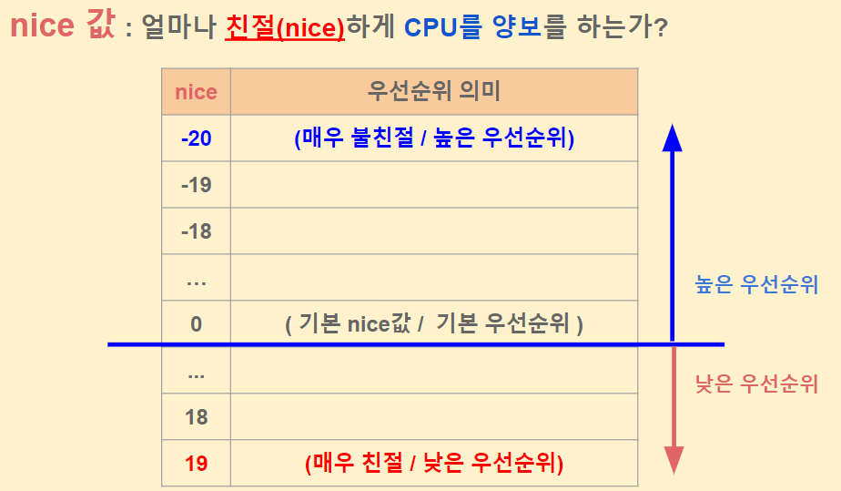


```
# nice 값 수치확인하는 방법
# /proc/PID/stat 결과의 19번째 값
$ man proc
...
(19) nice  %ld
     The  nice  value  (see setpriority(2)), a value in the  
     range 19 (low priority) to -20 (high priority).
...

# 현재 프로세스 기준으로 nice 값 확인하기
$ cat /proc/$$/stat | awk '{print $19}'
0

# 프로세스 PID 4번 기준으로 nice 값 확인하기
$ cat /proc/4/stat | awk '{print $19}'
-20

# 프로세스 PID 4번 (커널프로세스) 프로세스명 확인하기    
$ cat /proc/4/comm
kworker/0:0H


```


```

# 현재 프로세스 nice 값 확인하기
$ ps -eo pid,comm,nice | grep $$
   2244 bash              0

# 커널 태스크 (예: kworker) nice 값 확인하기    
$ ps -eo pid,comm,nice | grep kworker
      6 kworker/0:0H-kb -20
     20 kworker/1:0H-kb -20
...
    212 kworker/2:2-mm_   0
    295 kworker/1:1H-kb -20
    322 kworker/0:1H-kb -20
   3188 kworker/u8:3-ev   0
   3810 kworker/1:0-mm_   0
   3855 kworker/u8:1-ev   0


```


#### nice 변경

```
# nice 값을 변경해서 프로세스를 실행하는 명령어
$ whatis nice
nice (1)             - run a program with modified scheduling priority  

# nice 적용 프로세스 실행 (기본값 nice: 10)
$ nice bash
reallinux@ubuntu:~$ ps -eo pid,comm,nice | grep $$
   3894 bash             10

# nice 값 -20 (우선순위 높음) super user 권한 필요
$ nice -n -20 bash
nice: cannot set niceness: Permission denied

# nice 값 -20 (우선순위 높음)
$ sudo nice -n -20 bash
$ ps -eo pid,comm,nice | grep $$
   3965 bash            -20


```


#### weight 값

* 스케쥴링에서 진짜 사용하는 값은 weight
* nice 값을 반영하여 weight 값을 만들었음.

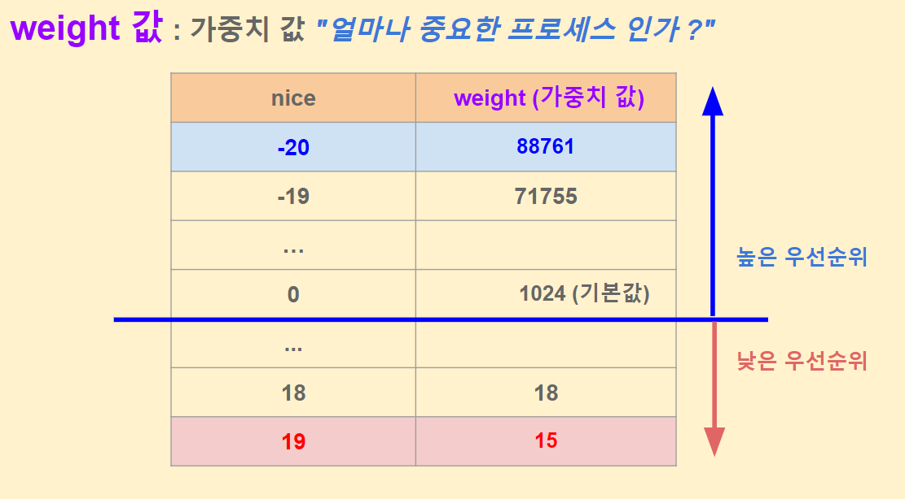

```
$ cd ~/git/linux/
$ vim kernel/sched/core.c
7526 const int sched_prio_to_weight[40] = {
7527  /* -20 */     88761,     71755,     56483,     46273,     36291,
7528  /* -15 */     29154,     23254,     18705,     14949,     11916,
7529  /* -10 */      9548,      7620,      6100,      4904,      3906,
7530  /*  -5 */      3121,      2501,      1991,      1586,      1277,
7531  /*   0 */      1024,       820,       655,       526,       423,
7532  /*   5 */       335,       272,       215,       172,       137,
7533  /*  10 */       110,        87,        70,        56,        45,
7534  /*  15 */        36,        29,        23,        18,        15,   
7535 };
```


#### 프로세스 weight

```
# 프로세스 PID 6번의 프로세스 명 확인
$ cat /proc/6/comm
kworker/0:0H-kblockd

# 프로세스 PID 6번의 nice 값 확인
$ cat /proc/6/stat | awk '{print $19}'
-20

# 프로세스 PID 6번의 weight 값 확인하기
$ cat /proc/4/sched | grep "se.load.weight"
se.load.weight             :             90891264  

# 실제 weight 값은 x 1024 되어있는 값이다.
$ echo $((90891264/1024))
88761

```


#### timeslice

* 이것 중요한데... 기존에 어떤 문제가 있었냐 하면....

* cfs 스케쥴러 나오기전에 단순하게 timeslice 정했는데... nice
* 처음에는 nice 우선 순위에 따라 time slice 할당했었음. 그런데 ... 이것에서 문제...
* 문제가 되는지점은... 아래처럼 프로세스가 2개만 있다고 하면...


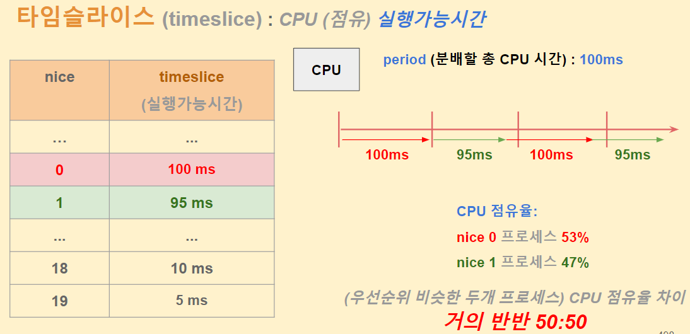

* nice가 18,19일때 1칸 차이인데.. 너무 불공평한 문제가 나온다. 

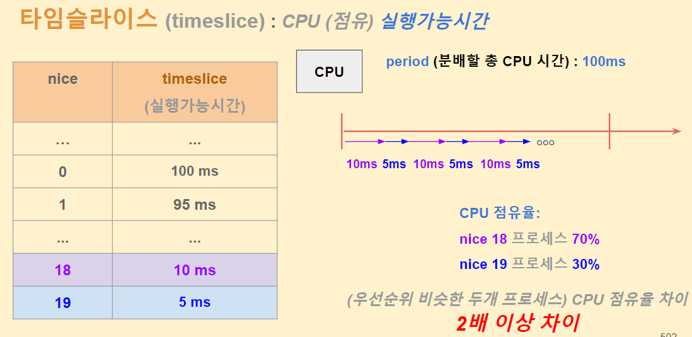

* 그래서 이렇게...

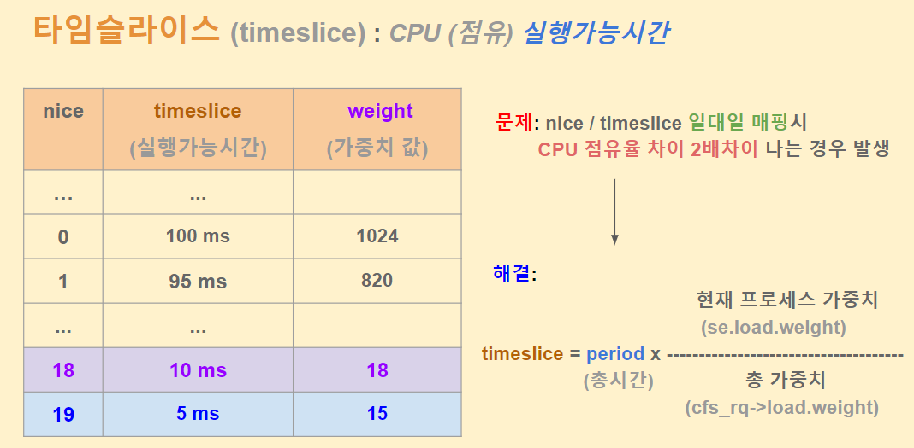

* 현재 커널에서 timeslice를 계산하는 방법
* 현재 실행 중인 프로세스가 10개라면 모든 프로세스의 가중치를 합해서...분모로 하고 해당 프로세스의 가중치를 분자로 해서 period 값을 
* 100ms 기준값은 어디서 나온거야?

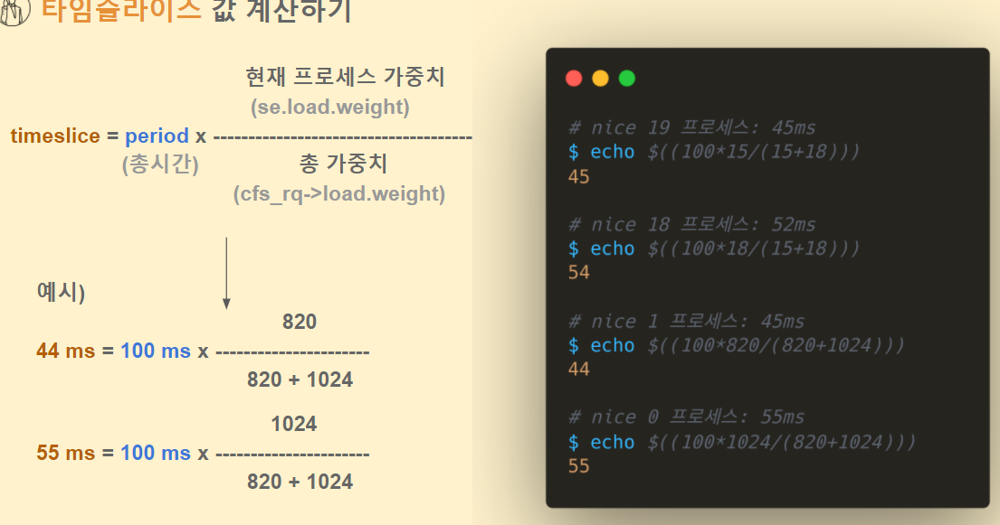

```
# nice 19 프로세스: 45ms
$ echo $((100*15/(15+18)))
45

# nice 18 프로세스: 52ms
$ echo $((100*18/(15+18)))
54

# nice 1 프로세스: 45ms
$ echo $((100*820/(820+1024)))
44

# nice 0 프로세스: 55ms
$ echo $((100*1024/(820+1024)))    
55
```

#####  cpu의 총 시간  

/sys/fs/cgroup/cpu/cpu.cfs_period_us에 정의 되어 있다. 

```
# 분배할 CPU 총시간 period 기본값 100 ms
$ cat /sys/fs/cgroup/cpu/cpu.cfs_period_us 
100000

```


## virtual runtime


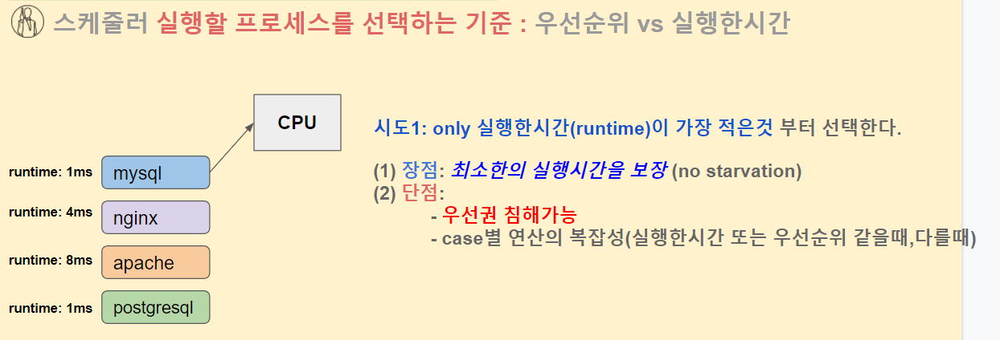


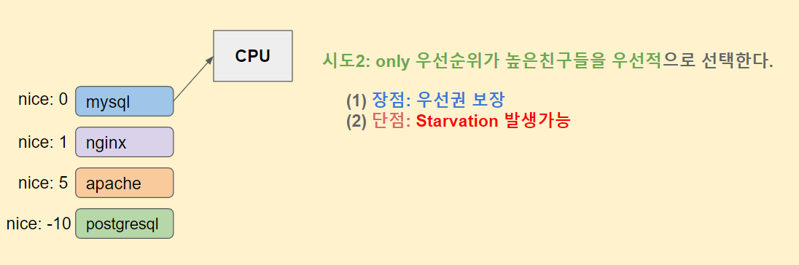


#### 실행시간이 작은것 선택

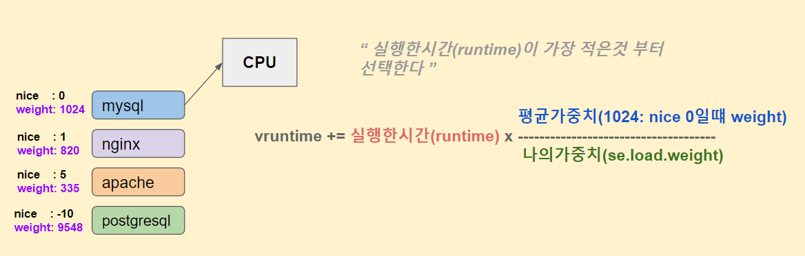

* 시간이 다르게 흐르도록 하는 것이 핵심이다. 
* 가중치가 낮으면 시간을 많이 사용한 것 처럼 (빨리 시간을 소모한것이지...)
* 가중치가 높으며 할당 runtime을 느리게 흐르게 한다. 

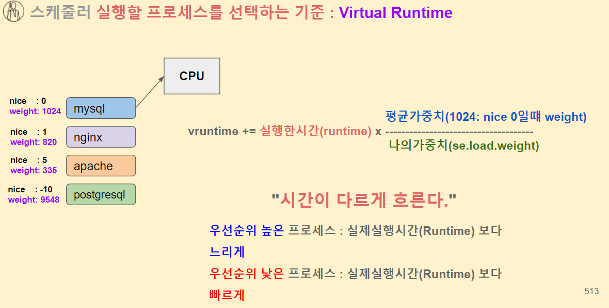

#### vruntime vs runtime

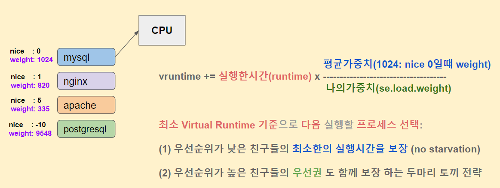

* 이렇게 계산된 vruntime을 기준으로 정렬한 다음에 vruntime을 기준으로 선택하면..
* 실행할 프로세스를 선택하는 기준으로 사용된다. 
* runtime은 실제 프로세스가 할당 받는 시간이다.
* 그리고  virtual runtime은 다음에 실행할 프로세스를 선택하는 기준으로 사용한다. 

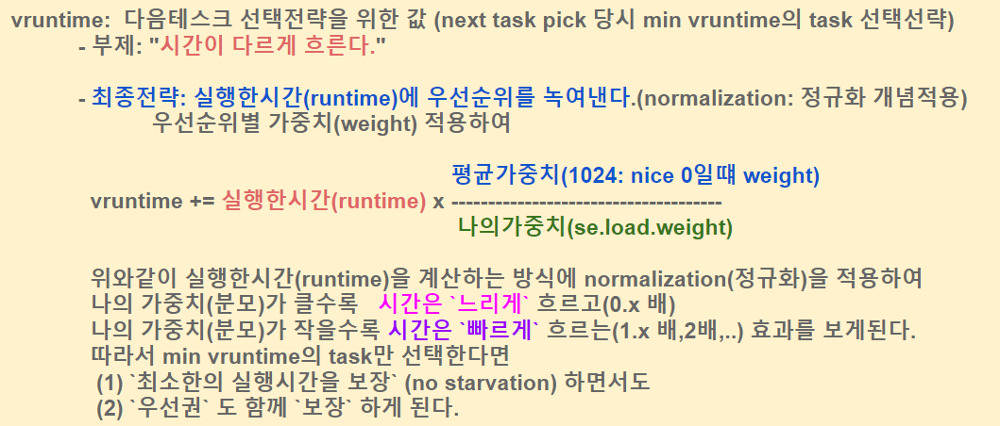


##### 우선순위 높으면

-  runtime 과 유사한 시간이 나온다.
- 중력이 낮다. 

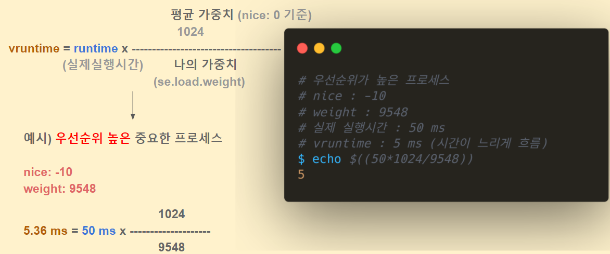


##### 우선순위 낮으면 

* 50ms 사용했는데도 3413.33ms 사용한 것처럼  된다. 
* 따라서 선택될 가능성이 낮아 진다. 
* 중력이 높아진다. 

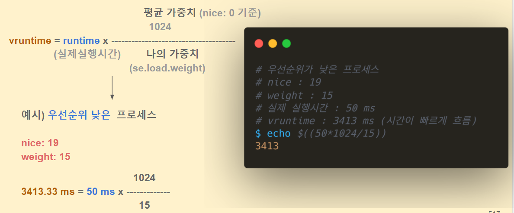


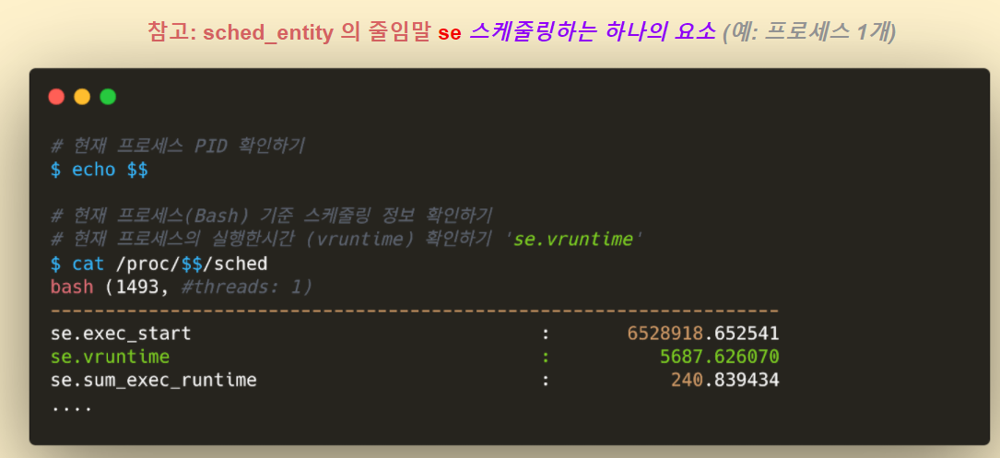


#### vruntime 확인

```
root@ubuntu:/proc/1492# cat /proc/1492/sched | grep vruntime
se.vruntime                                  :         10595.746460
```


## Scheduler


### 주요 개념


* next task.... 가장 작은 vruntime 기준으로 정렬해서 가장 작은 것을 그냥 선택해서 쓰면 된다.
* 이것은 복잡도가 0 이다.
* context switch 이것은 좀 ...  뭔가 CPU에 누구를 태우는 작업. 해당 CPU에 끼워주는 작업이 어셈블리어로 되어 있다.
* 어떤 원리도 되어 있는지만 알면 된다. 
* context switch :  레지스터 값들을 교체 한다는 의미로 해석하면 됨
* time slice를 다 소진 하지 않았어도 IO 발생하면 schedule 함수를 호출하고 cpu를 놔줘야 한다.  
* IO wait발생할때 이때 sleep이 된다. 이때 schedule에 의해서 sleep으로 놔줬다면 try_to_wake_up  통해서 sleep중인 프로세스를 wakeup 해주는 짝궁을 맞줘 줘야 한다. 
* IO 가 종료된 다음 interrupt가 호출되면 다시 해당 프로세스가 깨어 난다...


#### cpu time interrupt 

* 계속 cpu 뺏앗을지 여부를 판단하는 작업


* core 갯수

```
root@ubuntu:/proc/1492# nproc
4
```


```
# scheduler_tick()에서 entity_tick()까지
# 함수 호출과정 찾기

# scheduler_tick()
#  -> sched_class->task_tick(rq, curr, 0);
#    -> task_tick_fair()
#       -> entity_tick()
$ cd git/linux/kernel/sched
$ vim core.c
...
void scheduler_tick(void)
{
...
        curr->sched_class->task_tick(rq, curr, 0);  
...
# CPU들간의 로드밸런싱 
        trigger_load_balance(rq);
#endif
}
```

scheduler_tick

* 여기서 check_preempt_tick() 호출...

```
# scheduler_tick의 주요 함수는 entity_tick() 이다.
$ cd git/linux/kernel/sched
$ vim fair.c
...
entity_tick(struct cfs_rq *cfs_rq, struct sched_entity *curr, int queued)  
{
        /*
         * Update run-time statistics of the 'current'.
         */
# Virtual Runtime 최신화 하기
        update_curr(cfs_rq);
...
        if (cfs_rq->nr_running > 1)
# 선점여부(타임슬라이스 소진 여부) 확인하기
                check_preempt_tick(cfs_rq, curr);
}

```


### check_preempt_tick

```
# 선점여부 체크하는 check_preempt_tick 함수
$ cd git/linux/kernel/sched
$ vim fair.c
...
check_preempt_tick(struct cfs_rq *cfs_rq, struct sched_entity *curr)
{
...
# (실행가능한) 타임슬라이스 값 가져오기
        ideal_runtime = sched_slice(cfs_rq, curr);
# 실제 실행한 시간 가져오기
        delta_exec = curr->sum_exec_runtime - curr->prev_sum_exec_runtime;
# 타임슬라이스 소진 체크 후 선점(need_resched)여부 체크
        if (delta_exec > ideal_runtime) {
                resched_curr(rq_of(cfs_rq));
                /*
                 * The current task ran long enough, ensure it doesn't get  
                 * re-elected due to buddy favours.
                 */
                clear_buddies(cfs_rq, curr);
                return;
        }

# 많은 컨텍스트 스위칭 방지용 최소 타임슬라이스 보장
        if (delta_exec < sysctl_sched_min_granularity)
                return;

# 우선순위 체크 후  선점(need_resched)여부 체크
        se = __pick_first_entity(cfs_rq);
        delta = curr->vruntime - se->vruntime;

        if (delta < 0)
                return;

        if (delta > ideal_runtime)
                resched_curr(rq_of(cfs_rq));
}

```


#### check_preempt_tick -> sched_slice()

```
<linux/kernel/sched/fair.c>

 4114 /*
 4115  * Preempt the current task with a newly woken task if needed:
 4116  */
 4117 static void
 4118 check_preempt_tick(struct cfs_rq *cfs_rq, struct sched_entity *curr)
 4119 {
 4120     unsigned long ideal_runtime, delta_exec;
 4121     struct sched_entity *se;
 4122     s64 delta;
 4123
 4124     ideal_runtime = sched_slice(cfs_rq, curr);   <<==== time tick이 실행될 때마다 이것을 재계산한다. 
 4125     delta_exec = curr->sum_exec_runtime - curr->prev_sum_exec_runtime; <<== runtime 소진 여부 확인
 4126     if (delta_exec > ideal_runtime) {
 4127         resched_curr(rq_of(cfs_rq));  <<=== 리 스케쥴링 될 필요가 있다는 것...
 4128         /*
 4129          * The current task ran long enough, ensure it doesn't get
 4130          * re-elected due to buddy favours.
 4131          */
 4132         clear_buddies(cfs_rq, curr);
 4133         return;
 4134     }
 4135
 4136     /*
 4137      * Ensure that a task that missed wakeup preemption by a
 4138      * narrow margin doesn't have to wait for a full slice.
 4139      * This also mitigates buddy induced latencies under load.
 4140      */
 4141     if (delta_exec < sysctl_sched_min_granularity)
 4142         return;
 4143
 4144     se = __pick_first_entity(cfs_rq);
 4145     delta = curr->vruntime - se->vruntime;
 4146
 4147     if (delta < 0)
 4148         return;
 4149
 4150     if (delta > ideal_runtime)
 4151         resched_curr(rq_of(cfs_rq));
 4152 }

```


```
<linux/kernel/sched/core.c>
 507 void resched_curr(struct rq *rq)
 508 {
 509     struct task_struct *curr = rq->curr;
 510     int cpu;
 511
 512     lockdep_assert_held(&rq->lock);
 513
 514     if (test_tsk_need_resched(curr))
 515         return;
 516
 517     cpu = cpu_of(rq);
 518
 519     if (cpu == smp_processor_id()) {
 520         set_tsk_need_resched(curr);
 521         set_preempt_need_resched();
 522         return;
 523     }
 524
 525     if (set_nr_and_not_polling(curr))
 526         smp_send_reschedule(cpu);
 527     else
 528         trace_sched_wake_idle_without_ipi(cpu);
 529 }

```


```
<linux/kernel/sched/sched.h>
1759 static inline int test_tsk_need_resched(struct task_struct *tsk)
1760 {
1761     return unlikely(test_tsk_thread_flag(tsk,TIF_NEED_RESCHED));
1762 }

```


### Schedule()


#### TASK 스위칭 : A -> B

* 이것은 커널 모드로 진입한 상황이 전제 조건이다. 커널 진입 없이 유저 모드에서 전환은 없다. 


*** 여기는 쫌 정리가 필요하겠네.

정말 이해하기가 쉽지 않군...


```
<linux/kernel/sched/core.c>

3804 static void __sched notrace __schedule(bool preempt)
3805 {
3806     struct task_struct *prev, *next;
3807     unsigned long *switch_count;
3808     struct rq_flags rf;
3809     struct rq *rq;
3810     int cpu;
3811
3812     cpu = smp_processor_id();
3813     rq = cpu_rq(cpu);
3814     prev = rq->curr;
3815
3816     schedule_debug(prev);
3817
3818     if (sched_feat(HRTICK))
3819         hrtick_clear(rq);
3820
3821     local_irq_disable();
3822     rcu_note_context_switch(preempt);
3823
3824     /*
3825      * Make sure that signal_pending_state()->signal_pending() below
3826      * can't be reordered with __set_current_state(TASK_INTERRUPTIBLE)
3827      * done by the caller to avoid the race with signal_wake_up().
3828      *
3829      * The membarrier system call requires a full memory barrier
3830      * after coming from user-space, before storing to rq->curr.
3831      */
3832     rq_lock(rq, &rf);
3833     smp_mb__after_spinlock();
3834
3835     /* Promote REQ to ACT */
3836     rq->clock_update_flags <<= 1;
3837     update_rq_clock(rq);
3838
3839     switch_count = &prev->nivcsw;
3840     if (!preempt && prev->state) {
3841         if (signal_pending_state(prev->state, prev)) {
3842             prev->state = TASK_RUNNING;
3843         } else {
3844             deactivate_task(rq, prev, DEQUEUE_SLEEP | DEQUEUE_NOCLOCK);
3845
3846             if (prev->in_iowait) {
3847                 atomic_inc(&rq->nr_iowait);
3848                 delayacct_blkio_start();
3849             }
3850         }
3851         switch_count = &prev->nvcsw;
3852     }
3853
3854     next = pick_next_task(rq, prev, &rf);   <<==== vruntime이 가장 작은 것을 선택...
3855     clear_tsk_need_resched(prev);


3213 static __always_inline struct rq *
3214 context_switch(struct rq *rq, struct task_struct *prev,
3215            struct task_struct *next, struct rq_flags *rf)
3216 {
3217     struct mm_struct *mm, *oldmm;
3218
3219     prepare_task_switch(rq, prev, next);
3220
3221     mm = next->mm;
3222     oldmm = prev->active_mm;
3223     /*
3224      * For paravirt, this is coupled with an exit in switch_to to
3225      * combine the page table reload and the switch backend into
3226      * one hypercall.
3227      */
3228     arch_start_context_switch(prev);
3229
3230     /*
3231      * If mm is non-NULL, we pass through switch_mm(). If mm is
3232      * NULL, we will pass through mmdrop() in finish_task_switch().
3233      * Both of these contain the full memory barrier required by
3234      * membarrier after storing to rq->curr, before returning to
3235      * user-space.
3236      */
3237     if (!mm) {
3238         next->active_mm = oldmm;
3239         mmgrab(oldmm);
3240         enter_lazy_tlb(oldmm, next);
3241     } else
3242         switch_mm_irqs_off(oldmm, mm, next);
3243
3244     if (!prev->mm) {
3245         prev->active_mm = NULL;
3246         rq->prev_mm = oldmm;
3247     }
3248
3249     rq->clock_update_flags &= ~(RQCF_ACT_SKIP|RQCF_REQ_SKIP);
3250
3251     prepare_lock_switch(rq, next, rf);
3252
3253     /* Here we just switch the register state and the stack. */ <<====== register state and stack 전환
3254     switch_to(prev, next, prev);    <<========여기서 jump  A->B로 전환 된 다음...
3255     barrier();    <<==== 되돌아 올때는 여기 부터 시작하면 되는데.... 뺏긴 상태 그대로 돌아 온다...
3256
3257     return finish_task_switch(prev); <<=== 
3258 }

```


### try_to_wake_up 동작

```
# trace 초기화
$ cd /sys/kernel/debug/tracing
$ echo nop > current_tracer
$ echo 0 > events/enable
$ echo 0 > options/stacktrace

# runqueue 에 enqueue 되는 상황추적하기
$ echo 'p:enqueue_task_fair enqueue_task_fair' > kprobe_events  
$ echo 1 > events/kprobes/enqueue_task_fair/enable
$ echo 1 > options/stacktrace

$ cat trace

```


```
$ cd ~/git/linux/net/core
$ vim sock.c
...
int sk_wait_data(struct sock *sk, long *timeo, const struct sk_buff *skb)
{
        DEFINE_WAIT_FUNC(wait, woken_wake_function);
        int rc;

        add_wait_queue(sk_sleep(sk), &wait);
        sk_set_bit(SOCKWQ_ASYNC_WAITDATA, sk);
        rc = sk_wait_event(sk, timeo, skb_peek_tail(&sk->sk_receive_queue) != skb, &wait);  
        sk_clear_bit(SOCKWQ_ASYNC_WAITDATA, sk);
        remove_wait_queue(sk_sleep(sk), &wait);
        return rc;
}


```


```
$ cd ~/git/linux/net/core
$ vim sock.c
...
static void sock_def_readable(struct sock *sk)
{
        struct socket_wq *wq;

        rcu_read_lock();
        wq = rcu_dereference(sk->sk_wq);
        if (skwq_has_sleeper(wq))
                wake_up_interruptible_sync_poll(&wq->wait, EPOLLIN | EPOLLPRI |  
                                                EPOLLRDNORM | EPOLLRDBAND);  
        sk_wake_async(sk, SOCK_WAKE_WAITD, POLL_IN);
        rcu_read_unlock();
}


```


### load_balance 동작

* time irq 마다 cpu 사이 runqueue 로드 밸런싱


```
# 후반부작업으로 실행되는 run_rebalance_domains()에서
# load_balance()까지 함수 호출과정 찾기

# run_rebalance_domains()
#  -> rebalance_domains()
#    -> load_balance()
$ cd git/linux/kernel/sched
$ vim fair.c
...
static int load_balance(int this_cpu, struct rq *this_rq,
                        struct sched_domain *sd, enum cpu_idle_type idle,  
                        int *continue_balancing)
{
...


```


```
# 후반부작업으로 실행되는 run_rebalance_domains()에서
# load_balance()까지 함수 호출과정 찾기

# run_rebalance_domains()
#  -> rebalance_domains()
#    -> load_balance()
$ cd git/linux/kernel/sched
$ vim fair.c
...
  $ cd ~/git/linux/kernel/sched
$ vim fair.c
...
static int load_balance(int this_cpu, struct rq *this_rq,
                        struct sched_domain *sd, enum cpu_idle_type idle,  
                        int *continue_balancing)
{
...
# CPU들 사이에서 가장 바쁜 (태스크가 많은) 런큐를 고른다.
        busiest = find_busiest_queue(&env, group);

                /*
                 * cur_ld_moved - load moved in current iteration
                 * ld_moved     - cumulative load moved across iterations   
                 */
# (2) detach_tasks 함수를 통해서 옮길 태스크들을 현재 런큐에서 빼낸다.
                cur_ld_moved = detach_tasks(&env);

# (3) attach_tasks 함수를 통해서 옮길 태스크들을 해당 CPU 런큐에 삽입한다.
                if (cur_ld_moved) {
                        attach_tasks(&env);


```


### 선점 preempt 과정


```
# 대표적인 커널함수 진입점: Interrupt와 Exception 처리됨
$ cd git/linux/arch/x85/entry
$ vim entry_64.S
...
# 인터럽트 처리 시작 -> do_IRQ 호출
common_interrupt:
        addq    $-0x80, (%rsp)
        call    interrupt_entry
        UNWIND_HINT_REGS indirect=1
        call    do_IRQ  /* rdi points to pt_regs */
        /* 0(%rsp): old RSP */

# 인터럽트 끝난이후 인터럽트 때문에 멈췄던 코드지점(user or kernel)으로 복귀  
ret_from_intr:
...


```


```
# 대표적인 커널함수 진입점: Interrupt와 Exception 처리됨
$ cd git/linux/arch/x85/entry
$ vim entry_64.S
...
ret_from_intr:
...
# CS 코드세그먼트를 통해서 유저모드(3) / 커널모드(0) 확인 후
# 코드지점(user or kernel)으로 복귀

# (1) 유저코드로 복귀 retint_user
# (2) 커널코드로 복귀 retint_kernel
        testb   $3, CS(%rsp)
        jz      retint_kernel

# 참고: jz 명령은 testb (and 연산)결과가 0 이면 jump 한다  

        /* Interrupt came from user space */
GLOBAL(retint_user)

```


```
$ cd git/linux/arch/x85/entry
$ vim entry_64.S
...
/* Returning to kernel space */
retint_kernel:
#ifdef CONFIG_PREEMPT
        /* Interrupts are off */
        /* Check if we need preemption */
        btl     $9, EFLAGS(%rsp)
        jnc     1f
        
# __preempt_count 값을 통해서 선점필요성 체크 
        cmpl    $0, PER_CPU_VAR(__preempt_count) 
        jnz     1f
        call    preempt_schedule_irq


```


```
$ cd git/linux/arch/x85/entry
$ vim entry_64.S
...
/* Returning to kernel space */
retint_kernel:
#ifdef CONFIG_PREEMPT
        /* Interrupts are off */
        /* Check if we need preemption */
        btl     $9, EFLAGS(%rsp)
        jnc     1f
        
# __preempt_count 값을 통해서 선점필요성 체크 
        cmpl    $0, PER_CPU_VAR(__preempt_count) 
        jnz     1f
        call    preempt_schedule_irq


```


```
# 유저코드로 복귀하기 전에 prepare_exit_to_usermode 함수 호출  
# prepare_exit_to_usermode()
#   -> exit_to_usermode_loop()
#        -> schedule() 선점확인후 schedule함수 호출
$ cd git/linux/arch/x85/entry
$ vim common.c
...
__visible inline void prepare_exit_to_usermode(struct pt_regs *regs)  
{
        struct thread_info *ti = current_thread_info();
        u32 cached_flags;

        addr_limit_user_check();

        lockdep_assert_irqs_disabled();
        lockdep_sys_exit();

        cached_flags = READ_ONCE(ti->flags);

        if (unlikely(cached_flags & EXIT_TO_USERMODE_LOOP_FLAGS))
                exit_to_usermode_loop(regs, cached_flags);
...


```


```
# 유저코드로 복귀하기 전에 prepare_exit_to_usermode 함수 호출  
# prepare_exit_to_usermode()
#   -> exit_to_usermode_loop()
#        -> schedule() 선점확인후 schedule함수 호출
$ cd git/linux/arch/x85/entry
$ vim common.c
...
static void exit_to_usermode_loop(struct pt_regs *regs, u32 cached_flags)  
{
...

                if (cached_flags & _TIF_NEED_RESCHED)
                        schedule();


```


