# signal 


## signal


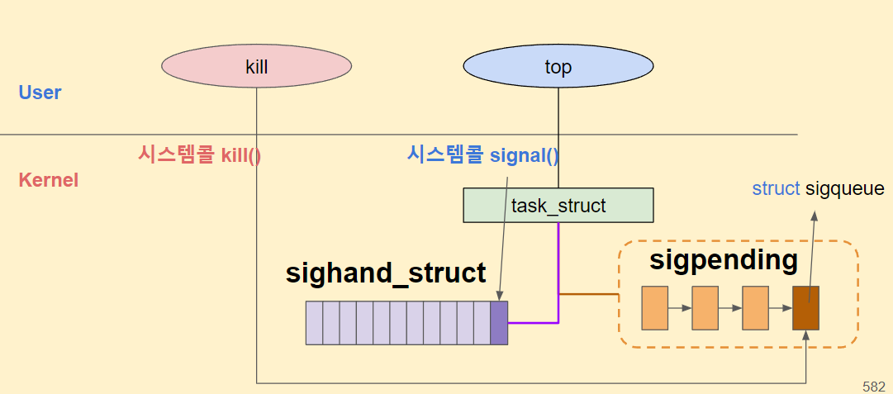


```
# top 프로세스 PID 알아내기 (예시: 2203)
$ ps -ef | grep top
reallin+  2203  2191  1 00:55 pts/4    00:00:00 top  

# top 프로세스 (PID: 2203)에게 kill 시그널(signr: 9) 전송과정 추적하기
$ sudo uftrace record -d kill_sig.uftrace.data --force -K 30 kill -9 2203  

# top 프로세스에 시그널 전송하는 과정 추적결과 확인하기
# 커널 함수 send_signal() 를 찾아보자
$ cd kill_sig.uftrace.data
$ uftrace replay -F __x64_sys_kill@kernel -t 50us
# DURATION     TID     FUNCTION
            [  2209] | __x64_sys_kill() {
            [  2209] |   __task_pid_nr_ns() {
  59.686 us [  2209] |     rcu_read_lock_held();
  68.106 us [  2209] |   } /* __task_pid_nr_ns */
            [  2209] |   kill_something_info() {
            [  2209] |     kill_pid_info() {
            [  2209] |       group_send_sig_info() {
            [  2209] |         check_kill_permission() {
  55.032 us [  2209] |           audit_signal_info();
 164.166 us [  2209] |         } /* check_kill_permission */
            [  2209] |         do_send_sig_info() {
            [  2209] |           send_signal() {
            [  2209] |             __send_signal() {
            [  2209] |               complete_signal() {
...


# top 프로세스에 시그널 전송하는 과정 추적결과 확인하기
# 커널 함수 send_signal() 를 찾아보자
$ cd kill_sig.uftrace.data
$ uftrace replay -F __x64_sys_kill@kernel -t 50us
# DURATION     TID     FUNCTION
            [  2209] | __x64_sys_kill() {
            [  2209] |   __task_pid_nr_ns() {
  59.686 us [  2209] |     rcu_read_lock_held();
  68.106 us [  2209] |   } /* __task_pid_nr_ns */
            [  2209] |   kill_something_info() {
            [  2209] |     kill_pid_info() {
            [  2209] |       group_send_sig_info() {
            [  2209] |         check_kill_permission() {
  55.032 us [  2209] |           audit_signal_info();
 164.166 us [  2209] |         } /* check_kill_permission */
            [  2209] |         do_send_sig_info() {
            [  2209] |           send_signal() {
            [  2209] |             __send_signal() {
            [  2209] |               complete_signal() {
...


```


```
# top 프로세스에 시그널 전송하는 과정 추적결과 확인하기
# 커널 함수 send_signal() 를 찾아보자
$ cd kill_sig.uftrace.data
$ uftrace replay -F __x64_sys_kill@kernel -t 50us
# DURATION     TID     FUNCTION
            [  2209] | __x64_sys_kill() {
            [  2209] |   __task_pid_nr_ns() {
  59.686 us [  2209] |     rcu_read_lock_held();
  68.106 us [  2209] |   } /* __task_pid_nr_ns */
            [  2209] |   kill_something_info() {
            [  2209] |     kill_pid_info() {
            [  2209] |       group_send_sig_info() {
            [  2209] |         check_kill_permission() {
  55.032 us [  2209] |           audit_signal_info();
 164.166 us [  2209] |         } /* check_kill_permission */
            [  2209] |         do_send_sig_info() {
            [  2209] |           send_signal() {
            [  2209] |             __send_signal() {
            [  2209] |               complete_signal() {
...


```


```
# trace_pipe 결과에서 signal_deliver 를 통해서 top 프로세스 입장 시그널 deq되어 처리과정 확인하기
# do_exit 를 통해서 종료 하면서 부모프로세스(bash, 예시 PID: 2191)로 SIGCHID 17 보내는 과정 확인하기
$ cat trace_pipe 
           <...>-2389 : signal_deliver: sig=9 errno=0 code=0 sa_handler=0 sa_flags=0
           <...>-2389 : <stack trace>
 => trace_event_raw_event_signal_deliver
 => get_signal
 => do_signal
 => exit_to_usermode_loop
 => do_syscall_64
 => entry_SYSCALL_64_after_hwframe
             top-2389 : signal_generate: sig=17 errno=0 code=2 comm=bash pid=2191 grp=1 res=0
             top-2389 : <stack trace>
 => trace_event_raw_event_signal_generate
 => __send_signal
 => do_notify_parent
 => do_exit
 => do_group_exit
 => get_signal
 => do_signal
 => exit_to_usermode_loop
 => do_syscall_64
 => entry_SYSCALL_64_after_hwframe


```


```
# 새롭게 top 프로세스 실행하기
$ top

top - 01:21:09 up  7:03,  6 users,  load average: 0.00, 0.00, 0.00
Tasks: 122 total,   1 running,  79 sleeping,   0 stopped,   0 zombie
%Cpu(s):  0.1 us,  0.2 sy,  0.0 ni, 99.7 id,  0.0 wa,  0.0 hi,  0.0 si,  0.0 st
KiB Mem :  2020212 total,  1271704 free,   316056 used,   432452 buff/cache
KiB Swap:  2094076 total,  2094076 free,        0 used.  1670884 avail Mem 
...
Killed

# top 프로세스 kill된 후에 부모 프로세스 PID 확인하기
# top 프로세스(child process)가 종료하면서 부모 프로세스(bash)에게
# SIGCHLD 17 보내는 과정을 /sys/kernel/debug/tracing/trace 결과에서 확인하자!
$ echo $$
2191


```


### signal 


```
# 시그널 테스트 코드
$ vim signal_test.c
$ gcc -o signal_test signal_test.c
$ cat signal_test.c
#include <unistd.h>
#include <stdlib.h>
#include<stdio.h> 
#include<signal.h> 
  
void handle_sigint(int sig) 
{ 
    printf("Caught signal %d\n", sig); 
} 
  
int main() 
{
    signal(SIGINT, SIG_IGN); // Ignore SIGINT
    signal(SIGINT, SIG_DFL); // Use default SIGINT
    signal(SIGINT, handle_sigint); // Set a signal handler

    while (1) {
	    sleep(1);
	    printf("Process Running ...\n");
    }

    return 0; 
}
```

```

root@ubuntu:/sys/kernel/debug/tracing/events# kill -l
 1) SIGHUP       2) SIGINT       3) SIGQUIT      4) SIGILL       5) SIGTRAP
 6) SIGABRT      7) SIGBUS       8) SIGFPE       9) SIGKILL     10) SIGUSR1
11) SIGSEGV     12) SIGUSR2     13) SIGPIPE     14) SIGALRM     15) SIGTERM
16) SIGSTKFLT   17) SIGCHLD     18) SIGCONT     19) SIGSTOP     20) SIGTSTP
21) SIGTTIN     22) SIGTTOU     23) SIGURG      24) SIGXCPU     25) SIGXFSZ
26) SIGVTALRM   27) SIGPROF     28) SIGWINCH    29) SIGIO       30) SIGPWR
31) SIGSYS      34) SIGRTMIN    35) SIGRTMIN+1  36) SIGRTMIN+2  37) SIGRTMIN+3
38) SIGRTMIN+4  39) SIGRTMIN+5  40) SIGRTMIN+6  41) SIGRTMIN+7  42) SIGRTMIN+8
43) SIGRTMIN+9  44) SIGRTMIN+10 45) SIGRTMIN+11 46) SIGRTMIN+12 47) SIGRTMIN+13
48) SIGRTMIN+14 49) SIGRTMIN+15 50) SIGRTMAX-14 51) SIGRTMAX-13 52) SIGRTMAX-12
53) SIGRTMAX-11 54) SIGRTMAX-10 55) SIGRTMAX-9  56) SIGRTMAX-8  57) SIGRTMAX-7
58) SIGRTMAX-6  59) SIGRTMAX-5  60) SIGRTMAX-4  61) SIGRTMAX-3  62) SIGRTMAX-2
63) SIGRTMAX-1  64) SIGRTMAX

```


```
# 시그널 테스트 프로그램
# Ctrl + c 를 통해서 SIGINT 전송
$ ./signal_test

# 다른 터미널에서 시그널 전송
$ whatis kill
$ pidof signal_test
$ kill -SIGINT "PID"

```


#### kill -9 하면 불완전 종료 될 수 있다.

* kill pid 하면 15번이 전달되서 자원을 정상적으로 해제한다
* kill -9 하면 정상적으로 자원을 해제 하지 못하고 종료 된다.  

```
root@ubuntu:/sys/kernel/debug/tracing/events# pidof htop
8032
root@ubuntu:/sys/kernel/debug/tracing/events# kill  8032
root@ubuntu:/sys/kernel/debug/tracing/events# kill -9  8032
bash: kill: (8032) - No such process
root@ubuntu:/sys/kernel/debug/tracing/events# pidof htop
8034
root@ubuntu:/sys/kernel/debug/tracing/events# kill -9  8034
root@ubuntu:/sys/kernel/debug/tracing/events# pidof htop
8038
root@ubuntu:/sys/kernel/debug/tracing/events# kill 8038

```


## network


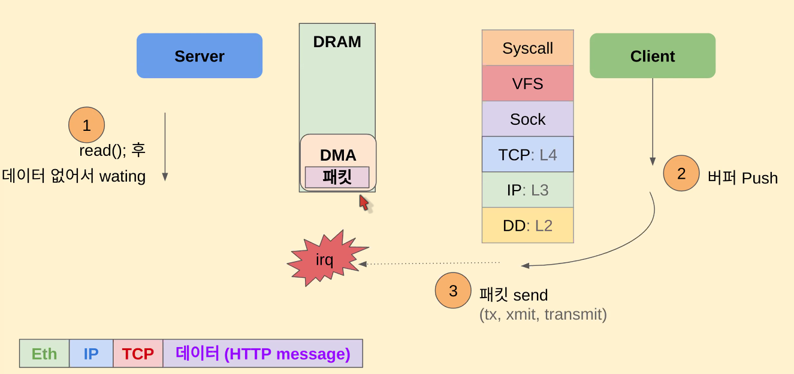


### hard irq vs soft irq

* 후반부 irq 작업이 90% 이상이다.
* 전반부 irq는 짧게 끝난다.

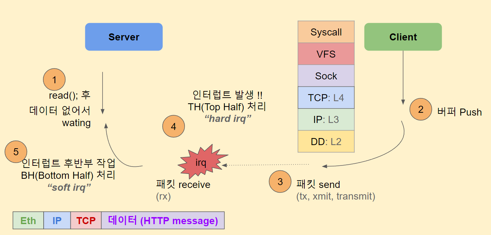


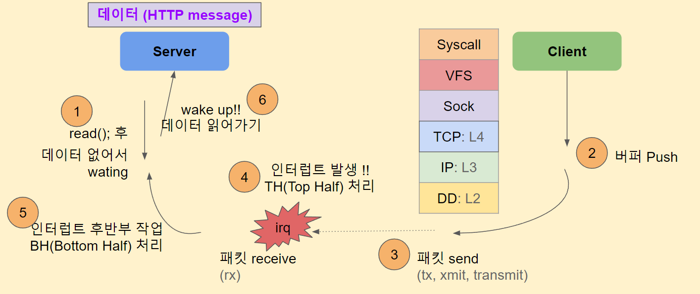


# interrupt


## interrupt

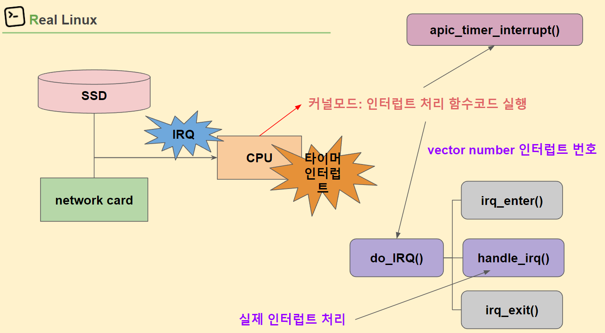


```
root@ubuntu:/proc# cat interrupts
           CPU0       CPU1       CPU2       CPU3
  0:         30          0          0          0   IO-APIC   2-edge      timer
  1:          0          0          9          0   IO-APIC   1-edge      i8042
  8:          0          0          0          0   IO-APIC   8-edge      rtc0
  9:          0          0          0          0   IO-APIC   9-fasteoi   acpi
 12:          0        158          0          0   IO-APIC  12-edge      i8042
 14:          0          0      20982          0   IO-APIC  14-edge      ata_piix
 15:          0          0          0      20970   IO-APIC  15-edge      ata_piix
 19:          0          0        104      47572   IO-APIC  19-fasteoi   enp0s3
 20:          0          3          0          0   IO-APIC  20-fasteoi   vboxguest
 21:       5081          0      34144          0   IO-APIC  21-fasteoi   ahci[0000:00:0d.0]
 22:         26          0          0          0   IO-APIC  22-fasteoi   ohci_hcd:usb1
NMI:          0          0          0          0   Non-maskable interrupts
LOC:     104547      82025      90393     103660   Local timer interrupts  <<=== 236번으로 irq 벡터번호
SPU:          0          0          0          0   Spurious interrupts
PMI:          0          0          0          0   Performance monitoring interrupts
IWI:          0          0          0          0   IRQ work interrupts
RTR:          0          0          0          0   APIC ICR read retries
RES:      50885      60852      43216      43153   Rescheduling interrupts
CAL:       1215       1149       1450       1337   Function call interrupts
TLB:        465        784        684       2601   TLB shootdowns
TRM:          0          0          0          0   Thermal event interrupts
THR:          0          0          0          0   Threshold APIC interrupts
DFR:          0          0          0          0   Deferred Error APIC interrupts
MCE:          0          0          0          0   Machine check exceptions
MCP:         68         68         68         68   Machine check polls
ERR:          0
MIS:          0
PIN:          0          0          0          0   Posted-interrupt notification event
NPI:          0          0          0          0   Nested posted-interrupt event
PIW:          0          0          0          0   Posted-interrupt wakeup event

```


#### interrupt 모니터링

```
watch -n 0.1 "cat /proc/interrupts | grep enp0s3"
watch -n 0.1 "cat /proc/interrupts | grep 'Local timer'"

```


```
# 현재 처리되는 인터럽트 확인하기 
$ cat /proc/interrupts

# 네트워크(enp0s3) 인터럽트 확인하기
# 인터럽트 번호 19번
$ ip link | grep enp0s3
$ cat /proc/interrupts | grep enp0s3
           CPU0       CPU1       CPU2       CPU3       
 19:          0       5187          0      96305   IO-APIC  19-fasteoi   enp0s3  

```


```
# 로컬 타이머 인터럽트 확인하기
# 인터럽트 번호 LOC (0xec: 236번)
$ cat /proc/interrupts | grep "Local timer"
LOC:      58549      72261      76015      70348   Local timer interrupts

# 로컬 타이머 인터럽트 번호(0xec) 확인하기
$ cat arch/x86/include/asm/irq_vectors.h | grep "define LOCAL_TIMER_VECTOR" 
#define LOCAL_TIMER_VECTOR		0xec

# 16진수(0xec)를 10진수(236)로 변환하기
$ echo $((16#ec))
236


```


```
# 리눅스 커널 이벤트 추적준비 tracepoint
$ sudo su
$ cd /sys/kernel/debug/tracing
$ echo 0 > events/enable
$ echo 0 > options/stacktrace
$ echo nop > current_tracer

# 인터럽트 추적하기
$ echo 1 > events/irq/irq_handler_entry/enable
$ echo 1 > events/irq_vectors/local_timer_entry/enable  

# Ctrl + c 로 중단하기
$ cat trace_pipe


```


```
# 다른 터미널에서 로컬 타이머 인터럽트 발생 모니터링
$ $ watch -n 0.1 'cat /proc/interrupts | grep LOC'

LOC:      61282      77615      80973      75653   Local timer interrupts 


# 다른 터미널에서 로컬 타이머 인터럽트 발생 모니터링
$ watch -n 0.1 'cat /proc/interrupts | grep enp0'

19:          0       5187          0     112035   IO-APIC  19-fasteoi   enp0s3 

```


### interrup 소스

####  출발점은 entry_64.S

```
# 인터럽트 처리의 시작점: entry 폴더로 이동하기
$ cd ~/git/linux/
$ cd arch/x86/entry/

# do_IRQ 함수 검색하기
$ vim entry_64.S
...
 603 common_interrupt:
 604         addq    $-0x80, (%rsp)
 605         call    interrupt_entry
 606         UNWIND_HINT_REGS indirect=1
 607         call    do_IRQ  /* rdi points to pt_regs */  
...


```


#### do_irq

```
# 인터럽트 처리 폴더로 이동
$ cd ~/git/linux/
$ cd arch/x86/kernel/

# do_IRQ 함수 검색하기
$ vim irq.c
...
233 __visible unsigned int __irq_entry do_IRQ(struct pt_regs *regs)  
234 {
235         struct pt_regs *old_regs = set_irq_regs(regs);
236         struct irq_desc * desc;
237         /* high bit used in ret_from_ code  */
238         unsigned vector = ~regs->orig_ax;
239 
240         entering_irq();
...
247         if (!handle_irq(desc, regs)) {
...
258 
259         exiting_irq();
 
...


```

#### trace

```
# 리눅스 커널 이벤트 추적준비 tracepoint
$ sudo su
$ cd /sys/kernel/debug/tracing
$ echo 0 > events/enable
$ echo 0 > options/stacktrace
$ echo nop > current_tracer

# 인터럽트 처리함수 do_IRQ() 추적하기
$ echo 1 > events/irq/irq_handler_entry/enable
$ echo do_IRQ > set_graph_function
$ echo function_graph > current_tracer
$ cat trace
...
0)               |  do_IRQ() {
 0)               |    irq_enter() {
...
 0)               |    handle_irq() {
...
 0)               |              /* irq_handler_entry: irq=15 name=ata_piix */  


```


```
# 리눅스 커널 이벤트 추적준비 tracepoint
$ sudo su
$ cd /sys/kernel/debug/tracing
$ echo 0 > events/enable
$ echo 0 > options/stacktrace
$ echo nop > current_tracer

# 인터럽트 처리함수 do_IRQ() 추적하기
$ echo 1 > events/irq/irq_handler_entry/enable 
$ echo do_IRQ > set_graph_function
$ echo function_graph > current_tracer


# CPU 선택해서 trace 결과 확인하기
$ cat per_cpu/cpu3/trace


```


```
# 인터럽트 처리의 시작점: entry 폴더로 이동하기
$ cd ~/git/linux/
$ cd arch/x86/entry/

# do_IRQ 함수 검색하기
$ vim entry_64.S
...
 830 apicinterrupt LOCAL_TIMER_VECTOR        apic_timer_interrupt       smp_apic_timer_interrupt 
...


```


```
# 인터럽트 처리 폴더로 이동
$ cd ~/git/linux/
$ cd arch/x86/kernel/

#  smp_apic_timer_interrupt 함수 검색하기
$ vim apic/apic.c
...
1121 __visible void __irq_entry smp_apic_timer_interrupt(struct pt_regs *regs) 
1122 {
...
1133         entering_ack_irq();
1134         trace_local_timer_entry(LOCAL_TIMER_VECTOR);
1135         local_apic_timer_interrupt();
1136         trace_local_timer_exit(LOCAL_TIMER_VECTOR);
1137         exiting_irq();
...


```


```
# 리눅스 커널 이벤트 추적준비 tracepoint
$ sudo su
$ cd /sys/kernel/debug/tracing
$ echo 0 > events/enable
$ echo 0 > options/stacktrace
$ echo nop > current_tracer

# 인터럽트 처리함수 smp_apic_timer_interrupt() 추적하기
$ echo 1 > events/irq_vectors/local_timer_entry/enable
$ echo smp_apic_timer_interrupt > set_graph_function
$ echo function_graph > current_tracer
$ cat trace
...
 0)               |    smp_apic_timer_interrupt() {
 0)               |      irq_enter() {
 0) + 20.106 us   |        rcu_irq_enter();
 0) + 39.114 us   |      }
 0)               |      /* local_timer_entry: vector=236 */ 
 0)               |      hrtimer_interrupt() {
...
 0)               |                scheduler_tick() {


```


```
# 리눅스 커널 이벤트 추적준비 tracepoint
$ sudo su
$ cd /sys/kernel/debug/tracing
$ echo 0 > events/enable
$ echo 0 > options/stacktrace
$ echo nop > current_tracer

# 인터럽트 처리함수 smp_apic_timer_interrupt() 추적하기
$ echo 1 > events/irq_vectors/local_timer_entry/enable
$ echo smp_apic_timer_interrupt > set_graph_function
$ echo function_graph > current_tracer


# CPU 선택해서 trace 결과 확인하기
$ cat per_cpu/cpu0/trace


```


### soft irq


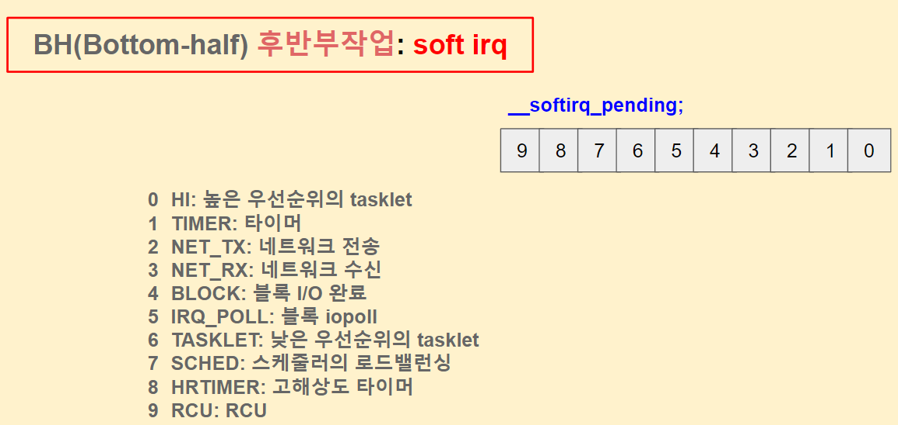


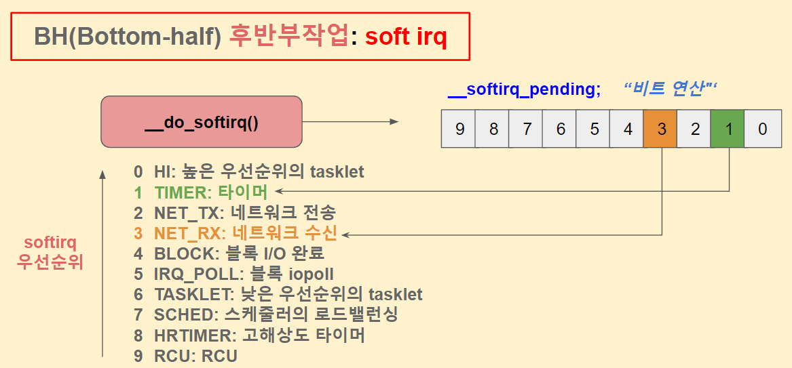


```
# 현재 softirq(인터럽트 후반부작업) 확인하기 
$ cat /proc/softirqs

# 0번째 부터 9번째까지 softirq 확인하기
$ cat /proc/softirqs | grep ":" | nl -v 0

# 타이머(TIMER)와 네트워크 수신(RX) softriq 작업 확인하기 
$ cat /proc/softirqs  | grep TIMER
$ cat /proc/softirqs  | grep RX


```


```
reallinux@ubuntu:~/git/linux/kernel/sched$ ps -ef | grep irq
root        10     2  0 02:47 ?        00:00:00 [ksoftirqd/0]
root        18     2  0 02:47 ?        00:00:00 [ksoftirqd/1]
root        24     2  0 02:47 ?        00:00:00 [ksoftirqd/2]
root        30     2  0 02:47 ?        00:00:00 [ksoftirqd/3]
root       112     2  0 02:47 ?        00:00:00 [vfio-irqfd-clea]
root       918     1  0 02:47 ?        00:00:00 /usr/sbin/irqbalance --foreground
reallin+ 20512  1379  0 08:47 pts/0    00:00:00 grep --color=auto irq

```


```
# 리눅스 커널 이벤트 추적준비 tracepoint
$ sudo su
$ cd /sys/kernel/debug/tracing
$ echo 0 > events/enable
$ echo 0 > options/stacktrace
$ echo nop > current_tracer

# softirq(인터럽트 후반부 작업) 추적하기
$ echo 1 > events/irq/softirq_raise/enable 
$ echo 1 > events/irq/softirq_entry/enable   
$ echo 1 > events/irq/softirq_exit/enable 

# Ctrl + c 로 중단하기
$ cat trace_pipe


```


### 후반부 작업

* 왠만하면 후반부로 작업을 미뤄서 진행한다. 

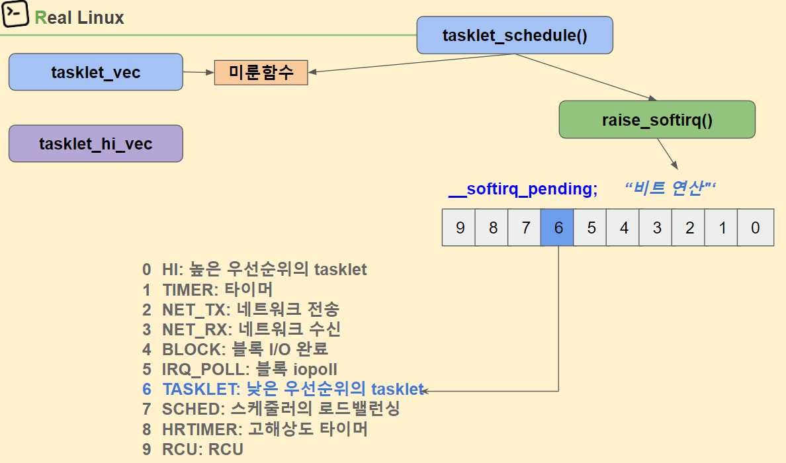


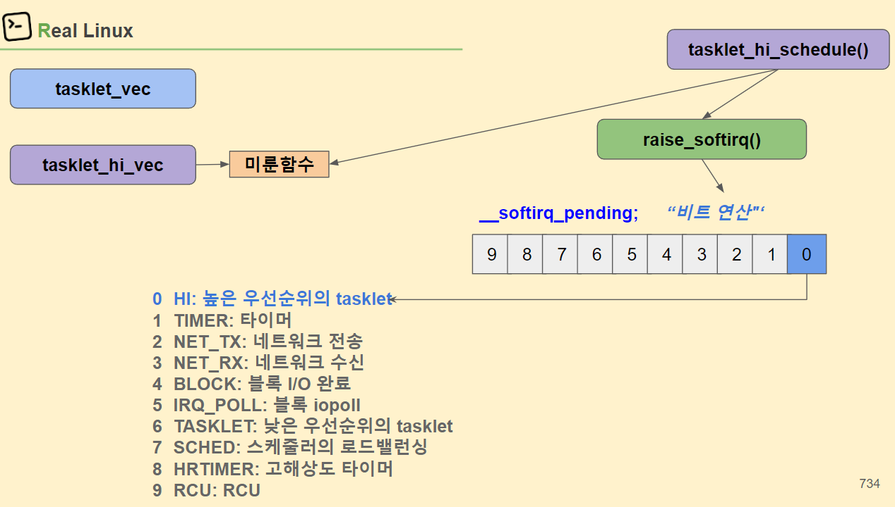


### workqueue


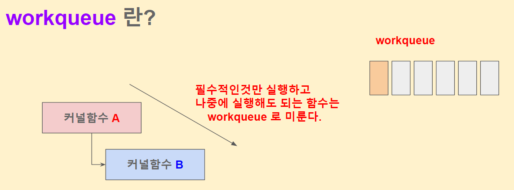


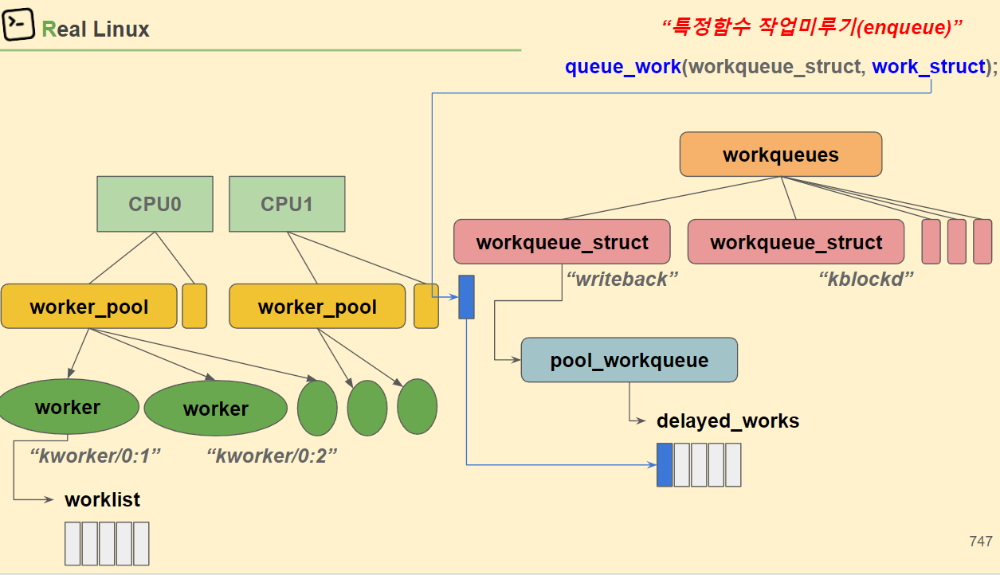


