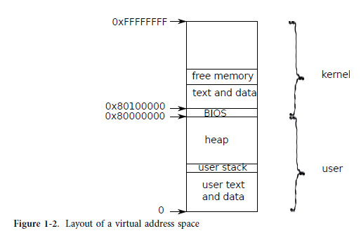

## Process overview

다른 Unix 운영 체제에서와 같이 xv6의 격리 단위는 프로세스입니다.
프로세스 추상화는 한 프로세스가 다른 프로세스의 메모리, CPU, 파일 설명자 등을 손상시키거나 염탐하는 것을 방지합니다. 또한 프로세스가 커널 자체를 손상시키는 것을 방지합니다(즉, 커널이 격리를 시행하는 것을 방지). 버그가 있거나 악의적인 응용 프로그램이 커널이나 하드웨어를 속여 나쁜 일(예: 강제 격리 우회)을 수행할 수 있으므로 커널은 프로세스 추상화를 신중하게 구현해야 합니다. 프로세스를 구현하기 위해 커널이 사용하는 메커니즘에는 사용자/커널 모드 플래그, 주소 공간 및 스레드의 시간 분할이 포함되며 이 하위 섹션에서 개요를 제공합니다.

격리를 적용할 수 있도록 프로세스는 자체 추상 기계가 있다는 환상을 프로그램에 제공하는 추상화입니다. 프로세스는 개인 메모리 시스템 또는 주소 공간으로 보이는 것을 프로그램에 제공합니다.
프로세스는 읽거나 쓸 수 없습니다. 또한 프로세스는 프로그램의 명령을 실행하기 위해 자체 CPU로 보이는 것을 프로그램에 제공합니다.

##### page table 

* 프로세스별 가상 공간 제공하는 방법

Xv6은 페이지 테이블(하드웨어에 의해 구현됨)을 사용하여 각 프로세스에 고유한 주소 공간을 제공합니다.  x86 페이지 테이블은 가상 주소(x86 명령어가 조작하는 주소)를 물리적 주소(주소 프로세서 칩이 메인 메모리로 보내는).

Xv6은 해당 프로세스의 주소 공간을 정의하는 각 프로세스에 대해 별도의 페이지 테이블을 유지 관리합니다. 그림 1-2에서 볼 수 있듯이 주소 공간에는 가상 주소 0에서 시작하는 프로세스의 사용자 메모리가 포함됩니다. 명령어가 먼저 나오고 전역 변수, 스택, 마지막으로 프로세스가 필요에 따라 확장할 수 있는 '힙' 영역(malloc의 경우)이 옵니다.

##### 프로세스의 주소 공간이 커널 주소 공간도 매핑

각 프로세스의 주소 공간은 커널의 명령과 데이터, 사용자 프로그램의 메모리를 매핑합니다. 프로세스가 시스템 호출을 호출하면 시스템 호출이 실행됩니다.
프로세스 주소 공간의 커널 매핑에서. 이 배열은 커널의 시스템 호출 코드가 사용자 메모리를 직접 참조할 수 있도록 존재합니다. 사용자 메모리가 커질 수 있는 공간을 남기기 위해 xv6의 커널 주소 공간은 0x80100000에서 시작하는 상위 주소에서 커널을 매핑합니다.

##### struct proc

xv6 커널은 struct proc(2353)으로 수집하는 각 프로세스에 대한 많은 상태를 유지합니다. 프로세스의 가장 중요한 커널 상태는 페이지 테이블, 커널 스택, 실행 상태입니다. p->xxx 표기법을 사용하여 proc 구조의 요소를 참조합니다.

각 프로세스에는 프로세스의 명령을 실행하는 실행 스레드(줄여서 스레드)가 있습니다. 스레드는 일시 중단되었다가 나중에 재개될 수 있습니다. 프로세스 간에 투명하게 전환하기 위해 커널은 현재 실행 중인 스레드를 일시 중단하고 다른 프로세스의 스레드를 재개합니다.  스레드 상태(로컬 변수, 함수 호출 반환 주소)의 대부분은 스레드의 스택에 저장됩니다. 

##### 사용자 stack과 커널 stack

각 프로세스에는 사용자 스택과 커널 스택(p->kstack)의 두 가지 스택이 있습니다. 프로세스가 사용자 명령을 실행할 때 사용자 스택만 사용 중이며 커널 스택은 비어 있습니다. 프로세스가 커널에 들어갈 때(시스템 호출 또는 인터럽트를 위해) 커널 코드는 프로세스의 커널 스택; 프로세스가 커널에 있는 동안 사용자 스택에는 여전히 저장된 데이터가 포함되지만 활발히 사용되지는 않습니다. 프로세스의 스레드는 사용자 스택과 커널 스택을 번갈아 사용합니다. 커널 스택은 별도의(사용자 코드로부터 보호됨) 프로세스가 사용자 스택을 망가뜨린 경우에도 커널이 실행할 수 있습니다.

##### systemcall 권한 수준

프로세스가 시스템 호출을 만들 때 프로세서는 커널 스택으로 전환하고 하드웨어 권한 수준을 높이고 시스템 호출을 구현하는 커널 명령 실행을 시작합니다. 시스템 호출이 완료되면 커널은 사용자 공간으로 돌아갑니다. 하드웨어는 권한 수준을 낮추고 사용자 스택으로 다시 전환하고 시스템 호출 명령 직후에 사용자 명령 실행을 재개합니다. 프로세스의 스레드는 I/O를 기다리기 위해 커널에서 '차단'할 수 있으며 I/O가 완료되면 중단된 위치에서 재개할 수 있습니다.
p->state는 프로세스가 할당되었는지, 실행할 준비가 되었는지, 실행 중인지, I/O를 기다리고 있는지 또는 종료하는지 나타냅니다.

##### page directory

p->pgdir은 x86 하드웨어가 예상하는 형식으로 프로세스의 페이지 테이블을 보유합니다.
xv6은 페이징 하드웨어가 해당 프로세스를 실행할 때 프로세스의 p->pgdir을 사용하도록 합니다. 프로세스의 페이지 테이블은 또한 프로세스의 메모리를 저장하기 위해 할당된 물리적 페이지 주소의 레코드 역할을 합니다.