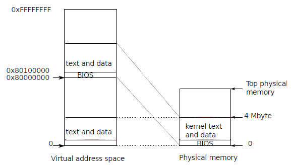
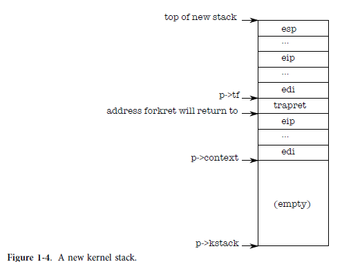

## code : the first address space

xv6 구조를 보다 구체적으로 만들기 위해 커널이 

* 첫 번째 주소 공간(자체적으로)을 만드는 방법, 
* 커널이 첫 번째 프로세스를 만들고 시작하는 방법, 
* 해당 프로세스가 만드는 첫 번째 시스템 호출을 살펴봅니다. 

이러한 작업을 추적하여 xv6이 프로세스에 대해 강력한 격리를 제공하는 방법을 자세히 알 수 있습니다. 강력한 격리를 제공하는 첫 번째 단계는 커널이 자체 주소 공간에서 실행되도록 설정하는 것입니다. 

강력한 결리를 제공하는 첫번 째 방법은 커널이 자체 주소 공간에서 실행되도록 하는 것이다. 

PC는 전원이 켜지면 스스로 초기화한 다음 디스크에서 메모리로 부트로더를 로드하여 실행합니다. 부록 B에서 자세한 내용을 설명합니다. Xv6의 부트 로더는 디스크에서 xv6 커널을 로드하고 항목(1040)에서 시작하여 실행합니다. 커널이 시작될 때 x86 페이징 하드웨어는 활성화되지 않습니다. 가상 주소는 실제 주소에 직접 매핑됩니다.

##### 왜 0x100000 2^20 1MB 주소에서 시작하는 가?

* 2가지 이유 : 큰메모리 없을 수 있고, 0xa0000:0x100000에는 IO 장치 주소가 포함되어 있어서...

부트 로더는 xv6 커널을 물리적 주소 0x100000의 메모리에 로드합니다.
커널이 명령과 데이터를 찾을 것으로 예상하는 0x80100000에서 커널을 로드하지 않는 이유는 작은 머신에서 그렇게 높은 주소에 물리적 메모리가 없을 수 있기 때문입니다. 커널을 0x0이 아닌 0x100000에 배치하는 이유는 주소 범위 0xa0000:0x100000에 I/O 장치가 포함되어 있기 때문입니다.

##### KERNBASE : 0x80000000 2GB

나머지 커널이 실행될 수 있도록 항목은 0x80000000 (KERNBASE이라고 함)에서 시작하는 가상 주소를 0x0에서 시작하는 물리적 주소로 매핑하는 페이지 테이블을 설정합니다(그림 1-2 참조). 동일한 물리적 메모리 범위에 매핑되는 두 가지 범위의 가상 주소를 설정하는 것은 페이지 테이블의 일반적인 사용이며 이와 같은 더 많은 예를 보게 될 것입니다.

* 커널에서 사용하려는 page table을  임시로 구성하기 위해서  PTE (PPN+flage)로 구성된 page table을 구성하는 내용과 관련되어 있다.
* PTE의 0번 항목은 가상주소 0:0x400000을 물리적 주소 0:0x400000 매핑
* PTE 512개 *4KB => 2MB 밖에 안되는데... PTE가 1024되어야 할것 같은데 이것 512개 엔트리는 좀 이상하네....
* 아무튼 이것은 초기 에 이렇게 page table을 구성한다는것 그리고 삭제 한다는 것.
* 여기서 4MB 아래의 사용 주소를 하위 주소라고 하고 이것은 삭제된다. 그리고 이것을 넘어서는 주소는 상위 주소라고 한다. 

엔트리 페이지 테이블은 main.c(1311)에 정의되어 있습니다. 2장에서 페이지 테이블의 세부 사항을 살펴보지만 간단히 말하면 항목 0은 가상 주소 0:0x400000을 물리적 주소 0:0x400000에 매핑한다는 것입니다. 이 매핑은 항목이 낮은 주소에서 실행되는 동안 필요하지만 결국 제거됩니다.
항목 512는 가상 주소 ERNBASE:KERNBASE+0x400000을 물리적 주소에 매핑합니다.
0:0x400000. 이 항목은 항목이 완료된 후 커널에서 사용됩니다. 커널이 명령과 데이터를 찾을 것으로 예상하는 상위 가상 주소를 부트 로더가 로드한 하위 물리적 주소에 매핑합니다. 이 매핑은 커널 명령어와 데이터를 4MB로 제한합니다.

##### entrypgdir => %cr3 로드

* MMU에게 알려준다. 페이지 시스템의 엔트리 주소를...%cr3
* 페이징 하드웨어 MMU 활성화를 위해서 %cr0에 CR0_PG 설정
* 아무튼 PTE를 먼저 

항목으로 돌아가서 entrypgdir의 물리적 주소를 제어 레지스터 %cr3에 로드합니다.  페이징 하드웨어는 아직 가상 주소를 변환하는 방법을 모르기 때문에 entrypgdir의 물리적 주소를 알아야 합니다. 아직 페이지 테이블이 없습니다. 기호 entrypgdir은 상위 메모리의 주소를 참조하고 매크로 V2P_WO(0220)는 물리적 주소를 찾기 위해 KERNBASE를 뺍니다. 페이징 하드웨어를 활성화하기 위해 xv6은 제어 레지스터 %cr0에 플래그 CR0_PG를 설정합니다.
프로세서는 페이징이 활성화된 후에도 여전히 낮은 주소에서 명령을 실행하고 있습니다. 이는 entrypgdir이 낮은 주소를 매핑하기 때문에 작동합니다. xv6이 entrypgdir에서 항목 0을 생략한 경우 페이징을 활성화한 명령 다음에 명령을 실행하려고 할 때 컴퓨터가 충돌했을 것입니다.

##### 커널 스텍포인터 지정

* 커널 스텍 주소는 상위 주소를 사용하기 때문에 커널 페이지 테이블이 삭제 되도 유효하다.
* main 으로 점프 한다. (간접 점프 한다. 스텍에는 리턴 주소 없다.)

이제 항목을 커널의 C 코드로 전송하고 높은 메모리에서 실행해야 합니다.
먼저 스택 포인터 %esp가 스택으로 사용할 메모리를 가리키도록 합니다(1054). 스택을 포함한 모든 기호에는 상위 주소가 있으므로 하위 매핑이 제거되더라도 스택은 여전히 유효합니다. 마지막으로 항목은 상위 주소인 main으로 점프합니다. 간접 점프가 필요합니다. 그렇지 않으면 어셈블러가 PC 기준 직접 점프를 생성하여 메인 메모리가 적은 버전을 실행하기 때문입니다. 스택에 리턴 PC가 없기 때문에 Main은 리턴할 수 없습니다. 이제 커널은 main(1217) 기능의 상위 주소에서 실행됩니다.

