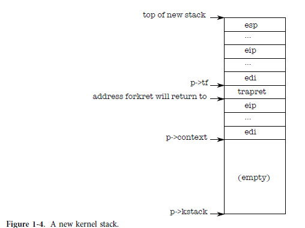

## Code: creating the first process

##### 사용자 프로세스 생성과 격리

이제 커널은 자체 주소 공간 내에서 실행됩니다. 커널이 사용자 수준 프로세스를 생성하고 커널과 사용자 수준 프로세스 사이, 그리고 프로세스 자체 간에 강력한 격리를 보장하는 방법을 살펴봅니다.

#### userinit

* allocproc : struct proc에서 porc 할당 
* UNUSED -> EMBRYO -> RUNNING

main은 여러 장치와 하위 시스템을 초기화한 후 userinit(1239)를 호출하여 첫 번째 프로세스를 생성합니다. Userinit의 첫 번째 작업은 allocproc을 호출하는 것입니다. 

#### allocproc

* proc  할당한다. 
* 커널 스택 구성한다. (초기 커널 stack 구성, trapret, forklet 주소 할당)
* page table은 구성하지 않는다.  

allocproc(2455)의 작업은 프로세스 테이블에 슬롯(struct proc)을 할당하고 커널 스레드가 실행되는 데 필요한 프로세스 상태의 일부를 초기화하는 것입니다. Allocproc은 각각의 새 프로세스에 대해 호출되는 반면 userinit는 맨 처음 프로세스에 대해서만 호출됩니다.
Allocproc은 상태가 UNUSED(2461-2463)인 슬롯에 대해 proc 테이블을 스캔합니다. 사용되지 않은 슬롯을 찾으면 allocproc은 상태를 EMBRYO로 설정하여 사용된 것으로 표시하고 프로세스에 고유한 pid(2451-2469)를 제공합니다. 다음으로 프로세스의 커널 스레드에 커널 스택을 할당하려고 시도합니다. 메모리 할당이 실패하면 allocproc은 상태를 다시 UN-USED로 변경하고 신호 실패에 대해 0을 반환합니다.

##### 커널 스텍에 항목 추가 

* 기존 main jump 할때 사용한 커널의 스텍에 사용자 프로세스 등록하면서 최초의 프로세스 내용을 스텍에 추가한다.
* 최초 사용자 프로세스를 커널 스텍에 추가하여 불씨를 살린다.
* allocporc은 fork에서도 사용하기 때문에 fork syscall 처리와 유사하다.




이제 allocproc은 새 프로세스의 커널 스택을 설정해야 합니다. allocproc은 첫 번째 프로세스를 생성할 때 뿐만 아니라 fork에서도 사용할 수 있도록 작성되었습니다.

allocproc은 특별히 준비된 커널 스택과 커널 레지스터 세트를 사용하여 새 프로세스를 설정하여 처음 실행될 때 사용자 공간으로 '반환'되도록 합니다.

 준비된 커널 스택의 레이아웃은 그림 1-4와 같습니다. allocproc은 새 프로세스의 커널 스레드가 먼저 forkret에서 실행된 다음 trapret(2486-2491)에서 실행되도록 하는 반환 프로그램 카운터 값을 설정하여 이 작업의 일부를 수행합니다.

 커널 스레드는 p->context에서 복사한 레지스터 내용으로 실행을 시작합니다. 따라서 p->context->eip를 forkret으로 설정하면 커널 스레드가 forkret(2783) 시작 시 실행됩니다. 이 함수는 스택 맨 아래에 있는 주소로 반환합니다. 컨텍스트 전환 코드(2958)는 p->context의 끝 바로 너머를 가리키도록 스택 포인터를 설정합니다.

allocproc places p->context on the stack, and puts a pointer to trapret just above it; that is where forkret will return.

trapret은 커널 스택의 맨 위에 저장된 값에서 사용자 레지스터를 복원하고 프로세스로 점프합니다(3277).
이 설정은 일반 포크와 첫 번째 프로세스 생성에 대해 동일하지만 후자의 경우 프로세스가 포크에서 반환되는 위치가 아니라 사용자 공간 위치 0에서 실행을 시작합니다.

```c
//  Look in the process table for an UNUSED proc.
//  If found, change state to EMBRYO and initialize
//  state required to run in the kernel.
//  Otherwise return 0.
static struct proc * allocproc(void)
{
  struct proc *p;
  char *sp;

  acquire(&ptable.lock);

  for (p = ptable.proc; p < &ptable.proc[NPROC]; p++)
    if (p->state == UNUSED)
      goto found;

  release(&ptable.lock);
  return 0;

found:
  p->state = EMBRYO;
  p->pid = nextpid++;

  release(&ptable.lock);

  // Allocate kernel stack.
  if ((p->kstack = kalloc()) == 0)
  {
    p->state = UNUSED;
    return 0;
  }
  sp = p->kstack + KSTACKSIZE;

  // Leave room for trap frame.
  sp -= sizeof *p->tf;
  p->tf = (struct trapframe *)sp;

  // Set up new context to start executing at forkret,
  // which returns to trapret.
  sp -= 4;
  *(uint *)sp = (uint)trapret;

  sp -= sizeof *p->context;
  p->context = (struct context *)sp;
  memset(p->context, 0, sizeof *p->context);
  p->context->eip = (uint)forkret;

  return p;
}
```


##### trapframe 구성 

* 커널에서 사용자 프로세스로 되 돌아  올수 있도록 커널 스택 상태를  구성한다. 

3장에서 볼 수 있듯이 사용자 소프트웨어에서 커널로 제어가 전송되는 방식은 시스템 호출, 인터럽트 및 예외에서 사용되는 인터럽트 메커니즘을 통한 것입니다. 프로세스가 실행되는 동안 제어가 커널로 이전될 때마다 하드웨어 및 xv6 트랩 항목 코드는 프로세스의 커널 스택에 사용자 레지스터를 저장합니다.
userinit는 프로세스가 인터럽트(2514-2520)를 통해 커널에 들어갔을 때 있었던 값과 똑같이 보이는 값을 새 스택의 맨 위에 기록하므로 커널에서 프로세스의 사용자에게 다시 반환하기 위한 일반 코드 코드가 작동합니다.
이 값은 사용자 레지스터를 저장하는 struct trapframe입니다. 이제 그림 1-4와 같이 새 프로세스의 커널 스택이 완전히 준비되었습니다.

* 커널 스택이 준비된 상태...

```c
void userinit(void)
{
  struct proc *p;
  extern char _binary_initcode_start[], _binary_initcode_size[];

  p = allocproc();

  initproc = p;
  if ((p->pgdir = setupkvm()) == 0)
    panic("userinit: out of memory?");
  inituvm(p->pgdir, _binary_initcode_start, (int)_binary_initcode_size);
  p->sz = PGSIZE;
  memset(p->tf, 0, sizeof(*p->tf));
  p->tf->cs = (SEG_UCODE << 3) | DPL_USER;
  p->tf->ds = (SEG_UDATA << 3) | DPL_USER;
  p->tf->es = p->tf->ds;
  p->tf->ss = p->tf->ds;
  p->tf->eflags = FL_IF;
  p->tf->esp = PGSIZE;
  p->tf->eip = 0; // beginning of initcode.S

  safestrcpy(p->name, "initcode", sizeof(p->name));
  p->cwd = namei("/");

  // this assignment to p->state lets other cores
  // run this process. the acquire forces the above
  // writes to be visible, and the lock is also needed
  // because the assignment might not be atomic.
  acquire(&ptable.lock);

  p->state = RUNNABLE;

  release(&ptable.lock);
}
```


#### initcode.S

첫 번째 프로세스는 작은 프로그램(initcode.S; (8200))을 실행할 것입니다. 프로세스는 이 프로그램을 저장할 물리적 메모리가 필요하고 프로그램을 해당 메모리에 복사해야 하며 프로세스는 해당 메모리를 참조하는 페이지 테이블이 필요합니다.


##### setupkvm이용한 커널 page table 구성

userinit는 setupkvm(1837)을 호출하여 커널이 사용하는 메모리에 대해서만 (처음에는) 매핑이 있는 프로세스에 대한 페이지 테이블을 생성합니다. 우리는 이 기능을 2장에서 자세히 공부할 것이지만 높은 수준에서 setupkvm과 userinit는 다음과 같이 주소 공간을 생성합니다.
그림 1-2에 나와 있습니다.
첫 번째 프로세스 메모리의 초기 내용은 init-code.S의 컴파일된 형식입니다. 커널 빌드 프로세스의 일부로 링커는 해당 바이너리를 커널에 포함하고 바이너리의 위치와 크기를 나타내는 두 개의 특수 기호 _binary_initcode_start 및 _binary_initcode_size를 정의합니다. Userinit는 물리적 메모리의 한 페이지를 할당하고 가상 주소 0을 해당 메모리에 매핑하고 해당 페이지에 바이너리를 복사하는 inituvm을 호출하여 해당 바이너리를 새 프로세스의 메모리에 복사합니다(1903).

##### trapframe 구성

그런 다음 userinit는 초기 사용자 모드 상태로 트랩 프레임(0602)을 설정합니다. %cs 레지스터에는 권한 수준 DPL_USER(즉, 커널 모드가 아닌 사용자 모드)에서 실행되는 SEG_UCODE 세그먼트에 대한 세그먼트 선택기가 포함되어 있으며 유사하게 %ds, % es 및 %ss는 DPL_USER 권한으로 SEG_UDATA를 사용합니다. %eflags FL_IF 비트는 하드웨어 인터럽트를 허용하도록 설정됩니다. 우리는 이것을 3장에서 재검토할 것이다.

스택 포인터 %esp는 프로세스의 가장 큰 유효한 가상 주소 p->sz로 설정됩니다.
명령어 포인터는 초기화 코드의 진입점인 주소 0으로 설정됩니다.
userinit 함수는 주로 디버깅을 위해 p->name을 initcode로 설정합니다. p->cwd를 설정하면 프로세스의 현재 작업 디렉토리가 설정됩니다. namei는 6장에서 자세히 살펴보겠습니다.
프로세스가 초기화되면 userinit는 p->state를 RUNNABLE로 설정하여 예약 가능한 것으로 표시합니다.

```asm
# Initial process execs /init.
# This code runs in user space.

#include "syscall.h"
#include "traps.h"

# exec(init, argv)
.globl start
start:
  pushl $argv
  pushl $init
  pushl $0  // where caller pc would be
  movl $SYS_exec, %eax
  int $T_SYSCALL

# for(;;) exit();
exit:
  movl $SYS_exit, %eax
  int $T_SYSCALL
  jmp exit

# char init[] = "/init\0";
init:
  .string "/init\0"

# char *argv[] = { init, 0 };
.p2align 2
argv:
  .long init
  .long 0
```


```

```

