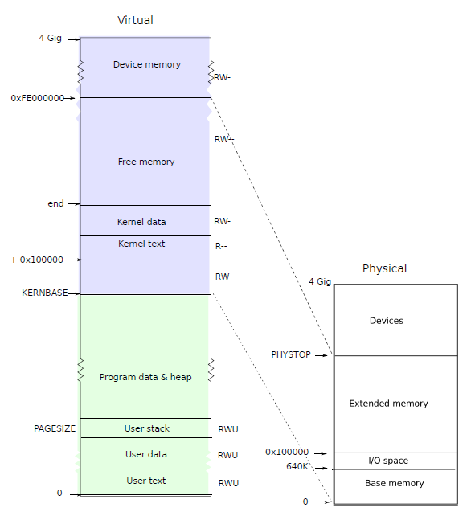

## Process address space

**enrty**에 의해서 생성된 page table은 커널 C 코드가 실행 시작하기에 충분하게 매핑되어 있다. 

그러나 커널은 프로세스 주소 공간을 설명하기 위한 보다 정교한 계획이 있기 때문에 main은 kvmalloc 을 호출하여 즉시 새 페이지 테이블로 변경합니다.

```c
int main(void)
{
  kinit1(end, P2V(4 * 1024 * 1024));  // phys page allocator
  kvmalloc();                         // kernel page table
..}
```

* 스케쥴러 프로세스를 위한 커널 주소 공간을 위해서 페이지 테이블 할당 받는다. 

```c
// Allocate one page table for the machine for the kernel address space for scheduler processes.
void kvmalloc(void)
{
  kpgdir = setupkvm();
  switchkvm();
}

// Set up kernel part of a page table.
pde_t * setupkvm(void)
{
  pde_t *pgdir;
  struct kmap *k;

  if ((pgdir = (pde_t *)kalloc()) == 0)
    return 0;
  memset(pgdir, 0, PGSIZE);
  if (P2V(PHYSTOP) > (void *)DEVSPACE)
    panic("PHYSTOP too high");
  for (k = kmap; k < &kmap[NELEM(kmap)]; k++)
    if (mappages(pgdir, k->virt, k->phys_end - k->phys_start,(uint)k->phys_start, k->perm) < 0)
    {
      freevm(pgdir);
      return 0;
    }
  return pgdir;
}

// This table defines the kernel's mappings, which are present in every process's page table.
static struct kmap
{
  void *virt;
  uint phys_start;
  uint phys_end;
  int perm;
} kmap[] = {
    {(void *)KERNBASE, 0, EXTMEM, PTE_W},   // I/O space
    {(void *)KERNLINK, V2P(KERNLINK), V2P(data), 0}, // kern text+rodata
    {(void *)data, V2P(data), PHYSTOP, PTE_W}, // kern data+memory
    {(void *)DEVSPACE, DEVSPACE, 0, PTE_W},  // more devices
};
```

* kmap은 모든 프로세스의 page table에 존재한다. 
* page table은 PTE(PPN + flag)의 모음이다. 

각 프로세스는 분리된 page table (protected 되었다고 이야기 하는 바로 그 부분)을 가지고 있고, xv6는 페이지 테이블 하드웨어 (MMU)에게 페이지 테이블을 스위칭 하도록  알려줘야 한다.  (MMU에게 알려줘야 한다.)

#### 가상 주소와 Addresss Space

아래 그림에서 보여 준 것 처럼 프로세스의 사용자 메모리는 virtual address의 0 번지에서 시작하여 KERNBASE까지 증가 하는 것을 보여 준다. 프로세스의 주소가 2GB까지 증가될 수 있다.  `memlayout.h`에서  xv6 메모리 layout 구성을 보여 준다. 



##### page table에 할당되는 주소 공간

프로세스당 하나의 페이지 테이블과 CPU가 프로세스를 실행하지 않을 때 사용되는 하나(kpgdir)가 있습니다.

*  프로세스 당 하나의 페이지 테이블 이 있다 (이것은 프로세스 주소와 커널 주소가 포함된다.)
* CPU가 프로세스를 실행하지 않을때는 스케쥴러에 있을때 인데 이것을 위한 페이지 테이블이 있다는 의미인것 같다.

커널은 시스템 호출과 인터럽트 동안 현재 프로세스의 페이지 테이블을 사용합니다. 페이지 보호 비트는 사용자 코드가 커널의 매핑을 사용하는 것을 방지합니다.

 setupkvm() 및 exec()는 다음과 같이 모든 페이지 테이블을 설정합니다. (두가지 경우 모두 커널 주소를 page table에 반영한다는 뜻)

* 0..KERNBASE: 커널이 할당한 물리적 메모리에 매핑된 사용자 메모리(텍스트+데이터+스택+힙)
* KERNBASE..KERNBASE+EXTMEM: 0..EXTMEM에 매핑됨(I/O 공간용)
* KERNBASE+EXTMEM..data: 커널 명령 및 r/o 데이터에 대해 EXTMEM..V2P(data)에 매핑됨
* data..KERNBASE+PHYSTOP: V2P(data)..PHYSTOP에 매핑됨, rw 데이터 + 사용 가능한 물리적 메모리
* 0xfe000000..0: 직접 매핑됨(ioapic과 같은 장치)

커널은 V2P(end)와 물리적 메모리 끝(PHYSTOP)(end..P2V(PHYSTOP)에서 직접 주소 지정 가능) 사이의 힙 및 사용자 메모리에 대한 물리적 메모리를 할당합니다. (커널 공간에 사용자 메모리를 할당하는 것이 좀 이상하다.)

이 테이블은 모든 프로세스의 페이지 테이블에 있는 커널의 매핑을 정의합니다.

```c
// Memory layout

#define EXTMEM  0x100000    // Start of extended memory
#define PHYSTOP 0xE000000   // Top physical memory
#define DEVSPACE 0xFE000000 // Other devices are at high addresses

// Key addresses for address space layout (see kmap in vm.c for layout)
#define KERNBASE 0x80000000  // First kernel virtual address
#define KERNLINK (KERNBASE+EXTMEM)  // Address where kernel is linked

#define V2P(a) (((uint) (a)) - KERNBASE)
#define P2V(a) ((void *)(((char *) (a)) + KERNBASE))

#define V2P_WO(x) ((x) - KERNBASE)    // same as V2P, but without casts
#define P2V_WO(x) ((x) + KERNBASE)    // same as P2V, but without casts
```

##### 프로세스가 더 많은 메모리를 요청할때

프로세스가 xv6에 더 많은 메모리를 요청할 때 xv6은 먼저 저장공간를 제공하기 위해 여유 물리적 페이지를 찾은 다음 새 물리적 페이지를 가리키는 프로세스의 페이지 테이블에 PTE를 추가합니다.

xv6은 이러한 PTE에서 PTE_U, PTE_W 및 PTE_P 플래그를 설정합니다.

대부분의 프로세스는 전체 사용자 주소 공간을 사용하지 않습니다. xv6은 사용되지 않은 PTE에서 PTE_P를 비워둡니다.

다른 프로세스의 페이지 테이블은 사용자 주소를 물리적 메모리의 다른 페이지로 변환하므로 각 프로세스에는 개인 사용자 메모리가 있습니다.

##### 프로세스 페이지 테이블에 모든 매핑이 포함 : 커널 주소, user 주소

xv6는 모든 프로세스의 페이지 테이블에서 커널을 수행할 수 있도록 필요한 모든 매핑이 포함되어 있다.  (이 것이 무엇을 의미하는지 한참 고민했는데... 모든 사용자 프로세스가 사용하는 페이지 테이블에서 커널 코드를 수행할 수 있는 커널 주소도 매핑되어 있다는 뜻이다.)

Xv6에는 커널이 모든 프로세스의 페이지 테이블에서 실행되는 데 필요한 모든 매핑이 포함되어 있습니다. 이러한 매핑은 모두 KERNBASE 위에 나타납니다. 가상 주소 KERN-BASE:KERNBASE+PHYSTOP을 :PHYSTOP에 매핑합니다. 이 매핑의 한 가지 이유는 커널이 자체 명령과 데이터를 사용할 수 있기 때문입니다.

또 다른 이유는 예를 들어 페이지 테이블 페이지를 생성할 때 커널이 물리적 메모리의 주어진 페이지를 쓸 수 있어야 하는 경우가 있기 때문입니다. 모든 물리적 페이지가 예측 가능한 가상 주소에 나타나도록 하면 편리합니다.

이 arrangement의 결함은 xv6이 2GB 이상의 물리적 메모리를 사용할 수 없다는 것입니다.

메모리 매핑된 I/O를 사용하는 일부 장치는 0xFE000000에서 시작하는 물리적 주소에 나타나므로 직접 매핑을 포함하는 xv6 페이지 테이블입니다. Xv6은 KERN-BASE 이상의 PTE에 PTE_U 플래그를 설정하지 않으므로 커널만 사용할 수 있습니다.  (아~~ 사용자가 사용하는 주소 부분과 커널이 사용하는 부분을 flag를 통해서 분리한다는 뜻이구나)

##### 모든 프로세스의 사용자 메모리와 전체 커널 매핑 포함

* 이렇게 하면 시스템 호출이나 인터럽트 동안 페이지 테이블 전환이 발생하지 않는 장점이 있다.

모든 프로세스의 페이지 테이블에 사용자 메모리와 전체 커널에 대한 매핑이 포함되어 있으면 시스템 호출 및 인터럽트 동안 사용자 코드에서 커널 코드로 전환할 때 편리합니다. 이러한 전환에는 페이지 테이블 전환이 필요하지 않습니다.
대부분의 경우 커널에는 자체 페이지 테이블이 없습니다. 거의 항상 일부 프로세스의 페이지 테이블을 빌리고 있습니다.


다시 한번 생각해보자 . 

* xv6은 각 프로세스가 자체 메모리만 사용할 수 있고 각 프로세스가 메모리를 0에서 시작하는 연속적인 가상 주소를 갖는다
* xv6은 프로세스의 자체 메모리를 참조하는 가상 주소의 PTE에만 PTE_U 비트를 설정하여 첫 번째를 구현합니다. (커널과 유저 메모리 구분 방법)
* 연속적인 가상 주소를 프로세스에 할당된 물리적 페이지로 변환하는 페이지 테이블의 기능을 사용하여 두 번째를 구현합니다. (연속적인 가상 주소 개념은 segment 개념인데.. 어차피 상위 20 비트를 확인해서 PPN을 찾아 내는 것이 중요 하다는 것...)