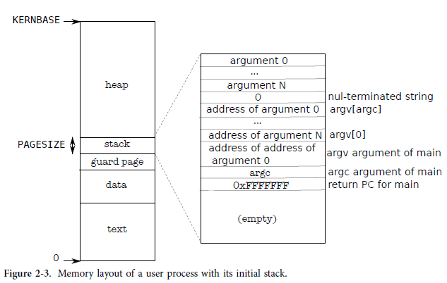

## User part of an address space

xv6에서 실행 프로세스의 사용자 메모리 layout이다. 



##### heap

* heap은 stack 위에 있다 그래서 확장될 수 있다. (뭔말인가? 연속 주소 공간으로 확장할 수 있다는 의미인가?)

##### stack 

* 스택은 단일 페이지이며 exec에 의해 생성된 초기 내용과 함께 표시됩니다.
* 명령줄 인수를 포함하는 문자열과 이에 대한 포인터 배열은 스택의 맨 위에 있습니다.
* 그 바로 아래에는 main(argc, argv) 함수 호출이 막 시작된 것처럼 프로그램이 main에서 시작할 수 있도록 하는 값이 있습니다.

##### guard page

* 스택 페이지에서 자라나는 스택을 보호하기 위해 xv6은 스택 바로 아래에 보호 페이지를 배치합니다.
* 가드 페이지는 매핑되지 않으므로 스택이 스택 페이지를 벗어나면 하드웨어는 오류 주소를 변환할 수 없기 때문에 예외를 생성합니다.


```c
int exec(char *path, char **argv)
{
  char *s, *last;
  int i, off;
  uint argc, sz, sp, ustack[3 + MAXARG + 1];
  struct elfhdr elf;
  struct inode *ip;
  struct proghdr ph;
  pde_t *pgdir, *oldpgdir;
  struct proc *curproc = myproc();

  begin_op();
  if ((ip = namei(path)) == 0)  { ... }
  // Check ELF header
  // Load program into memory.
  end_op();

  // Allocate two pages at the next page boundary.
  // Make the first inaccessible.  Use the second as the user stack.
  // Push argument strings, prepare rest of stack in ustack.
  for (argc = 0; argv[argc]; argc++)
  {
    if (argc >= MAXARG)      goto bad;
    sp = (sp - (strlen(argv[argc]) + 1)) & ~3;
    if (copyout(pgdir, sp, argv[argc], strlen(argv[argc]) + 1) < 0)  goto bad;
    ustack[3 + argc] = sp;
  }
  ustack[3 + argc] = 0;
  ustack[0] = 0xffffffff; // fake return PC
  ustack[1] = argc;
  ustack[2] = sp - (argc + 1) * 4; // argv pointer

  sp -= (3 + argc + 1) * 4;
  // Save program name for debugging.
  // Commit to the user image.
  oldpgdir = curproc->pgdir;
  curproc->pgdir = pgdir;
  curproc->sz = sz;
  curproc->tf->eip = elf.entry; // main
  curproc->tf->esp = sp;
  switchuvm(curproc);
  freevm(oldpgdir);
}

```


