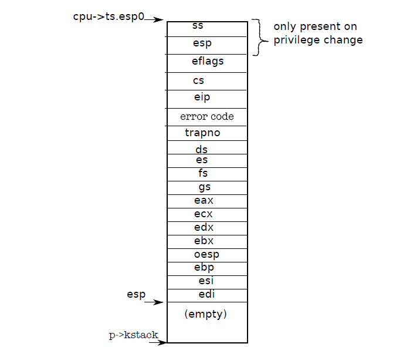

## Code: The first system call

1장의 끝에서 initcode.S에서 systemcall을 호출하는 것을 보여 줬지. 그것을 다시 한번 생각해보자. 프로세스는 exec systemcall 수행을 위한 argment를 Process 스택에 저장한다. (어디에… process’s stack), 그리고 systemcall을 하는 번호는 %eax에 저정해서 systemcall 번호를 알 수 있도록 한다. systemcall 번호는 function 포인터를 담고 있는 테이블을 이용해서 찾아 가게 된다. 그리고 sys_exec에 대한 아그먼트를 추출할 수 있다.왜냐 하면  userprocess의 Stack에 담겨 놓고 그것이 kernel stack의 esp에 저장되어 있기 때문이다. 그래서 이런 systemcall을 생각하면서 우리는 interrup 처리에 대해서도 동일하게 생각해 볼 수 있는 것이다.


##### cpu state

```c
// Per-CPU state
struct cpu {
  uchar apicid;                // Local APIC ID
  struct context *scheduler;   // swtch() here to enter scheduler
  struct taskstate ts;         // Used by x86 to find stack for interrupt
  struct segdesc gdt[NSEGS];   // x86 global descriptor table
  volatile uint started;       // Has the CPU started?
  int ncli;                    // Depth of pushcli nesting.
  int intena;                  // Were interrupts enabled before pushcli?
  struct proc *proc;           // The process running on this cpu or null
};
```

##### taskstate 

```c

// Task state segment format
struct taskstate {
  uint link;         // Old ts selector
  uint esp0;         // Stack pointers and segment selectors
  ushort ss0;        // after an increase in privilege level
  ushort padding1;
  uint *esp1;
  ushort ss1;
  ushort padding2;
  uint *esp2;
  ushort ss2;
  ushort padding3;
  void *cr3;         // Page directory base
  uint *eip;         // Saved state from last task switch
  uint eflags;
  uint eax;          // More saved state (registers)
  uint ecx;
  uint edx;
  uint ebx;
  uint *esp;
  uint *ebp;
  uint esi;
  uint edi;
  ushort es;         // Even more saved state (segment selectors)
  ushort padding4;
  ushort cs;
  ushort padding5;
  ushort ss;
  ushort padding6;
  ushort ds;
  ushort padding7;
  ushort fs;
  ushort padding8;
  ushort gs;
  ushort padding9;
  ushort ldt;
  ushort padding10;
  ushort t;          // Trap on task switch
  ushort iomb;       // I/O map base address
};
```


##### cpu->ts.esp 




