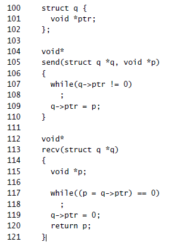
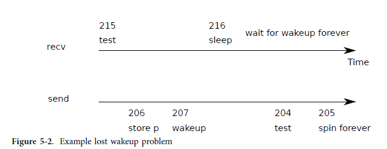
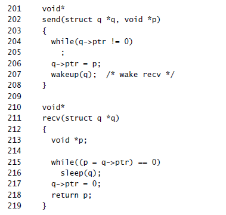
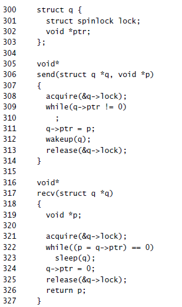
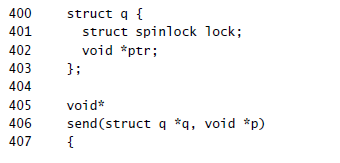
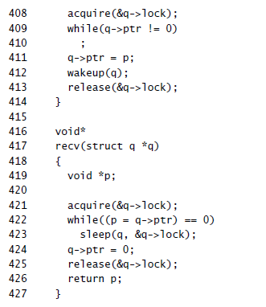

## Sleep and wakeup

스케줄링과 잠금은 한 프로세스의 존재를 다른 프로세스로부터 은폐하는 데 도움이 되지만, 지금까지는 프로세스가 의도적으로 상호 작용하는 데 도움이 되는 추상화가 없습니다. 슬립과 웨이크업은 그 공백을 채우고, 한 프로세스는 이벤트를 기다리며 슬립을 하고 다른 프로세스는 이벤트가 발생하면 깨우게 합니다. 절전 및 깨우기는 종종 시퀀스 조정 또는 조건부 동기화 메커니즘이라고 하며 운영 체제 문헌에는 다른 유사한 메커니즘이 많이 있습니다.

의미를 설명하기 위해 간단한 생산자/소비자 대기열을 살펴보겠습니다. 이 대기열은 프로세스에서 IDE 드라이버로 명령을 공급하는 대기열과 유사하지만(3장 참조) 모든 IDE 관련 코드를 추상화합니다. 큐를 사용하면 한 프로세스가 다른 프로세스에 0이 아닌 포인터를 보낼 수 있습니다. 발신자와 수신자가 하나만 있고 서로 다른 CPU에서 실행되고 컴파일러가 너무 적극적으로 최적화하지 않은 경우 다음 구현이 정확합니다.

큐가 비어 있을 때까지 루프를 보낸 다음(ptr == 0) 포인터 p를 큐에 넣습니다. Recv는 큐가 비어 있지 않고 포인터를 꺼낼 때까지 루프합니다. 다른 프로세스에서 실행될 때 send와 recv는 모두 q->ptr을 수정하지만 send는 0일 때만 포인터를 쓰고 recv는 0이 아닐 때만 포인터를 씁니다. 따라서 업데이트가 없습니다.
손실됩니다.
위의 구현은 비용이 많이 듭니다. 보낸 사람이 거의 보내지 않으면 받는 사람은 포인터를 기다리면서 대부분의 시간을 while 루프에서 회전하는 데 보냅니다. 수신기가 CPU를 양보하고 포인터가 전달된 경우에만 다시 시작할 수 있는 방법이 있다면 수신기의 CPU는 보다 생산적인 작업을 찾을 수 있습니다.

다음과 같이 작동하는 한 쌍의 호출(수면 및 기상)을 상상해 보겠습니다.
Sleep(chan)은 대기 채널이라고 하는 임의의 값 chan에서 휴면합니다. 절전 모드는 호출 프로세스를 절전 모드로 전환하여 다른 작업을 위해 CPU를 해제합니다. Wakeup(chan)은 chan(있는 경우)에서 잠자는 모든 프로세스를 깨워 잠자기 호출이 반환되도록 합니다. chan을 기다리고 있는 프로세스가 없으면 wakeup은 아무 작업도 수행하지 않습니다. 절전 및 깨우기를 사용하도록 대기열 구현을 변경할 수 있습니다.

Recv는 이제 회전하는 대신 CPU를 포기합니다. 그러나 이 인터페이스를 사용하여 "웨이크업 분실" 문제로 알려진 문제 없이 절전 및 깨우기를 설계하는 것은 간단하지 않은 것으로 나타났습니다(그림 5-2 참조). recv가 215행에서 q->ptr == 0임을 발견했다고 가정합니다. recv가 215행과 215행 사이에 있는 동안
216, send는 다른 CPU에서 실행됩니다. q->ptr을 0이 아닌 값으로 변경하고 절전 모드에서 잠자는 프로세스를 찾지 않고 아무 작업도 수행하지 않는 wakeup을 호출합니다. 이제 recv는 줄 216에서 계속 실행됩니다. 절전 모드를 호출하고 절전 모드로 전환됩니다. 이로 인해 문제가 발생합니다. recv는 이미 도착한 포인터를 기다리는 잠자기 상태입니다. 다음 보내기는 대기 중입니다.
recv가 큐의 포인터를 소비하기 위해 시스템이 교착 상태가 됩니다.
이 문제의 근본 원인은 q->ptr== 0일 때만 recv가 잠자는 불변량이 잘못된 순간에 실행되는 send에 의해 위반된다는 것입니다. 불변을 보호하는 잘못된 방법 중 하나는 recv에 대한 코드를 다음과 같이 수정하는 것입니다.

잠금이 라인 322와 323 사이에서 실행되는 것을 방지하기 때문에 이 버전의 recv가 손실된 깨우기를 피할 수 있기를 바랄 수도 있습니다. 그렇게 하지만 교착 상태도 발생합니다. recv는 잠자는 동안 잠금을 유지하므로 발신자는 영원히 대기를 차단합니다 자물쇠를 위해.
호출 프로세스가 절전 모드로 표시되고 절전 채널에서 대기한 후 잠금을 해제할 수 있도록 잠금을 절전 모드로 전달하여 앞의 구성표를 수정합니다.
잠금은 동시 전송이 수신기가 스스로를 절전 모드로 전환하는 것을 완료할 때까지 기다리도록 하여 절전 모드에서 잠자는 수신기를 찾아 깨울 것입니다. 수신기가 다시 깨어나면 sleep은 반환하기 전에 잠금을 다시 획득합니다. 새로운 올바른 구성표는 다음과 같이 사용할 수 있습니다.

recv가 q->lock을 유지한다는 사실은 send가 recv의 q->ptr 확인과 sleep 호출 사이에 깨우려고 시도하는 것을 방지합니다. 물론 수신 프로세스는 잠자는 동안 q->lock을 해제해야 발신자가 깨울 수 있습니다. 그래서 우리는 sleep이 원자적으로 q->lock을 해제하고 수신 프로세스를 휴면 상태로 만들기를 원합니다.
완전한 발신자/수신자 구현은 수신자가 이전 전송의 값을 소비할 때까지 대기할 때 전송 중에도 잠자기 상태가 됩니다.