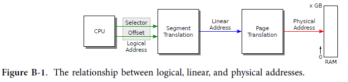
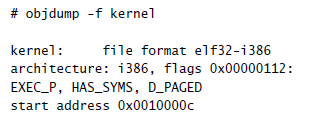

## the boot loader

* BIOS : 하드웨어 준비
* boot 디스크의 첫번째 sector 512바이트 읽음 => 부트 로더
* 0x7c00 에 디스크 부트 섹터를 로딩한다. (%ip 설정)
* bootasm.S, bootmain.c

x86 PC가 부팅되면 마더보드의 비휘발성 메모리에 저장된 BIOS라는 프로그램을 실행하기 시작합니다. BIOS의 역할은 하드웨어를 준비한 다음 제어를 운영 체제로 이전하는 것입니다. 특히 부트 디스크의 첫 번째 512바이트 섹터인 부트 섹터에서 로드된 코드로 제어를 전달합니다.
부트 섹터에는 커널을 메모리에 로드하는 부트 로더: 명령이 포함되어 있습니다.
BIOS는 메모리 주소 0x7c00에서 부트 섹터를 로드한 다음 해당 주소로 점프(프로세서의 %ip 설정)합니다. 부트 로더가 실행을 시작하면 프로세서는 Intel 8088을 시뮬레이션하고 로더의 작업은 프로세서를 보다 현대적인 운영 모드로 전환하고 xv6 커널을 디스크에서 메모리로 로드한 다음 제어를 커널로 이전하는 것입니다. xv6 부트 로더는 16비트 및 32비트 x86 어셈블리(bootasm.S; (8900))와 C(bootmain.c; (9000))의 조합으로 작성된 두 개의 소스 파일로 구성됩니다.

## code: Assembly bootstrap

* 첫번째는 인터럽트 비활성화 : cli

부트 로더의 첫 번째 명령은 프로세서 인터럽트를 비활성화하는 cli(8912)입니다. 인터럽트는 하드웨어 장치가 인터럽트 핸들러라고 하는 운영 체제 기능을 호출하는 방법입니다.
BIOS는 작은 운영 체제이며 하드웨어 초기화의 일부로 자체 인터럽트 처리기를 설정했을 수 있습니다.
그러나 BIOS는 더 이상 실행되지 않으므로(부트 로더는 실행됨) 하드웨어 장치의 인터럽트를 처리하는 것은 더 이상 적절하지 않거나 안전하지 않습니다. xv6이 준비되면(3장에서) 인터럽트를 다시 활성화합니다.

* 8080 리얼모드 : 8개 16비트 레지스터, 20비트 주소, 세그먼트 %cd %ds  %es %ss

프로세서는 Intel 8088을 시뮬레이트하는 리얼 모드에 있습니다. 리얼 모드에는 8개의 16비트 범용 레지스터가 있지만 프로세서는 20비트의 주소를 메모리로 보냅니다. 세그먼트 레지스터 %cs, %ds, %es 및 %ss는 16비트 레지스터에서 20비트 메모리 주소를 생성하는 데 필요한 추가 비트를 제공합니다. 프로그램이 메모리 주소를 참조할 때 프로세서는 자동으로 세그먼트 레지스터 중 하나의 값의 16배를 추가합니다. 이 레지스터의 너비는 16비트입니다. 어떤 세그먼트 레지스터가 일반적으로 메모리 참조 종류에 내재되어 있는지: 명령 가져오기는 %cs를 사용하고 데이터 읽기 및 쓰기는 %ds를 사용하며 스택 읽기 및 쓰기는 %ss를 사용합니다.

#### 논리 주소 -> 물리주소

* virtual address가 아니라 Logical address : segment와 offset 

Xv6은 x86 명령어가 메모리 피연산자에 대해 가상 주소를 사용하는 것처럼 가장하지만 x86 명령어는 실제로 논리 주소를 사용합니다(그림 B-1 참조). 논리 주소는 세그먼트 선택기와 오프셋으로 구성되며 때로는 세그먼트:오프셋으로 작성됩니다. 더 자주 세그먼트는 암시적이며 프로그램은 오프셋만 직접 조작합니다. MMU를 의미하는 는 것 같은데... Segment hardware는 위에서 설명한 변환을 수행하여 선형 주소를 생성합니다. 페이징 하드웨어가 활성화되면(2장 참조) 선형 주소를 물리적 주소로 변환합니다. 그렇지 않으면 프로세서는 선형 주소를 물리적 주소로 사용합니다.



#### segment hardware

* segment hardware 구성

부트 로더는 페이징 하드웨어를 활성화하지 않습니다. 사용하는 논리 주소는 Segment 하드웨어에 의해 선형 주소로 변환된 다음 실제 주소로 직접 사용됩니다. Xv6은 변환할 Segment hardware를 구성합니다.
변경 없이 논리적 주소를 선형 주소로 변경하므로 항상 동일합니다. 역사적 이유로 우리는 가상 주소라는 용어를 프로그램에 의해 조작된 주소를 지칭하는 데 사용했습니다. xv6 가상 주소는 x86 논리 주소와 동일하며 다음과 같습니다.
Segment hardware가 매핑하는 선형 주소입니다. 페이징이 활성화되면 시스템에서 유일하게 흥미로운 주소 매핑은 선형 대 물리적입니다. 

* 최초에 하는 일은 일단 segment 초기화 

BIOS는 %ds, %es, %ss의 내용에 대해 아무 것도 보장하지 않으므로 인터럽트를 비활성화한 후 가장 먼저 해야 할 일은 %ax를 0으로 설정한 다음 해당 0을 %ds, %es 및 %ss에 복사하는 것입니다( 8915-8918).

* virtual segment:offset

가상 세그먼트:오프셋은 21비트 물리적 주소를 생성할 수 있지만 Intel 8088은 20비트 메모리만 주소 지정할 수 있으므로 상위 비트: 0xffff0+0xffff =0x10ffef를 버렸지만 8088의 가상 주소 0xffff:0xffff는 다음을 참조했습니다. 물리적 주소 0x0ffef. 일부 초기 소프트웨어는 21번째 주소 비트를 무시하는 하드웨어에 의존했기 때문에 Intel이 20비트 이상의 물리적 주소를 가진 프로세서를 도입했을 때 IBM은 PC 호환 하드웨어에 대한 요구 사항인 호환성 해킹을 제공했습니다. 키보드 컨트롤러 출력 포트의 두 번째 비트가 낮으면 21번째 물리적 주소 비트가 항상 지워집니다. 높으면 21번째 비트가 정상적으로 작동합니다. 부트 로더는 포트 0x64 및 0x60(8920-8936)에서 키보드 컨트롤러에 대한 I/O를 사용하여 21번째 주소 비트를 활성화해야 합니다.

##### protected mode

리얼 모드의 16비트 범용 및 세그먼트 레지스터는 프로그램이 65,536바이트 이상의 메모리를 사용하는 것을 어색하게 만들고 메가바이트 이상을 사용하는 것은 불가능합니다. 80286 이후 x86 프로세서에는 물리적 주소가 더 많은 비트를 가질 수 있는 보호 모드와 (80386 이후) "32비트" 모드가 있습니다.
레지스터, 가상 주소 및 대부분의 정수 산술이 16비트가 아닌 32비트로 수행되도록 합니다. xv6 부트 시퀀스는 다음과 같이 보호 모드와 32비트 모드를 활성화합니다.

##### Segment descriptor

* protected mode에서 protect라는 개념... 물론 page table을 이용한 격리도 보호의 의미가 있지만 일단은 protected라는 것은 segment descriptor에서 lit와 flag를 통한 보호의 개념이 있다.

보호 모드에서 세그먼트 레지스터는 세그먼트 설명자 테이블에 대한 인덱스입니다(그림 B-2 참조). 각 테이블 항목은 기본 물리적 주소, 제한이라고 하는 최대 가상 주소 및 세그먼트에 대한 권한 비트를 지정합니다. 이러한 권한은 보호 모드에서의 보호입니다. 커널은 이를 사용하여 프로그램이 자체 메모리만 사용하도록 할 수 있습니다.


##### xv6에서 segement 적용 

* 어쩐지 그냥 심플하게 적용했더라...

xv6은 세그먼트를 거의 사용하지 않습니다. 2장에서 설명한 대로 페이징 하드웨어를 대신 사용합니다. 부트 로더는 세그먼트 설명자 테이블 gdt(8982-8985)를 설정하여 모든 세그먼트가 0의 기본 주소와 가능한 최대 제한(4GB)을 갖도록 합니다. 테이블에는 null 항목, 실행 코드에 대한 항목 하나, 데이터에 대한 항목 하나가 있습니다. 코드 세그먼트 설명자에는 코드가 32비트 모드(0660)에서 실행되어야 함을 나타내는 플래그 세트가 있습니다. 이 설정을 사용하면 부트 로더가 보호 모드에 들어갈 때 논리적 주소가 물리적 주소에 일대일로 매핑됩니다.

##### GDT : Global Descriptor Table 

* 이것은 커널의 기둥이다.

부트 로더는 lgdt 명령(8941)을 실행하여 gdt 테이블을 가리키는 값 gdtdesc(8987-8989)로 프로세서의 GDT(전역 설명자 테이블) 레지스터를 로드합니다.

* GDT 활성화 이후에 Protected mode 활성화 시킨다. 

GDT 레지스터를 로드하면 부트 로더는 레지스터 %cr0(8942-8944)에서 1비트(CR0_PE)를 설정하여 보호 모드를 활성화합니다. 보호 모드를 활성화해도 프로세서가 논리적 주소를 물리적 주소로 변환하는 방식이 즉시 변경되는 것은 아닙니다. 프로세서가 GDT를 읽고 내부 분할 설정을 변경하는 것은 세그먼트 레지스터에 새 값을 로드할 때만 가능합니다. %cs를 직접 수정할 수 없으므로 대신 코드가 코드를 허용하는 ljmp(원거리 점프) 명령(8953)을 실행합니다.
지정할 세그먼트 선택기. 점프는 다음 줄(8956)에서 계속 실행되지만 그렇게 하면 gdt의 코드 설명자 항목을 참조하도록 %cs가 설정됩니다. 해당 설명자는 32비트 코드 세그먼트를 설명하므로 프로세서는 32비트 모드로 전환됩니다. 부트 로더는 8088에서 80286, 80386으로의 진화를 통해 프로세서를 지원했습니다.

#### SEG_KDATA

* data segment 초기화
* 이제 논리 주소가 물리 주소로 매핑된다.
* 이제는 스텍만 구성하면 C 코드를 실행할 준비가 된다.
* xv6 커널을 0x100000 1MB에 로딩한다. 왜? ㅎㅎ 
* 0x7c00에 커널 스택을 구성한다. (0x7c00에서 역방향으로 커널이 성장하면 부트 코드는 침범하지 않음)

32비트 모드에서 부트로더의 첫 번째 작업은 SEG_KDATA(8958-8961)로 데이터 세그먼트 레지스터를 초기화하는 것입니다. 이제 논리적 주소가 물리적 주소에 직접 매핑됩니다. C 코드를 실행하기 전에 남은 유일한 단계는 사용되지 않는 메모리 영역에 스택을 설정하는 것입니다. 0xa0000에서 0x100000까지의 메모리는 일반적으로 Device 메모리 영역으로 가득 차 있으며 xv6 커널은 0x100000에 위치할 것으로 예상합니다. 부트 로더 자체는 0x7c00부터 0x7d00까지 있습니다. 기본적으로 메모리의 다른 섹션은 스택을 위한 좋은 위치가 될 것입니다. 부트 로더는 0x7c00(이 파일에서 $start로 알려짐)을 스택의 맨 위로 선택합니다. 스택은 부트 로더에서 멀어지는 0x0000쪽으로 거기에서 아래로 자랄 것입니다. (스택은 주소 역방향으로 진행한다는 이야기.)

마지막으로 부트 로더는 C 기능 bootmain(8968)을 호출합니다. Bootmain의 역할은 커널을 로드하고 실행하는 것입니다. 문제가 발생한 경우에만 반환됩니다. 이 경우 코드는 포트 0x8a00(8970-8976)에서 몇 가지 출력 단어를 보냅니다.
실제 하드웨어에서는 해당 포트에 연결된 장치가 없으므로 이 코드는 아무 작업도 수행하지 않습니다. 부트 로더가 PC 시뮬레이터 내에서 실행 중인 경우 포트 0x8a00은 시뮬레이터 자체에 연결되고 제어를 시뮬레이터로 다시 전송할 수 있습니다. 시뮬레이터 여부에 관계없이 코드는 무한 루프(8977-8978)를 실행합니다. 실제 부트 로더는 먼저 오류 메시지를 인쇄하려고 시도할 수 있습니다.

부트 로더의 마지막 단계는 커널의 진입점을 호출하는 것입니다. 이는 커널이 실행을 시작할 것으로 예상하는 명령입니다. xv6의 경우 항목 주소는 0x10000c입니다.





규칙에 따라 _start 기호는 파일 entry.S(1036)에 정의된 ELF 진입점을 지정합니다. xv6은 아직 가상 메모리를 설정하지 않았기 때문에 xv6의 진입점은 진입점의 물리적 주소(1040)입니다.


```asm
#include "asm.h"
#include "memlayout.h"
#include "mmu.h"

# Start the first CPU: switch to 32-bit protected mode, jump into C.
# The BIOS loads this code from the first sector of the hard disk into
# memory at physical address 0x7c00 and starts executing in real mode
# with %cs=0 %ip=7c00.

.code16                       # Assemble for 16-bit mode
.globl start
start:
  cli                         # BIOS enabled interrupts; disable

  # Zero data segment registers DS, ES, and SS.
  xorw    %ax,%ax             # Set %ax to zero
  movw    %ax,%ds             # -> Data Segment
  movw    %ax,%es             # -> Extra Segment
  movw    %ax,%ss             # -> Stack Segment

  # Physical address line A20 is tied to zero so that the first PCs 
  # with 2 MB would run software that assumed 1 MB.  Undo that.
seta20.1:
  inb     $0x64,%al               # Wait for not busy
  testb   $0x2,%al
  jnz     seta20.1

  movb    $0xd1,%al               # 0xd1 -> port 0x64
  outb    %al,$0x64

seta20.2:
  inb     $0x64,%al               # Wait for not busy
  testb   $0x2,%al
  jnz     seta20.2

  movb    $0xdf,%al               # 0xdf -> port 0x60
  outb    %al,$0x60

  # Switch from real to protected mode.  Use a bootstrap GDT that makes
  # virtual addresses map directly to physical addresses so that the
  # effective memory map doesn't change during the transition.
  lgdt    gdtdesc
  movl    %cr0, %eax
  orl     $CR0_PE, %eax
  movl    %eax, %cr0

//PAGEBREAK!
  # Complete the transition to 32-bit protected mode by using a long jmp
  # to reload %cs and %eip.  The segment descriptors are set up with no
  # translation, so that the mapping is still the identity mapping.
  ljmp    $(SEG_KCODE<<3), $start32

.code32  # Tell assembler to generate 32-bit code now.
start32:
  # Set up the protected-mode data segment registers
  movw    $(SEG_KDATA<<3), %ax    # Our data segment selector
  movw    %ax, %ds                # -> DS: Data Segment
  movw    %ax, %es                # -> ES: Extra Segment
  movw    %ax, %ss                # -> SS: Stack Segment
  movw    $0, %ax                 # Zero segments not ready for use
  movw    %ax, %fs                # -> FS
  movw    %ax, %gs                # -> GS

  # Set up the stack pointer and call into C.
  movl    $start, %esp
  call    bootmain

  # If bootmain returns (it shouldn't), trigger a Bochs
  # breakpoint if running under Bochs, then loop.
  movw    $0x8a00, %ax            # 0x8a00 -> port 0x8a00
  movw    %ax, %dx
  outw    %ax, %dx
  movw    $0x8ae0, %ax            # 0x8ae0 -> port 0x8a00
  outw    %ax, %dx
spin:
  jmp     spin

# Bootstrap GDT
.p2align 2                                # force 4 byte alignment
gdt:
  SEG_NULLASM                             # null seg
  SEG_ASM(STA_X|STA_R, 0x0, 0xffffffff)   # code seg
  SEG_ASM(STA_W, 0x0, 0xffffffff)         # data seg

gdtdesc:
  .word   (gdtdesc - gdt - 1)             # sizeof(gdt) - 1
  .long   gdt                             # address gdt

```


