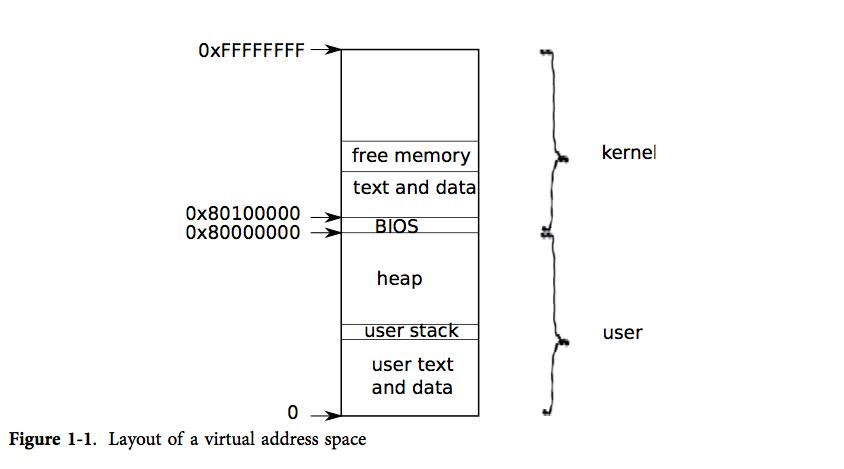
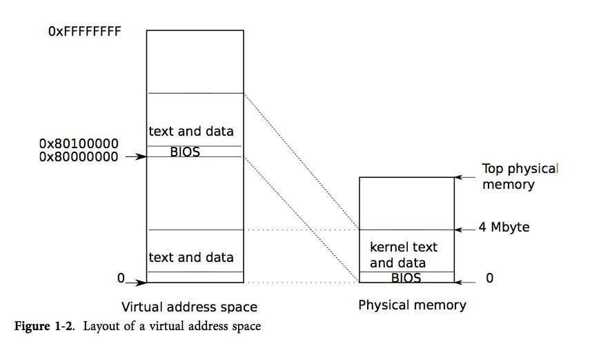
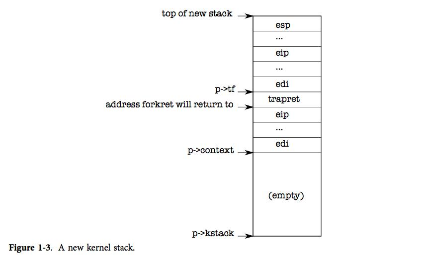

## xv6 소스 코드 분석 - 첫 번째 사용자 프로세스

### 프로세스 정보

프로세스는 프로그램이 기계를 독점적으로 소유하고 있다고 가정할 수 있도록 하는 추상적인 개념입니다. 이 프로세스는 프로그램에 다른 프로세스가 읽고 쓸 수 없는 "외견상" 개인 메모리 공간과 프로그램만 실행하는 "외상" CPU를 제공합니다. Xv6은 페이지 테이블(하드웨어)을 사용하여 각 프로세스에 고유한 주소 공간을 제공하고 페이지 테이블은 가상 주소를 물리적 주소에 매핑합니다.

Xv6은 가상 주소 0에서 시작하는 사용자 메모리를 포함하여 각 프로세스에 대해 0xFFFFFFFF의 메모리 주소를 가상화합니다. 해당 주소는 프로세스의 명령이 배치되는 가장 낮은 위치이고 전역 변수, 스택 영역 및 "힙"이 뒤따릅니다. 사용자가 필요에 따라 확장할 수 있는 영역(malloc의 경우)입니다.

커널의 명령과 데이터도 각 프로세스의 주소 공간에 매핑됩니다. 프로세스가 시스템 호출을 사용할 때 시스템 호출은 실제로 프로세스 주소 공간의 커널 영역에서 실행됩니다. 이 디자인을 통해 커널의 시스템 호출 코드가 사용자 메모리를 직접 가리킬 수 있습니다. 사용자에게 충분한 메모리 공간을 남기기 위해 xv6은 커널을 0x80100000에서 시작하는 주소 공간의 상위 주소에 매핑합니다.

Xv6은 struct proc 구조를 사용하여 프로세스의 많은 상태를 유지합니다.

```c
// Per-process state
struct proc {
  uint sz;                     // Size of process memory (bytes)
     pde_t* pgdir; // Page table
     char *kstack; // Bottom of kernel stack for this process
     enum procstate state; // Process state running state
     int pid; // Process ID Process ID
  struct proc *parent;         // Parent process 
     struct trapframe *tf; // Trap frame for current syscall The register saved by the current system call
     struct context *context; // swtch() here to run process process switching context information
  void *chan;                  // If non-zero, sleeping on chan
  int killed;                  // If non-zero, have been killed
  struct file *ofile[NOFILE];  // Open files
  struct inode *cwd;           // Current directory
  char name[16];               // Process name (debugging)
};
```


프로세스의 가장 중요한 상태는 페이지 테이블, 커널 스택 및 현재 실행 상태입니다.

각 프로세스에는 해당 프로세스의 명령을 실행하는 스레드(Thread)가 있습니다. 스레드는 일시적으로 일시 중단되고 나중에 다시 실행될 수 있습니다. 프로세스 간의 시스템 전환은 실제로 현재 실행 중인 스레드를 일시 중단하고 다른 프로세스의 스레드를 재개합니다. 대부분의 스레드 상태(로컬 변수 및 함수 호출 반환 주소)는 스레드 스택에 저장됩니다.

각 프로세스에는 사용자 스택과 커널 스택(p->kstack)이 있습니다. 프로세스가 사용자 명령을 실행할 때 사용자 스택만 사용되며 커널 스택은 비어 있습니다. 그러나 프로세스가 커널에 진입하면(시스템 호출 또는 인터럽트를 통해) 커널 코드는 커널 스택에서 실행됩니다. 프로세스가 커널에 있을 때 해당 사용자 스택은 여전히 데이터를 보유하지만 일시적으로 비활성화됩니다. 프로세스의 스레드는 사용자 스택과 커널 스택을 번갈아 사용합니다. 커널 스택은 사용자 코드에서 사용할 수 없으므로 프로세스가 사용자 스택을 파괴하더라도 커널은 계속 실행할 수 있습니다.

프로세스가 시스템 호출을 사용할 때 프로세서는 하드웨어 권한 수준 을 향상시키기 위해 커널 스택으로 이동 한 다음 시스템 호출에 해당하는 커널 코드를 실행합니다. 시스템 호출이 완료되면 커널 공간에서 사용자 공간으로 돌아갑니다. 하드웨어 권한 수준을 낮추고 사용자 스택으로 전송하고 시스템 호출 명령 후에 사용자 명령 실행을 재개합니다. 스레드는 커널에서 "차단"하고 I/O를 기다리고 I/O가 끝난 후 작업을 재개할 수 있습니다.

* P->state indicates the state of the process: new, ready, running, waiting for I/O or exiting.

* New: The process is being created and has not yet turned to the ready state.

* Ready: The process has obtained all the required resources except the processor
* Running: The process is running on the processor.
* Blocking: The process is waiting for an event and suspended.
* Exit: The process is disappearing from the system, divided into normal end and abnormal exit.

### 첫 번째 주소 공간



PC의 전원을 켜면 자체적으로 초기화된 후 디스크에서 메모리로 부트로더를 로드하여 실행합니다. 그런 다음 부트 로더는 디스크에서 xv6 커널을 로드하고 항목에서 실행합니다. xv6의 페이징 하드웨어는 현재 작동을 시작하지 않았습니다. 따라서 이때 가상 주소는 물리적 주소에 직접 매핑됩니다.

부트 로더는 x86 커널을 물리적 주소 0x100000으로 로드합니다. 커널 명령어와 커널 데이터가 로드되지 않았을 때 나타나야 하는 0x80100000이 나오는 이유는 아마도 작은 머신에 그렇게 큰 물리적 메모리가 없기 때문일 것이다. 0x0이 아닌 0x100000에 있는 이유는 0xa0000 ~ 0x100000 주소가 I/O 장치에 속하기 때문입니다.

나머지 커널이 실행될 수 있도록 항목 코드는 페이지 테이블을 설정하여 0x80000000에서 시작하는 가상 주소를 물리적 주소 0x0으로 매핑합니다.

```c
// The boot page table used in entry.S and entryother.S.
// Page directories (and page tables) must start on page boundaries,
// hence the __aligned__ attribute.
// PTE_PS in a page directory entry enables 4Mbyte pages.
 
__attribute__((__aligned__(PGSIZE)))
pde_t entrypgdir[NPDENTRIES] = {//pde_t uint
  // Map VA's [0, 4MB) to PA's [0, 4MB)
  [0] = (0) | PTE_P | PTE_W | PTE_PS,
  // Map VA's [KERNBASE, KERNBASE+4MB) to PA's [0, 4MB)
  [KERNBASE>>PDXSHIFT] = (0) | PTE_P | PTE_W | PTE_PS,
};
```


항목의 페이지 테이블 정의는 main.c에 있습니다. 페이지 테이블 항목 0은 가상 주소 0:0x400000을 물리적 주소 0:0x400000에 매핑합니다. 엔트리 코드가 메모리의 낮은 주소에서 계속 실행되고 있는 한 우리는 이 방식으로 설정해야 하지만 페이지 테이블 엔트리는 결국 제거될 것입니다. 페이지 테이블 항목(512)은 가상 주소 KERNBASE: KERNBASE+0x400000을 물리적 주소 0:0x400000에 매핑합니다. 이 페이지 테이블 항목은 항목 코드가 끝난 후 사용됩니다. 커널 명령어와 커널 데이터가 나타나야 하는 상위 가상 주소를 부트 로더가 실제로 로드하는 하위 물리적 주소에 매핑합니다. 이 매핑은 커널 명령어 + 코드를 4MB 이내로 제한합니다.

```c
entry:
  # Turn on page size extension for 4Mbyte pages
     #Set up cr4, use 4M pages, so the page table created is relatively simple
  movl    %cr4, %eax
  orl     $(CR4_PSE), %eax
  movl    %eax, %cr4
     # Set page directory Load the physical address of entrypgdir into the control register %cr3
  movl    $(V2P_WO(entrypgdir)), %eax
  movl    %eax, %cr3
     # Turn on paging. Turn on paging
  movl    %cr0, %eax
  orl     $(CR0_PG|CR0_WP), %eax
  movl    %eax, %cr0
 
     # Set up the stack pointer. Create a CPU stack
  movl $(stack + KSTACKSIZE), %esp
 
  # Jump to main(), and switch to executing at
  # high addresses. The indirect call is needed because
  # the assembler produces a PC-relative instruction
  # for a direct jump.
  mov $main, %eax
  jmp *%eax
 #Open up the stack area, the size is KSTACKSIZE
.comm stack, KSTACKSIZE
```

 

항목으로 돌아가서 페이지 테이블 설정을 계속해 보겠습니다. 이것은 entrypgdir의 물리적 주소를 제어 레지스터 %cr3에 로드합니다. 페이징 하드웨어는 아직 가상 주소를 변환하는 방법을 모르기 때문에 entrypdgir의 물리적 주소를 알아야 합니다. 아직 페이지 테이블이 없습니다. 기호 entrypgdir은 메모리의 상위 주소를 가리키지만 물리적 주소는 매크로 V2P_WO에서 KERNBASE를 빼서 찾을 수 있습니다. 페이징 하드웨어를 실행하기 위해 xv6은 제어 레지스터 %cr0에 플래그 CR0_PG를 설정합니다.

 

이제 항목은 커널의 c 코드로 점프하여 메모리의 상위 주소에서 실행합니다. 먼저 스택 포인터 %esp가 스택으로 사용되는 메모리 섹션을 가리킵니다. 스택을 포함한 모든 기호는 상위 주소에 있으므로 하위 주소 매핑이 제거되면 스택을 계속 사용할 수 있습니다. 마지막으로 항목은 상위 주소의 기본 코드로 점프합니다. PC 값이 스택에 반환되지 않기 때문에 main은 반환되지 않습니다. 이제 커널은 상위 주소의 main 함수에서 실행됩니다.

#### 첫 번째 프로세스 만들기

main 함수는 일부 장치와 하위 시스템을 초기화한 후 userinit를 호출하여 첫 번째 프로세스를 설정합니다.

```c
// Bootstrap processor starts running C code here.
// Allocate a real stack and switch to it, first
// doing some setup required for memory allocator to work.
int
main(void)
{
  kinit1(end, P2V(4*1024*1024)); // phys page allocator allocates physical pages
     kvmalloc(); // kernel page table
     mpinit(); // detect other processors detect other processors
     lapicinit(); // interrupt controller interrupt controller
     seginit(); // segment descriptors segment description symbol
     picinit(); // disable pic to disable pictures
     ioapicinit(); // another interrupt controller
     consoleinit(); // console hardware
     uartinit(); // serial port through port
     pinit(); // process table
     tvinit(); // trap vectors interrupt vector
     binit(); // buffer cache
     fileinit(); // file table file table
     ideinit(); // disk disk
     startothers(); // start other processors start other processors
     kinit2(P2V(4*1024*1024), P2V(PHYSTOP)); // must come after startothers()
     userinit(); // first user process
     mpmain(); // finish this processor's setup
}
```

userinit는 먼저 allocproc을 호출합니다.

```cpp
//PAGEBREAK: 32
// Set up first user process.
void
userinit(void)
{
  struct proc *p;
  extern char _binary_initcode_start[], _binary_initcode_size[];
  p = allocproc();  
 
 .....
}
```

allocproc의 작업은 프로세스 테이블에 proc을 할당하고 프로세스의 상태를 초기화한 다음 커널 스택 메모리를 할당하고 커널 스택을 초기화하는 것입니다. 커널 스레드의 작업을 준비합니다.

```cpp
static struct proc*
allocproc(void)
{
  struct proc *p;
  char *sp;
 
  acquire(&ptable.lock);
 
  for(p = ptable.proc; p < &ptable.proc[NPROC]; p++)
         if(p->state == UNUSED) // find an unused structure
      goto found;
 
  release(&ptable.lock);
  return 0;
 
found:
     p->state = EMBRYO;//Change the state to use
     p->pid = nextpid++;//Set the process number
 
  release(&ptable.lock);
 
     // Allocate kernel stack. Try to allocate the kernel stack
     if((p->kstack = kalloc()) == 0){//kalloc returns the virtual address of the allocated memory
    p->state = UNUSED;
    return 0;
  }
```

참고: userinit는 첫 번째 프로세스가 생성될 때만 호출되고 allocproc은 모든 프로세스가 생성될 때 호출됩니다. allocproc은 프로세스 테이블에서 UNUSED로 표시된 위치를 찾습니다. 이러한 사용되지 않는 위치를 찾으면 allocproc은 상태를 EMBRYO로 설정하고 사용 중인 것으로 표시하고 이 프로세스에 고유한 pid를 부여합니다. 다음으로 프로세스의 커널 스레드에 대한 커널 스택 할당을 시도합니다. 할당이 실패하면 allocproc은 이 위치의 상태를 UNUSED로 복원하고 실패를 표시하기 위해 0을 반환합니다.



커널 스택은 아래에서 위로 세 부분으로 나뉩니다.

* struct trapframe: 시스템 호출 또는 인터럽트 발생 시 저장해야 하는 정보
* trapret
* struct context: 프로세스 전환을 위해 저장해야 하는 컨텍스트

```cpp
    sp = p->kstack + KSTACKSIZE;//stack top pointer
 
  // Leave room for trap frame.
  sp -= sizeof *p->tf;
  p->tf = (struct trapframe*)sp;
 
  // Set up new context to start executing at forkret,
  // which returns to trapret.
  sp -= 4;
  *(uint*)sp = (uint)trapret;
 
  sp -= sizeof *p->context;
  p->context = (struct context*)sp;
     memset(p->context, 0, sizeof *p->context);//The context content is cleared to 0
     p->context->eip = (uint)forkret;//The kernel thread starts to run from forkret
 
  return p;
}
sp = p->kstack + KSTACKSIZE;//stack top pointer

  // Leave room for trap frame.
  sp -= sizeof *p->tf;
  p->tf = (struct trapframe*)sp;

  // Set up new context to start executing at forkret,
  // which returns to trapret.
  sp -= 4;
  *(uint*)sp = (uint)trapret;

  sp -= sizeof *p->context;
  p->context = (struct context*)sp;
     memset(p->context, 0, sizeof *p->context);//The context content is cleared to 0
     p->context->eip = (uint)forkret;//The kernel thread starts to run from forkret

  return p;
}
```

이제 allocproc은 새 프로세스의 커널 스택을 설정해야 합니다. 그것은 영리한 방법을 사용하여 첫 번째 프로세스를 만들 때 사용하고 포크 작업 중에 사용합니다. Alloproc은 새 프로세스에 대한 커널 스택과 일련의 커널 레지스터를 설정하여 프로세스가 처음 실행될 때 사용자 공간으로 "돌아가"도록 합니다. Allocproc은 새 프로세스의 커널 스레드가 forkret에서 먼저 실행되도록 반환 프로그램 카운터 값을 설정합니다. 코드를 입력한 다음 트랩렛으로 돌아가서 실행합니다. 커널 스레드는 p->context에 복사된 내용에서 실행되기 시작하므로 p->context->eip를 forkret으로 지정하여 커널 스레드가 forkret의 시작 부분에서 실행되도록 할 수 있습니다. 이 함수는 그 순간 스택의 맨 아래에 있는 주소로 돌아갑니다.

 

컨텍스트 스위치의 코드는 스택 포인터가 p->context의 끝을 가리킵니다. Allocproc은 다시 p->context를 스택에 놓고 그 위에 trapret에 대한 포인터를 놓습니다. 이렇게 하면 다 쓴 포크렛이 트랩렛으로 돌아갑니다. 그런 다음 Trapret은 스택의 맨 위에서 사용자 레지스터를 복원하고 실행을 위해 사용자 프로세스로 점프합니다. 이 설정은 일반 포크와 첫 번째 프로세스 생성 모두에 적용할 수 있지만, 후자의 경우 프로세스는 실제로 포크에서 반환하는 대신 사용자 공간의 주소 0에서 실행을 시작합니다.

사용자로부터 커널로의 제어 전송은 인터럽트 메커니즘을 통해 이루어집니다. 프로세스가 실행되는 동안 제어가 커널로 전송될 때마다 하드웨어 및 xv6 트랩 항목 코드는 프로세스의 커널 스택에 사용자 레지스터를 저장합니다. userinit는 새로 생성된 스택의 맨 위에 값을 기록하여 마치 프로세스가 인터럽트를 통해 커널에 들어간 것처럼 만듭니다. 따라서 커널에서 사용자에게 반환하는 데 사용되는 일반 코드는 첫 번째 프로세스에도 적용할 수 있습니다. 이러한 저장된 값은 사용자 레지스터를 저장하는 구조 구조를 형성합니다. 이제 프로세스의 커널 스택이 완전히 준비되었습니다.

```cpp
void
userinit(void)
{
  struct proc *p;
  extern char _binary_initcode_start[], _binary_initcode_size[];
 
  p = allocproc();
 
  initproc = p;
     if((p->pgdir = setupkvm()) == 0)//setupkvm creates a page table and only maps the kernel area
    panic("userinit: out of memory?");
  inituvm(p->pgdir, _binary_initcode_start, (int)_binary_initcode_size);
  p->sz = PGSIZE;
  memset(p->tf, 0, sizeof(*p->tf));
  p->tf->cs = (SEG_UCODE << 3) | DPL_USER;
  p->tf->ds = (SEG_UDATA << 3) | DPL_USER;
  p->tf->es = p->tf->ds;
  p->tf->ss = p->tf->ds;
  p->tf->eflags = FL_IF;
  p->tf->esp = PGSIZE;
  p->tf->eip = 0;  // beginning of initcode.S
 
  safestrcpy(p->name, "initcode", sizeof(p->name));
  p->cwd = namei("/");
 
  // this assignment to p->state lets other cores
  // run this process. the acquire forces the above
  // writes to be visible, and the lock is also needed
  // because the assignment might not be atomic.
  acquire(&ptable.lock);
 
  p->state = RUNNABLE;
 
  release(&ptable.lock);
}
userinit(void)
{
  struct proc *p;
  extern char _binary_initcode_start[], _binary_initcode_size[];

  p = allocproc();

  initproc = p;
     if((p->pgdir = setupkvm()) == 0)//setupkvm creates a page table and only maps the kernel area
    panic("userinit: out of memory?");
  inituvm(p->pgdir, _binary_initcode_start, (int)_binary_initcode_size);
  p->sz = PGSIZE;
  memset(p->tf, 0, sizeof(*p->tf));
  p->tf->cs = (SEG_UCODE << 3) | DPL_USER;
  p->tf->ds = (SEG_UDATA << 3) | DPL_USER;
  p->tf->es = p->tf->ds;
  p->tf->ss = p->tf->ds;
  p->tf->eflags = FL_IF;
  p->tf->esp = PGSIZE;
  p->tf->eip = 0;  // beginning of initcode.S

  safestrcpy(p->name, "initcode", sizeof(p->name));
  p->cwd = namei("/");

  // this assignment to p->state lets other cores
  // run this process. the acquire forces the above
  // writes to be visible, and the lock is also needed
  // because the assignment might not be atomic.
  acquire(&ptable.lock);

  p->state = RUNNABLE;

  release(&ptable.lock);
} 
```

 

첫 번째 프로세스는 작은 프로그램(initcode.S)을 먼저 실행하므로 프로세스는 이 프로그램을 저장하기 위해 물리적 메모리를 찾아야 합니다. 프로그램은 메모리에 복사되어야 할 뿐만 아니라 해당 메모리를 가리키는 페이지 테이블도 필요합니다.

 

처음에 userinit는 setupkvm을 호출하여 커널 영역만 매핑하는 프로세스에 대한 페이지 테이블을 만듭니다. 첫 번째 프로세스 메모리의 초기 메모리는 컴파일된 initcode.S입니다. 프로세스의 커널 영역을 설정하는 단계로 링커는 이 바이너리 코드를 커널에 포함하고 두 개의 특수 기호를 정의합니다. _binary_initcode_start 및 _binary_initcode_size for 이 코드의 위치와 크기를 나타냅니다. 그런 다음 userinit는 inituvm을 호출하고 물리적 메모리 페이지를 할당하고 가상 주소 0을 해당 메모리에 매핑하고 이 코드를 해당 페이지에 복사합니다.
    

```c
// Load the initcode into address 0 of pgdir.
// sz must be less than a page.
void
inituvm(pde_t *pgdir, char *init, uint sz)
{
  char *mem;
 
  if(sz >= PGSIZE)
    panic("inituvm: more than a page");
     mem = kalloc();//Allocate a piece of memory
  memset(mem, 0, PGSIZE);
     mappages(pgdir, 0, PGSIZE, V2P(mem), PTE_W|PTE_U);//map to a virtual address starting from 0
     memmove(mem, init, sz);//store initcode in memory
}
inituvm(pde_t *pgdir, char *init, uint sz)
{
  char *mem;

  if(sz >= PGSIZE)
    panic("inituvm: more than a page");
     mem = kalloc();//Allocate a piece of memory
  memset(mem, 0, PGSIZE);
     mappages(pgdir, 0, PGSIZE, V2P(mem), PTE_W|PTE_U);//map to a virtual address starting from 0
     memmove(mem, init, sz);//store initcode in memory
}
```

 

다음으로 userinit는 트랩 프레임을 사용자 모드로 설정합니다. %cs 레지스터는 권한 수준 DPL_USER(커널 모드 대신 사용자 모드)인 세그먼트 SEG_UCODE를 가리키는 세그먼트 선택기를 저장합니다. 마찬가지로 %ds, %es 및 %ss의 세그먼트 선택자는 세그먼트 SEG_UDATA를 가리키고 권한 수준 DPL_USER에 있습니다. %eflags의 FL_IF 비트는 인터럽트를 활성화하도록 설정됩니다.
 

 

```cpp
  memset(p->tf, 0, sizeof(*p->tf));
  p->tf->cs = (SEG_UCODE << 3) | DPL_USER;
  p->tf->ds = (SEG_UDATA << 3) | DPL_USER;
  p->tf->es = p->tf->ds;
  p->tf->ss = p->tf->ds;
  p->tf->eflags = FL_IF;
     p->tf->esp = PGSIZE;//The maximum effective virtual address of the process
     p->tf->eip = 0; // beginning of initcode.S The instruction pointer points to the initialization code
 
  safestrcpy(p->name, "initcode", sizeof(p->name));
  p->cwd = namei("/");
 
  // this assignment to p->state lets other cores
  // run this process. the acquire forces the above
  // writes to be visible, and the lock is also needed
  // because the assignment might not be atomic.
  acquire(&ptable.lock);
 
  p->state = RUNNABLE;
 
  release(&ptable.lock);
}
 memset(p->tf, 0, sizeof(*p->tf));
  p->tf->cs = (SEG_UCODE << 3) | DPL_USER;
  p->tf->ds = (SEG_UDATA << 3) | DPL_USER;
  p->tf->es = p->tf->ds;
  p->tf->ss = p->tf->ds;
  p->tf->eflags = FL_IF;
  p->tf->esp = PGSIZE;//The maximum effective virtual address of the process
     p->tf->eip = 0; // beginning of initcode.S The instruction pointer points to the initialization code

  safestrcpy(p->name, "initcode", sizeof(p->name));
  p->cwd = namei("/");

  // this assignment to p->state lets other cores
  // run this process. the acquire forces the above
  // writes to be visible, and the lock is also needed
  // because the assignment might not be atomic.
  acquire(&ptable.lock);

  p->state = RUNNABLE;

  release(&ptable.lock);
}
```

 

스택 포인터 %esp는 프로세스의 최대 유효 가상 메모리 주소, 즉 p->sz로 설정됩니다. 명령어 포인터는 초기화 코드의 진입점인 주소 0을 가리킵니다.

 

userinit 함수는 주로 디버깅의 편의를 위해 p->name을 initcode로 설정합니다. 또한 p->cwd를 프로세스의 현재 작업 디렉토리로 설정하십시오.

초기화가 완료되면 userinit는 프로세스를 예약할 수 있도록 p->state를 RUNNABLE로 설정합니다.

​    초기화 코드.S

```asm
# Initial process execs /init.
# This code runs in user space.
 
#include "syscall.h"
#include "traps.h"
 
 
# exec(init, argv)
.globl start
start:
  pushl $argv
  pushl $init
  pushl $0  // where caller pc would be
  movl $SYS_exec, %eax
  int $T_SYSCALL
 
# for(;;) exit();
exit:
  movl $SYS_exit, %eax
  int $T_SYSCALL
  jmp exit
 
# char init[] = "/init\0";
init:
  .string "/init\0"
 
# char *argv[] = { init, 0 };
.p2align 2
argv:
  .long init
  .long 0
```

### 첫 번째 프로세스 실행

```c
// Common CPU setup code.
static void
mpmain(void)
{
  cprintf("cpu%d: starting %d\n", cpuid(), cpuid());
  idtinit();       // load idt register
  xchg(&(mycpu()->started), 1); // tell startothers() we're up
  scheduler();     // start running processes
}
```

main이 userinit를 호출한 후 mpmain은 스케줄러를 호출하여 실행 중인 프로세스를 시작합니다.

```c
void
scheduler(void)
{
  struct proc *p;
  struct cpu *c = mycpu();
  c->proc = 0;
  
  for(;;){
    // Enable interrupts on this processor.
    sti();
 
    // Loop over process table looking for process to run.
    acquire(&ptable.lock);
    for(p = ptable.proc; p < &ptable.proc[NPROC]; p++){
      if(p->state != RUNNABLE)
        continue;
 
      // Switch to chosen process.  It is the process's job
      // to release ptable.lock and then reacquire it
      // before jumping back to us.
      c->proc = p;
      switchuvm(p);
      p->state = RUNNING;
 
      swtch(&(c->scheduler), p->context);
      switchkvm();
 
      // Process is done running for now.
      // It should have changed its p->state before coming back.
      c->proc = 0;
    }
    release(&ptable.lock);
 
  }
}
```

 

스케줄러는 p->state가 RUNNABLE인 프로세스 initproc을 찾은 다음 CPU별 변수 proc을 이 프로세스로 지정한 다음 switchuvm을 호출하여 하드웨어에 대상 프로세스의 페이지 테이블 사용을 시작하도록 알립니다. 그런 다음 스케줄러는 p->state를 RUNNING으로 설정하고 swtch를 호출하고 컨텍스트를 대상 프로세스의 커널 스레드로 전환합니다. swtch는 현재 레지스터를 저장하고 대상 커널 스레드에 저장된 레지스터(proc->context)를 스택 포인터와 명령어 포인터도 포함하는 x86 하드웨어 레지스터에 로드합니다. 현재 컨텍스트는 프로세스가 아니라 특별한 CPU별 스케줄러의 컨텍스트입니다. 따라서 스케줄러는 swtch가 프로세스의 커널 스레드 컨텍스트가 아닌 CPU별 저장소(cpu->스케줄러)에 현재 하드웨어 레지스터를 저장하도록 합니다.

 

```asm
# Context switch
#
#   void swtch(struct context **old, struct context *new);
# 
# Save the current registers on the stack, creating
# a struct context, and save its address in *old.
# Switch stacks to new and pop previously-saved registers.
 
.globl swtch
swtch:
  movl 4(%esp), %eax
  movl 8(%esp), %edx
 
  # Save old callee-save registers
  pushl %ebp
  pushl %ebx
  pushl %esi
  pushl %edi
 
  # Switch stacks
  movl %esp, (%eax)
  movl %edx, %esp
 
  # Load new callee-save registers
  popl %edi
  popl %esi
  popl %ebx
  popl %ebp
  ret
```

마지막 ret 명령어는 스택에서 대상 프로세스의 %eip를 팝하여 컨텍스트 전환 작업을 종료합니다. 프로세서는 이제 프로세스 p의 커널 스택에서 실행됩니다.

Allocproc은 initproc의 p->context->eip를 forkret으로 설정하여 ret가 forkret의 코드를 실행하기 시작하도록 합니다. 처음 사용할 때(즉, 이번에) forkret은 일부 초기화 함수를 호출합니다. 자체 커널 스택이 있는 일반 프로세스에서 실행되어야 하기 때문에 메인에서 호출할 수 없습니다. 그런 다음 포크렛이 반환됩니다.

```c
// A fork child's very first scheduling by scheduler()
// will swtch here.  "Return" to user space.
void
forkret(void)
{
  static int first = 1;
  // Still holding ptable.lock from scheduler.
  release(&ptable.lock);
 
  if (first) {
    // Some initialization functions must be run in the context
    // of a regular process (e.g., they call sleep), and thus cannot
    // be run from main().
    first = 0;
    iinit(ROOTDEV);
    initlog(ROOTDEV);
  }
 
  // Return to "caller", actually trapret (see allocproc).
}
// will swtch here.  "Return" to user space.
void
forkret(void)
{
  static int first = 1;
  // Still holding ptable.lock from scheduler.
  release(&ptable.lock);

  if (first) {
    // Some initialization functions must be run in the context
    // of a regular process (e.g., they call sleep), and thus cannot
    // be run from main().
    first = 0;
    iinit(ROOTDEV);
    initlog(ROOTDEV);
  }

  // Return to "caller", actually trapret (see allocproc).
}

```

allocproc의 설계로 인해 스택에서 p->context 다음에 팝업되는 단어는 trapret이므로 다음으로 trapret이 실행됩니다. 이때 %esp는 p->tf를 저장한다.

```asm
 # Return falls through to trapret...
.globl trapret
trapret:
  popal
  popl %gs
  popl %fs
  popl %es
  popl %ds
  addl $0x8, %esp  # trapno and errcode
  iret
# Return falls through to trapret...
.globl trapret
trapret:
  popal
  popl %gs
  popl %fs
  popl %es
  popl %ds
  addl $0x8, %esp  # trapno and errcode
  iret
```

Trapret은 컨텍스트에 대한 swtch의 작업과 마찬가지로 팝 명령을 사용하여 trapframe에서 레지스터를 복원합니다. popal은 일반 레지스터를 복원하고 popl은 %gs, %fs, %es, %ds를 복원합니다. addl은 trapno 및 errcode 데이터를 건너뛰고 마지막으로 iret는 %cs, %eip, %flags, %esp, %ss를 표시합니다. 트랩 프레임의 내용이 CPU 상태로 전송되었으므로 프로세서는 트랩 프레임의 %eip 값에서 계속 실행됩니다. initproc의 경우 이 값은 initcode.S의 첫 번째 명령어인 가상 주소 0입니다. 이때 %eip와 %esp의 값은 0과 4096으로 프로세스 주소 공간의 가상 주소이다. 프로세서의 페이징 하드웨어는 이를 물리적 주소로 변환합니다. allocuvm은 프로세스에 대한 페이지 테이블을 생성하므로 이제 가상 주소 0은 프로세스에 할당된 물리적 주소를 가리킵니다. allocuvm은 또한 페이징 하드웨어가 사용자 코드가 메모리에 액세스할 수 있도록 플래그 비트 PTE_U를 설정합니다. Userinit는 프로세스의 사용자 코드가 CPL=3에서 실행되도록 %cs의 하위 비트를 설정합니다. 즉, 사용자 코드는 PTE_U 설정이 있는 페이지만 사용할 수 있으며 %cr3과 같은 민감한 하드웨어 레지스터는 수정할 수 없습니다. 이러한 방식으로 프로세서는 제한되고 자체 메모리만 사용할 수 있습니다.