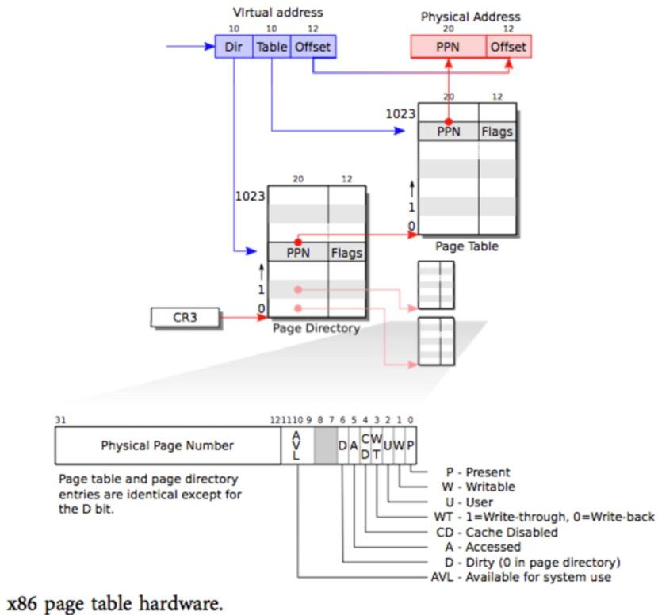

### XV6 소스 코드 읽기 - 가상 메모리 관리

1. 메모리 관리 부분: kalloc.c vm.c 및 기타 관련 파일 코드

- kalloc.c: char * kalloc(void)는 사용자 공간, 커널 스택, 페이지 테이블 페이지 및 버퍼에 대한 물리적 메모리 할당을 담당하고 필요할 때 물리적 주소를 가상 주소로 변환하여 반환합니다. 실제 페이지 크기는 4k입니다. void kfree(char * v)는 가상 주소를 받고 해제할 해당 물리적 주소를 찾습니다. Xv6은 사용 가능한 메모리의 첫 번째 부분을 사용 가능한 메모리의 다음 페이지를 가리키는 포인터 필드로 사용하며 물리적 메모리 관리는 페이지(4K) 단위로 할당됩니다. 물리적 메모리 공간의 모든 여유 페이지에는 다음 여유 페이지를 가리키는 포인터 필드(가상 주소)가 있으며 마지막 여유 페이지는 NULL입니다. 이러한 방식으로 kmem은 가상 주소 공간에 여유 목록 주소만 저장하면 됩니다. 할 수있다;

```c
// kalloc.c
// Physical memory allocator, intended to allocate
// memory for user processes, kernel stacks, page table pages,
// and pipe buffers. Allocates 4096-byte pages.

void freerange(void *vstart, void *vend);
extern char end[]; // first address after kernel loaded from ELF file

struct run {
  struct run *next;
};

struct {
  struct spinlock lock;
  int use_lock;
  struct run *freelist;
} kmem;
```

- Xv6에서는 각 프로세스가 독립적인 페이지 테이블 구조를 가질 수 있습니다. 프로세스를 전환할 때 항상 페이지 테이블을 전환해야 합니다. Switchkvm은 cr3 레지스터의 값을 kpgdir의 첫 번째 주소로 설정하고 kpgdir은 스케줄러 커널 스레드에서만 사용됩니다. 페이지 테이블과 커널 스택은 각 프로세스에 고유합니다. Xv6은 proc 구조를 사용하여 통합합니다. 프로세스가 전환될 때 종종 프로세스 스위치로 전환됩니다. 커널 스레드는 커널에서 시뮬레이션됩니다. 독점적인 커널 스택과 커널 페이지 테이블 kpgdir은 모든 프로세스 스케줄링의 기초입니다. Switchuvm은 TSS 관련 작업을 포함하여 들어오는 proc 구조를 통해 관련 프로세스의 고유한 데이터 구조를 전환하는 역할을 합니다.

```c
// vm.c

……

// Switch h/w page table register to the kernel-only page table,
// for when no process is running.
void
switchkvm(void)
{
  lcr3(v2p(kpgdir));   // switch to the kernel page table
}

// Switch TSS and h/w page table to correspond to process p.
void
switchuvm(struct proc *p)
{
  pushcli();
  cpu->gdt[SEG_TSS] = SEG16(STS_T32A, &cpu->ts, sizeof(cpu->ts)-1, 0);
  cpu->gdt[SEG_TSS].s = 0;
  cpu->ts.ss0 = SEG_KDATA << 3;
  cpu->ts.esp0 = (uint)proc->kstack + KSTACKSIZE;
  ltr(SEG_TSS << 3);
  if(p->pgdir == 0)
    panic("switchuvm: no pgdir");
  lcr3(v2p(p->pgdir));  // switch to new address space
  popcli();
}
```

- 프로세스의 페이지 테이블은 사용하기 전에 초기화해야 하는 경우가 많으며 커널 코드 매핑이 포함되어 있어야 프로세스가 커널에 들어갈 때 페이지 테이블을 다시 전환할 필요가 없습니다. 프로세스는 가상 주소 공간의 낮은 주소 부분을 사용하고 높은 주소 부분은 커널용으로 예약되어 있습니다. 메인 인터페이스:
  - pde_t * setupkvm(void)는 kalloc을 통해 페이지 디렉토리로 메모리 페이지를 할당한 다음 kmap 데이터 구조에 따라 커널 가상 주소 공간을 물리적 주소 공간에 매핑합니다. 이 동안 도구 기능 mappages가 호출됩니다.
  - int allocuvm(pde_t * pgdir, uint oldsz, uint newsz)는 페이지 테이블을 설정하는 동안 가상 주소 oldsz에서 newsz까지 페이지 단위로 메모리를 할당합니다.
  - int deallocuvm(pde_t * pgdir, uint oldsz, uint newsz)는 newsz에 해당하는 가상 주소 공간 메모리를 oldsz free로 설정합니다.
  - int loaduvm(pde_t * pgdir, char * addr, struct inode * ip, uint offset, uint sz) 파일 시스템의 i-노드 내용을 읽고 해당 주소로 로드하고 allocuvm 인터페이스 페이지 테이블, 그리고 나서 loaduvm 인터페이스를 호출하여 파일 시스템의 프로그램을 메모리로 로드합니다. 이는 사용자 프로세스의 공식적인 작업을 준비하기 위해 exec 시스템 호출에 대한 인터페이스를 제공할 수 있습니다.
  - 프로세스가 파괴되어 메모리를 회수해야 할 때 void freevm(pde_t * pgdir)을 호출하여 사용자 프로세스와 관련된 메모리 환경을 지웁니다. 먼저 가상 주소 공간을 0에서 KERNBASE로 회수하기 위해 호출한 다음 전체 프로세스의 페이지 테이블을 파괴합니다.
  - pde_t * copyuvm(pde_t * pgdir, uint sz)는 새 페이지 테이블을 복사하고 새 메모리를 할당하는 역할을 합니다. 새 메모리 레이아웃은 이전 메모리 레이아웃과 완전히 동일합니다. Xv6은 이 함수를 fork()의 기본 구현으로 사용합니다.

## 연습2 질문과 함께 읽기

1. main.c가 실행될 때 XV6이 초기화된 후 메모리 레이아웃은 무엇입니까(이미 들어 있는 것)?

- 커널 코드는 물리 주소의 하위 주소 0x100000에 존재하며 페이지 테이블은 main.c 파일의 entrypgdir 배열입니다. 가상 주소 하위 4M은 물리적 주소 하위 4M에 매핑되고 가상 주소 [KERNBASE, KERNBASE+4MB)는 물리적 주소 [0, 4MB)에 매핑됩니다.
- 그런 다음 kinit1을 호출하여 커널 끝에서 4M의 물리적 메모리까지 실제 메모리 공간을 사용하지 않은 것으로 초기화한 다음 kinit2를 호출하여 나머지 커널 공간을 PHYSTOP에 사용하지 않은 것으로 초기화합니다. 원래 페이지 테이블(즉, 위의 메모리 레이아웃)은 kinit1이 호출되기 전에 사용되므로 4M만 초기화할 수 있습니다. 동시에 새 페이지 테이블이 나중에 빌드될 때 페이지 테이블의 물리적 저장소를 찾기 위해 페이지 테이블 변환 메커니즘을 사용해야 합니다. 부트스트래핑 문제를 구성하는 메모리 공간 xv6은 메인 기능 시작 시 커널 끝에서 4Mb까지 공간을 해제하여 페이지 테이블을 할당합니다. 멀티 코어 CPU는 처음에 시작되지 않았기 때문에 잠금 메커니즘이 없습니다. kinit2는 커널이 새 페이지 테이블을 빌드한 후 커널의 가상 주소 공간에 완전히 액세스할 수 있습니다.
- 그런 다음 주 함수는 void kvmalloc(void) 함수를 호출하여 새 커널 페이지 테이블의 초기화를 구현합니다.
- 최종 메모리 레이아웃과 주소 공간은 다음과 같다. 커널 끝의 물리 주소에서 물리 주소 PHYSTOP까지의 메모리 공간은 사용하지 않고, 가상 주소 공간 KERNBASE 위의 부분은 해당 위치에 매핑된다. 물리적 메모리의 하위 주소

```c
// kalloc.c
// Initialization happens in two phases.
// 1. main() calls kinit1() while still using entrypgdir to place just
// the pages mapped by entrypgdir on free list.
// 2. main() calls kinit2() with the rest of the physical pages
// after installing a full page table that maps them on all cores.
void
kinit1(void *vstart, void *vend)
{
  initlock(&kmem.lock, "kmem");
  kmem.use_lock = 0;
  freerange(vstart, vend);
}

void
kinit2(void *vstart, void *vend)
{
  freerange(vstart, vend);
  kmem.use_lock = 1;
}

// kmap.c
……
// This table defines the kernel's mappings, which are present in
// every process's page table.
static struct kmap {
  void *virt;
  uint phys_start;
  uint phys_end;
  int perm;
} kmap[] = {
 { (void*)KERNBASE, 0,             EXTMEM,    PTE_W}, // I/O space
 { (void*)KERNLINK, V2P(KERNLINK), V2P(data), 0},     // kern text+rodata
 { (void*)data,     V2P(data),     PHYSTOP,   PTE_W}, // kern data+memory
 { (void*)DEVSPACE, DEVSPACE,      0,         PTE_W}, // more devices
};
……
```

1. XV6의 동적 메모리 관리는 어떻게 이루어집니까? 할당 가능한 물리적 메모리 페이지를 관리하기 위한 kmem(연결 목록)이 있습니다. (vend=0x00400000, 즉, 할당할 수 있는 최대 메모리 페이지는 4Mb 입니다.)
   자세한 사항은 "Exercise 1 Source Code Reading" 부분을 참고하시면 완벽한 답변이 이루어졌습니다.
2. XV6의 가상 메모리는 어떻게 초기화됩니까? XV6의 가상 메모리 레이아웃을 그립니다. 각 부분에 해당하는 내용을 알려주세요. memlayout.h 및 vm.c의 kmap에 대한 주석을 참조하십시오.

- main 함수는 void kinit1(void * vstart, void * vend), void kinit2(void * vstart, void * vend), void kvmalloc(void) 함수를 호출하여 커널 새 페이지 테이블의 초기화를 구현합니다. 가상 주소와 물리적 주소 간의 변환 인터페이스:

```c
// memlayout.h
// Memory layout

#define EXTMEM  0x100000            // Start of extended memory
#define PHYSTOP 0xE000000           // Top physical memory
#define DEVSPACE 0xFE000000         // Other devices are at high addresses

// Key addresses for address space layout (see kmap in vm.c for layout)
#define KERNBASE 0x80000000         // First kernel virtual address
#define KERNLINK (KERNBASE+EXTMEM)  // Address where kernel is linked

#ifndef __ASSEMBLER__

static inline uint v2p(void *a) { return ((uint) (a))  - KERNBASE; }
static inline void *p2v(uint a) { return (void *) ((a) + KERNBASE); }

#endif

#define V2P(a) (((uint) (a)) - KERNBASE)
#define P2V(a) (((void *) (a)) + KERNBASE)

#define V2P_WO(x) ((x) - KERNBASE)    // same as V2P, but without casts
#define P2V_WO(x) ((x) + KERNBASE)    // same as V2P, but without casts
```

- 메모리 레이아웃:


1. XV6 메모리 페이지 관리 정보. 인터럽트가 발생하면 어떤 페이지 테이블이 사용됩니까? 메모리 페이지의 크기는 얼마입니까? 페이지 디렉토리에 몇 개의 항목이 있습니까? 페이지 테이블에 몇 개의 항목이 있습니까? 지원되는 최대 메모리 크기는 얼마입니까? 가상 주소에서 물리적 주소로의 변환 다이어그램을 그립니다. XV6에서 가상 주소는 물리적 주소에 어떻게 매핑됩니까(어떤 기능이 어떤 기능을 수행하기 위해 호출됨)?

- 인터럽트가 발생하면 CPU로 교환된 프로세스의 페이지 테이블의 첫 번째 주소가 cr3 레지스터에 저장됩니다. 메모리 페이지는 4k입니다. XV6 페이지 테이블은 2차 디렉토리를 사용하고, 1차 디렉토리는 2^{10} 21 0 기사, 보조 디렉토리에는 2^{10} * 2^{10} 210∗21 0 기사; 페이지 테이블 항목은 2^2 22 바이트이므로 페이지 테이블에는 2^{12} / 2^2 = 2^{10} = 1024 212/22=210=1 0 2 4 항목; 최대 지원 4G 메모리;



- 물리적 메모리 페이지의 적용 및 해제, 가상 주소와 물리적 주소 매핑 방법 등은 "연습 1 소스 코드 읽기"에서 자세히 설명했습니다. 여기서는 주로 mappages 인터페이스, 가상 주소 * va 및 물리적 주소 * pa 매핑 크기 바이트에 대해 이야기할 것이며 페이지에 부여된 권한은 다음과 같습니다.

```c
// vm.c
……
// Create PTEs for virtual addresses starting at va that refer to
// physical addresses starting at pa. va and size might not
// be page-aligned.
static int
mappages(pde_t *pgdir, void *va, uint size, uint pa, int perm)
{
  char *a, *last;
  pte_t *pte;
  
  a = (char*)PGROUNDDOWN((uint)va);
  last = (char*)PGROUNDDOWN(((uint)va) + size - 1);
  for(;;){
    if((pte = walkpgdir(pgdir, a, 1)) == 0)
      return -1;
    if(*pte & PTE_P)
      panic("remap");
    *pte = pa | perm | PTE_P;
    if(a == last)
      break;
    a += PGSIZE;
    pa += PGSIZE;
  }
  return 0;
}
……
```