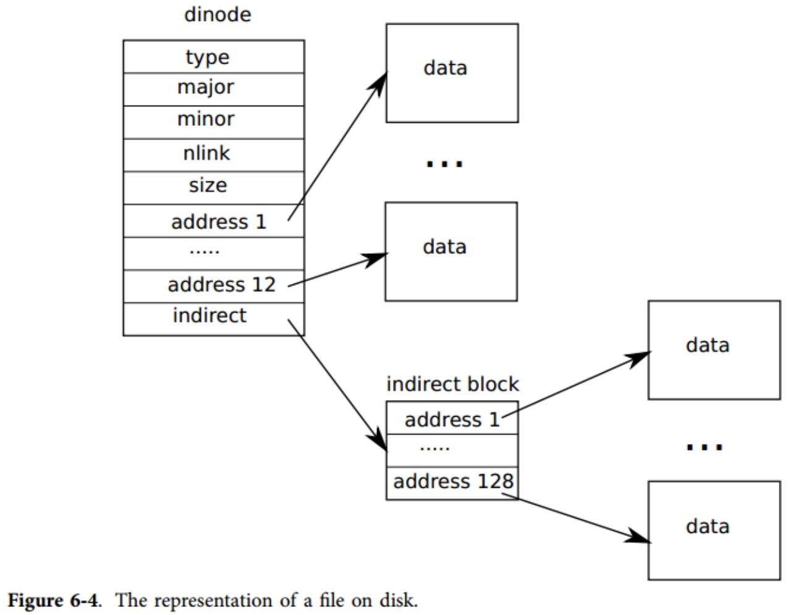

## XV6 소스 코드 읽기 파일 시스템


### Exercise1 소스코드 읽기

#### 파일 시스템 부분

파일 시스템 부분 buf.h fcntl.h stat.h fs.h file.h ide.c bio.c log.c fs.c file.c sysfile.c exec.c

#### buf

1. buf.h: xv6에서 디스크 블록 데이터 구조를 정의하고 블록 크기는 512바이트입니다.

```c
// The disk block data structure in xv6, the block size is 512 bytes
struct buf {
  int flags; // DIRTY, VALID
  uint dev;
  uint sector;  // corresponding sector
  struct buf *prev; // LRU cache list
  struct buf *next;  // Chain structure is used to connect
  struct buf *qnext; // disk queue
  uchar data[512];
};
#define B_BUSY  0x1  // buffer is locked by some process
#define B_VALID 0x2  // buffer has been read from disk
#define B_DIRTY 0x4  // buffer needs to be written to disk
12345678910111213
```

#### fcntl

1. fcntl.h: 매크로 정의 작업 권한입니다.

```c
#define O_RDONLY 0x000 // Read only
#define O_WRONLY 0x001 // write only
#define O_RDWR 0x002 // read and write
#define O_CREATE 0x200 // Create
1234
```

#### stat

1. stat.h: 파일 또는 디렉토리 속성 데이터 구조를 선언합니다.

```c
#define T_DIR  1   // Directory
#define T_FILE 2   // File
#define T_DEV  3   // Device

struct stat {
  short type;  // Type of file
  int dev;     // File system's disk device
  uint ino;    // Inode number
  short nlink; // Number of links to file
  uint size;   // Size of file in bytes
};
1234567891011
```

#### fs

1. fs.h / fs.c: 슈퍼 블록, 다이노드, 파일 및 디렉토리 데이터 구조, 관련 매크로 정의를 선언합니다.

```c
#define ROOTINO 1  // root i-number
#define BSIZE 512  // block size

// File system super block
struct superblock {
  uint size;         // Size of file system image (blocks)
  uint nblocks;      // Number of data blocks
  uint ninodes;      // Number of inodes.
  uint nlog;         // Number of log blocks
};

#define NDIRECT 12
#define NINDIRECT (BSIZE / sizeof(uint))
#define MAXFILE (NDIRECT + NINDIRECT)

 // Representation of inode nodes on disk
// On-disk inode structure
struct dinode {
  short type;           // File type
  short major;          // Major device number (T_DEV only)
  short minor;          // Minor device number (T_DEV only)
  short nlink;          // Number of links to inode in file system
  uint size;            // Size of file (bytes)
  uint addrs[NDIRECT+1];   // Data block addresses
};

// Inodes per block.
#define IPB           (BSIZE / sizeof(struct dinode))

// Block containing inode i
#define IBLOCK(i)     ((i) / IPB + 2)

// Bitmap bits per block
#define BPB           (BSIZE*8)

// Block containing bit for block b
#define BBLOCK(b, ninodes) (b/BPB + (ninodes)/IPB + 3)

// Directory is a file containing a sequence of dirent structures.
#define DIRSIZ 14

 // According to the structure of the file or directory, the directory itself is stored on the disk as a file, called a directory file.
struct dirent {
  ushort inum;  // i node
  char name[DIRSIZ];  // file or directory name
};
```

#### file

1. file.h: inode 및 파일 데이터 구조를 선언합니다.

```c
struct file {
     // Divided into pipeline files, equipment files, and ordinary files
  enum { FD_NONE, FD_PIPE, FD_INODE } type; 
  int ref; // reference count
  char readable;
  char writable;
  struct pipe *pipe;
  struct inode *ip;  // point to the inode node
  uint off;
};

 // The form of inode node in memory
// in-memory copy of an inode
struct inode {
  uint dev;           // Device number
  uint inum;          // Inode number
  int ref;            // Reference count
  int flags;          // I_BUSY, I_VALID

	   // The following programming is a copy of dinode
	  // copy of disk inode
  short type;         
  short major;
  short minor;
  short nlink;
  uint size;
  uint addrs[NDIRECT+1];
};
#define I_BUSY 0x1
#define I_VALID 0x2

// table mapping major device number to device functions
struct devsw {
  int (*read)(struct inode*, char*, int);
  int (*write)(struct inode*, char*, int);
};

extern struct devsw devsw[];

#define CONSOLE 1
```

#### ide

1. ide.c: 디스크 IO의 특정 구현인 xv6은 디스크 작업을 요청하는 프로세스에 대한 idequeue를 유지 관리합니다. 프로세스가 **void iderw(struct buf *b)**를 호출하여 디스크 읽기 및 쓰기를 요청하면 요청이 대기 대기열 idequeue에 추가되고 프로세스가 절전 모드로 전환됩니다. 디스크 읽기 및 쓰기 작업이 완료되면 인터럽트가 트리거됩니다. 인터럽트 핸들러 ideintr()은 대기열 시작 부분에서 요청을 제거하고 대기열 시작 부분에서 요청에 해당하는 프로세스를 깨웁니다.

```c
// idequeue points to the buf now being read/written to the disk.
// idequeue->qnext points to the next buf to be processed.
// You must hold idelock while manipulating queue.

static struct spinlock idelock;  // protect idequeue
static struct buf *idequeue;  // Request queue for disk read and write operations
……
 // Wait for the disk to enter the idle state
// Wait for IDE disk to become ready.
static int idewait(int checkerr)
{
  ……
  // 
  while(((r = inb(0x1f7)) & (IDE_BSY|IDE_DRDY)) != IDE_DRDY);
  ……
}

 // Initialize IDE disk IO
void ideinit(void)
{
  ……
}

 // Start a disk read and write request
// Start the request for b.  Caller must hold idelock.
static void idestart(struct buf *b)
{
  ……
}

 // The function that the interrupt handler will call when the disk request is completed
// Interrupt handler.
void ideintr(void)
{
     …… // After processing a disk IO request, wake up the process waiting at the head of the waiting queue
  wakeup(b);
  
     // If the queue is not empty, continue to process the next disk IO task
  // Start disk on next buf in queue.
  if(idequeue != 0)
    idestart(idequeue);
  ……
}

//PAGEBREAK!    Disk IO interface called by the upper file system
// Sync buf with disk. 
// If B_DIRTY is set, write buf to disk, clear B_DIRTY, set B_VALID.
// Else if B_VALID is not set, read buf from disk, set B_VALID.
void iderw(struct buf *b)
{
     ... // Competition lock
  acquire(&idelock);  //DOC:acquire-lock

  // Append b to idequeue.
  b->qnext = 0;
  for(pp=&idequeue; *pp; pp=&(*pp)->qnext)  //DOC:insert-queue
    ;
  *pp = b;
  
  // Start disk if  necessary. Start processing a disk IO task
  if(idequeue == b)
    idestart(b);
  
  // Wait for  request to finish. Sleep waiting
  while((b->flags & (B_VALID|B_DIRTY)) != B_VALID){
    sleep(b, &idelock);
  }

  release(&idelock);    // release the lock
}
```

#### bio

1. bio.c: Buffer Cache의 구체적인 구현. 디스크 읽기와 쓰기의 효율이 높지 않기 때문에 시간과 공간 집약성의 원리에 따라 최근에 자주 접근하는 디스크 블록을 메모리에 캐싱한다. 주요 인터페이스는 struct buf* bread(uint dev, uint 섹터), void bwrite(struct buf *b)이며, 빵은 먼저 캐시에서 블록의 존재를 찾고 존재하는 경우 직접 반환하고 디스크를 요청합니다. 존재하지 않는 경우 읽기 작업. 캐시에서 읽은 후 결과를 반환합니다. bwrite는 캐시의 데이터를 디스크에 직접 씁니다.

#### log

1. log.c: 이 모듈은 주로 파일 시스템의 일관성을 유지합니다. 로그 모듈이 도입된 후 상위 파일 시스템의 모든 디스크 작업은 트랜잭션으로 나뉩니다. 각 트랜잭션은 먼저 데이터와 해당 디스크 번호를 디스크의 로그 영역에 기록하고 로그 영역이 성공적으로 기록된 후에만 로그 영역의 데이터가 실제로 저장된 데이터 블록에 기록됩니다. 따라서 로그를 작성하는 동안 충돌이 발생하면 파일 시스템은 재시작 후 로그 영역이 존재하지 않는 것으로 간주합니다. 로그 영역에서 실제 영역으로 쓰기 시 크래시가 나면 로그 영역의 데이터를 기반으로 복구할 수 있습니다.

#### sysfile

1. sysfile.c: 주로 파일과 관련된 시스템 호출을 정의합니다. 주요 인터페이스와 그 의미는 다음과 같습니다.

```c
// Allocate a file descriptor for the given file.
// Takes over file reference from caller on success.
static int fdalloc(struct file *f)
{
  ...... // Request an unused file handle
}

int sys_dup(void)
{
     ...... // Call filedup to the reference count of the file handle +1
  filedup(f);
  return fd;
}

int sys_read(void)
{
     …… // read file data
  return fileread(f, p, n);
}

int sys_write(void)
{
     …… // write data to file
  return filewrite(f, p, n);
}

int sys_close(void)
{
     ...... // Release file handle resources
  fileclose(f);
  return 0;
}

int sys_fstat(void)
{
     …… // Modify file statistics
  return filestat(f, st);
}

// Create the path new as a link to the same inode as old.
int sys_link(void)
{
     ... // Create a new name for the existing inode
}

//PAGEBREAK!
int sys_unlink(void)
{
     …… // Deactivate a name in the inode, if all names are removed, the inode will be released
}

static struct inode* create(char *path, short type, 
	    short major, short minor)
{
  …… // 
}

int sys_mkdir(void)
{
     ...... // Create a directory
}

int sys_mknod(void)
{
     …… // Create a new file
}

int sys_chdir(void)
{
     …… // switch directory
}

int sys_pipe(void)
{
     ...... // Create a pipeline file
}

```

#### exec

1. exec.c: exec 인터페이스는 하나만 있습니다. 핵심은 실행 파일을 elf 형식으로 전달하고 메모리에 로드하고 메모리 페이지를 할당하는 것입니다. argv는 매개변수를 전달하는 데 사용되는 포인터 배열입니다.

```c
int exec(char *path, char **argv)
{
     …… // Determine whether the file exists
  if((ip = namei(path)) == 0)
    return -1;
  ilock(ip);
  pgdir = 0;

     // Check ELF header Check whether the ELF header is legal
  if(readi(ip, (char*)&elf, 0, sizeof(elf)) < sizeof(elf))
    goto bad;
  ……
  
  // Load program into memory.
  sz = 0;
  for(i=0, off=elf.phoff; i<elf.phnum; i++, off+=sizeof(ph)){
    if(readi(ip, (char*)&ph, off, sizeof(ph)) != sizeof(ph))
      goto bad;
    if(ph.type != ELF_PROG_LOAD)
      continue;
    if(ph.memsz < ph.filesz)
      goto bad;
    if((sz = allocuvm(pgdir, sz, ph.vaddr + ph.memsz)) == 0)
      goto bad;
    if(loaduvm(pgdir, (char*)ph.vaddr, ip, ph.off, ph.filesz) < 0)
      goto bad;
  }
  iunlockput(ip);
  ip = 0;

  // Allocate two pages at the next page boundary.
  // Make the first inaccessible.  Use the second as the user stack.
  sz = PGROUNDUP(sz);
  if((sz = allocuvm(pgdir, sz, sz + 2*PGSIZE)) == 0)
    goto bad;
  clearpteu(pgdir, (char*)(sz - 2*PGSIZE));
  sp = sz;

  // Push argument strings, prepare rest of stack in ustack.
  for(argc = 0; argv[argc]; argc++) {
    if(argc >= MAXARG)
      goto bad;
    sp = (sp - (strlen(argv[argc]) + 1)) & ~3;
    if(copyout(pgdir, sp, argv[argc], strlen(argv[argc]) + 1) < 0)
      goto bad;
    ustack[3+argc] = sp;
  }
  ……

 bad:
  if(pgdir)
    freevm(pgdir);
  if(ip)
    iunlockput(ip);
  return -1;
}
```

### 연습2 질문과 함께 읽기

#### Unix 파일 시스템 구성요소

1. UNIX 파일 시스템의 주요 구성 요소인 수퍼 블록, 아이노드, 데이터 블록, 디렉토리 블록 및 간접 참조 블록을 이해합니다. 각자의 역할을 따로 설명하세요.

| boot    | super block | dinode                   | free bitmap block            | data block               | log block             |
| ------- | ----------- | ------------------------ | ---------------------------- | ------------------------ | --------------------- |
| block 0 | block 1     | superblock.ninodes block | Bitmap management free block | superblock.nblocks block | superblock.nlog block |

- 부트로더 부트 영역(블록 0): 부트 프로그램을 저장하는 데 사용되며 시스템은 여기에서 시작됩니다.
- 수퍼 블록 슈퍼 블록(블록 1): 파일 시스템의 총 블록 수, 데이터 블록 수, i-노드 수 및 로그 블록 수와 같은 파일 시스템의 메타 정보를 기록합니다.
- i-node(inode): 블록 2부터 i-node를 저장하고 각 블록은 여러 i-node를 저장할 수 있습니다.
- 비트맵 자유 블록 관리 영역: 시스템이 파일 시스템의 사용, 할당된 블록 및 할당되지 않은 블록을 알아야 하기 때문에 자유 블록 비트맵을 저장하는 데 사용됩니다.
- 데이터 블록(datablock): 데이터 블록은 실제 파일 내용을 저장합니다.
- 디렉터리 블록(directoryblock): 파일 외에도 파일 시스템에 디렉터리가 있습니다. 디렉토리 자체는 파일 디렉토리(많은 FCB로 구성됨)입니다. 파일 디렉토리도 파일 형태로 디스크에 저장해야 합니다. 이 파일은 디스크에 저장됩니다. 카탈로그 파일이라고 하며 카탈로그 파일은 카탈로그 블록에 저장됩니다.
- 간접 참조 블록(indirectionblock): 여기서 xv6은 디스크 IO 작업을 수행하는 파일 시스템의 중간 계층인 로그 로그 블록을 참조해야 하며 주요 목적은 파일 시스템의 일관성을 유지하는 것입니다.

#### IDE 파일 읽기

ide.c 파일을 읽습니다. 이것은 내용에 대한 일반적인 이해를 돕기 위한 간단한 IDE 하드 드라이브 프로그램입니다.

- xv6 파일 시스템은 다음과 같이 아래에서 위로 6개의 레이어로 구현됩니다.

| system call  | File descriptors            |
| ------------ | --------------------------- |
| Path names   | Recursive lookup            |
| Directories  | directory inodes            |
| Files        | inodes and block alloccator |
| Transactions | Logging                     |
| Blocks       | Buffer cache                |

- 맨 아래 계층은 디스크에 대한 액세스를 동기화하는 블록 버퍼 캐시를 통해 IDE 하드 디스크를 읽고 쓰고 하나의 커널 프로세스만 동시에 디스크 블록을 수정할 수 있도록 합니다.
- 두 번째 계층 Loggins는 상위 계층에 서비스를 제공합니다. 이 계층은 파일 시스템의 일관성을 구현하여 상위 계층 인터페이스가 세션에 따라 디스크 업데이트를 패키징할 수 있으며 세션은 이러한 작업이 원자적 작업인지 확인하는 데 사용됩니다(또는 모두 적용되거나 둘 다 적용되지 않음). 은 적용되다);
- 세 번째 계층은 이름 없는 파일을 제공합니다. 이러한 각 파일은 i-노드와 일련의 데이터 블록으로 구성됩니다.
- 네 번째 수준은 디렉토리를 특수 i-노드로 구현하고, 그 내용은 일련의 디렉토리 항목이며, 각 디렉토리 항목에는 파일 이름과 해당 i-노드가 포함됩니다.
- 다섯 번째 계층은 계층적 경로 이름(예: /usr/rtm/xv6/fs.c)을 제공하며 이 계층은 경로에 해당하는 파일을 재귀적으로 쿼리합니다.
- 마지막 계층은 많은 UNIX 리소스(예: 파이프, 장치, 파일 등)를 파일 시스템 인터페이스로 추상화하여 프로그래머의 작업을 크게 단순화합니다.

#### buf, bio 읽기

buf.h, bio.c 파일을 읽습니다. XV6 파일 시스템에서 버퍼 캐시 계층의 내용과 구현을 이해합니다. 버퍼 이중 연결 목록 데이터 구조와 초기화 과정을 설명합니다. 버퍼의 상태를 이해합니다. 버퍼에 대한 다양한 작업을 이해합니다.

- 데이터 구조 bcache는 struct buf로 구성된 이중 연결 목록을 유지하고 bcache.lock 사용자는 상호 배타적 액세스를 허용합니다.
- 먼저 시스템은 binit()을 호출하여 캐시를 초기화한 다음 initlock을 호출하여 bcache.lock을 초기화한 다음 buf 배열을 순환하면서 헤더 보간 방법을 사용하여 bcache.head에 하나씩 연결합니다.
- 상위 파일 시스템은 디스크를 읽을 때 빵()을 호출한 다음 bug()를 호출하여 요청된 디스크 블록이 캐시에 있는지 확인합니다. 적중하면 캐시 적중 결과가 반환됩니다. 누락된 경우 기본 iderw() 함수로 이동하여 디스크 블록을 먼저 디스크에서 캐시로 로드한 다음 디스크 블록을 반환합니다.
- 상위 파일 시스템이 디스크에 쓸 때 캐시에 있는 데이터를 디스크에 직접 쓰기 위해 bwrite()를 호출합니다. 버퍼 캐시 계층은 지연된 쓰기 작업을 수행하지 않습니다. 디스크에 쓰기 위해 bwrite()를 호출하는 시기는 상위 파일 시스템에 의해 제어됩니다.
- 상위 파일 시스템은 brelse()를 호출하여 더 이상 사용되지 않는 버퍼를 해제할 수 있습니다.

```c
// buf.h
struct buf {
  int flags;
  uint dev;
  uint sector;
  struct buf *prev; // LRU cache list
  struct buf *next;
  struct buf *qnext; // disk queue
  uchar data[512];
};

// bio.c
struct {
  struct spinlock lock;
  struct buf buf[NBUF];

  // Linked list of all buffers, through prev/next.
  // head.next is most recently used.
  struct buf head;
} bcache;

void binit(void)
{
  struct buf *b;

  initlock(&bcache.lock, "bcache");

  //PAGEBREAK!    Head insertion method, every time it is inserted behind bcache.head
  // Create linked list of buffers
  bcache.head.prev = &bcache.head;
  bcache.head.next = &bcache.head;
  for(b = bcache.buf; b < bcache.buf+NBUF; b++){
    b->next = bcache.head.next;
    b->prev = &bcache.head;
    b->dev = -1;
    bcache.head.next->prev = b;
    bcache.head.next = b;
  }
}

// Return a B_BUSY buf with the contents of the indicated disk sector.
struct buf* bread(uint dev, uint sector)
{
  struct buf *b;
     // First lookup cache
  b = bget(dev, sector);
  if(!(b->flags & B_VALID))
    iderw(b);    // Call the next interface when the hit fails to read the disk
  return b;
}

// Write b's contents to disk.  Must be B_BUSY.
void bwrite(struct buf *b)
{
  if((b->flags & B_BUSY) == 0)
    panic("bwrite");
  b->flags |= B_DIRTY;
  iderw(b);  // write immediately, write without delay
}
```

#### xv6 파일 시스템의 로깅

1. XV6 파일 시스템의 로깅 및 트랜잭션 메커니즘을 이해하려면 log.c 파일을 읽으십시오.
   로그는 디스크 끝의 알려진 고정 영역에 있습니다. 여기에는 시작 블록과 일련의 데이터 블록이 포함됩니다. 시작 블록에는 각각 로그의 데이터 블록에 해당하는 섹터 번호의 배열이 포함되며 시작 블록에는 로그 데이터 블록의 개수도 포함됩니다. Xv6은 로그의 시작 블록을 이전이 아닌 제출 후 수정하고, 로그의 모든 데이터 블록을 파일 시스템에 복사한 후 데이터 블록 수를 0으로 지웁니다. 제출 후 지우기 전에 충돌이 발생하면 0이 아닌 카운트 값이 생성됩니다.

#### fs

1. fs.h/fs.c 파일을 읽습니다. XV6 파일 시스템의 하드 디스크 레이아웃을 이해합니다.

```c
// On-disk inode structure
struct dinode {
  short type;           // File type
  short major;          // Major device number (T_DEV only)
  short minor;          // Minor device number (T_DEV only)
  short nlink;          // Number of links to inode in file system
  uint size;            // Size of file (bytes)
  // NDIRECT =  12, the first 12 are direct indexes, 
     // The 13th is an indirect index, which can accommodate 128 direct indexes
  uint addrs[NDIRECT+1];   // Data block addresses  
};
```



#### file

1. file.h/file.c 파일을 읽습니다. XV6 "파일"이 무엇인지 이해하고 파일, i-노드 및 장치와 관련된 데이터 구조를 이해합니다. 파일에 대한 XV6의 기본 작업을 이해합니다. XV6은 최대 몇 개의 파일을 지원합니까? 각 프로세스에서 최대 몇 개의 파일을 열 수 있습니까?

- xv6 파일은 파이프라인 파일, 장비 파일 및 일반 파일로 나뉩니다.
- XV6은 최대 100개의 파일을 동시에 열 수 있도록 지원합니다. 즉, 100개의 파일 핸들이 할당됩니다.
- 단일 프로세스는 최대 16개의 파일을 열 수 있습니다.

```bash
// param.h
#define NOFILE       16  // open files per process
#define NFILE       100  // open files per system
```

1. sysfile.c 파일을 읽습니다. 파일 시스템과 관련된 시스템 호출을 이해하고 각 시스템 호출의 역할을 간략하게 설명합니다.
   완전한 답변은 소스 코드 읽기 섹션을 참조하십시오.

