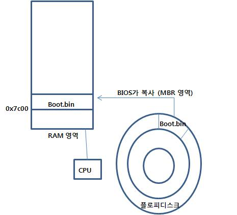
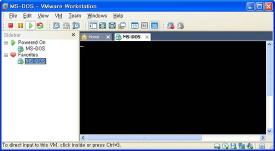
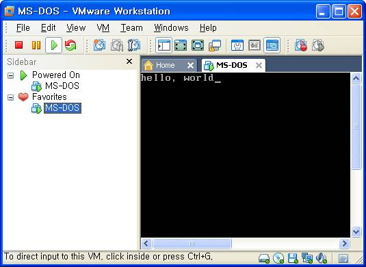
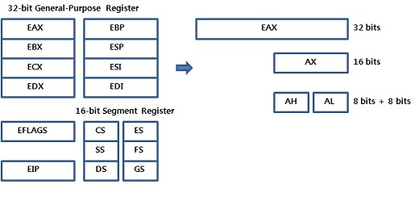

## boot

### MBR

#### 1. 목표

 \- 플로피디스크에 프로그램을 담아 부팅시켜보자. 

#### 2. 부팅 과정 순서 

 1) 컴퓨터 전원 ON

 2) CPU가 BIOS 롬에 새겨진 프로그램 실행

 3) 현재 사용하는 마더보드 상태, 주변 접속장치등 체크

 4) 디스크의 첫 512바이트 (MBR 영역 0번 트랙 1번 섹터)를 램으로 읽어들여 ran : 0x7c00 번지에 로드

 5) 프로그램 실행

 

#### 3. 해야할일

 1) 512바이트에 있는 프로그램 작성

 2) NASM 컴파일 ( ex : nasm -f bin -o boot.bin boot.asm )

 3) VMware 로 .BIN 파일을 플로피 디스크로 부팅시킴

 

#### 4. 예상 그림 

 

 

#### 5. 소스 코드

* boot.asm

```asm
hang:
    jmp hang
                          ; 중간에 510 byte 사용 가능
times 510 - ($-$$) db 0   ; $ 자신의 현재 위치 - $$ 시작위치 
                          ; 나머진는 0으로 채워라
dw 0AA55h                 ; dw = 2바이트 ,
                          ; 0AA55h 부트로더의 마지막 표시
```

 

#### 6. 실행 결과



 

#### 7. 소스 해석

\- 프로그램이 에러 없이 실행 되었다.

\- jmp hang 코드로 인해 부팅이 된후 무한루프를 돌고 있다.

 

#### 8. 디스어셈 결과

```asm
- ndisasm -b 16 boot.bin > boot.txt
주소       기계어             어셈블리어
00000000  EBFE              jmp short 0x0
00000002  0000              add [bx+si],al
00000004  0000              add [bx+si],al
00000006  0000              add [bx+si],al
00000008  0000              add [bx+si],al
                        .
000001F6  0000              add [bx+si],al
000001F8  0000              add [bx+si],al
000001FA  0000              add [bx+si],al
000001FC  0000              add [bx+si],al
000001FE  55                push bp
000001FF  AA                stosb

-> times 510 - ($-$$) db 0 코드로 인해서 모두 0으로 채워져 있다.
```


### boot: hello world

#### 1. 목표

 \- 화면에 hello word를 찍어보자.

 

#### 2. 해야할일

 1) 물리주소의 시작위치 정하기

 2) 'hello, wordl'의 메모리 공간 확보

 3) 비디오 서비스를 위한 BIOS 인터럽트를 걸어 화면에 출력

 

#### 3. 소스 코드

```asm
 - boot.asm

[org 0]                         ; 물리주소 계산법 : (cs<<4)+ip+org
jmp 07c0h:start                 ; 0x7c00 
 
start:           
    mov ax, cs                  ; 0x7c05,  cs = 0x7c00 세팅
    mov ds, ax                   
    mov es, ax       
    mov si, msg
 
print:
    lodsb                       ; al <= [es:si], si++ 
    cmp al, 0                   ; H의 아스키코드를 넣는다
    je hang
    mov ah, 0Eh
    mov bx, 7
    int 10h                     ; BIOS interrupt
    jmp print
 
hang:
    jmp hang
 
msg db 'hello, world', 0     
    
times 510 - ($-$$) db 0
dw 0AA55h
```


#### 4. 실행 화면

 

 

#### 5. 소스 설명

#####  1) 물리주소의 시작위치 정하기

  \- 바이오스가 MBR을 읽어 램의 물리 주소 0x7c00 번지에 복사한다. 그리고 프로그램이 메모리의 몇 번지에서 실행해야 하는지를 컴파일러에게 알려주어야 한다. 이 선언문이 [ org 번지수 ] 이다.

 [ org 번지수 ] 의 표기 방법에 따라 우리 프로그램은 [ org 0x7c0h ] 로 표기할수 있다. 그러나 [ org 0x7c0h ] 의 표기 방법보다 기준주소 + 오프셋 표기법이 주소 계산에 편리하기 때문에 [ org 0 ] 을 사용하고 직접 실행햐야할 주소를 jmp 문을 사용해 알려준다. 다음과 같이 jmp 0x7cOh:start 문을 사용하여 바로 start 라벨이( 또는 0x7C0h 에서 오프셋이 start 만큼 떨어진곳 ) 있는곳 부터 시작한다. 바이오스도 처음 점프 할때 0x0000:7C00 방식으로 점프한다. 그래서 CPU에 의해 자동적으로 CS(코드 세그먼트) 레지스터에는 0x0000 이, IP(프로그램 카운터) 레지스터에는 0x7C00이 들어 있는 상태가 된다.   

 

##### 2) ' hello world'의 메모리 공간 확보

 \- 어셈블리 문법인 데이터 정의문(data definition statement)을 사용 하여 db 'hello world', 0 표기 한다. 마지막 0은 NULL 이다.

< 데이터 정의 디렉티브 >

| DB   | 8 비트 정수            |
| ---- | ---------------------- |
| DW   | 16 비트 정수           |
| DD   | 32 비트 정수 또는 실수 |
| DQ   | 64 비트 정수 또는 실수 |
| DT   | 80 비트 10 바이트 정의 |

 

##### 3) 비디오 서비스를 위한 바이오스 인터럽트를 걸어 화면에 출력

 \- 바이오스 인터럽트 콜은 http://en.wikipedia.org/wiki/BIOS_call을 보면 스팩이 나와 있다. 우리가 사용한 int 10h는 비디오 서비스이고 소프트웨어 프로그램에 의해 호출된다. 파라미터로는 0Eh (mov ah, 0Eh )를 주었다. Write Character in TTY Mode 이다.

 

##### 4) 그외 코드

 \- ds, es 에 cs 를 바로 넣어줄수 없기 때문에 ax 를 이용하여 넣어준다. ( mov ax, cs )

 \- lodsb 는 다음의 두 명령을 대신한다. ( direction flag가 0 = clear 되어 있음을 가정).

```asm
mov al, [esi]
 inc esi
```

 \- cmp al, 0  -> al, 0 비교

  je hang   ->  al == 0 ( al == NULL ) 이면 jmp hang

 

#### 6. 디스어셈으로 확인

```asm
- ndisasm -b 16 boot.bin > boot.txt
         기계어 주소   기계어                       어셈블리
00000000  EA0500C007        jmp word 0x7c0:0x5
00000005  8CC8              mov ax,cs
00000007  8ED8              mov ds,ax
00000009  8EC0              mov es,ax
0000000B  BE1E00            mov si,0x1e
0000000E  AC                lodsb
0000000F  3C00              cmp al,0x0
00000011  7409              jz 0x1c
00000013  B40E              mov ah,0xe
00000015  BB0700            mov bx,0x7
00000018  CD10              int 0x10
0000001A  EBF2              jmp short 0xe
0000001C  EBFE              jmp short 0x1c
0000001E  68656C            push word 0x6c65
00000021  6C                insb
00000022  6F                outsw
00000023  2C20              sub al,0x20
00000025  776F              ja 0x96
00000027  726C              jc 0x95
00000029  640000            add [fs:bx+si],al
0000002C  0000              add [bx+si],al
................................. repeat ...
000001FC  0000              add [bx+si],al
000001FE  55                push bp
000001FF  AA                stosb
```


\- start가 0x5 로 바낀이유는 컴파일러가 바이너리 파일에는 반영하지 않기 때문이다.

\- 왜 0x5 번지로 바뀌어 있을까? 첫번째 행의 기계어를 보면 EA, 05, 00, C0, 07 로 5바이트를 차지하기 때문이다.

 

#### 7. 레지스터 종류

 

* 특별한 용도의 레지스터 

|          |                                                              |
| -------- | ------------------------------------------------------------ |
| EAX      | 누산기 레지스터, 입출력 및 산술, 놀리 연산에 사용 또는 리턴값, 인터럽트 번호 지정시 사용 |
| EBX      | 주소 지정을 확장하거나 초기 주소 지정을 위해 사용            |
| ECX      | 카운트 레지스터, 반목문 수행할때 사용                        |
| EDX      | 데이터 레지스터, EAX의 보조 누산기로 사용, 입축력 연산시 보조값을 저장하는데 사용 |
| ESI, EDI | 고속 메모리 전송 명령어에서 사용                             |
| EBP      | 스택의 베이스 포인터로 사용                                  |
| ESP      | 현재까지 사용된 스택의 위치를 저장                           |
| ESI      | 연산 및 간접 주소 연산에 주로 사용                           |
| EIP      | 다음에 실행할 명령어의 주소를 가리킴                         |
| EFLAGS   | 프로그램이 실행되고 있는 상황의 연산이나 결과 또는 시스템 제어 등의 상태 정보를 저장 |

* segment regitster 종류와 구조

|        |                                                              |
| ------ | ------------------------------------------------------------ |
| CS     | 함수나 제어문 같은 명령어들이 저장되는 코드 세그먼트         |
| DS     | 전역, 정적 변수 데이터가 들어있는 데이터 세그먼트            |
| SS     | 주소와 데이터를 일시적으로 저장할 목적으로 쓰이는 스택의 주소를 지정 |
| ES     | 추가 레지스터로 주로 문자 데이터의 주소를 지정하는데 사용    |
| FS, GS | 추가 레지스터                                                |


| Index | 디스크립터 파일에서의 인덱스                   |
| ----- | ---------------------------------------------- |
| TI    | 디스크립터 테이블이 Global(0), Local(1)        |
| RPL   | 요구 특권 레벨 값 ( 00-커널모드, 11-유저모드 ) |

 