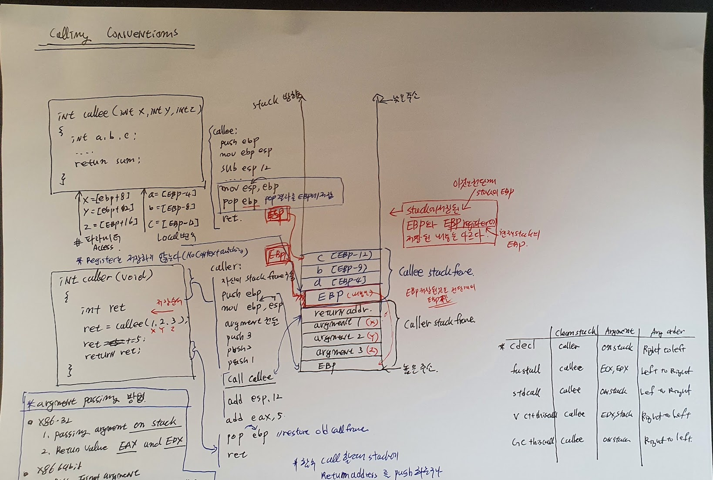

# Calling Convention

## 함수호출

#### 함수호출, Parameter passing

* ESP: Stack pointer
* EBP: Stack frame의 시작 주소

#### Caller 역할

* passing 변수 저장
* 저장 방법은 cdecl 방법에 따라서서 Right to Left 방식으로 저장
* 함수 Call 시점에 Resturn addr를 Stack에 push

#### Callee 역할

* EBP 를 Stack에 저장 (현재 Register의 EBP 값을 Stack에 저장 한다.)
* mov ebp, esp // 이것은 ESP를 EBP register에 저장 한다는 의미이다.
* 이것은 Stack에 저장된 EBP와는 전혀 무관하게 새로은 Stack frame이 시작 되었다는 의미이다.
* 그리고 이 EBP를 이용하여 전달 받은 argement와 local 변수를 참조 할 수 있다. 

