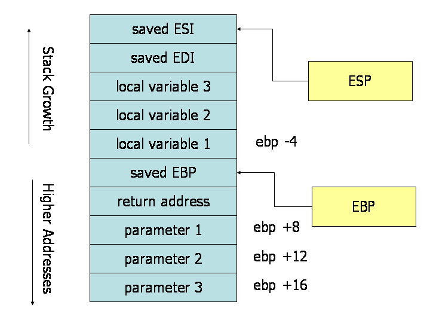

# Calling Convention


## 함수호출


#### 함수호출, Parameter passing

* ESP: Stack pointer
* EBP: Stack frame의 시작 주소

#### Caller 역할

* passing 변수 저장
* 저장 방법은 cdecl 방법에 따라서서 Right to Left 방식으로 저장
* 함수 Call 시점에 Resturn addr를 Stack에 push

#### Callee 역할

* EBP 를 Stack에 저장 (현재 Register의 EBP 값을 Stack에 저장 한다.)
* mov ebp, esp // 이것은 ESP를 EBP register에 저장 한다는 의미이다.
* 이것은 Stack에 저장된 EBP와는 전혀 무관하게 새로은 Stack frame이 시작 되었다는 의미이다.
* 그리고 이 EBP를 이용하여 전달 받은 argement와 local 변수를 참조 할 수 있다. 


#### stack에서  매개변수 전달, Local 변수 사용




#### objdump -d hello

* main 함수도  시작은 push  rbp로  시작

```asm
00000000000011e9 <main>:
    11e9:	f3 0f 1e fa          	endbr64 
    11ed:	55                   	push   %rbp
    11ee:	48 89 e5             	mov    %rsp,%rbp
    11f1:	ff 15 f1 2d 00 00    	callq  *0x2df1(%rip)        # 3fe8 <mcount@GLIBC_2.2.5>
    11f7:	48 8d 3d 06 0e 00 00 	lea    0xe06(%rip),%rdi        # 2004 <_IO_stdin_used+0x4>
    11fe:	e8 6d fe ff ff       	callq  1070 <puts@plt>
    1203:	b8 00 00 00 00       	mov    $0x0,%eax
    1208:	5d                   	pop    %rbp
    1209:	c3                   	retq   
    120a:	66 0f 1f 44 00 00    	nopw   0x0(%rax,%rax,1)
    
00000000000010a0 <_start>:
    10a0:	f3 0f 1e fa          	endbr64 
    10a4:	31 ed                	xor    %ebp,%ebp
    10a6:	49 89 d1             	mov    %rdx,%r9
    10a9:	5e                   	pop    %rsi
    10aa:	48 89 e2             	mov    %rsp,%rdx
    10ad:	48 83 e4 f0          	and    $0xfffffffffffffff0,%rsp
    10b1:	50                   	push   %rax
    10b2:	54                   	push   %rsp
    10b3:	4c 8d 05 c6 01 00 00 	lea    0x1c6(%rip),%r8        # 1280 <__libc_csu_fini>
    10ba:	48 8d 0d 4f 01 00 00 	lea    0x14f(%rip),%rcx        # 1210 <__libc_csu_init>
    10c1:	48 8d 3d 21 01 00 00 	lea    0x121(%rip),%rdi        # 11e9 <main>
    10c8:	ff 15 12 2f 00 00    	callq  *0x2f12(%rip)        # 3fe0 <__libc_start_main@GLIBC_2.2.5>
    10ce:	f4                   	hlt    
    10cf:	90                   	nop


```

