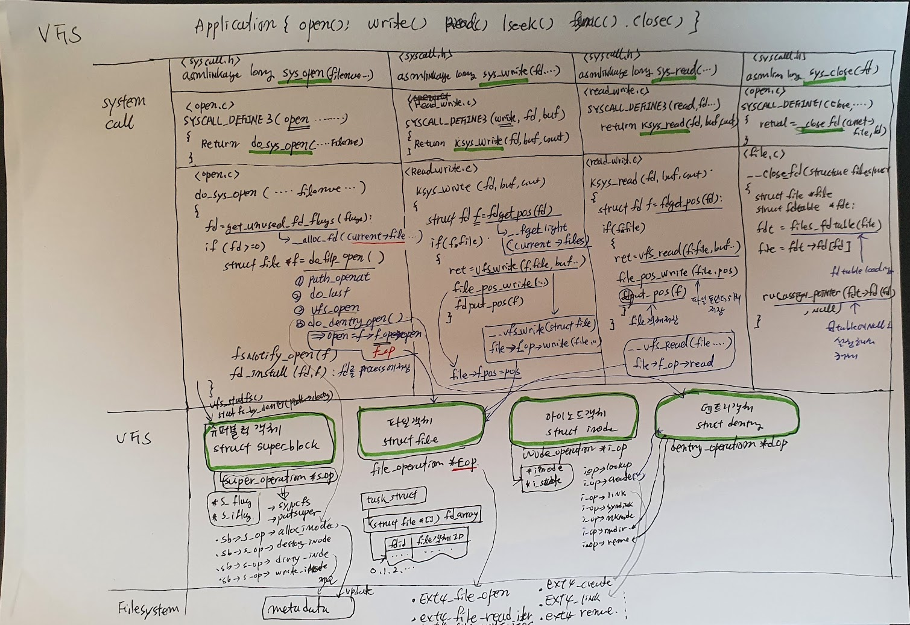
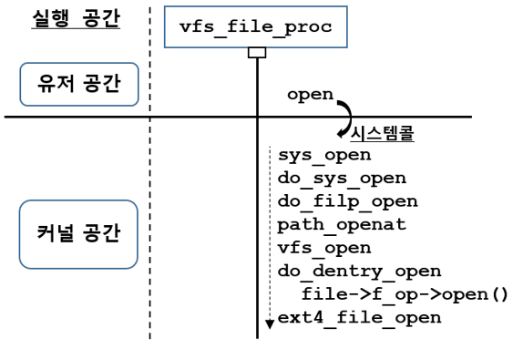
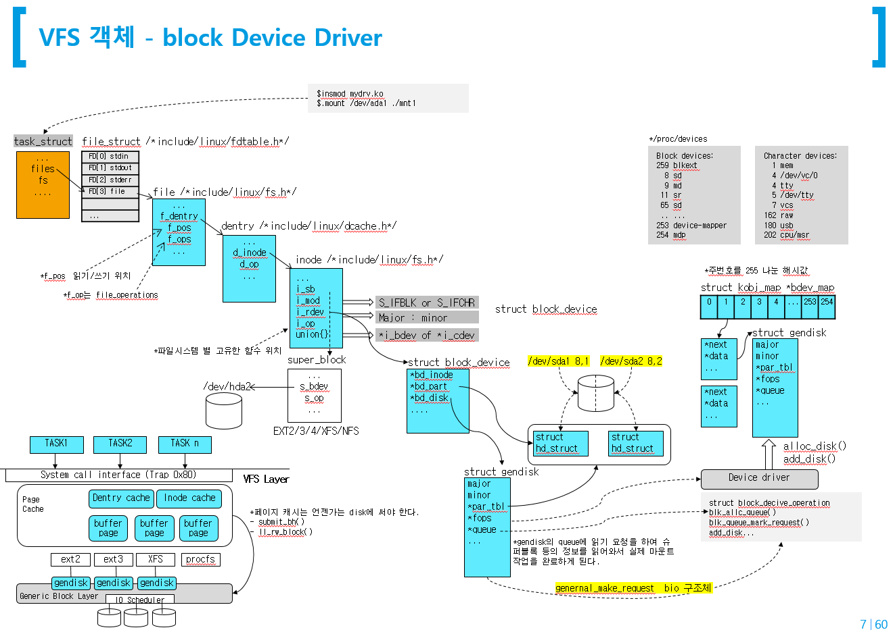
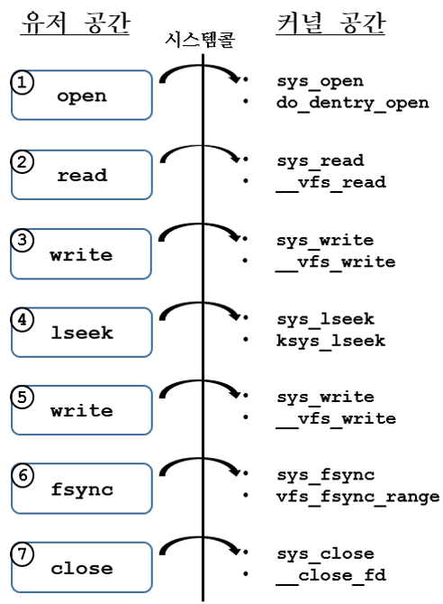
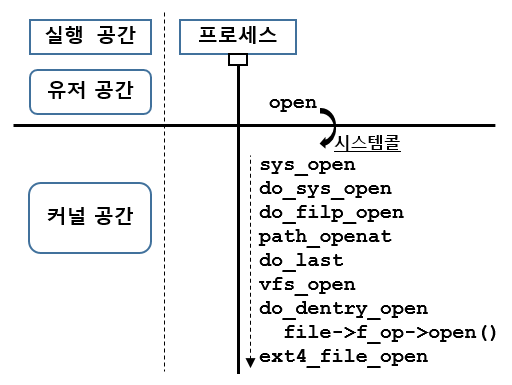
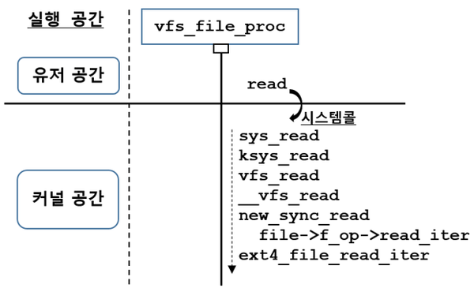
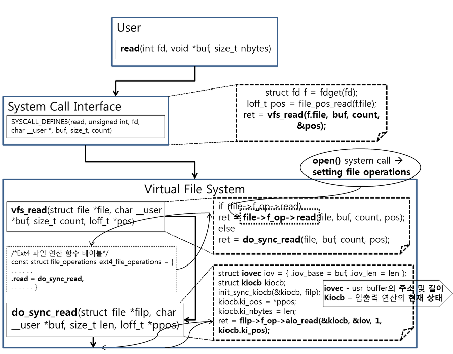
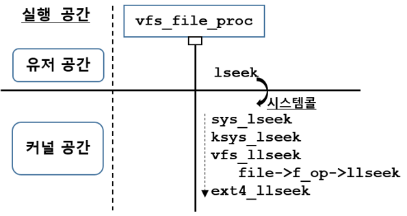
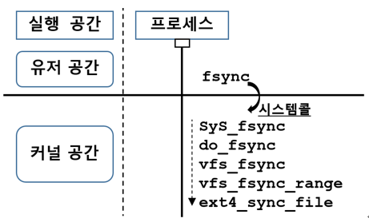
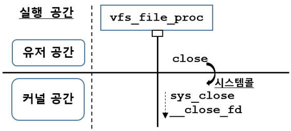

# VFS

## system call - VFS - Filesystem



#### source code

```c
#include <unistd.h>
#include <stdio.h>
#include <stdlib.h>

void main()
{
    FILE *fp = fopen("hello.txt", "w");

    if (fp) {
        fprintf(fp, "hello linux filesystem\n");
        fclose(fp);
        sync();
    }
}
```

#### debug

```sh
# gcc -g -pg wr write.c
# gdb ./wr
(gdb) b main
(gdb) run
(gdb) info proc
process 826968
cmdline = '/home/jhyunlee/code/linuxkernel/code_file/wr'
cwd = '/home/jhyunlee/code/linuxkernel/code_file'
exe = '/home/jhyunlee/code/linuxkernel/code_file/wr'
(gdb)
```


### ftrace

```sh
root@ubuntu20:/sys/kernel/debug/tracing# cat available_filter_functions  | grep ext4_file_open
ext4_file_open
```

* pid, set_ftrace_filter 적용해서 filter하고 cgdb를 이용해서 단계별로 실행하면서 event를 잡아 낸다.

####   ft.sh

```sh
echo 0 > tracing_on
echo 0 > events/enable
echo function > current_tracer
echo 1 > events/sched/sched_switch/enable
echo 1 > events/raw_syscalls/sys_enter/enable
echo 1 > events/raw_syscalls/sys_exit/enable
echo ext4_file_open ext4_file_write_iter > set_ftrace_filter
echo ext4_file_read_iter ext4_llseek >> set_ftrace_filter
echo ext4_sync_file __close_fd >> set_ftrace_filter
echo 1 > options/func_stack_trace
echo 1 > options/sym-offset
echo "pid" > set_ftrace_pid
echo "pid" > set_event_pid
echo 1 > tracing_on
```

#### run app

```shell
cgdb에서 실행 프로그램 실행 후
cgdb ./wr
(gdb) info proc
==> pid 잡아낸 다음  
$ echo "pid" > set_ftrace_pid
$ echo "pid" > set_event_pid
```

#### log.sh

```shell
#!/bin/bash
#run as root
echo 0 > /sys/kernel/debug/tracing/tracing_on
echo 0 > /sys/kernel/debug/tracing/events/enable
echo 0 > /sys/kernel/debug/tracing/options/stacktrace
cp  /sys/kernel/debug/tracing/trace ftrace.log
```

#### cgdb 통해서 pid 필터 event 결과

```sh
    wr-1251588 [000] .... 115658.005849: sys_enter: NR 257 (ffffff9c, 555555556006, 241, 1b6, 4, 1)
    wr-1251588 [000] .... 115658.005855: ext4_file_open+0x0/0x2e0 <-do_dentry_open+0x156/0x370
    wr-1251588 [000] .... 115658.005862: <stack trace>
 => 0xffffffffc083b099
 => ext4_file_open+0x5/0x2e0
 => do_dentry_open+0x156/0x370
 => vfs_open+0x2d/0x30
 => path_openat+0xb17/0x1120
 => do_filp_open+0x91/0x100
 => do_sys_openat2+0x221/0x2e0
 => do_sys_open+0x46/0x80
 => __x64_sys_openat+0x20/0x30
 => do_syscall_64+0x38/0x90
 => entry_SYSCALL_64_after_hwframe+0x44/0xa9
 
    wr-1251588 [003] .... 115816.811486: ext4_file_write_iter+0x0/0x220 <-new_sync_write+0x117/0x1b0
    wr-1251588 [003] .... 115816.811487: <stack trace>
 => 0xffffffffc083b099
 => ext4_file_write_iter+0x5/0x220
 => new_sync_write+0x117/0x1b0
 => vfs_write+0x1ca/0x280
 => ksys_write+0x67/0xe0
 => __x64_sys_write+0x1a/0x20
 => do_syscall_64+0x38/0x90
 => entry_SYSCALL_64_after_hwframe+0x44/0xa9

wr-1251588 [003] .... 115816.811496: sys_exit: NR 1 = 20
    wr-1251588 [003] .... 115816.811497: sys_enter: NR 20 (a, 7fffffffdd60, 3, 1b6, 20241, 7fffffffdd60)
    wr-1251588 [003] .... 115816.811498: ext4_file_write_iter+0x0/0x220 <-do_iter_readv_writev+0x152/0x1b0
    wr-1251588 [003] .... 115816.811499: <stack trace>
 => 0xffffffffc083b099
 => ext4_file_write_iter+0x5/0x220
 => do_iter_readv_writev+0x152/0x1b0
 => do_iter_write+0x88/0x1c0
 => vfs_writev+0x83/0x140
 => do_writev+0x71/0x120
 => __x64_sys_writev+0x1c/0x20
 => do_syscall_64+0x38/0x90
 => entry_SYSCALL_64_after_hwframe+0x44/0xa9
```

* ftrace로 확인하는 event 중심으로 kernel 함수 호출 관계를 확인하는 것과 차이는 없지만, 확인하려고 하는 event가 많이 섞여져 있서 분리하기가 좀 힘드네..
* 그래서 cgdb에서 프로세스 기동하고 나서 디버깅 모드로 (gdb) info proc 하면서  pid로 필터링 걸어서 진행하면 원하는 event를 정확하게 잡하 낼수 있다.





## uftrace

#### user level

```sh
root@ubuntu20:/home/jhyunlee/code/linuxkernel/code_file# uftrace ./wr
# DURATION     TID     FUNCTION
   0.240 us [844328] | __monstartup();
   0.090 us [844328] | __cxa_atexit();
            [844328] | main() {
  25.588 us [844328] |   fopen();
   2.464 us [844328] |   fwrite();
  50.826 us [844328] |   fclose();
            [844328] |   sync() {
 299.105 us [844328] |     /* linux:schedule */
   1.527 ms [844328] |     /* linux:schedule */
  26.841 us [844328] |     /* linux:schedule */
   2.202 ms [844328] |   } /* sync */
   2.283 ms [844328] | } /* main */
```


## uftrace kernel

```
# uftrace record -K 30  ./wr
# uftrace  tui -N smp_apic_timer_interrupt
# uftrace tui -F fopen  -N smp_apic_timer_interrupt -t 10us

  528.179 us : (1) wr                                                                                                                                                                      
  528.179 us : (1) fopen
   18.034 us :  ├─(1) handle_mm_fault
   16.481 us :  │ (1) __handle_mm_fault
   15.580 us :  │ (1) do_fault
   15.138 us :  │ (1) filemap_map_pages
   13.325 us :  │ (1) alloc_set_pte
   12.153 us :  │ (1) page_add_file_rmap
  502.301 us :  └─(1) __x64_sys_openat   <<====
  501.920 us :    (1) do_sys_open   <<===
  501.530 us :    (1) do_sys_openat2 
  493.394 us :    (1) do_filp_open  <=======
  492.593 us :    (1) path_openat         <=====
   20.469 us :     ├─(1) alloc_empty_file
   20.067 us :     │ (1) __alloc_file
   11.451 us :     │ (1) security_file_alloc
  402.494 us :     ├─(1) ext4_create              <=======
  217.086 us :     │  ├─(1) __ext4_new_inode
   36.609 us :     │  │  ├─(1) new_inode          
   35.156 us :     │  │  │ (1) new_inode_pseudo
   16.491 us :     │  │  │ (1) alloc_inode   <<=======
   12.693 us :     │  │  │ (1) ext4_alloc_inode   <<================
   12.974 us :     │  │  ├─(1) __ext4_journal_start_sb
   11.422 us :     │  │  │ (1) jbd2__journal_start
   13.225 us :     │  │  ├─(1) ext4_inode_bitmap_csum_set
   12.463 us :     │  │  │ (1) crypto_shash_update
   11.952 us :     │  │  │ (1) crc32c_pcl_intel_update
   10.329 us :     │  │  │ (1) kernel_fpu_begin_mask
   20.829 us :     │  │  ├─(1) insert_inode_locked
   10.871 us :     │  │  │ (1) __sysvec_irq_work
   29.976 us :     │  │  ├─(1) ext4_ext_tree_init
   29.585 us :     │  │  │ (1) __ext4_mark_inode_dirty
   21.711 us :     │  │  │ (1) ext4_mark_iloc_dirty
   19.967 us :     │  │  │ (1) ext4_do_update_inode
   49.322 us :     │  │  └─(1) __ext4_mark_inode_dirty
  180.168 us :     │  └─(1) ext4_add_nondir
  136.996 us :     │     ├─(1) ext4_add_entry
  134.942 us :     │     │ (1) ext4_dx_add_entry
   31.068 us :     │     │  ├─(1) dx_probe
   10.149 us :     │     │  │  ├─(1) __ext4_read_dirblock
   10.820 us :     │     │  │  └─(1) ext4fs_dirhash
   15.379 us :     │     │  ├─(1) __ext4_journal_get_write_access
   77.205 us :     │     │  └─(1) add_dirent_to_buf
   55.334 us :     │     │     ├─(1) __ext4_mark_inode_dirty
   16.281 us :     │     │     └─(1) ext4_handle_dirty_dirblock
   11.992 us :     │     │       (1) __ext4_handle_dirty_metadata
   39.263 us :     │     └─(1) __ext4_mark_inode_dirty
   31.469 us :     │       (1) ext4_mark_iloc_dirty
   11.211 us :     │        ├─(1) ext4_fc_track_inode
   10.399 us :     │        │ (1) ext4_inode_journal_mode
   19.646 us :     │        └─(1) ext4_do_update_inode
   13.274 us :     ├─(1) vfs_open
   12.884 us :     │ (1) do_dentry_open
   11.342 us :     └─(1) terminate_walk
```

#### 1. __x64_sys_openat()

```
jhyunlee@ubuntu20:~/code/linux/arch/x86/entry/syscalls$ grep  open syscall_64.tbl 
2       common  open                    __x64_sys_open
240     common  mq_open                 __x64_sys_mq_open
257     common  openat                  __x64_sys_openat <<=================
298     common  perf_event_open         __x64_sys_perf_event_open
304     common  open_by_handle_at       __x64_sys_open_by_handle_at
428     common  open_tree               __x64_sys_open_tree
430     common  fsopen                  __x64_sys_fsopen
434     common  pidfd_open              __x64_sys_pidfd_open
```


```c
</include/linux/syscalls.h>
extern long do_sys_open(int dfd, const char __user *filename, int flags, umode_t mode);                    
```

#### 2. do_sys_open

```c
<fs/open.c>
SYSCALL_DEFINE3(open, const char __user *, filename, int, flags, umode_t, mode)
{
	if (force_o_largefile())
		flags |= O_LARGEFILE;

	return do_sys_open(AT_FDCWD, filename, flags, mode);
}

long do_sys_open(int dfd, const char __user *filename, int flags, umode_t mode)
{
	struct open_flags op;
	int fd = build_open_flags(flags, mode, &op);
	struct filename *tmp;

	if (fd)
		return fd;

	tmp = getname(filename);
	if (IS_ERR(tmp))
		return PTR_ERR(tmp);

	fd = get_unused_fd_flags(flags); <<=== 1단계
	if (fd >= 0) {
		struct file *f = do_filp_open(dfd, tmp, &op);  <<=== 2단계
		if (IS_ERR(f)) {
			put_unused_fd(fd);
			fd = PTR_ERR(f);
		} else {
			fsnotify_open(f);  <<=== 3단계
			fd_install(fd, f);
		}
	}
	putname(tmp);
	return fd;
}


```


```c
int get_unused_fd_flags(unsigned flags)
{
	return __alloc_fd(current->files, 0, rlimit(RLIMIT_NOFILE), flags);
}

/*
 * allocate a file descriptor, mark it busy.
 */
int __alloc_fd(struct files_struct *files, unsigned start, unsigned end, unsigned flags)
{
	unsigned int fd;
	int error;
	struct fdtable *fdt;

	spin_lock(&files->file_lock);
repeat:
	fdt = files_fdtable(files);
	fd = start;
	if (fd < files->next_fd)
		fd = files->next_fd;

	if (fd < fdt->max_fds)
		fd = find_next_fd(fdt, fd);

	/*
	 * N.B. For clone tasks sharing a files structure, this test
	 * will limit the total number of files that can be opened.
	 */
	error = -EMFILE;
	if (fd >= end)
		goto out;

	error = expand_files(files, fd);
	if (error < 0)
		goto out;

	/*
	 * If we needed to expand the fs array we
	 * might have blocked - try again.
	 */
	if (error)
		goto repeat;

	if (start <= files->next_fd)
		files->next_fd = fd + 1;

	__set_open_fd(fd, fdt);
	if (flags & O_CLOEXEC)
		__set_close_on_exec(fd, fdt);
	else
		__clear_close_on_exec(fd, fdt);
	error = fd;
#if 1
	/* Sanity check */
	if (rcu_access_pointer(fdt->fd[fd]) != NULL) {
		printk(KERN_WARNING "alloc_fd: slot %d not NULL!\n", fd);
		rcu_assign_pointer(fdt->fd[fd], NULL);
	}
#endif

out:
	spin_unlock(&files->file_lock);
	return error;
}
```


```c
struct files_struct {
  /*
   * read mostly part
   */
	atomic_t count;
	bool resize_in_progress;
	wait_queue_head_t resize_wait;

	struct fdtable __rcu *fdt;
	struct fdtable fdtab;
  /*
   * written part on a separate cache line in SMP
   */
	spinlock_t file_lock ____cacheline_aligned_in_smp;
	unsigned int next_fd;
	unsigned long close_on_exec_init[1];
	unsigned long open_fds_init[1];
	unsigned long full_fds_bits_init[1];
	struct file __rcu * fd_array[NR_OPEN_DEFAULT];
};

struct fdtable {
	unsigned int max_fds;
	struct file __rcu **fd;      /* current fd array */
	unsigned long *close_on_exec;
	unsigned long *open_fds;
	unsigned long *full_fds_bits;
	struct rcu_head rcu;
};
```


#### 3. do_filp_open

* do_filp_open

```c
<fs/namei.c>
struct file *do_filp_open(int dfd, struct filename *pathname, const struct open_flags *op)
{
	struct nameidata nd;
	int flags = op->lookup_flags;
	struct file *filp;

	set_nameidata(&nd, dfd, pathname);
	filp = path_openat(&nd, op, flags | LOOKUP_RCU);
	if (unlikely(filp == ERR_PTR(-ECHILD)))
		filp = path_openat(&nd, op, flags);
	if (unlikely(filp == ERR_PTR(-ESTALE)))
		filp = path_openat(&nd, op, flags | LOOKUP_REVAL);
	restore_nameidata();
	return filp;
}
```

* path_openat

```c
static struct file *path_openat(struct nameidata *nd,const struct open_flags *op, unsigned flags)
{
	struct file *file;
	int error;

	file = alloc_empty_file(op->open_flag, current_cred());
	if (IS_ERR(file))
		return file;

	if (unlikely(file->f_flags & __O_TMPFILE)) {
		error = do_tmpfile(nd, flags, op, file);
	} else if (unlikely(file->f_flags & O_PATH)) {
		error = do_o_path(nd, flags, file);
	} else {
		const char *s = path_init(nd, flags);
		while (!(error = link_path_walk(s, nd)) &&
			(error = do_last(nd, file, op)) > 0) {
			nd->flags &= ~(LOOKUP_OPEN|LOOKUP_CREATE|LOOKUP_EXCL);
			s = trailing_symlink(nd);
		}
		terminate_walk(nd);
	}
	if (likely(!error)) {
		if (likely(file->f_mode & FMODE_OPENED))
			return file;
		WARN_ON(1);
		error = -EINVAL;
	}
	fput(file);
	if (error == -EOPENSTALE) {
		if (flags & LOOKUP_RCU)
			error = -ECHILD;
		else
			error = -ESTALE;
	}
	return ERR_PTR(error);
}
```


#### 3. vfs_open -> do_dentry_open

```c
int vfs_open(const struct path *path, struct file *file)
{
	file->f_path = *path;
	return do_dentry_open(file, d_backing_inode(path->dentry), NULL);
}

static int do_dentry_open(struct file *f, struct inode *inode, int (*open)(struct inode *, struct file *))
{
	static const struct file_operations empty_fops = {};
	int error;

	path_get(&f->f_path);
	f->f_inode = inode;
	f->f_mapping = inode->i_mapping;

	/* Ensure that we skip any errors that predate opening of the file */
	f->f_wb_err = filemap_sample_wb_err(f->f_mapping);

	if (unlikely(f->f_flags & O_PATH)) {
		f->f_mode = FMODE_PATH | FMODE_OPENED;
		f->f_op = &empty_fops;
		return 0;
	}

	/* normally all 3 are set; ->open() can clear them if needed */
	f->f_mode |= FMODE_LSEEK | FMODE_PREAD | FMODE_PWRITE;
	if (!open)
		open = f->f_op->open;
	if (open) {
		error = open(inode, f);
		if (error)
			goto cleanup_all;
	}

cleanup_all:
	if (WARN_ON_ONCE(error > 0))
		error = -EINVAL;
	fops_put(f->f_op);
	if (f->f_mode & FMODE_WRITER) {
		put_write_access(inode);
		__mnt_drop_write(f->f_path.mnt);
	}
cleanup_file:
	path_put(&f->f_path);
	f->f_path.mnt = NULL;
	f->f_path.dentry = NULL;
	f->f_inode = NULL;
	return error;
}

```


#### 4. fd_install

```c
void fd_install(unsigned int fd, struct file *file)
{
	__fd_install(current->files, fd, file);
}
```


### File 객체




#### task_struct

```c
<include/linux/sched.h>
struct task_struct {
    strcut trhread_info thread_info;
    ...
    struct files_struct  *files;
    ...
}
```

#### file_struct

```c
struct files_struct {
  /*
   * read mostly part
   */
	atomic_t count;
	bool resize_in_progress;
	wait_queue_head_t resize_wait;

	struct fdtable __rcu *fdt;
	struct fdtable fdtab;
  /*
   * written part on a separate cache line in SMP
   */
	spinlock_t file_lock ____cacheline_aligned_in_smp;
	unsigned int next_fd;
	unsigned long close_on_exec_init[1];
	unsigned long open_fds_init[1];
	unsigned long full_fds_bits_init[1];
	struct file __rcu * fd_array[NR_OPEN_DEFAULT];
};
```


#### file

```c
struct file {
	union {
		struct llist_node	fu_llist;
		struct rcu_head 	fu_rcuhead;
	} f_u;
	struct path		f_path;  <<===
	struct inode		*f_inode;	/* cached value */
	const struct file_operations	*f_op;

	/*
	 * Protects f_ep_links, f_flags.
	 * Must not be taken from IRQ context.
	 */
	spinlock_t		f_lock;
	enum rw_hint		f_write_hint;
	atomic_long_t		f_count;
	unsigned int 		f_flags;
	fmode_t			f_mode;
	struct mutex		f_pos_lock;
	loff_t			f_pos;
	struct fown_struct	f_owner;
	const struct cred	*f_cred;
	struct file_ra_state	f_ra;

	u64			f_version;
#ifdef CONFIG_SECURITY
	void			*f_security;
#endif
	/* needed for tty driver, and maybe others */
	void			*private_data;

#ifdef CONFIG_EPOLL
	/* Used by fs/eventpoll.c to link all the hooks to this file */
	struct list_head	f_ep_links;
	struct list_head	f_tfile_llink;
#endif /* #ifdef CONFIG_EPOLL */
	struct address_space	*f_mapping;
	errseq_t		f_wb_err;
} c
```


####  dentry

```c
struct path {
	struct vfsmount *mnt;
	struct dentry *dentry;
} __randomize_layout;

struct dentry {
	/* RCU lookup touched fields */
	unsigned int d_flags;		/* protected by d_lock */
	seqcount_t d_seq;		/* per dentry seqlock */
	struct hlist_bl_node d_hash;	/* lookup hash list */
	struct dentry *d_parent;	/* parent directory */
	struct qstr d_name;
	struct inode *d_inode;		/* Where the name belongs to - NULL is
					 * negative */
	unsigned char d_iname[DNAME_INLINE_LEN];	/* small names */

	/* Ref lookup also touches following */
	struct lockref d_lockref;	/* per-dentry lock and refcount */
	const struct dentry_operations *d_op;
	struct super_block *d_sb;	/* The root of the dentry tree */
	unsigned long d_time;		/* used by d_revalidate */
	void *d_fsdata;			/* fs-specific data */

	union {
		struct list_head d_lru;		/* LRU list */
		wait_queue_head_t *d_wait;	/* in-lookup ones only */
	};
	struct list_head d_child;	/* child of parent list */
	struct list_head d_subdirs;	/* our children */
	/*
	 * d_alias and d_rcu can share memory
	 */
	union {
		struct hlist_node d_alias;	/* inode alias list */
		struct hlist_bl_node d_in_lookup_hash;	/* only for in-lookup ones */
	 	struct rcu_head d_rcu;
	} d_u;
} __randomize_layout;

```


## system call



#### 1. open()




```
#open
01 vfs_file_proc-2102 [001] .... 3993.231746: sys_enter: NR 5 (76fe7ed8, 80000, 3, 76ffac90, 76fe7ed8, 7edfa524)
02 vfs_file_proc-2102 [001] .... 3993.231764: ext4_file_open+0x14/0x1dc <-do_dentry_open+0x240/0x3c4
03 vfs_file_proc-2102 [001] .... 3993.231798: <stack trace>
04 => ext4_file_open+0x18/0x1dc
05 => do_dentry_open+0x240/0x3c4
06 => vfs_open+0x3c/0x40
07 => path_openat+0x3a8/0x1000
08 => do_filp_open+0x84/0xf0
09 => do_sys_open+0x144/0x1f4
10 => sys_open+0x28/0x2c
11 => __sys_trace_return+0x0/0x10
12 => 0x7edfa434
13 vfs_file_proc-2102  [001] ....  3993.231809: sys_exit: NR 5 = 3
```


#### 2. read()



```
14 vfs_file_proc-2102 [001] .... 3993.231946: sys_enter: NR 3 (3, 7edfa080, 200, 0, 76ff7000, 0)
15 vfs_file_proc-2102 [001] .... 3993.231952: ext4_file_read_iter+0x10/0x54 <-__vfs_read+0x108/0x168
16 vfs_file_proc-2102 [001] .... 3993.231969: <stack trace>
17 => ext4_file_read_iter+0x14/0x54
18 => __vfs_read+0x108/0x168
19 => vfs_read+0x9c/0x164
20 => ksys_read+0x5c/0xbc
21 => sys_read+0x18/0x1c
22 => __sys_trace_return+0x0/0x10
23 => 0x7edf9fdc
24 vfs_file_proc-2102  [001] ....  3993.231977: sys_exit: NR 3 = 512
```




#### 3. write()


```
#write(x1)
25 vfs_file_proc-2102 [001] .... 3993.234630: sys_enter: NR 4 (3, 7edfa4a8, 10, 7edfa4a8, 1077c, 0)
26 vfs_file_proc-2102 [001] .... 3993.234636: ext4_file_write_iter+0x14/0x4c0 <-__vfs_write+0x10c/0x170
27 vfs_file_proc-2102 [001] .... 3993.234654: <stack trace>
28 => ext4_file_write_iter+0x18/0x4c0
29 => __vfs_write+0x10c/0x170
30 => vfs_write+0xb4/0x1c0
31 => ksys_write+0x5c/0xbc
32 => sys_write+0x18/0x1c
33 => __sys_trace_return+0x0/0x10
34 => 0x7edfa4a4
35 vfs_file_proc-2102 [001] .... 3993.234796: sys_exit: NR 4 = 16
```


#### 4. lseek()



```
#lseek
36 vfs_file_proc-2102 [001] .... 3993.234803: sys_enter: NR 19 (3, 0, 0, 7edfa4a8, 1077c, 0)
37 vfs_file_proc-2102 [001] .... 3993.234807: ext4_llseek+0x14/0x15c <-ksys_lseek+0xa8/0xd8
38 vfs_file_proc-2102 [001] .... 3993.234821: <stack trace>
39 => ext4_llseek+0x18/0x15c
40 => ksys_lseek+0xa8/0xd8
41 => sys_lseek+0x18/0x1c
42 => __sys_trace_return+0x0/0x10
43 => 0x7edfa4a4
44 vfs_file_proc-2102  [001] .... 3993.234825: sys_exit: NR 19 = 0
```


#### 5. fsync()




```
#fsync 
56 vfs_file_proc-2102 [001] .... 3993.235767: sys_enter: NR 118 (3, 7edfa4a8, 10, 7edfa4a8, 1077c, 0)
57 vfs_file_proc-2102 [001] .... 3993.235770: ext4_sync_file+0x14/0x464 <-vfs_fsync_range+0x4c/0x8c
58 vfs_file_proc-2102 [001] .... 3993.235796: <stack trace>
59 => ext4_sync_file+0x18/0x464
60 => vfs_fsync_range+0x4c/0x8c
61 => do_fsync+0x4c/0x74
62 => sys_fsync+0x1c/0x20
63 => __sys_trace_return+0x0/0x10
64 => 0x7edfa4a4
```

#### 6. close()




```
#close
66 vfs_file_proc-2102 [001] .... 3993.247156: sys_enter: NR 6 (3, 7edfa4a8, 10, 0, 1077c, 0)
67 vfs_file_proc-2102 [001] .... 3993.247162: __close_fd+0x10/0xa0 <-sys_close+0x30/0x58
68 vfs_file_proc-2102 [001] .... 3993.247197: <stack trace>
69 => __close_fd+0x14/0xa0
70 => sys_close+0x30/0x58
71 => __sys_trace_return+0x0/0x10
72 => 0x7edfa4a4
73 vfs_file_proc-2102  [001] ....  3993.247203: sys_exit: NR 6 = 0
```