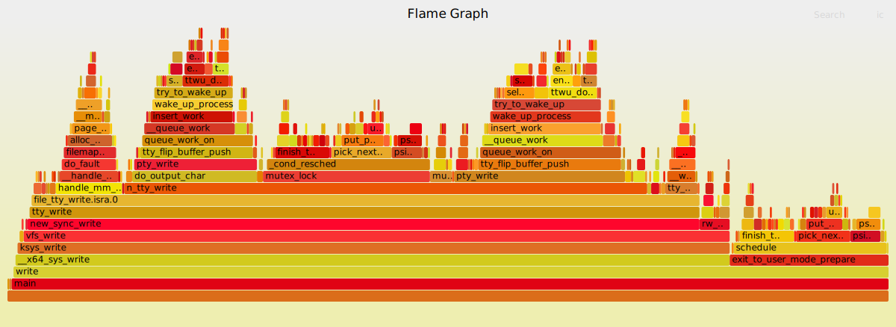

# System call


* Linux kernel sourcecode
* write() syscall
* copy_from_user()


### syscalls

#### man syscalls

```text
SYSCALLS(2)                                                           Linux Programmer's Manual                                                          SYSCALLS(2)

NAME
       syscalls - Linux system calls

SYNOPSIS
       Linux system calls.

DESCRIPTION
       The system call is the fundamental interface between an application and the Linux kernel.

   System calls and library wrapper functions
       System calls are generally not invoked directly, but rather via wrapper functions in glibc (or perhaps some other library).  For details of direct invocation
       of a system call, see intro(2).  Often, but not always, the name of the wrapper function is the same as the name of the system call that it invokes.  For ex‐
       ample, glibc contains a function chdir() which invokes the underlying "chdir" system call.
```


`*ABI* ( Application Binary Interface )`


#### Archtecure call Conventions

##### system call  Instruction, system call number

```
       Arch/ABI    Instruction           System  Ret  Ret  Error    Notes
                                         call #  val  val2
       ───────────────────────────────────────────────────────────────────
       alpha       callsys               v0      v0   a4   a3       1, 6
       arc         trap0                 r8      r0   -    -
       arm/OABI    swi NR                -       a1   -    -        2
       arm/EABI    swi 0x0               r7      r0   r1   -
       arm64       svc #0                x8      x0   x1   -
       i386        int $0x80             eax     eax  edx  -
       mips        syscall               v0      v0   v1   a3       1, 6
       powerpc     sc                    r0      r3   -    r0       1
       powerpc64   sc                    r0      r3   -    cr0.SO   1
       riscv       ecall                 a7      a0   a1   -
       s390        svc 0                 r1      r2   r3   -        3
       s390x       svc 0                 r1      r2   r3   -        3
       superh      trap #0x17            r3      r0   r1   -        4, 6
       sparc/32    t 0x10                g1      o0   o1   psr/csr  1, 6
       sparc/64    t 0x6d                g1      o0   o1   psr/csr  1, 6
       tile        swint1                R10     R00  -    R01      1
       x86-64      syscall               rax     rax  rdx  -        5
```


##### to pass the system call arguments

```
       Arch/ABI      arg1  arg2  arg3  arg4  arg5  arg6  arg7  Notes
       ──────────────────────────────────────────────────────────────
       arm/OABI      a1    a2    a3    a4    v1    v2    v3
       arm/EABI      r0    r1    r2    r3    r4    r5    r6
       arm64         x0    x1    x2    x3    x4    x5    -
       i386          ebx   ecx   edx   esi   edi   ebp   -
       mips/o32      a0    a1    a2    a3    -     -     -     1
       mips/n32,64   a0    a1    a2    a3    a4    a5    -
       powerpc       r3    r4    r5    r6    r7    r8    r9
       powerpc64     r3    r4    r5    r6    r7    r8    -
       riscv         a0    a1    a2    a3    a4    a5    -
       s390          r2    r3    r4    r5    r6    r7    -
       s390x         r2    r3    r4    r5    r6    r7    -
       superh        r4    r5    r6    r7    r0    r1    r2
       sparc/32      o0    o1    o2    o3    o4    o5    -
       sparc/64      o0    o1    o2    o3    o4    o5    -
       x86-64        rdi   rsi   rdx   r10   r8    r9    -
```


### Test code


```c
       #define _GNU_SOURCE
       #include <unistd.h>
       #include <sys/syscall.h>
       #include <sys/types.h>
       #include <signal.h>

       int
       main(int argc, char *argv[])
       {
           pid_t tid;

           tid = syscall(SYS_gettid);
           syscall(SYS_tgkill, getpid(), tid, SIGHUP);
       }
```

$ gcc -g -pg -o scall syscall.c

#### uftrace

```
$ sudo uftrace record  -K 30 ./scall
$ sudo uftrace tui  -t 8us  -N smp_apic_timer_interrupt@kernel
$ uftrace dump --flame-graph | ./flamegraph.pl > out.svg
```


#### write

```
NAME
       write - write to a file descriptor
SYNOPSIS
       #include <unistd.h>
       ssize_t write(int fd, const void *buf, size_t count);

```

##### write.c

```c
#include <unistd.h>
void main(){
    write(1, "HELLO\n",6);
}
```


```sh
jhyunlee@ubuntu20:~/code/lk/systemcall$ gcc -g -pg  -o write write.c
jhyunlee@ubuntu20:~/code/lk/systemcall$ ./write
jhyunlee@ubuntu20:~/code/lk/systemcall$ strace ./write
execve("./write", ["./write"], 0x7ffc915e1e70 /* 64 vars */) = 0
brk(NULL)                               = 0x55a1ee34f000
arch_prctl(0x3001 /* ARCH_??? */, 0x7ffcc08fc360) = -1 EINVAL (부적절한 인수)
access("/etc/ld.so.preload", R_OK)      = -1 ENOENT (그런 파일이나 디렉터리가 없습니다)
openat(AT_FDCWD, "/etc/ld.so.cache", O_RDONLY|O_CLOEXEC) = 3
fstat(3, {st_mode=S_IFREG|0644, st_size=80061, ...}) = 0
mmap(NULL, 80061, PROT_READ, MAP_PRIVATE, 3, 0) = 0x7fb8a9c2c000
close(3)                                = 0
openat(AT_FDCWD, "/lib/x86_64-linux-gnu/libc.so.6", O_RDONLY|O_CLOEXEC) = 3
read(3, "\177ELF\2\1\1\3\0\0\0\0\0\0\0\0\3\0>\0\1\0\0\0\360q\2\0\0\0\0\0"..., 832) = 832
pread64(3, "\6\0\0\0\4\0\0\0@\0\0\0\0\0\0\0@\0\0\0\0\0\0\0@\0\0\0\0\0\0\0"..., 784, 64) = 784
pread64(3, "\4\0\0\0\20\0\0\0\5\0\0\0GNU\0\2\0\0\300\4\0\0\0\3\0\0\0\0\0\0\0", 32, 848) = 32
pread64(3, "\4\0\0\0\24\0\0\0\3\0\0\0GNU\0\t\233\222%\274\260\320\31\331\326\10\204\276X>\263"..., 68, 880) = 68
fstat(3, {st_mode=S_IFREG|0755, st_size=2029224, ...}) = 0
mmap(NULL, 8192, PROT_READ|PROT_WRITE, MAP_PRIVATE|MAP_ANONYMOUS, -1, 0) = 0x7fb8a9c2a000
pread64(3, "\6\0\0\0\4\0\0\0@\0\0\0\0\0\0\0@\0\0\0\0\0\0\0@\0\0\0\0\0\0\0"..., 784, 64) = 784
pread64(3, "\4\0\0\0\20\0\0\0\5\0\0\0GNU\0\2\0\0\300\4\0\0\0\3\0\0\0\0\0\0\0", 32, 848) = 32
pread64(3, "\4\0\0\0\24\0\0\0\3\0\0\0GNU\0\t\233\222%\274\260\320\31\331\326\10\204\276X>\263"..., 68, 880) = 68
mmap(NULL, 2036952, PROT_READ, MAP_PRIVATE|MAP_DENYWRITE, 3, 0) = 0x7fb8a9a38000
mprotect(0x7fb8a9a5d000, 1847296, PROT_NONE) = 0
mmap(0x7fb8a9a5d000, 1540096, PROT_READ|PROT_EXEC, MAP_PRIVATE|MAP_FIXED|MAP_DENYWRITE, 3, 0x25000) = 0x7fb8a9a5d000
mmap(0x7fb8a9bd5000, 303104, PROT_READ, MAP_PRIVATE|MAP_FIXED|MAP_DENYWRITE, 3, 0x19d000) = 0x7fb8a9bd5000
mmap(0x7fb8a9c20000, 24576, PROT_READ|PROT_WRITE, MAP_PRIVATE|MAP_FIXED|MAP_DENYWRITE, 3, 0x1e7000) = 0x7fb8a9c20000
mmap(0x7fb8a9c26000, 13528, PROT_READ|PROT_WRITE, MAP_PRIVATE|MAP_FIXED|MAP_ANONYMOUS, -1, 0) = 0x7fb8a9c26000
close(3)                                = 0
arch_prctl(ARCH_SET_FS, 0x7fb8a9c2b540) = 0
mprotect(0x7fb8a9c20000, 12288, PROT_READ) = 0
mprotect(0x55a1ec58a000, 4096, PROT_READ) = 0
mprotect(0x7fb8a9c6d000, 4096, PROT_READ) = 0
munmap(0x7fb8a9c2c000, 80061)           = 0
brk(NULL)                               = 0x55a1ee34f000
brk(0x55a1ee370000)                     = 0x55a1ee370000
rt_sigaction(SIGPROF, {sa_handler=0x7fb8a9b5cd50, sa_mask=~[], sa_flags=SA_RESTORER|SA_RESTART|SA_SIGINFO, sa_restorer=0x7fb8a9a7e210}, {sa_handler=SIG_DFL, sa_mask=[], sa_flags=0}, 8) = 0
setitimer(ITIMER_PROF, {it_interval={tv_sec=0, tv_usec=10000}, it_value={tv_sec=0, tv_usec=10000}}, {it_interval={tv_sec=0, tv_usec=0}, it_value={tv_sec=0, tv_usec=0}}) = 0
write(1, "HELLO\n", 6HELLO
)                  = 6
setitimer(ITIMER_PROF, {it_interval={tv_sec=0, tv_usec=0}, it_value={tv_sec=0, tv_usec=0}}, NULL) = 0
rt_sigaction(SIGPROF, {sa_handler=SIG_DFL, sa_mask=[], sa_flags=SA_RESTORER, sa_restorer=0x7fb8a9a7e210}, NULL, 8) = 0
openat(AT_FDCWD, "gmon.out", O_WRONLY|O_CREAT|O_TRUNC|O_NOFOLLOW, 0666) = 3
write(3, "gmon\1\0\0\0\0\0\0\0\0\0\0\0\0\0\0\0", 20) = 20
writev(3, [{iov_base="\0", iov_len=1}, {iov_base="\240\20\0\0\0\0\0\0\264\22\0\0\0\0\0\0\210\0\0\0d\0\0\0seconds\0"..., iov_len=40}, {iov_base="\0\0\0\0\0\0\0\0\0\0\0\0\0\0\0\0\0\0\0\0\0\0\0\0\0\0\0\0\0\0\0\0"..., iov_len=272}], 3) = 313
close(3)                                = 0
exit_group(6)                           = ?
+++ exited with 6 +++

```




