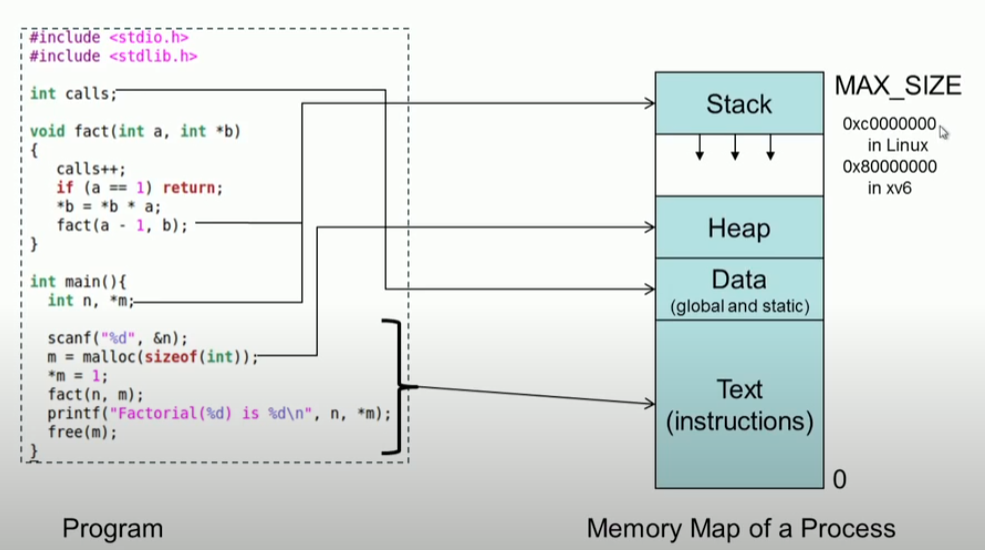
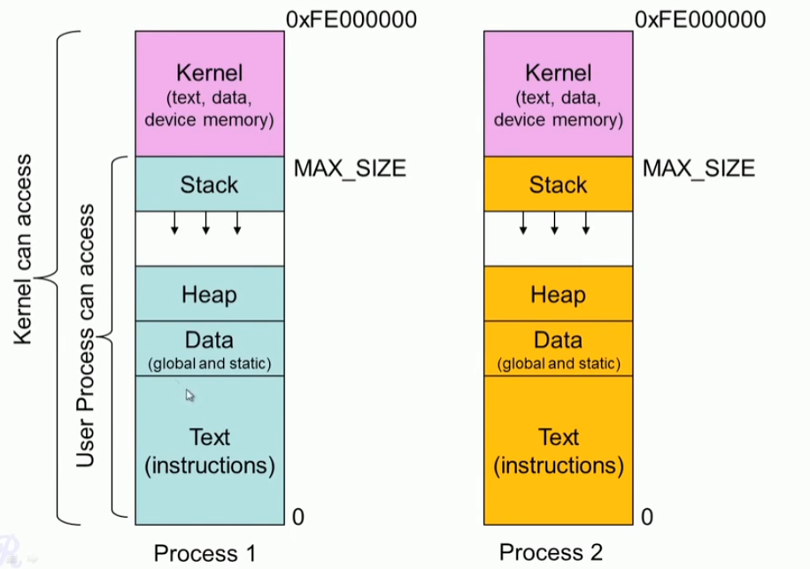
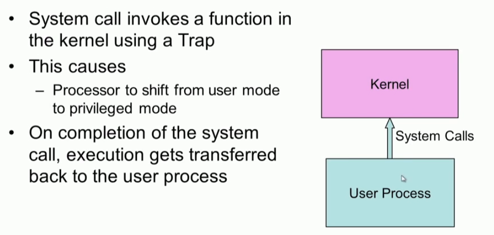
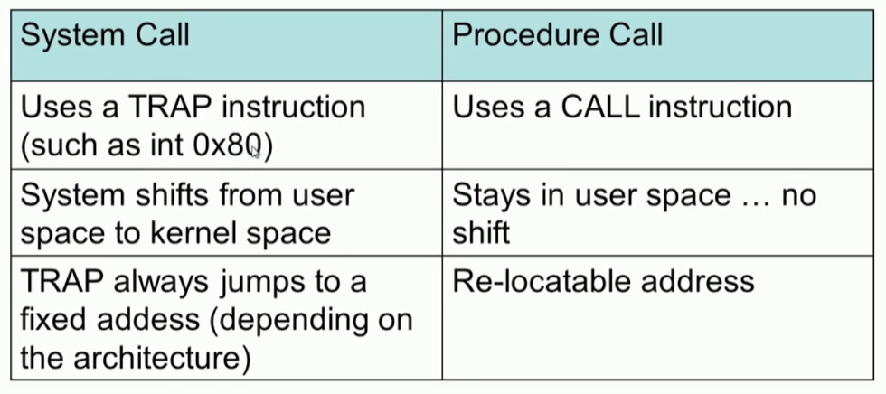
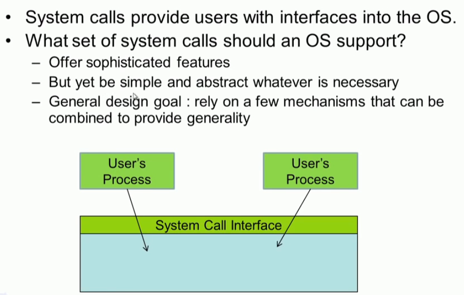
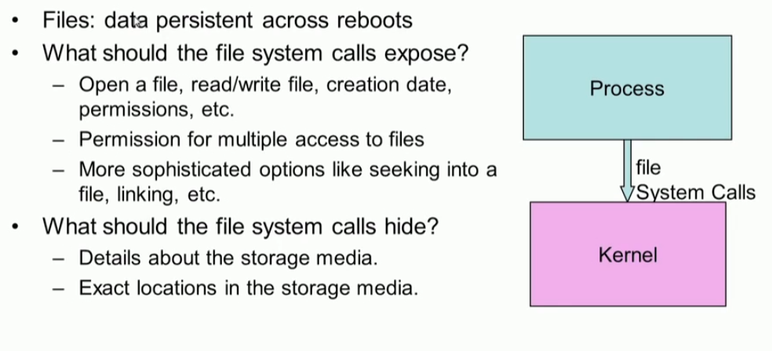
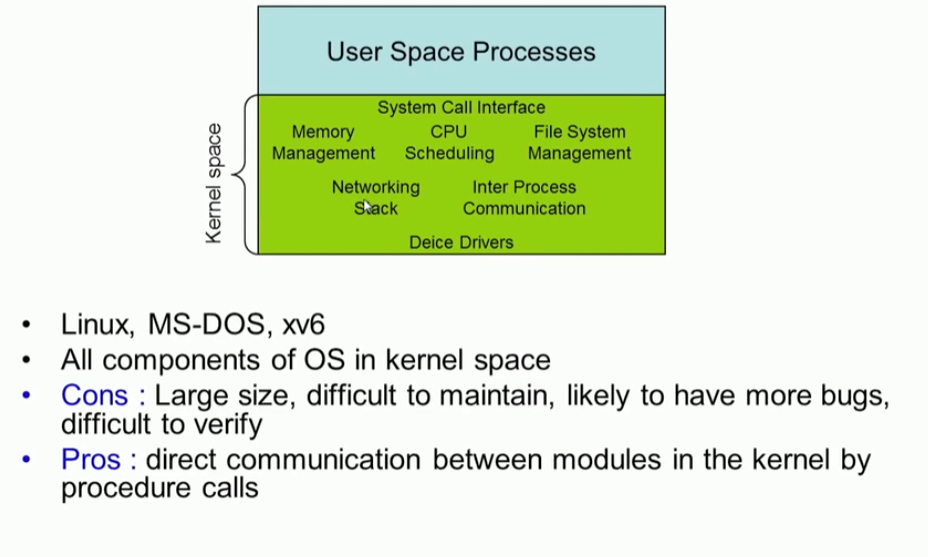
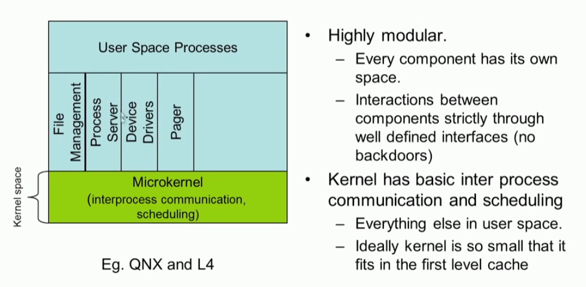

### Process

### Process Memory Map

#### Kernel memory map

* user program cannot access kernel memory area

## system call

#### system call trap handler

#### system call vs procedure call

#### monolithic structure

#### microkernel

